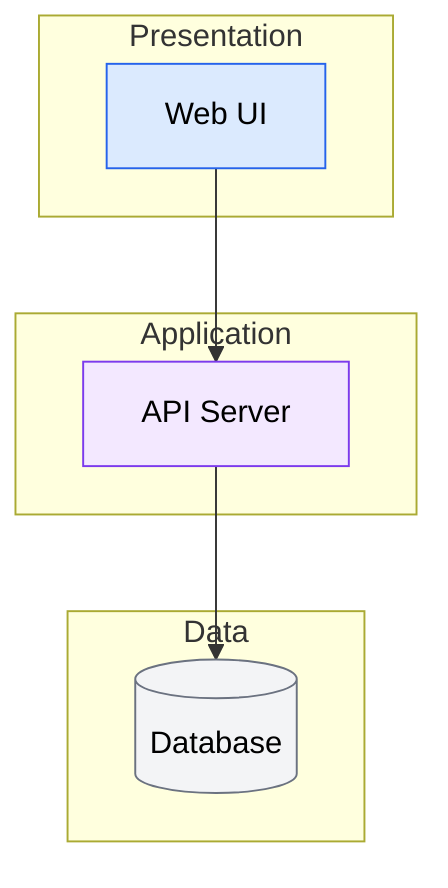
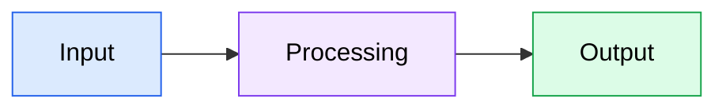
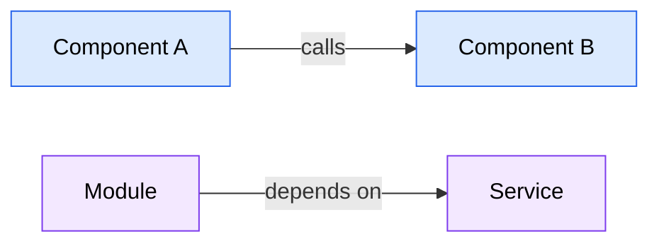
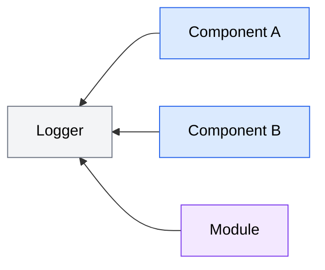

# Conversion Result: skill-core-tools-codebase-analysis

## Metadata

| Field | Value |
|-------|-------|
| Component ID | skill-core-tools-codebase-analysis |
| Component Type | skill |
| Group | core-tools |
| Name | codebase-analysis |
| Source Path | claude/core-tools/skills/codebase-analysis/SKILL.md |
| Target Path | skills/codebase-analysis/SKILL.md |
| Fidelity Score | 71% |
| Fidelity Band | yellow |
| Status | partial |

## Converted Content

~~~markdown
---
description: Produce a structured codebase analysis report with architecture overview, critical files, patterns, and actionable recommendations. Use when asked to "analyze codebase", "explore codebase", "understand this codebase", "map the codebase", "give me an overview of this project", "what does this codebase do", "codebase report", "project analysis", "audit this codebase", or "how is this project structured".
user-invocable: true
---

# Codebase Analysis Workflow

Analyze the codebase for: $ARGUMENTS (if no arguments provided, use "general codebase understanding" as the analysis context).

Execute a structured 3-phase codebase analysis workflow to gather insights.

**CRITICAL: Complete ALL 3 phases.** The workflow is not complete until Phase 3: Post-Analysis Actions is finished. After completing each phase, immediately proceed to the next phase without waiting for user prompts.

## Phase Overview

1. **Deep Analysis** — Explore and synthesize codebase findings via deep-analysis skill
2. **Reporting** — Present structured analysis to the user
3. **Post-Analysis Actions** — Save, document, or retain analysis insights

---

## Phase 1: Deep Analysis

**Goal:** Explore the codebase and synthesize findings.

1. **Determine analysis context:**
   - If `$ARGUMENTS` is provided, use it as the analysis context
   - If no arguments, set context to "general codebase understanding"

2. **Check for cached results:**
   - Check if `.claude/sessions/exploration-cache/manifest.md` exists
   - If found, read the manifest and verify: `codebase_path` matches the current working directory, and `timestamp` is within the configured cache TTL (default 24 hours)
   - **If cache is valid**, use the `question` tool:
     - **Use cached results** (show the formatted cache date) — Read cached synthesis from `.claude/sessions/exploration-cache/synthesis.md` and recon from `recon_summary.md`. Set `CACHE_HIT = true` and `CACHE_TIMESTAMP` to the cache's timestamp. Skip step 3 and proceed directly to step 4.
     - **Run fresh analysis** — Remove the cache manifest file, set `CACHE_HIT = false`, and proceed to step 3
   - **If no valid cache**: set `CACHE_HIT = false` and proceed to step 3

3. **Run deep-analysis workflow:**
   - Invoke skill({ name: "deep-analysis" }) and follow its workflow
   - Pass the analysis context from step 1
   - This handles reconnaissance, team planning, approval (auto-approved when skill-invoked), spawning code-explorer agents via `task` tool calls, and synthesis via the code-synthesizer agent
   - After completion, set `CACHE_TIMESTAMP = null` (fresh results, no prior cache)

4. **Verify results and capture metadata:**
   - Ensure the synthesis covers the analysis context adequately
   - If critical gaps remain, use Glob/Grep to fill them directly
   - Record analysis metadata for Phase 2 reporting: whether results were cached (`CACHE_HIT`), cache timestamp if applicable (`CACHE_TIMESTAMP`), and the number of explorer agents used (from the deep-analysis execution plan, or 0 if cached)

---

## Phase 2: Reporting

**Goal:** Present a structured analysis to the user.

1. **Load diagram guidance:**
   - Invoke skill({ name: "technical-diagrams" })
   - Use Mermaid diagrams in the Architecture Overview and Relationship Map sections

2. **Use the report template below to structure the presentation.**

3. **Present the analysis:**
   Structure the report with these sections:
   - **Executive Summary** — Lead with the most important finding
   - **Architecture Overview** — How the codebase is structured
   - **Tech Stack** — Core technologies, frameworks, and tools detected
   - **Critical Files** — The 5-10 most important files with details
   - **Patterns & Conventions** — Recurring patterns and coding conventions
   - **Relationship Map** — How components connect to each other
   - **Challenges & Risks** — Technical risks and complexity hotspots
   - **Recommendations** — Actionable next steps, each citing the challenge it addresses
   - **Analysis Methodology** — Agents used, cache status, scope, and duration

4. **IMPORTANT: Proceed immediately to Phase 3.**
   Do NOT stop here. Do NOT wait for user input. The report is presented, but the workflow requires Post-Analysis Actions. Continue directly to Phase 3 now.

---

## Phase 3: Post-Analysis Actions

**Goal:** Let the user save, document, or retain analysis insights from the report through a multi-step interactive flow.

### Step 1: Select actions

Use the `question` tool with multi-select options to present all available actions. List your selections:

- **Save Codebase Analysis Report** — Write the structured report to a markdown file
- **Save a custom report** — Generate a report tailored to your specific goals (you'll provide instructions next)
- **Update project documentation** — Add/update README.md, CLAUDE.md, or AGENTS.md with analysis insights
- **Keep a condensed summary in memory** — Retain a quick-reference summary in conversation context

If the user selects no actions, the workflow is complete. Thank the user and end.

### Step 2: Execute selected actions

Process selected actions in the following fixed order. Complete all sub-steps for each action before moving to the next.

#### Action: Save Codebase Analysis Report

**Step 2a-1: Prompt for file location**

- Check if an `internal/docs/` directory exists in the project root
  - If yes, suggest default path: `internal/docs/codebase-analysis-report-{YYYY-MM-DD}.md`
  - If no, suggest default path: `codebase-analysis-report-{YYYY-MM-DD}.md` in the project root
- Use the `question` tool to let the user confirm or customize the file path

**Step 2a-2: Generate and save the report**

- Use the report template (inlined below in the Reference Materials section)
- Generate the full structured report using the Phase 2 analysis findings and the template structure
- Write the report to the confirmed path using the write tool
- Confirm the file was saved

#### Action: Save Custom Report

**Step 2b-1: Gather report requirements**

- Use the `question` tool to ask the user to describe the goals and requirements for their custom report — what it should focus on, what questions it should answer, and any format preferences

**Step 2b-2: Prompt for file location**

- Check if an `internal/docs/` directory exists in the project root
  - If yes, suggest default path: `internal/docs/custom-report-{YYYY-MM-DD}.md`
  - If no, suggest default path: `custom-report-{YYYY-MM-DD}.md` in the project root
- Use the `question` tool to let the user confirm or customize the file path

**Step 2b-3: Generate and save the custom report**

- Generate a report shaped by the user's requirements from Step 2b-1, drawing from the Phase 2 analysis data — this is a repackaging of existing findings, not a re-analysis
- Write the report to the confirmed path using the write tool
- Confirm the file was saved

#### Action: Update Project Documentation

**Step 2c-1: Select documentation files and gather directions**

Use the `question` tool with multi-select options. List your selections:

- **README.md** — Add architecture, structure, and tech stack information
- **CLAUDE.md** — Add patterns, conventions, critical files, and architectural decisions
- **AGENTS.md** — Add agent descriptions, capabilities, and coordination patterns

Then use the `question` tool to gather update directions for all selected files: "What content from the analysis should be added or updated? Provide general directions or specific sections to focus on (applies across all selected files, or specify per-file directions)."

**Step 2c-2: Generate and approve documentation drafts**

For each selected file, read the existing file and generate a draft based on the user's directions and Phase 2 analysis data:

- **README.md**: Read existing file at project root. If no README.md exists, skip and inform the user. Draft updates focusing on architecture, project structure, and tech stack.
- **CLAUDE.md**: Read existing file at project root. If none exists, ask if one should be created (if declined, skip). Draft updates focusing on patterns, conventions, critical files, and architectural decisions.
- **AGENTS.md**: Read existing file at project root (create new if none exists). Draft content focusing on agent inventory (name, model, purpose), capabilities and tool access, coordination patterns, skill-agent mappings, and model tiering rationale.

Present **all drafts together** in a single output, clearly labeled by file. Then use the `question` tool:

- **Apply all** — Apply all drafted updates
- **Modify** — Specify which file(s) to revise and what to change (max 3 revision cycles, then must Apply or Skip)
- **Skip all** — Skip all documentation updates

If approved, apply updates using the edit tool (existing files) or write tool (new files).

#### Action: Keep Insights in Memory

- Present a condensed **Codebase Quick Reference** inline in the conversation:
  - **Architecture** — 1-2 sentence summary of how the codebase is structured
  - **Key Files** — 3-5 most critical files with one-line descriptions
  - **Conventions** — Important patterns and naming conventions
  - **Tech Stack** — Core technologies and frameworks
  - **Watch Out For** — Top risks or complexity hotspots
- No file is written — this summary stays in conversation context for reference during the session

### Step 3: Actionable Insights Follow-up

**Condition:** This step always executes after Step 2 completes. The Phase 2 analysis is available in conversation context regardless of whether a report file was saved.

Use the `question` tool to ask:
- **Address actionable insights** — Fix challenges and implement recommendations from the report
- **Skip** — No further action needed

If the user selects "Skip", proceed to Step 4.

If the user selects "Address actionable insights":

**Step 3a: Extract actionable items from the report**

Parse the Phase 2 report (in conversation context) to extract items from:
- **Challenges & Risks** table rows — title from Challenge column, severity from Severity column, description from Impact column
- **Recommendations** section — each numbered item with an _(addresses: {Challenge name})_ citation; inherit the cited challenge's severity (High/Medium/Low). If no citation is present, default to Medium.
- **Other findings** with concrete fixes — default to Low severity

If no actionable items are found, inform the user and skip to Step 4.

**Step 3b: Present severity-ranked item list**

Use the Actionable Insights format (inlined below in the Reference Materials section).

Present items sorted High → Medium → Low, each showing:
  - Title
  - Severity (High / Medium / Low)
  - Source section (Challenges & Risks, Recommendations, or Other)
  - Brief description

Use the `question` tool with multi-select options for the user to select which items to address. If no items selected, skip to Step 4.

**Step 3c: Process each selected item in priority order (High → Medium → Low)**

For each item:

1. **Assess complexity:**
   - **Simple** — Single file, clear fix, localized change
   - **Complex** — Multi-file, architectural impact, requires investigation

2. **Plan the fix:**
   - Simple: Read the target file, propose changes directly
   - Complex (architectural): Use the `task` tool with `command: "code-architect"` — pass context including the item title, severity, description, the relevant report section text (copy the specific Challenges/Recommendations entry), and any files or components mentioned. The agent designs the fix and returns a proposal.
   - Complex (needs investigation): Use the `task` tool with `command: "code-explorer"` — pass context including the item title, description, suspected files/components, and what needs investigation. The agent explores and returns findings for you to formulate a fix proposal.
   - If a task call fails, fall back to direct investigation using read/glob/grep and propose a simpler fix based on available information.

3. **Present proposal:** Show files to modify, specific changes, and rationale

4. **User approval** via the `question` tool:
   - **Apply** — Execute changes with edit/write tools, confirm success
   - **Skip** — Record the skip, move to next item
   - **Modify** — User describes adjustments, re-propose the fix (max 3 revision cycles, then must Apply or Skip)

**Step 3d: Summarize results**

Present a summary covering:
- Items addressed (with list of files modified per item)
- Items skipped
- Total files modified table

### Step 4: Complete the workflow

Summarize which actions were executed and confirm the workflow is complete.

---

## Error Handling

### General

If any phase fails:
1. Explain what went wrong
2. Ask the user how to proceed:
   - Retry the phase
   - Skip to next phase (with partial results)
   - Abort the workflow

### Documentation Update Failures (Step 2c)

If an edit or write call fails when applying documentation updates:
1. Retry the operation once
2. If still failing, present the drafted content to the user inline and suggest they apply it manually
3. Continue with the remaining selected files

### Agent Launch Failures (Step 3c)

If a `code-architect` or `code-explorer` task call fails during actionable insight processing:
1. Fall back to direct investigation using read, glob, and grep
2. Propose a simpler fix based on available information
3. If the item is too complex to address without agent assistance, inform the user and offer to skip

---

## Agent Coordination

Exploration and synthesis agent coordination is handled by the `deep-analysis` skill in Phase 1. That skill spawns code-explorer agents via `task` tool calls (hub-and-spoke pattern), performs reconnaissance, composes an execution plan (auto-approved when invoked by another skill), runs parallel exploration, and synthesizes results via the code-synthesizer agent. See that skill for agent model tiers, execution plan format, and failure handling details.

---

## Reference Materials

The following reference content is inlined from the original `references/` directory, which has no equivalent in OpenCode's directory structure. Content is embedded directly for runtime availability.

---

### Report Template

Use this template when presenting analysis findings in Phase 2.

```markdown
# Codebase Analysis Report

**Analysis Context**: {What was analyzed and why}
**Codebase Path**: {Path analyzed}
**Date**: {YYYY-MM-DD}

{If the report exceeds approximately 100 lines, add a **Table of Contents** here linking to each major section.}

---

## Executive Summary

{Lead with the most important finding. 2-3 sentences covering: what was analyzed, the key architectural insight, and the primary recommendation or risk.}

---

## Architecture Overview

{2-3 paragraphs describing:}
- How the codebase is structured (layers, modules, boundaries)
- The design philosophy and architectural style
- Key architectural decisions and their rationale

{Include a Mermaid architecture diagram (flowchart or C4 Context) showing the major layers/components. Use `classDef` with `color:#000` for all node styles. Example:}



---

## Tech Stack

| Category | Technology | Version (if detected) | Role |
|----------|-----------|----------------------|------|
| Language | {e.g., TypeScript} | {e.g., 5.x} | Primary language |
| Framework | {e.g., Next.js} | {e.g., 16} | Web framework |
| Styling | {e.g., Tailwind CSS} | {e.g., v4} | UI styling |
| Testing | {e.g., Jest} | — | Test runner |
| Build | {e.g., esbuild} | — | Bundler |

{Include only technologies actually detected in config files or code. Omit categories that don't apply.}

---

## Critical Files

{Limit to 5-10 most important files}

| File | Purpose | Relevance |
|------|---------|-----------|
| `path/to/file` | Brief description | High/Medium |

### File Details

#### `path/to/critical-file`
- **Key exports**: What this file provides to others
- **Core logic**: What it does
- **Connections**: What depends on it and what it depends on

---

## Patterns & Conventions

### Code Patterns
- **Pattern**: Description and where it's used

### Naming Conventions
- **Convention**: Description and examples

### Project Structure
- **Organization**: How files and directories are organized

---

## Relationship Map

{Describe how key components connect — limit to 15-20 most significant connections. Use Mermaid flowcharts for both data flows and dependency maps.}

**Data Flow:**



**Component Dependencies:**



**Cross-Cutting Concerns:**



{For complex architectures, group connections by subsystem using subgraphs rather than listing individually}

---

## Challenges & Risks

| Challenge | Severity | Impact |
|-----------|----------|--------|
| {Description} | High/Medium/Low | {What could go wrong} |

---

## Recommendations

1. **{Recommendation}** _(addresses: {Challenge name})_: {Brief rationale}
2. **{Recommendation}** _(addresses: {Challenge name})_: {Brief rationale}

---

## Analysis Methodology

- **Exploration agents**: {Number} agents with focus areas: {list}
- **Synthesis**: Findings merged and critical files read in depth
- **Scope**: {What was included and what was intentionally excluded}
- **Cache status**: {Fresh analysis / Cached results from YYYY-MM-DD}
- **Config files detected**: {List of config files found during reconnaissance (package.json, tsconfig.json, etc.)}
- **Gap-filling**: {Whether direct Glob/Grep investigation was needed after synthesis, and what areas were filled}
```

---

#### Section Guidelines

**Executive Summary**
- Lead with the most important finding, not a generic overview
- Keep to 2-3 sentences maximum
- Include at least one actionable insight

**Critical Files**
- Limit to 5-10 files — these should be the files someone must understand
- Include both the "what" (purpose) and "why" (relevance to analysis context)
- File Details should cover exports, logic, and connections

**Patterns & Conventions**
- Only include patterns that are consistently applied (not one-off occurrences)
- Note deviations from patterns — these are often more interesting than the patterns themselves

**Relationship Map**
- Focus on the most important connections, not an exhaustive dependency graph
- Use directional language (calls, depends on, triggers, reads from)
- Highlight any circular dependencies or unexpected couplings
- Depth: Include 2-3 levels of dependency depth — direct dependencies and their key subdependencies
- Format: Use Mermaid flowcharts for both linear flows and complex dependency webs. Apply `classDef` with `color:#000` for readability.
- Scope limit: Cap at 15-20 connections. If more exist, group related connections under subsystem labels.

**Challenges & Risks**
- Rate severity based on likelihood and impact combined
- Include specific details, not vague warnings
- Focus on challenges relevant to the analysis context

**Recommendations**
- Make recommendations actionable — "consider" is weaker than "use X for Y"
- Cite source challenge: Each recommendation must reference the specific challenge it addresses using the format: _(addresses: {Challenge name})_. This creates reliable severity links for the actionable insights step.
- Limit to 3-5 recommendations to maintain focus

---

#### Adapting the Template

**For Feature-Focused Analysis**
- Emphasize integration points and files that would need modification
- Include a "Feature Implementation Context" section before Recommendations
- Focus Challenges on implementation risks

**For General Codebase Understanding**
- Broader Architecture Overview with layer descriptions
- More extensive Patterns & Conventions section
- Focus Recommendations on areas for improvement or further investigation

**For Debugging/Investigation**
- Emphasize the execution path and data flow
- Include a "Relevant Execution Paths" section
- Focus Critical Files on the suspected problem area

---

### Actionable Insights Template

Use this template when presenting and processing actionable items in Phase 3's "Address Actionable Insights" action.

---

#### Item List Format

Present extracted items grouped by severity, highest first:

```markdown
### High Severity

1. **{Title}** — _{Source: Challenges & Risks}_
   {Brief description of the issue and its impact}

2. **{Title}** — _{Source: Recommendations}_
   {Brief description and rationale}

### Medium Severity

3. **{Title}** — _{Source: Recommendations}_
   {Brief description and rationale}

### Low Severity

4. **{Title}** — _{Source: Other Findings}_
   {Brief description}
```

---

#### Severity Assignment Guidelines

**From Challenges & Risks Table**
- Use the Severity column value directly (High, Medium, or Low)
- Title comes from the Challenge column
- Description comes from the Impact column

**From Recommendations Section**
- Each recommendation in the report should explicitly cite which challenge it addresses (see report template). Use this citation to inherit severity:
  - Recommendation cites a High challenge → assign High
  - Recommendation cites a Medium challenge → assign Medium
  - Recommendation cites a Low challenge → assign Low
- If a recommendation addresses multiple challenges, use the highest severity among them
- If no challenge link is present (legacy reports or standalone recommendations), infer from context or default to Medium

**From Other Findings**
- Default to Low unless the finding explicitly describes a critical issue
- Only include findings that have a concrete, implementable fix

---

#### Complexity Assessment Criteria

**Simple (No agent needed)**
- Single file change
- Clear, localized fix (rename, add validation, fix import, update config)
- No architectural impact
- Change is self-contained — no cascading modifications needed

**Complex — Architectural (Use `task` tool with `command: "code-architect"`)**
- Requires refactoring across multiple files
- Introduces or changes a pattern (new abstraction, restructured module boundaries)
- Affects system architecture (data flow, component relationships, API contracts)
- Requires design decisions about approach

**Complex — Investigation Needed (Use `task` tool with `command: "code-explorer"`)**
- Root cause is unclear or needs tracing through the codebase
- Multiple potential locations for the fix
- Requires understanding current behavior before proposing changes
- Dependencies or side effects need mapping

**Effort Estimates**

Provide rough effort alongside complexity to help users prioritize:

| Complexity | Typical Effort | Description |
|-----------|---------------|-------------|
| Simple | Low (~minutes) | Single targeted change, clear fix |
| Complex — Architectural | Medium–High (~30min–1hr+) | Multi-file refactoring, design decisions |
| Complex — Investigation | Medium (~15-30min) + varies | Investigation phase + fix implementation |

---

#### Change Proposal Format

Present each proposed fix using this structure:

```markdown
#### {Item Title} ({Severity})

**Complexity:** Simple / Complex (architectural) / Complex (investigation)
**Effort:** Low (~minutes) / Medium (~30min) / High (~1hr+)

**Files to modify:**
| File | Change Type |
|------|-------------|
| `path/to/file` | Edit / Create / Delete |

**Proposed changes:**
{Description of what will change and why. For simple fixes, show the specific code changes. For complex fixes, describe the approach.}

**Rationale:**
{Why this approach was chosen. Reference the original finding.}
```

---

#### Summary Format

After processing all selected items, present:

```markdown
## Actionable Insights Summary

### Items Addressed
| # | Item | Severity | Files Modified |
|---|------|----------|----------------|
| 1 | {Title} | High | `file1.ts`, `file2.ts` |
| 2 | {Title} | Medium | `file3.ts` |

### Items Skipped
| # | Item | Severity | Reason |
|---|------|----------|--------|
| 3 | {Title} | Low | User skipped |

### Files Modified
| File | Changes |
|------|---------|
| `path/to/file` | {Brief description of change} |

**Total:** {N} items addressed, {M} items skipped, {P} files modified
```

---

#### Section Guidelines

**Item Extraction**
- Only extract items with concrete, actionable fixes — skip vague observations
- Deduplication criteria — Merge items that match on any of:
  - Same target file or component mentioned in both items
  - Significant keyword overlap in titles (2+ shared meaningful words)
  - One item is a superset of the other (e.g., "fix error handling in auth" subsumes "add try-catch to login endpoint")
- When deduplicating, keep the higher severity, merge descriptions, and note both source sections

**User Selection**
- Present items in severity order so the user sees the most impactful items first
- Keep descriptions concise in the selection list — details come in the proposal

**Processing Order**
- Process items in the order the user selected them, but within that, prioritize by severity
- Conflict detection — Before starting fixes, scan the selected items for potential conflicts:
  - Same-file modifications: Two items targeting the same file(s) — flag ordering risk
  - Contradictory changes: One item adds what another removes, or they modify the same function/component in incompatible ways
  - Ordering dependencies: One fix creates a prerequisite for another (e.g., "add error type" must precede "use error type in handler")
- If conflicts are detected, present them to the user before proceeding and suggest a processing order that resolves dependencies

**Revision Cycles**
- Maximum 3 revision cycles per item when user selects "Modify"
- After 3 cycles, present final proposal with Apply or Skip only
- Track what the user changed in each cycle to converge on the right fix
~~~

## Fidelity Report

| Mapping Type | Count | Weight | Contribution |
|-------------|-------|--------|-------------|
| Direct | 5 | 1.0 | 5.0 |
| Workaround | 7 | 0.7 | 4.9 |
| TODO | 0 | 0.2 | 0.0 |
| Omitted | 2 | 0.0 | 0.0 |
| **Total** | **14** | | **9.9 / 14 = 70.7% → 71%** |

**Notes:** The two omitted features (`disable-model-invocation` and `allowed-tools`) are both cosmetic on OpenCode — `disable-model-invocation` defaults to false behavior anyway, and `allowed-tools` has no per-skill equivalent. The 7 workaround features are primarily reference-file inlining (2 features) and agent-launch API translation (code-architect + code-explorer via `task` tool, 2 features), plus name/argument-hint embedding (2 features) and an agent-coordination description update (1 feature). All workarounds are cached decisions with medium-to-high confidence.

## Decisions

| Feature | Decision Type | Original | Converted | Rationale | Confidence | Resolution Mode |
|---------|-------------|----------|-----------|-----------|------------|----------------|
| name | relocated | `name: codebase-analysis` (frontmatter) | Derived from directory path `skills/codebase-analysis/SKILL.md` | OpenCode derives skill name from directory structure; no explicit `name` field in frontmatter | high | auto |
| description | direct | `description: Produce a structured...` | `description: Produce a structured...` (unchanged) | Direct 1:1 field mapping in OpenCode skill frontmatter | high | N/A |
| argument-hint | relocated | `argument-hint: <analysis-context or feature-description>` | `$ARGUMENTS` placeholder in skill body first line | OpenCode embeds argument hints as `$ARGUMENTS` / `$NAME` placeholders in skill body text | high | auto |
| user-invocable | direct | `user-invocable: true` | `user-invocable: true` (unchanged) | Direct 1:1 field mapping | high | N/A |
| disable-model-invocation | omitted | `disable-model-invocation: false` | (removed) | Maps to null in OpenCode; no per-skill invocation control exists. Value was `false` (default behavior), so omission has zero behavioral impact | high | auto |
| allowed-tools | omitted | 14 tools listed | (removed) | OpenCode has no per-skill tool restrictions; `allowed-tools` maps to null. Tool permissions managed at agent level via `permission` frontmatter. All 14 tool entries dropped. | high | auto |
| deep-analysis skill load | direct | `Read ${CLAUDE_PLUGIN_ROOT}/skills/deep-analysis/SKILL.md` | `skill({ name: "deep-analysis" })` | OpenCode uses registry-based composition; `skill()` reference replaces filesystem Read directive | high | N/A |
| technical-diagrams skill load | direct | `Read ${CLAUDE_PLUGIN_ROOT}/skills/technical-diagrams/SKILL.md` | `skill({ name: "technical-diagrams" })` | Same registry-based composition pattern | high | N/A |
| report-template.md reference | flattened | `Read ${CLAUDE_PLUGIN_ROOT}/skills/codebase-analysis/references/report-template.md` | Full content inlined into "Reference Materials" section of skill body | OpenCode has no `reference_dir` equivalent; cached decision (reference_dir_null, apply_globally=true) mandates inlining | high | cached |
| actionable-insights-template.md reference | flattened | `Read ${CLAUDE_PLUGIN_ROOT}/skills/codebase-analysis/references/actionable-insights-template.md` | Full content inlined into "Reference Materials" section of skill body | Same cached resolution as above | high | cached |
| AskUserQuestion (all occurrences) | direct | `AskUserQuestion` with multiSelect/single-select | `question` tool | Direct mapping with equivalent multi-select and single-select support in OpenCode | medium | N/A |
| code-architect agent launch | workaround | `agent-alchemy-core-tools:code-architect` agent spawn | `task` tool with `command: "code-architect"` | TeamCreate/team-based spawning maps to null; restructured as `task` call per cached TeamCreate resolution. Agent name passed as `command` parameter. | high | cached |
| code-explorer agent launch | workaround | `agent-alchemy-core-tools:code-explorer` agent spawn | `task` tool with `command: "code-explorer"` | Same TeamCreate workaround pattern | high | cached |
| Agent Coordination section | workaround | Described "Agent Teams with hub-and-spoke coordination" pattern referencing TeamCreate/SendMessage/TeamDelete | Updated to describe `task` tool calls (hub-and-spoke via sequential/parallel task invocations) | TeamCreate/SendMessage/TeamDelete all map to null; prose updated to reflect task-based orchestration | high | cached |

## Gaps

| Feature | Reason | Severity | Workaround | User Acknowledged |
|---------|--------|----------|------------|-------------------|
| allowed-tools per-skill restrictions | OpenCode has no per-skill tool allowlist; permissions are agent-level only | cosmetic | No workaround needed — tool usage is unrestricted at skill level; agent-level `permission` can be configured if lockdown is needed | false |
| disable-model-invocation | OpenCode has no equivalent concept; skills are always discoverable | cosmetic | Omit field; default behavior (discoverable) is what `false` maps to anyway | false |
| references/ directory | OpenCode has no `reference_dir` support; content cannot be loaded from plugin-relative paths at runtime | functional | Inline all reference content into skill body (applied via cached decision) | false |
| TeamCreate / TeamDelete | No team orchestration API in OpenCode; subagents are spawned via `task` tool individually | functional | Restructured as `task` tool calls with explicit context in prompt; hub-and-spoke pattern preserved at the deep-analysis skill level | false |
| SendMessage | No inter-agent messaging; subagents are fully isolated | functional | Agents return findings in their task output; parent reads result and passes context forward explicitly | false |
| TaskCreate / TaskUpdate / TaskList / TaskGet | No structured task management; only session-scoped `todowrite`/`todoread` scratchpad available | functional | These tools are not directly called in the codebase-analysis skill body (only listed in allowed-tools); no inline workaround needed. If todowrite/todoread are used in future edits, note session-scope limitation. | false |

## Unresolved Incompatibilities

No unresolved incompatibilities. All gaps were either auto-resolved (cosmetic), resolved via cached decisions (apply_globally=true), or are functional gaps already documented in the Gaps table with applied workarounds. No inline markers were inserted.
