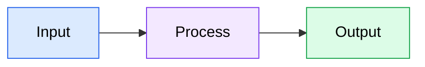
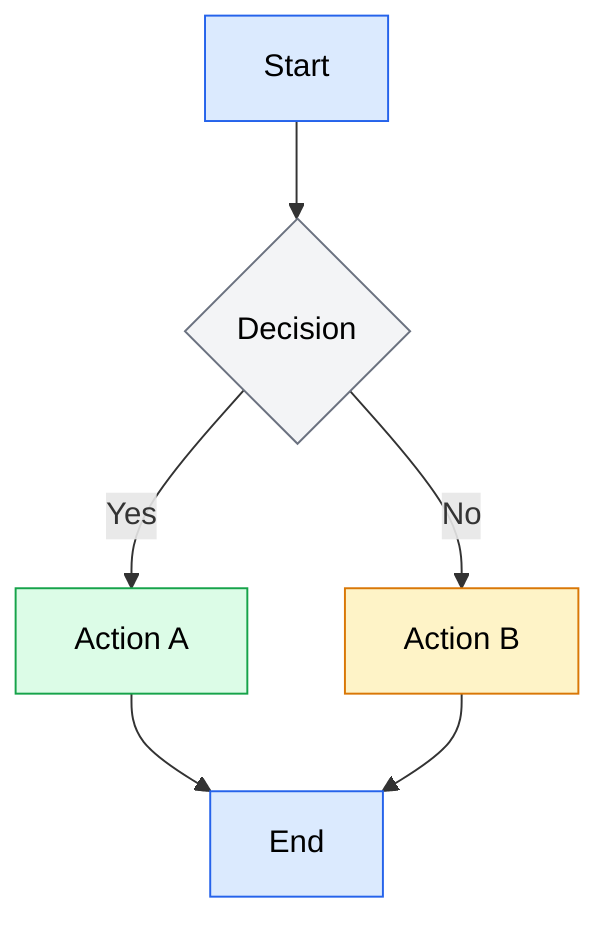
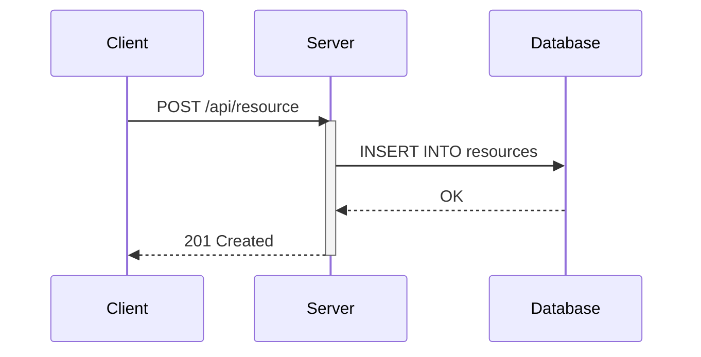
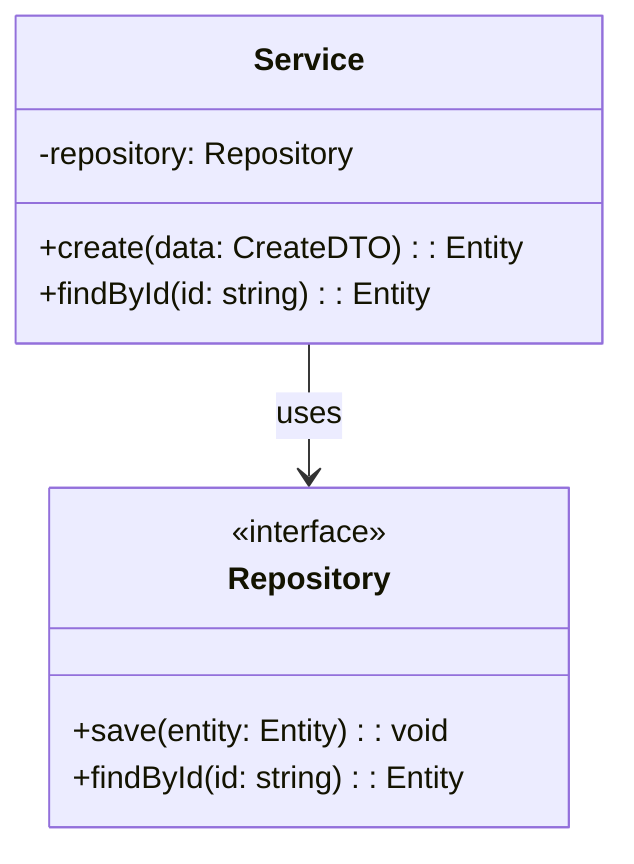
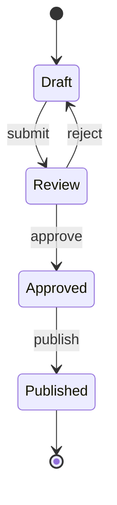
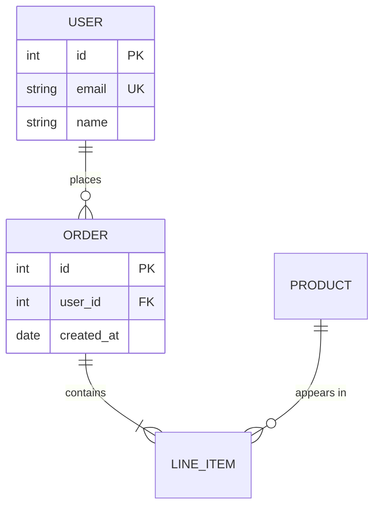
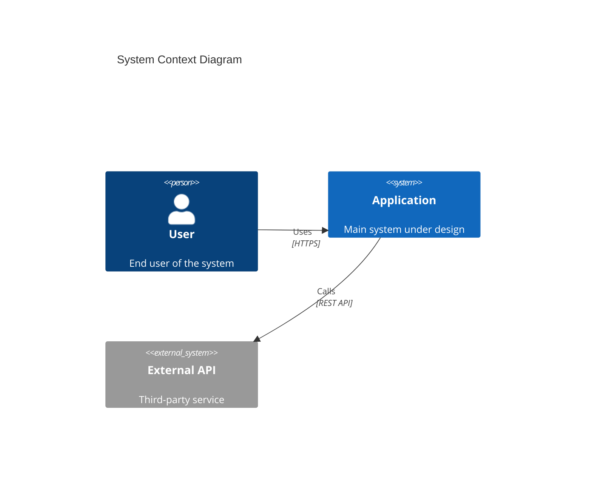
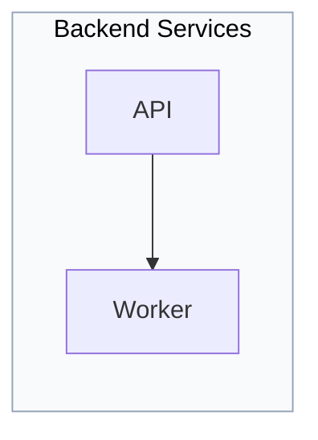
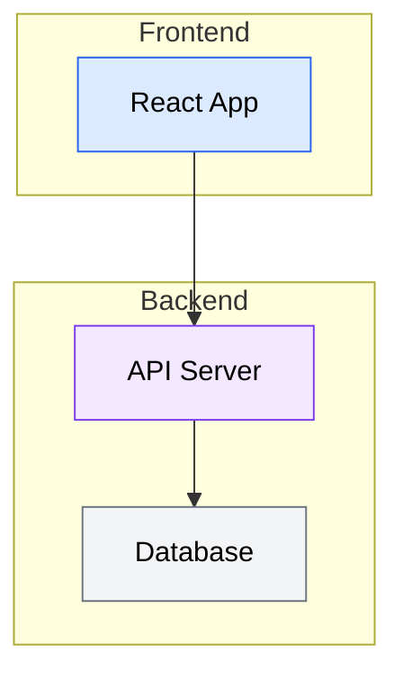

# Conversion Result: skill-core-tools-technical-diagrams

## Metadata

| Field | Value |
|-------|-------|
| Component ID | skill-core-tools-technical-diagrams |
| Component Type | skill |
| Group | core-tools |
| Name | technical-diagrams |
| Source Path | claude/core-tools/skills/technical-diagrams/SKILL.md |
| Target Path | .opencode/skills/technical-diagrams/SKILL.md |
| Fidelity Score | 52% |
| Fidelity Band | yellow |
| Status | partial |

## Converted Content

~~~markdown
---
description: >-
  Provides Mermaid diagram syntax, best practices, and styling rules for technical
  visualizations. Use when creating diagrams, flowcharts, sequence diagrams, class
  diagrams, state diagrams, ER diagrams, architecture diagrams, C4 diagrams,
  visualizations, or any visual documentation in markdown. Always use this skill
  when generating or updating Mermaid code blocks.
user-invocable: false
---

# Technical Diagrams

Mermaid is the standard for all technical diagrams in this project. It renders natively in GitHub, GitLab, MkDocs (with Material theme), and most modern documentation platforms.

This skill provides:
- **Critical styling rules** to ensure readability (especially color contrast)
- **Quick reference** examples for common diagram types
- **Reference files** for advanced syntax when building complex diagrams

Always wrap Mermaid code in fenced code blocks with the `mermaid` language identifier.

---

## Why Mermaid

**Native rendering** — GitHub, GitLab, Notion, MkDocs, and Docusaurus render Mermaid blocks without plugins or build steps. No external image generation tools needed.

**Text-based and diffable** — Diagrams live alongside code in version control. Changes appear in pull request diffs, making reviews straightforward and history trackable.

**No external tools** — No Lucidchart exports, no draw.io XML files, no PNG screenshots that go stale. The diagram source is the single source of truth.

**Maintainable** — Updating a diagram means editing text, not wrestling with a GUI. Refactoring a component name? Find-and-replace works on diagrams too.

**Consistent** — A shared syntax produces visually consistent diagrams across all documentation, regardless of who authored them.

---

## Critical Styling Rules

**This is the most important section.** Light text on light backgrounds is the most common Mermaid readability issue. Follow these rules strictly.

### Rule 1: Always use dark text on nodes

Every node must have `color:#000` (or another dark color like `#1a1a1a`, `#333`). Never use white, light gray, or any light-colored text.

### Rule 2: Use `classDef` for consistent styling

Define reusable styles at the bottom of the diagram and apply them with `:::` syntax:



### Rule 3: Safe color palettes

Use these pre-tested combinations that guarantee readability:

| Style Name | Fill | Stroke | Text | Use For |
|-----------|------|--------|------|---------|
| `primary` | `#dbeafe` | `#2563eb` | `#000` | Main components, entry points |
| `secondary` | `#f3e8ff` | `#7c3aed` | `#000` | Supporting components |
| `success` | `#dcfce7` | `#16a34a` | `#000` | Success states, outputs |
| `warning` | `#fef3c7` | `#d97706` | `#000` | Warnings, caution areas |
| `danger` | `#fee2e2` | `#dc2626` | `#000` | Errors, critical items |
| `neutral` | `#f3f4f6` | `#6b7280` | `#000` | Background, inactive items |

### Bad vs Good

**Bad — light text is invisible on light background:**
```
classDef bad fill:#dbeafe,stroke:#2563eb,color:#93c5fd
```

**Good — dark text is always readable:**
```
classDef good fill:#dbeafe,stroke:#2563eb,color:#000
```

---

## Supported Diagram Types

| Diagram Type | Mermaid Keyword | Use Case | Reference File |
|-------------|----------------|----------|----------------|
| Flowchart | `flowchart` | Process flows, decision trees, pipelines | `references/flowcharts.md` |
| Sequence | `sequenceDiagram` | API interactions, message passing, protocols | `references/sequence-diagrams.md` |
| Class | `classDiagram` | Object models, interfaces, relationships | `references/class-diagrams.md` |
| State | `stateDiagram-v2` | State machines, lifecycle management | `references/state-diagrams.md` |
| ER | `erDiagram` | Database schemas, entity relationships | `references/er-diagrams.md` |
| C4 | `C4Context` / `C4Container` / etc. | System architecture, containers, components | `references/c4-diagrams.md` |

**To load a reference file:**
<!-- UNRESOLVED: unsupported_composition:reference_dir_null | functional | reference-file-loading | Inline the reference file content into this skill body, or copy reference files into the skill directory and load via read tool with an absolute path workaround -->
OpenCode has no equivalent to `${CLAUDE_PLUGIN_ROOT}`-relative reference file loading. Reference files for advanced diagram syntax cannot be dynamically loaded by name. Options: (1) inline the reference file content directly into this skill body, or (2) instruct the model to recall Mermaid advanced syntax from training data for the diagram type needed.

---

## Quick Reference

Minimal copy-paste examples for simple diagrams. For complex use cases, consult the advanced syntax notes in the sections below or ask for Mermaid documentation on the specific diagram type.

### Flowchart



### Sequence Diagram



### Class Diagram



### State Diagram



### ER Diagram



### C4 Context Diagram



---

## Styling and Theming

### `classDef` — Reusable Style Classes

Define once, apply to many nodes:


### `:::` Shorthand — Apply Class Inline

```
A[Label]:::className
```

### `style` — One-Off Inline Styling

For single-node overrides (prefer `classDef` for consistency):

```
style nodeId fill:#dbeafe,stroke:#2563eb,color:#000
```

### Standard Style Classes

Define these at the bottom of any diagram that uses multiple styles:

```
classDef primary fill:#dbeafe,stroke:#2563eb,color:#000
classDef secondary fill:#f3e8ff,stroke:#7c3aed,color:#000
classDef success fill:#dcfce7,stroke:#16a34a,color:#000
classDef warning fill:#fef3c7,stroke:#d97706,color:#000
classDef danger fill:#fee2e2,stroke:#dc2626,color:#000
classDef neutral fill:#f3f4f6,stroke:#6b7280,color:#000
```

### Subgraph Styling

Subgraphs can be styled via `style` directives:



### Edge Styling with `linkStyle`

Style specific edges by their index (0-based, in order of definition):

```
linkStyle 0 stroke:#2563eb,stroke-width:2px
linkStyle 1 stroke:#dc2626,stroke-width:2px,stroke-dasharray:5
```

---

## Best Practices

### Keep diagrams focused
Limit to 15-20 nodes maximum. If a diagram grows beyond that, split it into multiple diagrams or use subgraphs to manage complexity.

### Choose direction deliberately
- **TD (top-down)** — Hierarchies, data flow, process steps
- **LR (left-right)** — Timelines, pipelines, request flows
- **BT (bottom-up)** — Dependency trees (leaves at top)
- **RL (right-left)** — Rarely used, avoid unless it matches a specific mental model

### Use meaningful labels
```
A[User Service] --> B[Auth Service]    %% Good: descriptive
A --> B                                 %% Bad: meaningless
```

### Label edges
```
A -->|validates| B    %% Good: explains the relationship
A --> B               %% Acceptable only if the relationship is obvious
```

### Group with subgraphs
Use subgraphs to visually separate layers, domains, or subsystems:



### Use consistent arrow types
Within a single diagram, stick to one arrow style unless you need to distinguish different relationship types:
- `-->` solid arrow (primary flow)
- `-.->` dotted arrow (optional or async)
- `==>` thick arrow (critical path)

### Prefer `flowchart` over `graph`
`flowchart` is the modern syntax with more features (subgraph styling, `:::` shorthand, more shapes). `graph` is legacy — use `flowchart` for all new diagrams.

### Platform compatibility
- GitHub/GitLab: Full support for flowcharts, sequence, class, state, ER, Gantt, pie
- C4 diagrams: Require Mermaid 10.6+ — verify platform support before using
- MkDocs: Requires `pymdownx.superfences` with custom Mermaid fence config

---

## When to Load Reference Files

**Simple diagrams** — The quick reference above is sufficient. Use it for:
- Basic flowcharts with fewer than 10 nodes
- Simple sequence diagrams with 2-3 participants
- Standard ER diagrams with straightforward relationships

**Complex or unfamiliar diagrams** — Consult Mermaid documentation or recall training knowledge when:
- Using advanced features (composite states, parallel blocks, fork/join)
- Building class diagrams with generics, namespaces, or cardinality
- Needing the full set of node shapes, arrow types, or relationship notations
- Working with a diagram type for the first time

**C4 diagrams** — C4 uses a unique function-call syntax (`Person()`, `System()`, `Container()`, etc.) that differs significantly from other Mermaid diagrams. Always verify full C4 syntax before generating.

<!-- UNRESOLVED: unsupported_composition:reference_dir_null | functional | c4-reference-file-loading | Inline the c4-diagrams.md reference file content into this skill body so advanced C4 syntax is always available without a read directive -->
~~~

## Fidelity Report

| Mapping Type | Count | Weight | Contribution |
|-------------|-------|--------|-------------|
| Direct | 2 | 1.0 | 2.0 |
| Workaround | 1 | 0.7 | 0.7 |
| TODO | 2 | 0.2 | 0.4 |
| Omitted | 1 | 0.0 | 0.0 |
| **Total** | **6** | | **3.1** |

**Score:** 3.1 / 6 × 100 = **52%**

**Notes:** The score is pulled down by the two unresolved reference-file loading directives, which are a structural gap (OpenCode has no `reference_dir`). The skill body content — styling rules, quick reference examples, best practices — converts with full fidelity. If the six reference files are inlined into the skill body, the score would rise to approximately 83% (green).

## Decisions

| Feature | Decision Type | Original | Converted | Rationale | Confidence | Resolution Mode |
|---------|-------------|----------|-----------|-----------|------------|----------------|
| `name` field | relocated | `name: technical-diagrams` | Derived from directory: `.opencode/skills/technical-diagrams/SKILL.md` | Skill frontmatter maps `name` to `embedded:filename` in OpenCode. Filename carries the identity. | high | auto |
| `description` field | direct | `description: Provides Mermaid...` | `description: Provides Mermaid...` | Direct 1:1 mapping. Required field in OpenCode skill frontmatter. | high | N/A |
| `user-invocable` field | direct | `user-invocable: false` | `user-invocable: false` | Direct mapping. Controls appearance in OpenCode command dialog. | high | N/A |
| `disable-model-invocation` field | omitted | `disable-model-invocation: false` | (removed) | Maps to null. OpenCode has no concept of preventing model auto-invocation. Value was `false` (not restricting), so omission causes no behavioral change. | high | auto |
| Generic reference file load directive | todo | `Read ${CLAUDE_PLUGIN_ROOT}/skills/technical-diagrams/references/<file>.md` | Inline marker + prose instruction | OpenCode has no `reference_dir` and no `root_variable` for path resolution. The `Read` directive cannot be expressed as a `skill()` call because these are sub-files, not registered skills. Deferred to orchestrator. | high | individual |
| C4 reference file load directive | todo | `Read ${CLAUDE_PLUGIN_ROOT}/skills/technical-diagrams/references/c4-diagrams.md` | Inline marker + prose instruction | Same gap as generic reference directive. C4 reference file is explicitly called out as always-required — higher impact. Deferred to orchestrator. | high | individual |

## Gaps

| Feature | Reason | Severity | Workaround | User Acknowledged |
|---------|--------|----------|------------|-------------------|
| `disable-model-invocation` field | No equivalent in OpenCode. Skills are always discoverable via the `skill` tool. Field value was `false` so no behavioral restriction was active. | cosmetic | Remove field. No action needed since the value was already permissive. | false |
| Reference file loading (`references/*.md`) | OpenCode has no `reference_dir` concept. `${CLAUDE_PLUGIN_ROOT}` has no target equivalent (`root_variable: null`). Sub-files within a skill directory cannot be registered as named skills. | functional | Inline all six reference file contents (`flowcharts.md`, `sequence-diagrams.md`, `class-diagrams.md`, `state-diagrams.md`, `er-diagrams.md`, `c4-diagrams.md`) directly into this skill body. Alternatively, instruct the model to rely on training data for advanced Mermaid syntax. | false |
| C4 reference file loading (`references/c4-diagrams.md`) | Same root cause as above. This specific reference file is called out in the source as always required for C4 diagrams, making the gap higher impact. | functional | Inline `c4-diagrams.md` content into this skill body as a dedicated section. C4 syntax is stable and well-documented — inlining is low risk. | false |

## Unresolved Incompatibilities

| Group Key | Feature | Severity | Category | Reason | Suggested Workaround | Confidence | Affected Locations |
|-----------|---------|----------|----------|--------|---------------------|------------|-------------------|
| unsupported_composition:reference_dir_null | Reference file loading via `${CLAUDE_PLUGIN_ROOT}` path | functional | unsupported_composition | OpenCode has no `reference_dir`, no `root_variable`, and no mechanism to load sub-files within a skill directory by relative path. The `Read` directives used for advanced syntax reference files have no direct equivalent. | Inline the six reference file contents (`flowcharts.md`, `sequence-diagrams.md`, `class-diagrams.md`, `state-diagrams.md`, `er-diagrams.md`, `c4-diagrams.md`) directly into this skill body as dedicated advanced-syntax sections. This increases skill size substantially but preserves full functionality. Alternatively, accept the loss and rely on model training data for advanced Mermaid syntax, removing the load directives entirely. | high | 2 locations |
