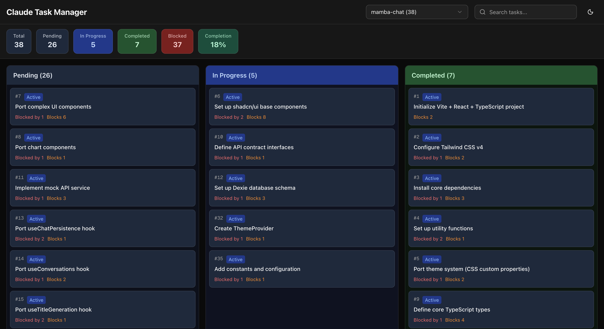
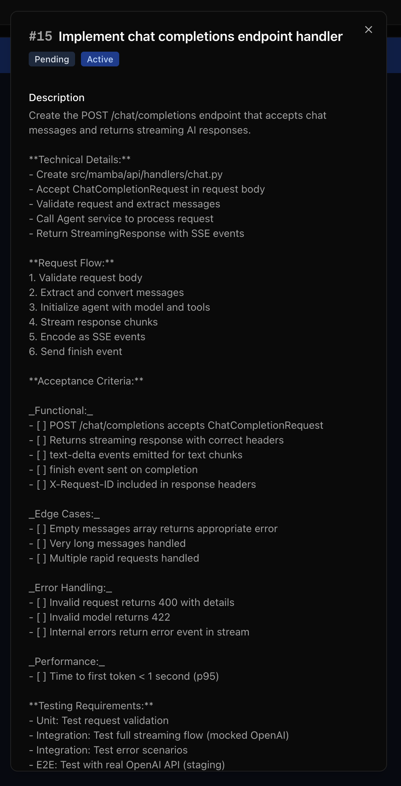
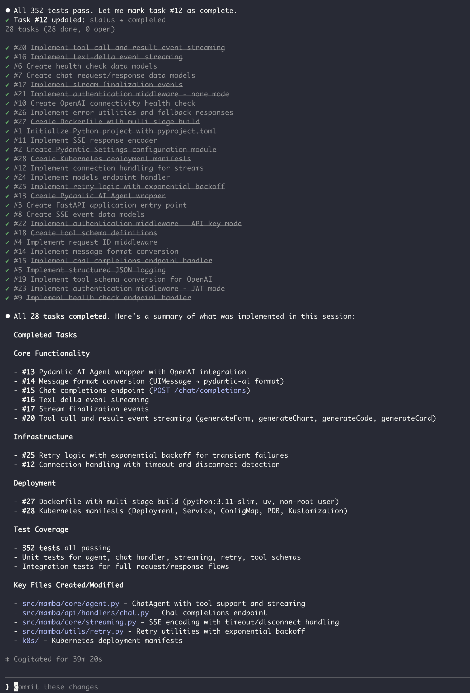

# Agent Alchemy

A plugin suite and developer toolkit that extends Claude Code into a structured development platform — from specs to tasks to autonomous execution.

## What is Agent Alchemy?

Agent Alchemy is an open-source toolkit for AI and software engineers who use Claude Code. It adds structured development workflows on top of Claude Code through six plugins, a real-time task manager, and a VS Code extension — all designed to work together as an integrated pipeline.

Everything is built with Claude Code for Claude Code. The plugins are plain markdown — readable, editable, and version-controlled like any other code.

## Components

### Claude Code Plugins

Six plugin groups providing 28 skills and 16 agents:

| Plugin | Description |
|--------|-------------|
| **[SDD Tools](claude/sdd-tools/)** | Spec-Driven Development — turn ideas into specs, specs into tasks, and tasks into autonomous execution |
| **[Dev Tools](claude/dev-tools/)** | Feature development, code review, architecture patterns, documentation, and changelog management |
| **[Core Tools](claude/core-tools/)** | Codebase analysis, deep exploration with multi-agent teams, and language patterns |
| **[TDD Tools](claude/tdd-tools/)** | Test-Driven Development — RED-GREEN-REFACTOR workflows, test generation, and coverage analysis |
| **[Git Tools](claude/git-tools/)** | Conventional Commits automation |
| **[Plugin Tools](claude/plugin-tools/)** | Plugin porting, adapter validation, ported plugin maintenance, and ecosystem health analysis |

### [Task Manager](apps/task-manager/)

A Next.js real-time Kanban dashboard for monitoring autonomous task execution. Tasks update live via filesystem watching and Server-Sent Events.



**See more screenshots [screenshots](#screenshots) below**

### [VS Code Extension](extensions/vscode/)

Schema validation, YAML frontmatter autocomplete, and hover documentation for Claude Code plugin development.

## Getting Started

### Prerequisites

- [Claude Code](https://docs.anthropic.com/en/docs/claude-code) CLI installed
- Node.js >= 18.0.0
- pnpm >= 8.0.0

### Install Plugins

```bash
# Install from the Claude Code marketplace
claude plugins install agent-alchemy/agent-alchemy-sdd-tools
claude plugins install agent-alchemy/agent-alchemy-dev-tools
claude plugins install agent-alchemy/agent-alchemy-core-tools
claude plugins install agent-alchemy/agent-alchemy-git-tools
claude plugins install agent-alchemy/agent-alchemy-tdd-tools
claude plugins install agent-alchemy/agent-alchemy-plugin-tools
```

### Run Task Manager

```bash
pnpm install
pnpm dev:task-manager
# Open http://localhost:3030
```

### Build VS Code Extension

```bash
cd extensions/vscode
npm install
npm run build
npm run package
```

## Configuration

Plugin behavior is configured via `.claude/agent-alchemy.local.md` — a markdown file with nested key-value pairs using `key: value` syntax. This file is not committed to version control.

### File Format

```markdown
- deep-analysis:
  - direct-invocation-approval: true
  - invocation-by-skill-approval: false
- execute-tasks:
  - max_parallel: 5
- author: Your Name
- spec-output-path: specs/
```

### Settings Reference

| Setting | Plugin | Default | Description |
|---------|--------|---------|-------------|
| `deep-analysis.direct-invocation-approval` | core-tools | `true` | Require user approval of the team plan when invoking `/deep-analysis` directly |
| `deep-analysis.invocation-by-skill-approval` | core-tools | `false` | Require approval when deep-analysis is loaded by another skill (e.g., `/feature-dev`, `/codebase-analysis`) |
| `execute-tasks.max_parallel` | sdd-tools | `5` | Maximum concurrent task-executor agents per wave. CLI `--max-parallel` takes precedence. Set to `1` for sequential execution |
| `author` | sdd-tools | — | Author name for spec attribution and task metadata |
| `spec-output-path` | sdd-tools | `specs/` | Default directory for spec file output |

### Precedence

Settings follow this precedence order (highest to lowest):
1. CLI arguments (e.g., `--max-parallel`)
2. `.claude/agent-alchemy.local.md` settings
3. Built-in defaults

## Architecture

Agent Alchemy follows a **markdown-as-code** philosophy — "prompts as software" — where AI agent behaviors, workflows, and domain knowledge are defined entirely in Markdown with YAML frontmatter. There is no compilation step; the markdown files *are* the executable code, interpreted directly by Claude Code's runtime.

### Three Interconnected Systems

```
Plugin Framework (claude/)        Task Dashboard (apps/task-manager/)
  28 skills, 16 agents              Next.js 16 + TanStack Query
  6 plugin groups                   Real-time Kanban via SSE
  markdown-as-code                  Watches ~/.claude/tasks/
         │                                    ▲
         │  creates task JSON files           │ watches filesystem
         └────────────────────────────────────┘

VS Code Extension (extensions/vscode/)
  Ajv YAML frontmatter validation
  7 JSON schemas
  Autocompletion + hover docs
```

### The SDD Pipeline

The flagship workflow chains four skills into an end-to-end development pipeline:

```
/create-spec  →  specs/SPEC-{name}.md        (adaptive interview)
                      │
/analyze-spec →  {name}.analysis.md + .html   (quality gate)
                      │
/create-tasks →  ~/.claude/tasks/*.json       (dependency-ordered decomposition)
                      │
/execute-tasks → Wave-based autonomous execution → Task Manager (real-time)
```

### Model Tiering

| Tier | Model | Use Case |
|------|-------|----------|
| Reasoning | Opus | Synthesis, architecture, review, implementation |
| Exploration | Sonnet | Parallel search, broad codebase exploration |
| Simple | Haiku | Git commits, quick tasks |

### Tech Stack

| Component | Technology |
|-----------|-----------|
| Plugins | Markdown + YAML frontmatter |
| Task Manager | Next.js 16, React 19, TanStack Query 5, Tailwind CSS v4, Chokidar 5 |
| VS Code Extension | Ajv, esbuild |
| Package Manager | pnpm (workspaces) |

### Repository Structure

```
claude/                          # Plugins (markdown-as-code)
├── core-tools/                  # Analysis & exploration
├── dev-tools/                   # Development lifecycle
├── sdd-tools/                   # Spec-Driven Development
├── tdd-tools/                   # Test-Driven Development
├── git-tools/                   # Git automation
└── plugin-tools/                # Plugin porting & ecosystem health

apps/task-manager/               # Real-time dashboard
├── src/lib/fileWatcher.ts       # Chokidar -> SSE
├── src/app/api/events/route.ts  # SSE endpoint
└── src/components/              # React UI

extensions/vscode/               # Developer tooling
├── src/frontmatter/             # YAML validation
└── schemas/                     # JSON Schemas for plugin contracts
```


## Screenshots

### Task Manager Kanban View


### Tasks Generated from sdd-tools


### Single Task View with Dependencies, Test Cases and Acceptance Criteria


### Completed Tasks in Claude Code



## License

MIT
