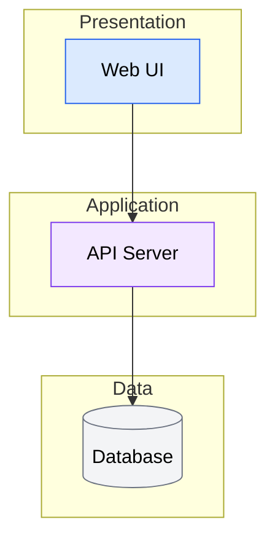
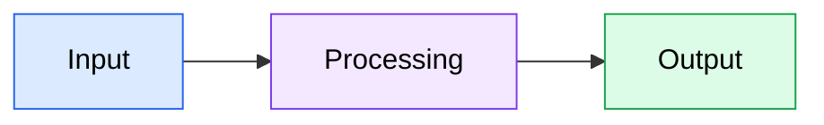
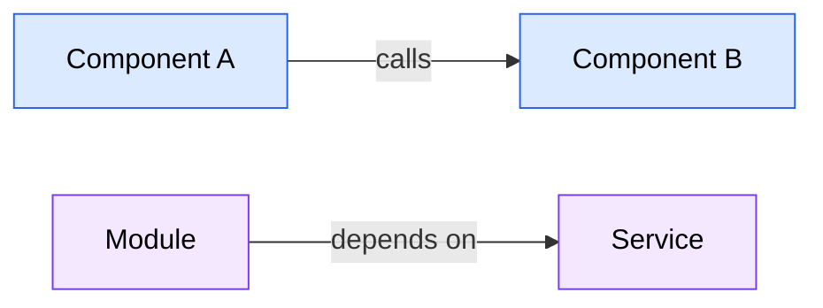
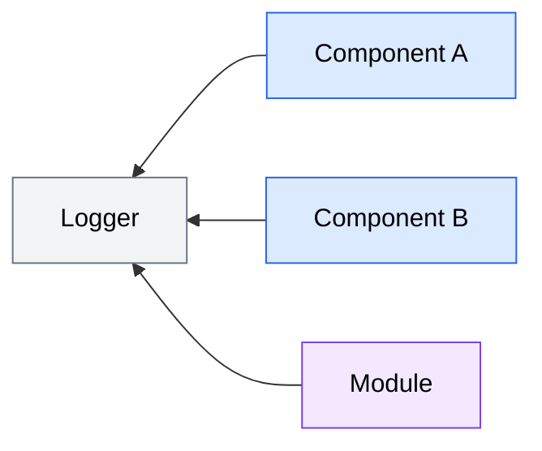

# Codebase Analysis Report Template

Use this template when presenting analysis findings in Phase 2.

---

## Template

```markdown
# Codebase Analysis Report

**Analysis Context**: {What was analyzed and why}
**Codebase Path**: {Path analyzed}
**Date**: {YYYY-MM-DD}

{If the report exceeds approximately 100 lines, add a **Table of Contents** here linking to each major section.}

---

## Executive Summary

{Lead with the most important finding. 2-3 sentences covering: what was analyzed, the key architectural insight, and the primary recommendation or risk.}

---

## Architecture Overview

{2-3 paragraphs describing:}
- How the codebase is structured (layers, modules, boundaries)
- The design philosophy and architectural style
- Key architectural decisions and their rationale

{Include a Mermaid architecture diagram (flowchart or C4 Context) showing the major layers/components. Use `classDef` with `color:#000` for all node styles. Example:}



---

## Tech Stack

| Category | Technology | Version (if detected) | Role |
|----------|-----------|----------------------|------|
| Language | {e.g., TypeScript} | {e.g., 5.x} | Primary language |
| Framework | {e.g., Next.js} | {e.g., 16} | Web framework |
| Styling | {e.g., Tailwind CSS} | {e.g., v4} | UI styling |
| Testing | {e.g., Jest} | — | Test runner |
| Build | {e.g., esbuild} | — | Bundler |

{Include only technologies actually detected in config files or code. Omit categories that don't apply.}

---

## Critical Files

{Limit to 5-10 most important files}

| File | Purpose | Relevance |
|------|---------|-----------|
| `path/to/file` | Brief description | High/Medium |

### File Details

#### `path/to/critical-file`
- **Key exports**: What this file provides to others
- **Core logic**: What it does
- **Connections**: What depends on it and what it depends on

---

## Patterns & Conventions

### Code Patterns
- **Pattern**: Description and where it's used

### Naming Conventions
- **Convention**: Description and examples

### Project Structure
- **Organization**: How files and directories are organized

---

## Relationship Map

{Describe how key components connect — limit to 15-20 most significant connections. Use Mermaid flowcharts for both data flows and dependency maps.}

**Data Flow:**



**Component Dependencies:**



**Cross-Cutting Concerns:**



{For complex architectures, group connections by subsystem using subgraphs rather than listing individually}

---

## Challenges & Risks

| Challenge | Severity | Impact |
|-----------|----------|--------|
| {Description} | High/Medium/Low | {What could go wrong} |

---

## Recommendations

1. **{Recommendation}** _(addresses: {Challenge name})_: {Brief rationale}
2. **{Recommendation}** _(addresses: {Challenge name})_: {Brief rationale}

---

## Analysis Methodology

- **Exploration agents**: {Number} agents with focus areas: {list}
- **Synthesis**: Findings merged and critical files read in depth
- **Scope**: {What was included and what was intentionally excluded}
- **Cache status**: {Fresh analysis / Cached results from YYYY-MM-DD}
- **Config files detected**: {List of config files found during reconnaissance (package.json, tsconfig.json, etc.)}
- **Gap-filling**: {Whether direct Glob/Grep investigation was needed after synthesis, and what areas were filled}
```

---

## Section Guidelines

### Executive Summary
- Lead with the most important finding, not a generic overview
- Keep to 2-3 sentences maximum
- Include at least one actionable insight

### Critical Files
- Limit to 5-10 files — these should be the files someone must understand
- Include both the "what" (purpose) and "why" (relevance to analysis context)
- File Details should cover exports, logic, and connections

### Patterns & Conventions
- Only include patterns that are consistently applied (not one-off occurrences)
- Note deviations from patterns — these are often more interesting than the patterns themselves

### Relationship Map
- Focus on the most important connections, not an exhaustive dependency graph
- Use directional language (calls, depends on, triggers, reads from)
- Highlight any circular dependencies or unexpected couplings
- **Depth**: Include 2-3 levels of dependency depth — direct dependencies and their key subdependencies
- **Format**: Use Mermaid flowcharts for both linear flows and complex dependency webs. Apply `classDef` with `color:#000` for readability.
- **Scope limit**: Cap at 15-20 connections. If more exist, group related connections under subsystem labels.

### Challenges & Risks
- Rate severity based on likelihood and impact combined
- Include specific details, not vague warnings
- Focus on challenges relevant to the analysis context

### Recommendations
- Make recommendations actionable — "consider" is weaker than "use X for Y"
- **Cite source challenge**: Each recommendation must reference the specific challenge it addresses using the format: _(addresses: {Challenge name})_. This creates reliable severity links for the actionable insights step.
- Limit to 3-5 recommendations to maintain focus

---

## Adapting the Template

### For Feature-Focused Analysis
- Emphasize integration points and files that would need modification
- Include a "Feature Implementation Context" section before Recommendations
- Focus Challenges on implementation risks

### For General Codebase Understanding
- Broader Architecture Overview with layer descriptions
- More extensive Patterns & Conventions section
- Focus Recommendations on areas for improvement or further investigation

### For Debugging/Investigation
- Emphasize the execution path and data flow
- Include a "Relevant Execution Paths" section
- Focus Critical Files on the suspected problem area
