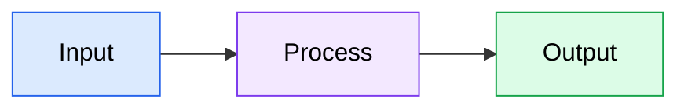
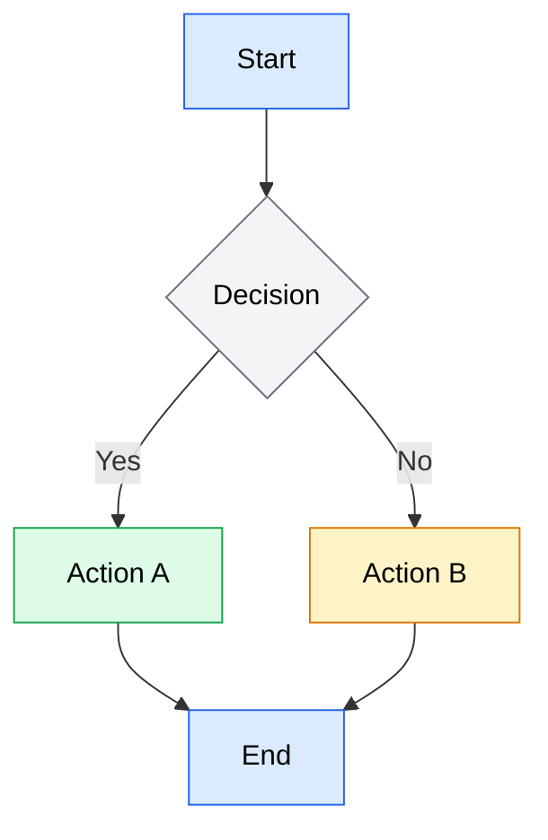
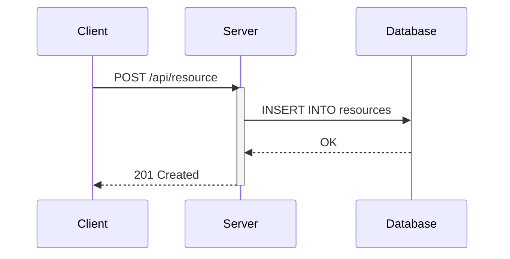
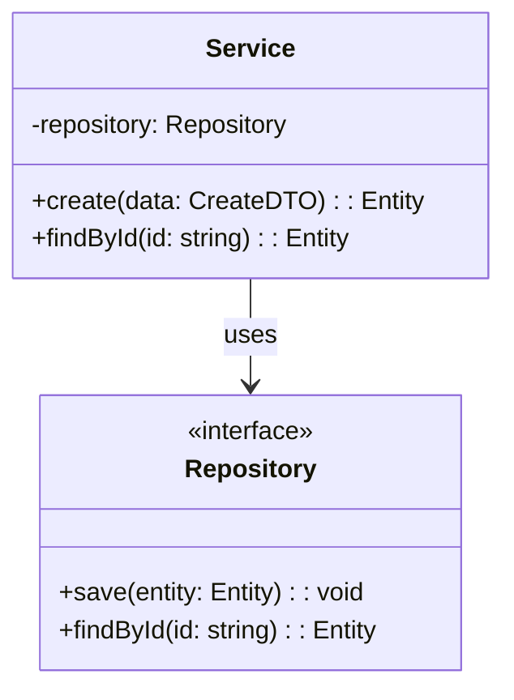
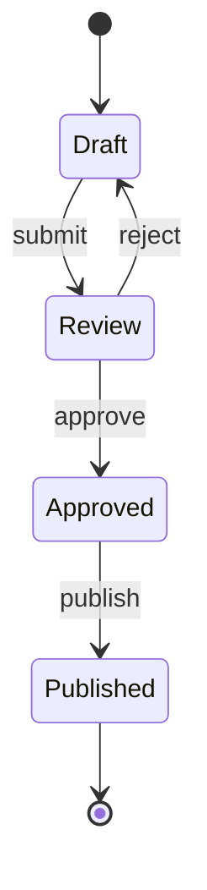
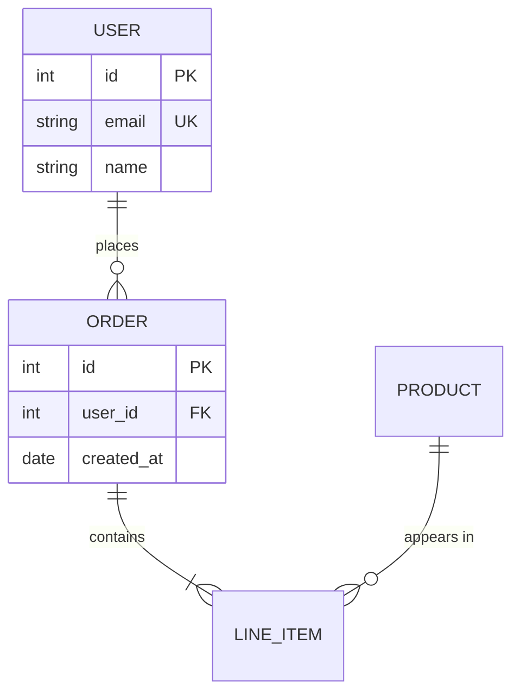
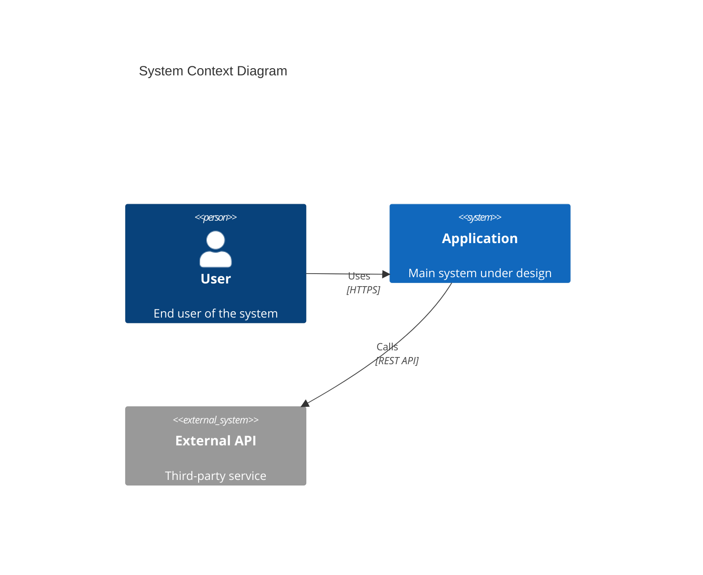
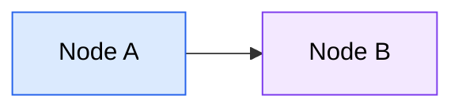
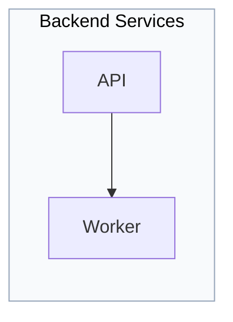
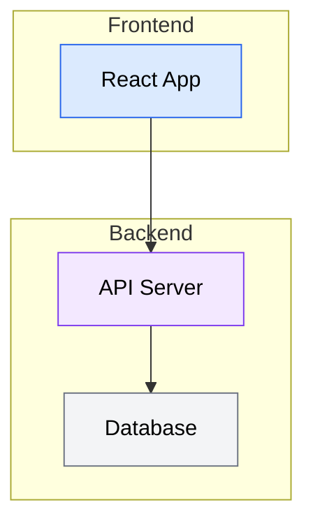

# Technical Diagrams

Mermaid is the standard for all technical diagrams in this project. It renders natively in GitHub, GitLab, MkDocs (with Material theme), and most modern documentation platforms.

This skill provides:
- **Critical styling rules** to ensure readability (especially color contrast)
- **Quick reference** examples for common diagram types
- **Reference files** for advanced syntax when building complex diagrams

Always wrap Mermaid code in fenced code blocks with the `mermaid` language identifier.

---

## Why Mermaid

**Native rendering** — GitHub, GitLab, Notion, MkDocs, and Docusaurus render Mermaid blocks without plugins or build steps. No external image generation tools needed.

**Text-based and diffable** — Diagrams live alongside code in version control. Changes appear in pull request diffs, making reviews straightforward and history trackable.

**No external tools** — No Lucidchart exports, no draw.io XML files, no PNG screenshots that go stale. The diagram source is the single source of truth.

**Maintainable** — Updating a diagram means editing text, not wrestling with a GUI. Refactoring a component name? Find-and-replace works on diagrams too.

**Consistent** — A shared syntax produces visually consistent diagrams across all documentation, regardless of who authored them.

---

## Critical Styling Rules

**This is the most important section.** Light text on light backgrounds is the most common Mermaid readability issue. Follow these rules strictly.

### Rule 1: Always use dark text on nodes

Every node must have `color:#000` (or another dark color like `#1a1a1a`, `#333`). Never use white, light gray, or any light-colored text.

### Rule 2: Use `classDef` for consistent styling

Define reusable styles at the bottom of the diagram and apply them with `:::` syntax:



### Rule 3: Safe color palettes

Use these pre-tested combinations that guarantee readability:

| Style Name | Fill | Stroke | Text | Use For |
|-----------|------|--------|------|---------|
| `primary` | `#dbeafe` | `#2563eb` | `#000` | Main components, entry points |
| `secondary` | `#f3e8ff` | `#7c3aed` | `#000` | Supporting components |
| `success` | `#dcfce7` | `#16a34a` | `#000` | Success states, outputs |
| `warning` | `#fef3c7` | `#d97706` | `#000` | Warnings, caution areas |
| `danger` | `#fee2e2` | `#dc2626` | `#000` | Errors, critical items |
| `neutral` | `#f3f4f6` | `#6b7280` | `#000` | Background, inactive items |

### Bad vs Good

**Bad — light text is invisible on light background:**
```
classDef bad fill:#dbeafe,stroke:#2563eb,color:#93c5fd
```

**Good — dark text is always readable:**
```
classDef good fill:#dbeafe,stroke:#2563eb,color:#000
```

---

## Supported Diagram Types

| Diagram Type | Mermaid Keyword | Use Case | Reference File |
|-------------|----------------|----------|----------------|
| Flowchart | `flowchart` | Process flows, decision trees, pipelines | `references/flowcharts.md` |
| Sequence | `sequenceDiagram` | API interactions, message passing, protocols | `references/sequence-diagrams.md` |
| Class | `classDiagram` | Object models, interfaces, relationships | `references/class-diagrams.md` |
| State | `stateDiagram-v2` | State machines, lifecycle management | `references/state-diagrams.md` |
| ER | `erDiagram` | Database schemas, entity relationships | `references/er-diagrams.md` |
| C4 | `C4Context` / `C4Container` / etc. | System architecture, containers, components | `references/c4-diagrams.md` |

**To load a reference file:**
```
Read ${CLAUDE_PLUGIN_ROOT}/skills/technical-diagrams/references/<file>.md
```

---

## Quick Reference

Minimal copy-paste examples for simple diagrams. For complex use cases, load the corresponding reference file.

### Flowchart



### Sequence Diagram



### Class Diagram



### State Diagram



### ER Diagram



### C4 Context Diagram



---

## Styling and Theming

### `classDef` — Reusable Style Classes

Define once, apply to many nodes:



### `:::` Shorthand — Apply Class Inline

```
A[Label]:::className
```

### `style` — One-Off Inline Styling

For single-node overrides (prefer `classDef` for consistency):

```
style nodeId fill:#dbeafe,stroke:#2563eb,color:#000
```

### Standard Style Classes

Define these at the bottom of any diagram that uses multiple styles:

```
classDef primary fill:#dbeafe,stroke:#2563eb,color:#000
classDef secondary fill:#f3e8ff,stroke:#7c3aed,color:#000
classDef success fill:#dcfce7,stroke:#16a34a,color:#000
classDef warning fill:#fef3c7,stroke:#d97706,color:#000
classDef danger fill:#fee2e2,stroke:#dc2626,color:#000
classDef neutral fill:#f3f4f6,stroke:#6b7280,color:#000
```

### Subgraph Styling

Subgraphs can be styled via `style` directives:



### Edge Styling with `linkStyle`

Style specific edges by their index (0-based, in order of definition):

```
linkStyle 0 stroke:#2563eb,stroke-width:2px
linkStyle 1 stroke:#dc2626,stroke-width:2px,stroke-dasharray:5
```

---

## Best Practices

### Keep diagrams focused
Limit to 15-20 nodes maximum. If a diagram grows beyond that, split it into multiple diagrams or use subgraphs to manage complexity.

### Choose direction deliberately
- **TD (top-down)** — Hierarchies, data flow, process steps
- **LR (left-right)** — Timelines, pipelines, request flows
- **BT (bottom-up)** — Dependency trees (leaves at top)
- **RL (right-left)** — Rarely used, avoid unless it matches a specific mental model

### Use meaningful labels
```
A[User Service] --> B[Auth Service]    %% Good: descriptive
A --> B                                 %% Bad: meaningless
```

### Label edges
```
A -->|validates| B    %% Good: explains the relationship
A --> B               %% Acceptable only if the relationship is obvious
```

### Group with subgraphs
Use subgraphs to visually separate layers, domains, or subsystems:



### Use consistent arrow types
Within a single diagram, stick to one arrow style unless you need to distinguish different relationship types:
- `-->` solid arrow (primary flow)
- `-.->` dotted arrow (optional or async)
- `==>` thick arrow (critical path)

### Prefer `flowchart` over `graph`
`flowchart` is the modern syntax with more features (subgraph styling, `:::` shorthand, more shapes). `graph` is legacy — use `flowchart` for all new diagrams.

### Platform compatibility
- GitHub/GitLab: Full support for flowcharts, sequence, class, state, ER, Gantt, pie
- C4 diagrams: Require Mermaid 10.6+ — verify platform support before using
- MkDocs: Requires `pymdownx.superfences` with custom Mermaid fence config

---

## When to Load Reference Files

**Simple diagrams** — The quick reference above is sufficient. Use it for:
- Basic flowcharts with fewer than 10 nodes
- Simple sequence diagrams with 2-3 participants
- Standard ER diagrams with straightforward relationships

**Complex or unfamiliar diagrams** — Load the reference file when:
- Using advanced features (composite states, parallel blocks, fork/join)
- Building class diagrams with generics, namespaces, or cardinality
- Needing the full set of node shapes, arrow types, or relationship notations
- Working with a diagram type for the first time

**C4 diagrams** — Always load the reference file. C4 uses a unique function-call syntax (`Person()`, `System()`, `Container()`, etc.) that differs significantly from other Mermaid diagrams.

```
Read ${CLAUDE_PLUGIN_ROOT}/skills/technical-diagrams/references/c4-diagrams.md
```
