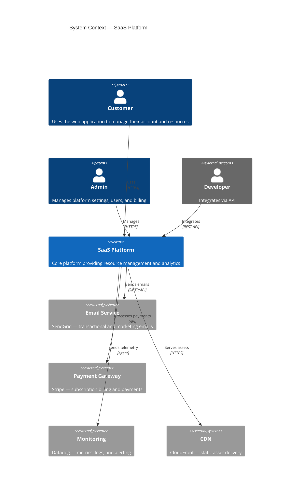
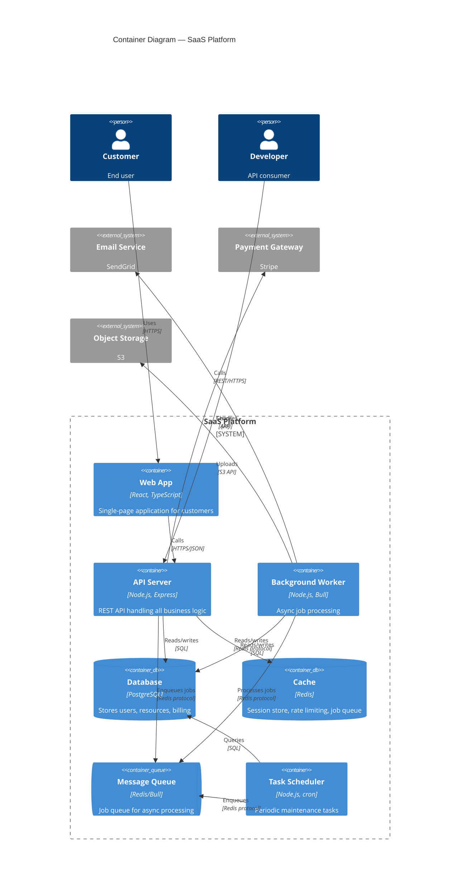
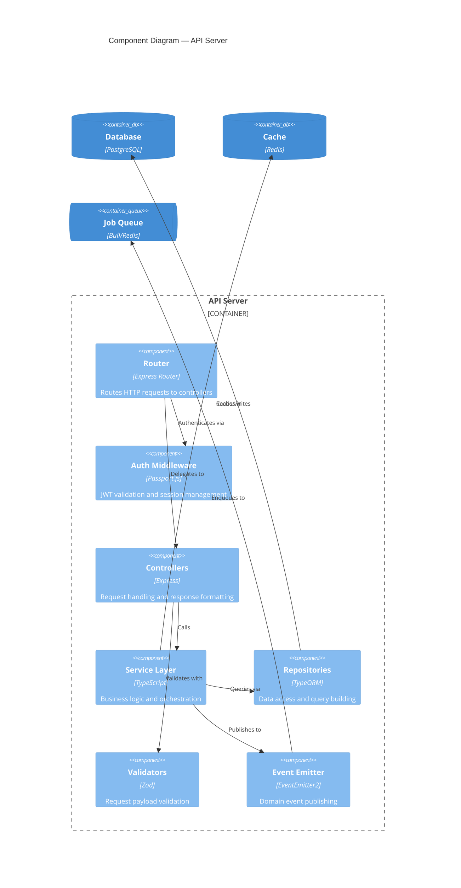
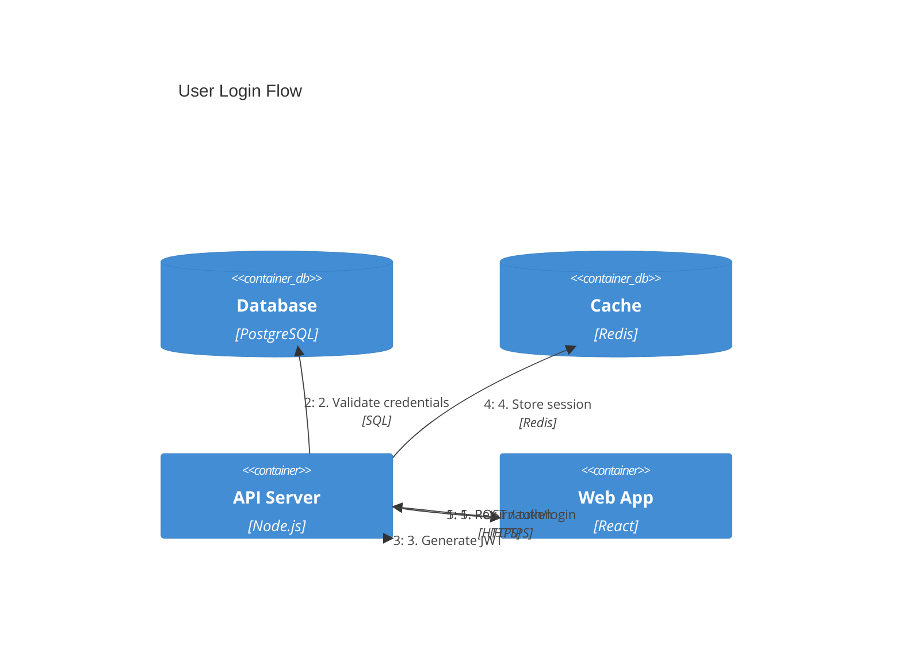

# C4 Diagrams Reference

C4 diagrams model software architecture at multiple zoom levels — from system context down to individual components. C4 uses a unique function-call syntax that differs from other Mermaid diagram types.

**Keywords:** `C4Context`, `C4Container`, `C4Component`, `C4Dynamic`, `C4Deployment`

**Compatibility note:** C4 requires Mermaid 10.6+. Verify your rendering platform supports it.

---

## Diagram Levels

| Level | Keyword | Scope | Shows |
|-------|---------|-------|-------|
| Context | `C4Context` | Entire system | People, systems, external dependencies |
| Container | `C4Container` | Single system | Applications, databases, services within one system |
| Component | `C4Component` | Single container | Internal components of one application |
| Dynamic | `C4Dynamic` | Interaction flow | Numbered sequence of interactions |
| Deployment | `C4Deployment` | Infrastructure | Where containers run (servers, cloud, VMs) |

---

## Element Functions

### People

```
Person(alias, "Label", "Description")
Person_Ext(alias, "Label", "Description")
```

- `Person` — Internal user
- `Person_Ext` — External user

### Systems

```
System(alias, "Label", "Description")
System_Ext(alias, "Label", "Description")
System_Boundary(alias, "Label") { ... }
```

- `System` — System under design
- `System_Ext` — External system
- `System_Boundary` — Groups elements belonging to one system

### Containers

```
Container(alias, "Label", "Technology", "Description")
ContainerDb(alias, "Label", "Technology", "Description")
ContainerQueue(alias, "Label", "Technology", "Description")
Container_Ext(alias, "Label", "Technology", "Description")
Container_Boundary(alias, "Label") { ... }
```

- `Container` — Application/service
- `ContainerDb` — Database
- `ContainerQueue` — Message queue
- `Container_Ext` — External container
- `Container_Boundary` — Groups containers

### Components

```
Component(alias, "Label", "Technology", "Description")
ComponentDb(alias, "Label", "Technology", "Description")
ComponentQueue(alias, "Label", "Technology", "Description")
Component_Ext(alias, "Label", "Technology", "Description")
```

### Deployment Nodes

```
Deployment_Node(alias, "Label", "Technology") { ... }
Node(alias, "Label", "Technology") { ... }
```

---

## Relationships

```
Rel(from, to, "Label")
Rel(from, to, "Label", "Technology/Protocol")

Rel_D(from, to, "Label")    %% Downward
Rel_U(from, to, "Label")    %% Upward
Rel_L(from, to, "Label")    %% Left
Rel_R(from, to, "Label")    %% Right

Rel_Back(from, to, "Label")          %% Reverse direction
BiRel(from, to, "Label")             %% Bidirectional
```

---

## Styling

### UpdateElementStyle

```
UpdateElementStyle(alias, $bgColor="color", $fontColor="color", $borderColor="color")
```

### UpdateRelStyle

```
UpdateRelStyle(from, to, $textColor="color", $lineColor="color", $offsetX="n", $offsetY="n")
```

### Layout

```
UpdateLayoutConfig($c4ShapeInRow="3", $c4BoundaryInRow="1")
```

---

## Title and Description

Always include a title for context:

```
title System Context Diagram for My Application
```

---

## Complete Examples

### System Context Diagram



### Container Diagram



### Component Diagram



### Dynamic Diagram


