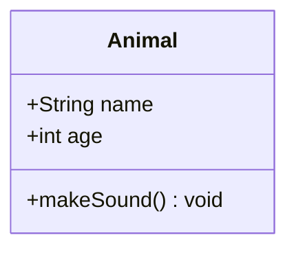
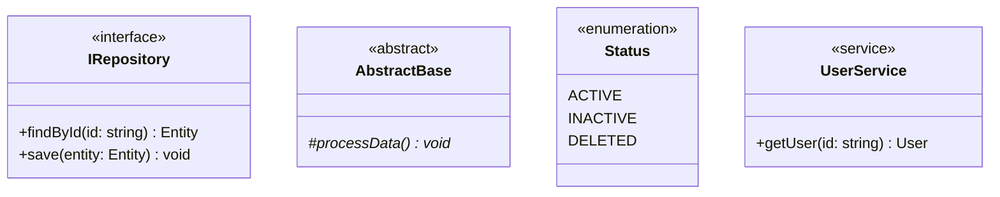
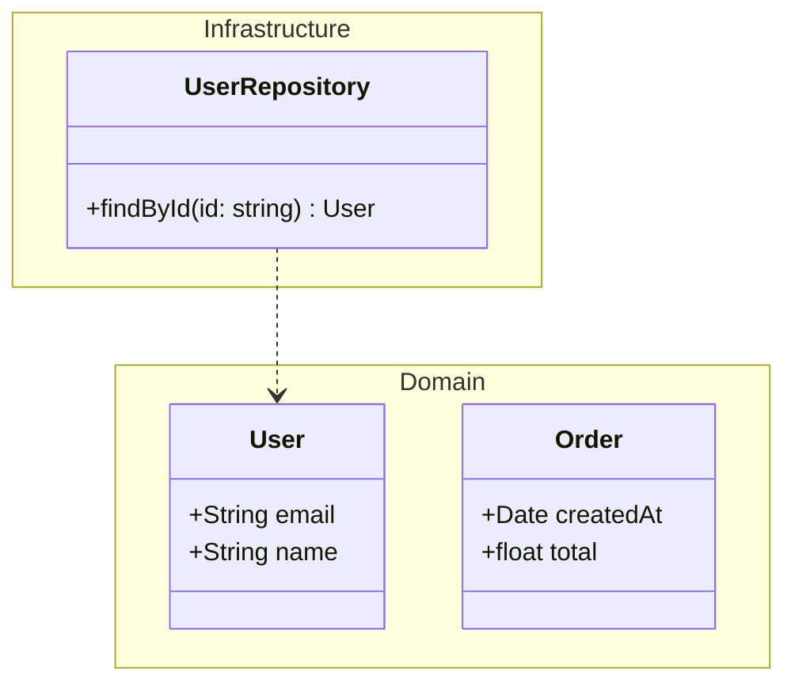
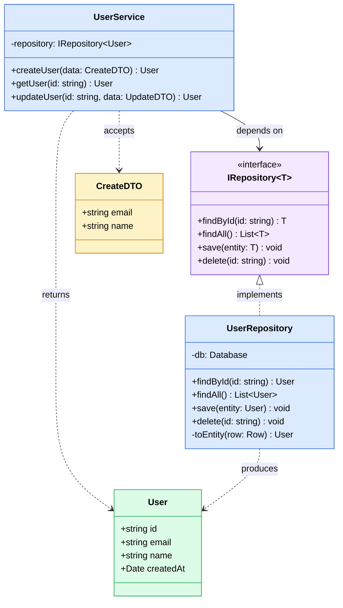
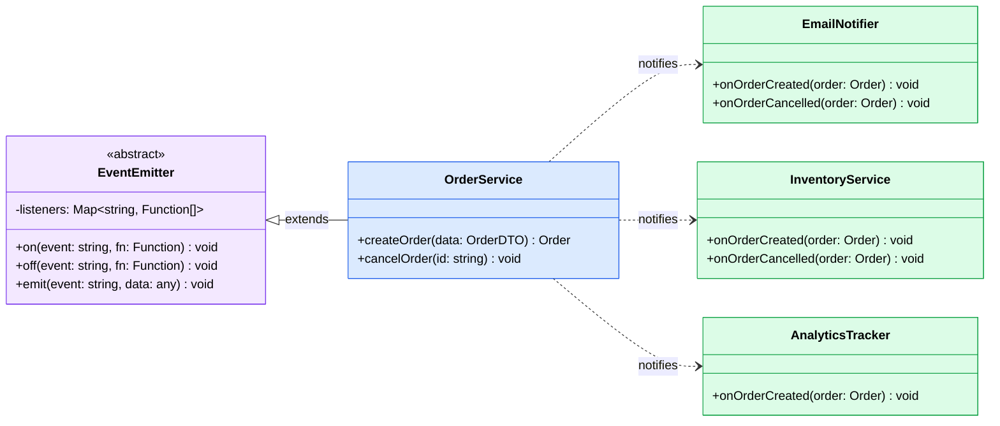

# Class Diagrams Reference

Class diagrams model object-oriented structures — classes, interfaces, relationships, and inheritance hierarchies.

**Keyword:** `classDiagram`

---

## Class Declaration

### Basic class



### Visibility Modifiers

| Symbol | Visibility |
|--------|-----------|
| `+` | Public |
| `-` | Private |
| `#` | Protected |
| `~` | Package/Internal |

### Method Signatures

```
+methodName(param1: Type, param2: Type) ReturnType
+staticMethod(input: String)$ String
+abstractMethod()* void
```

- `$` suffix — static method
- `*` suffix — abstract method

### Attributes

```
+attributeName: Type
-privateField: String
#protectedField: int
~internalField: boolean
```

---

## Annotations

Mark classes with stereotypes:



Available annotations: `<<interface>>`, `<<abstract>>`, `<<enumeration>>`, `<<service>>`, or any custom text.

---

## Relationships

| Syntax | Type | Meaning |
|--------|------|---------|
| `A <\|-- B` | Inheritance | B extends A |
| `A <\|.. B` | Realization | B implements A |
| `A *-- B` | Composition | B is part of A (lifecycle coupled) |
| `A o-- B` | Aggregation | B belongs to A (independent lifecycle) |
| `A --> B` | Association | A uses B |
| `A ..> B` | Dependency | A depends on B |
| `A -- B` | Link | General association (no direction) |

### With Labels

```
A --> B : uses
A <|-- B : extends
```

### Cardinality

```
A "1" --> "many" B : contains
A "1" --> "0..1" B : optional
A "1..*" --> "*" B : maps to
```

Common cardinality notations: `1`, `0..1`, `1..*`, `*`, `n`, `0..n`, `1..n`

---

## Namespaces

Group classes into logical namespaces:



---

## Direction

Control diagram direction:

```
classDiagram
    direction LR
```

Options: `TB` (default), `BT`, `LR`, `RL`

---

## Styling

### Class-level styling

```
style User fill:#dbeafe,stroke:#2563eb,color:#000
```

### CSS classes

```
cssClass "User,Order" entityStyle
```

---

## Complete Examples

### Repository Pattern



### Observer Pattern


