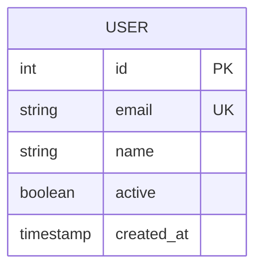
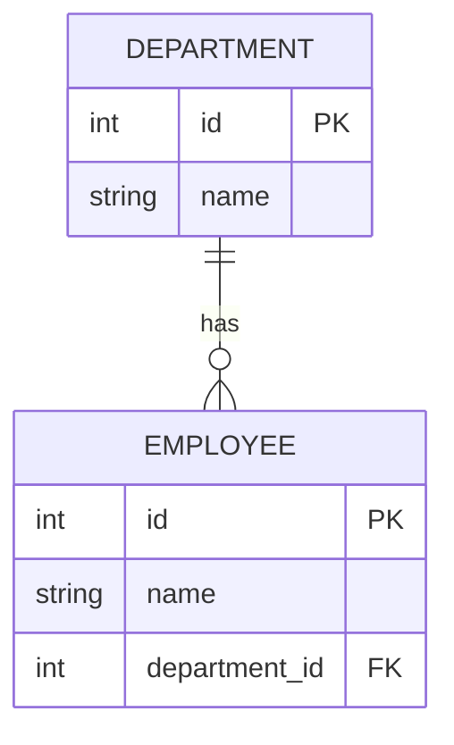
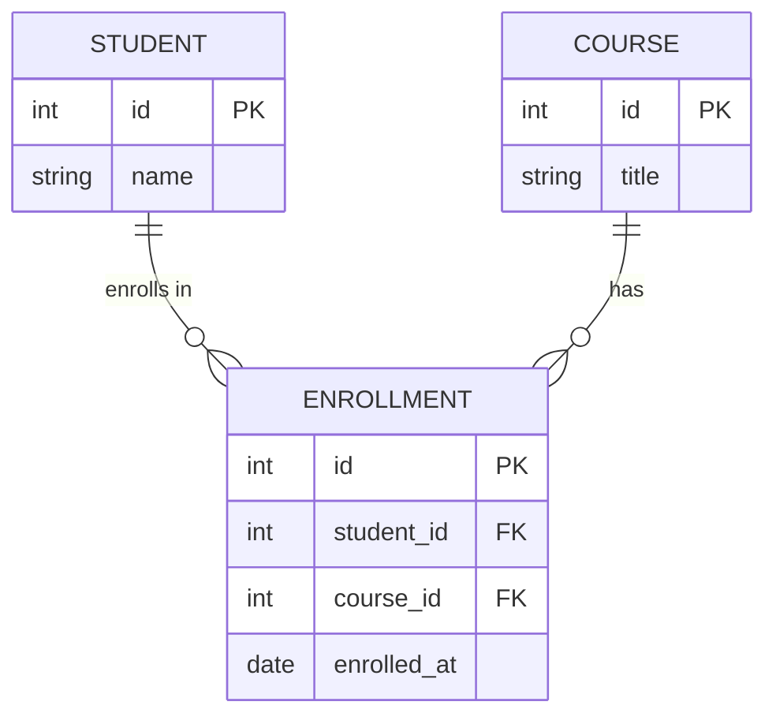
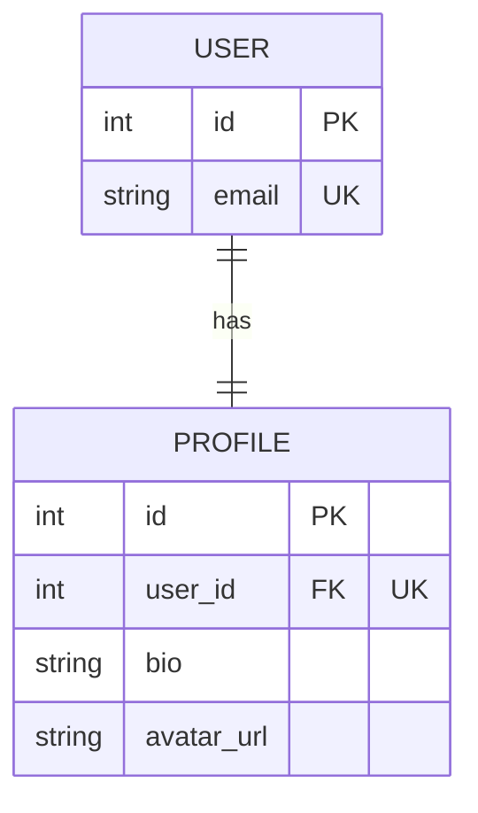
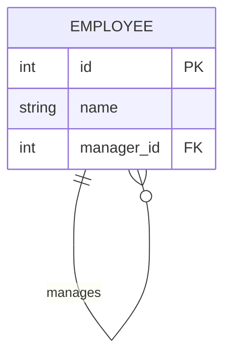
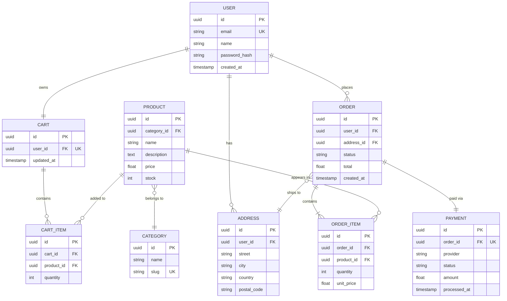
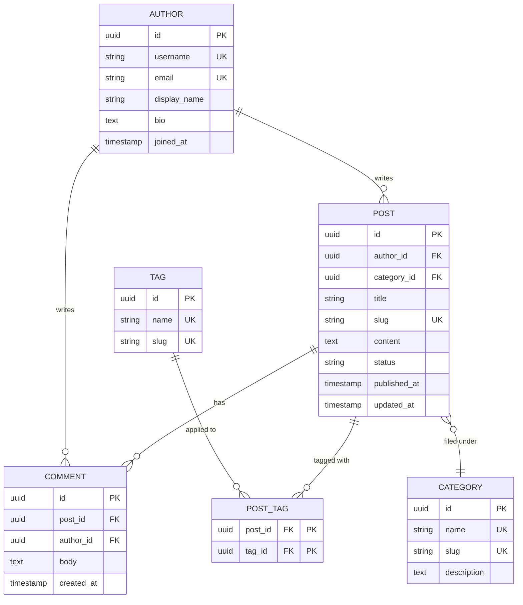

# ER Diagrams Reference

Entity-Relationship diagrams model database schemas — tables, columns, data types, primary/foreign keys, and relationships between entities.

**Keyword:** `erDiagram`

---

## Entity Declaration

### Basic entity with attributes



### Attribute format

```
type name constraint
```

- **type** — Data type (`int`, `string`, `boolean`, `float`, `date`, `timestamp`, `uuid`, `json`, `text`, `blob`)
- **name** — Column name
- **constraint** — Optional: `PK` (primary key), `FK` (foreign key), `UK` (unique key)

---

## Relationships

### Cardinality Notation

| Left | Right | Meaning |
|------|-------|---------|
| `\|\|` | `\|\|` | Exactly one to exactly one |
| `\|\|` | `o\|` | Exactly one to zero or one |
| `\|\|` | `\|{` | Exactly one to one or more |
| `\|\|` | `o{` | Exactly one to zero or more |
| `o\|` | `o\|` | Zero or one to zero or one |
| `o\|` | `o{` | Zero or one to zero or more |

### Reading the Notation

The symbols read as:
- `||` — exactly one (mandatory)
- `o|` — zero or one (optional)
- `|{` — one or more (mandatory many)
- `o{` — zero or more (optional many)

### Relationship Syntax

```
ENTITY_A cardinality--cardinality ENTITY_B : "label"
```

The `--` can be solid (`--`) for identifying relationships or dotted (`..`) for non-identifying.

### Identifying vs Non-Identifying

```
PARENT ||--|{ CHILD : "identifying"
PARENT ||..o{ RELATED : "non-identifying"
```

- **Identifying** (`--`): Child's existence depends on parent; FK is part of child's PK
- **Non-identifying** (`..`): Child can exist independently; FK is a regular column

---

## Common Relationship Patterns

### One-to-Many



### Many-to-Many (via junction table)



### One-to-One



### Self-Referencing



---

## Styling

ER diagrams have limited styling options. Entity names should be clear and uppercase by convention.

Use short, descriptive relationship labels:
- `"places"`, `"contains"`, `"has"`, `"belongs to"`
- Avoid generic labels like `"relates to"`

---

## Complete Examples

### E-Commerce Schema



### Blog CMS Schema


