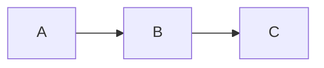
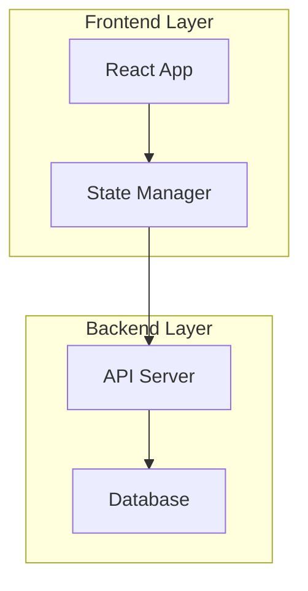
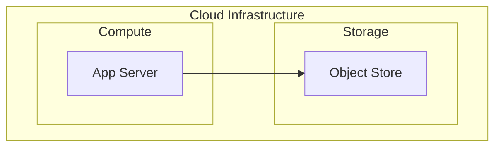
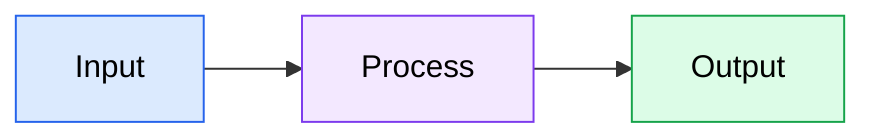
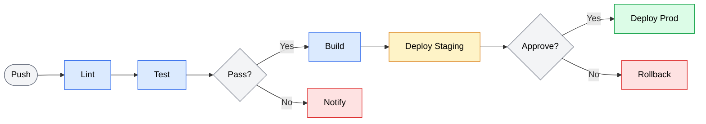
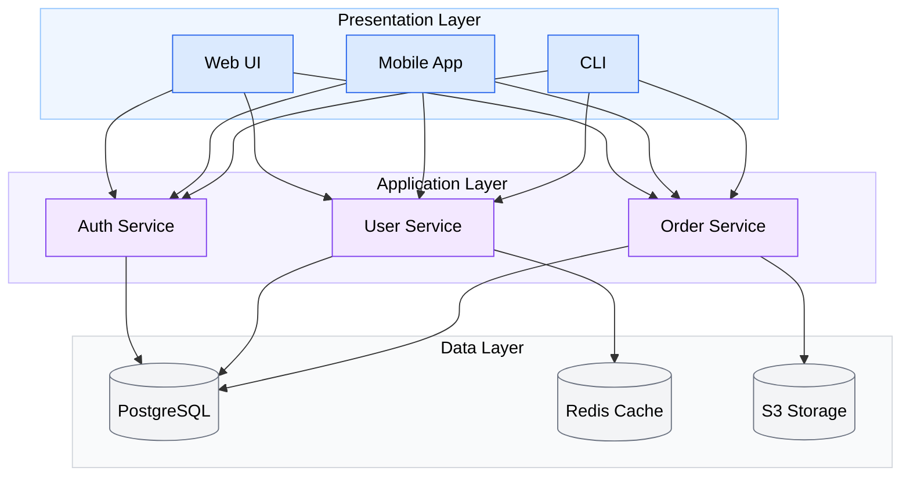

# Flowcharts Reference

Flowcharts visualize process flows, decision trees, pipelines, and system architectures. They are the most versatile Mermaid diagram type.

**Keyword:** `flowchart` (prefer over legacy `graph`)

---

## Direction Keywords

| Keyword | Direction | Best For |
|---------|-----------|----------|
| `TD` / `TB` | Top to bottom | Hierarchies, process steps |
| `LR` | Left to right | Pipelines, request flows, timelines |
| `BT` | Bottom to top | Dependency trees |
| `RL` | Right to left | Rarely used |



---

## Node Shapes

| Syntax | Shape | Use For |
|--------|-------|---------|
| `A[Text]` | Rectangle | Default, general purpose |
| `A(Text)` | Rounded rectangle | Processes, steps |
| `A([Text])` | Stadium | Start/end points |
| `A[[Text]]` | Subroutine | External processes |
| `A[(Text)]` | Cylinder | Databases, storage |
| `A((Text))` | Circle | Connectors, small nodes |
| `A{Text}` | Diamond | Decisions, conditions |
| `A{{Text}}` | Hexagon | Preparation steps |
| `A>Text]` | Asymmetric | Flags, signals |
| `A[/Text/]` | Parallelogram | Input/output |
| `A[\Text\]` | Alt parallelogram | Alt input/output |
| `A[/Text\]` | Trapezoid | Transforms |
| `A[\Text/]` | Alt trapezoid | Alt transforms |
| `A(((Text)))` | Double circle | Critical nodes |

---

## Edge Types

### Solid Edges

| Syntax | Description |
|--------|-------------|
| `A --> B` | Arrow |
| `A --- B` | Line (no arrow) |
| `A -->\|label\| B` | Arrow with label |
| `A --label--> B` | Arrow with label (alt) |

### Dotted Edges

| Syntax | Description |
|--------|-------------|
| `A -.-> B` | Dotted arrow |
| `A -.- B` | Dotted line |
| `A -.->\|label\| B` | Dotted arrow with label |

### Thick Edges

| Syntax | Description |
|--------|-------------|
| `A ==> B` | Thick arrow |
| `A === B` | Thick line |
| `A ==>\|label\| B` | Thick arrow with label |

### Multi-Directional

| Syntax | Description |
|--------|-------------|
| `A <--> B` | Bidirectional arrow |
| `A o--o B` | Circle endpoints |
| `A x--x B` | Cross endpoints |

### Edge Length

Add extra dashes/dots/equals to make edges longer:
- `A ---> B` (longer than `A --> B`)
- `A -----> B` (even longer)

---

## Subgraphs

Group related nodes into labeled regions:



### Nested Subgraphs



### Subgraph Direction

Override direction inside a subgraph:

```
subgraph section["Section"]
    direction LR
    A --> B --> C
end
```

---

## Styling

### classDef and :::



### Inline style

```
style A fill:#dbeafe,stroke:#2563eb,color:#000
```

### Subgraph styling

```
style subgraphId fill:#f8fafc,stroke:#94a3b8,color:#000
```

### linkStyle

Style edges by their 0-based index (order of definition):

```
linkStyle 0 stroke:#2563eb,stroke-width:2px
linkStyle 1 stroke:#dc2626,stroke-dasharray:5
```

### Apply class to multiple nodes

```
class A,B,C primary
```

---

## Complete Examples

### CI/CD Pipeline



### Layered Architecture


