# Sequence Diagrams Reference

Sequence diagrams visualize interactions between components over time — API calls, message passing, authentication flows, and protocol exchanges.

**Keyword:** `sequenceDiagram`

---

## Participants and Actors

### Participants (box shape)

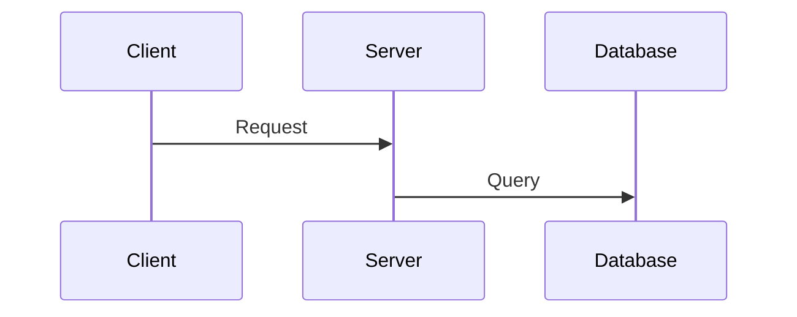

### Actors (person shape)

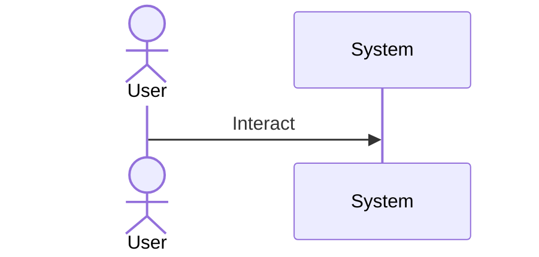

Participants appear in the order they are declared. Use `as` for short aliases.

---

## Message Types

| Syntax | Description | Use For |
|--------|-------------|---------|
| `A->>B: msg` | Solid arrow | Synchronous request |
| `A-->>B: msg` | Dotted arrow | Asynchronous response |
| `A-xB: msg` | Solid cross | Failed/rejected message |
| `A--xB: msg` | Dotted cross | Failed async response |
| `A-)B: msg` | Solid open | Async fire-and-forget |
| `A--)B: msg` | Dotted open | Async notification |

---

## Activation

Show when a participant is actively processing:

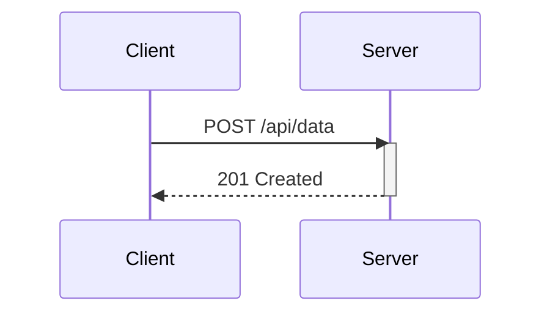

### Shorthand with `+` / `-`

```
C->>+S: Request     %% activates S
S-->>-C: Response   %% deactivates S
```

### Nested Activation

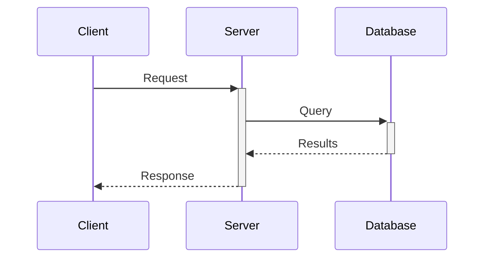

---

## Control Structures

### alt / else — Conditional

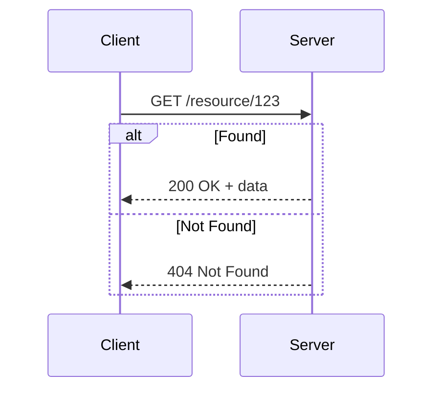

### opt — Optional

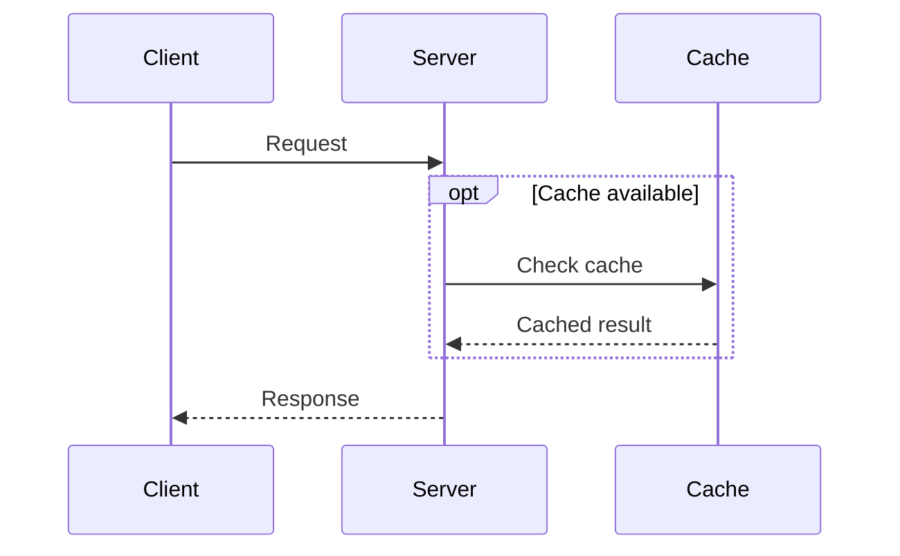

### loop — Repetition

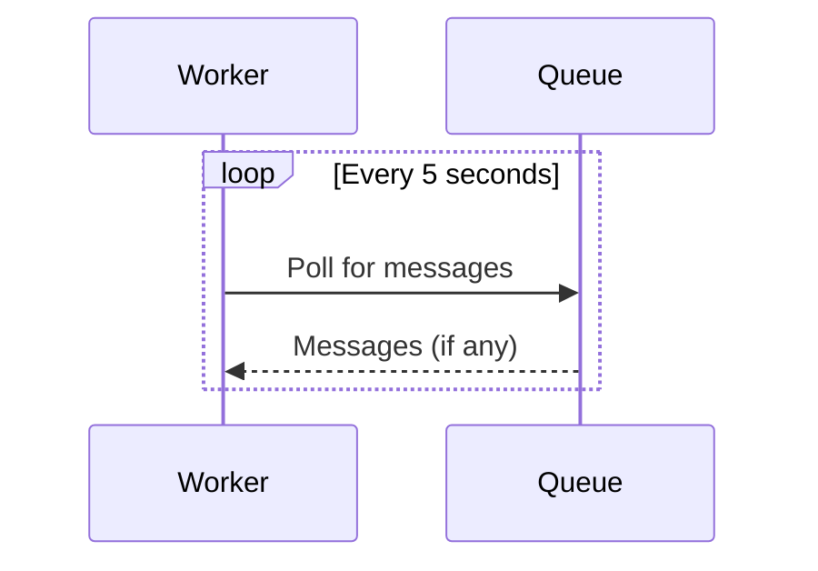

### par — Parallel

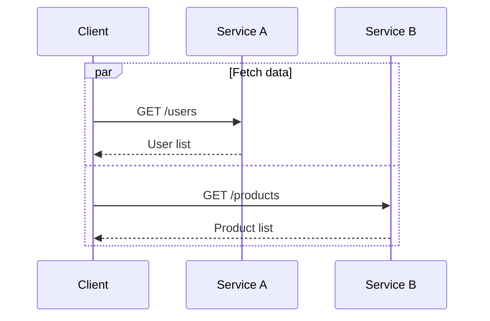

### critical — Critical Region

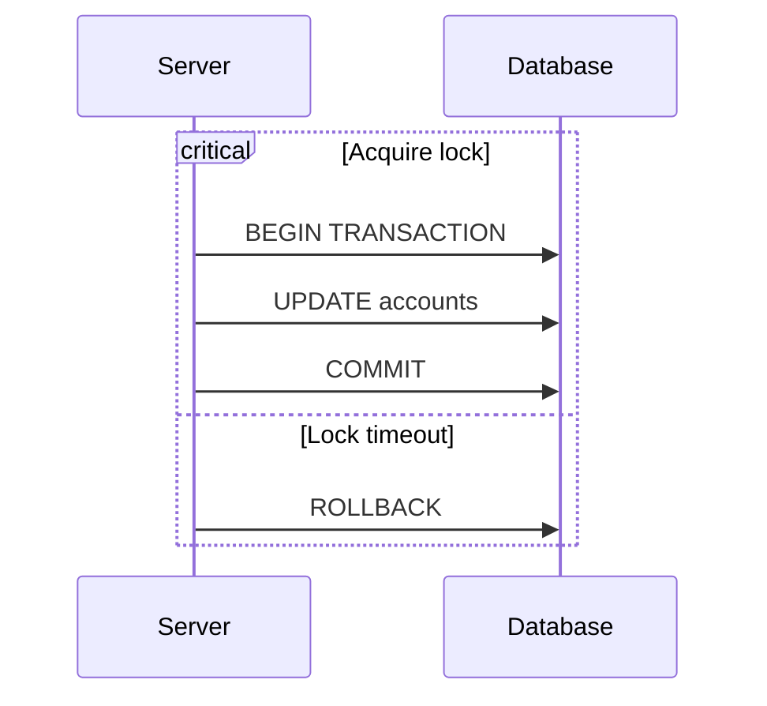

### break — Early Exit

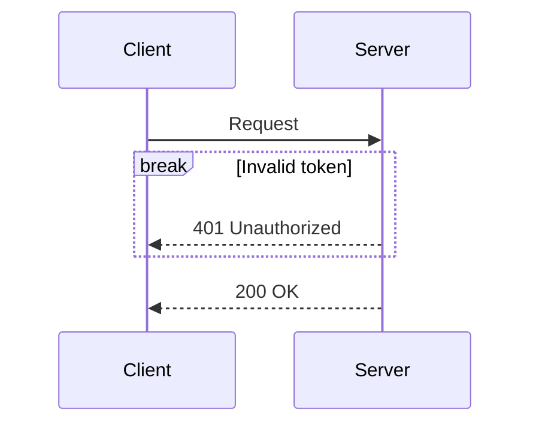

---

## Notes

```
Note right of A: Single participant note
Note left of A: Left-side note
Note over A: Above participant
Note over A,B: Spanning multiple participants
```

---

## Autonumber

Add sequential numbers to all messages:

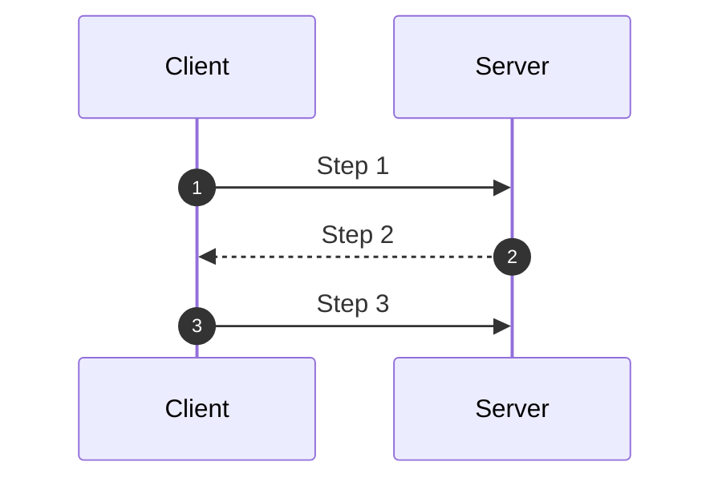

---

## Styling

### Participant colors

Use `box` to group and color participants:

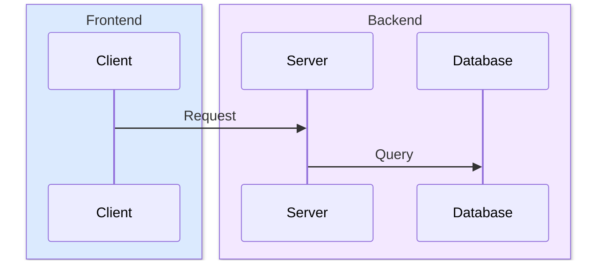

---

## Complete Examples

### OAuth2 Authorization Code Flow

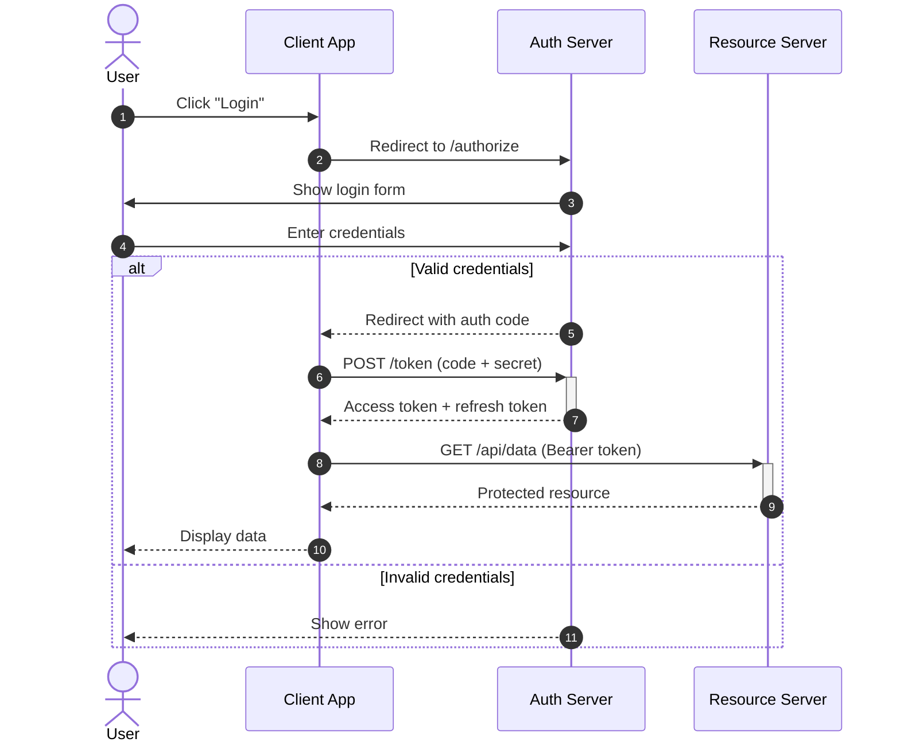

### Microservice Request with Fallback

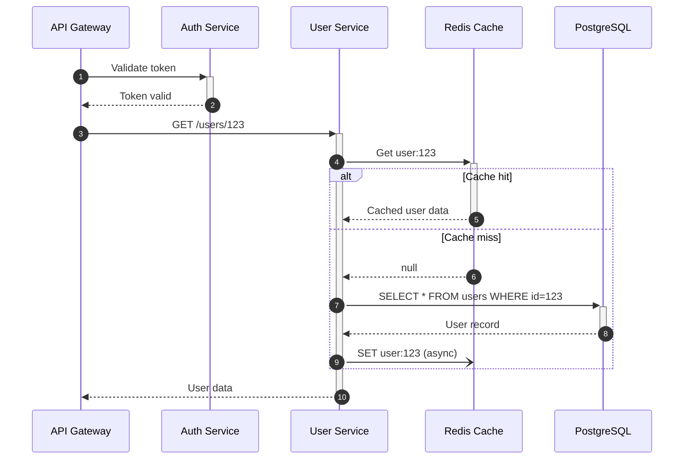
