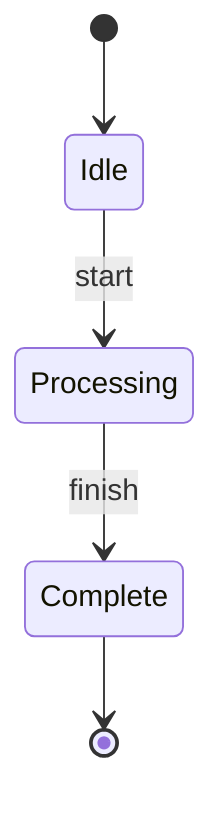
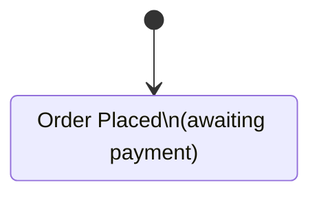
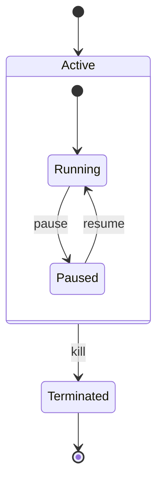
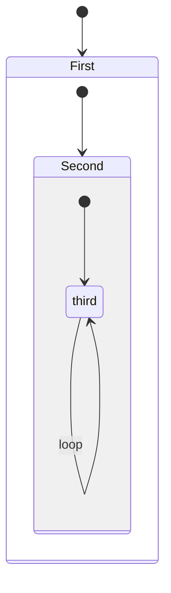
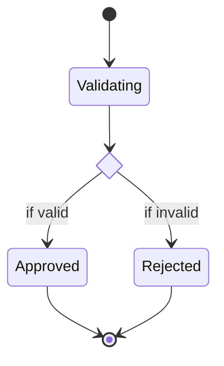
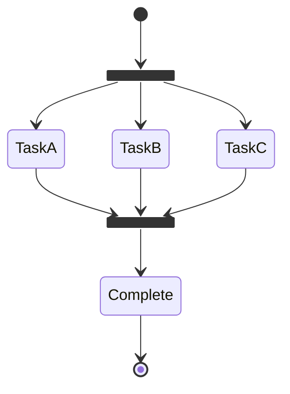
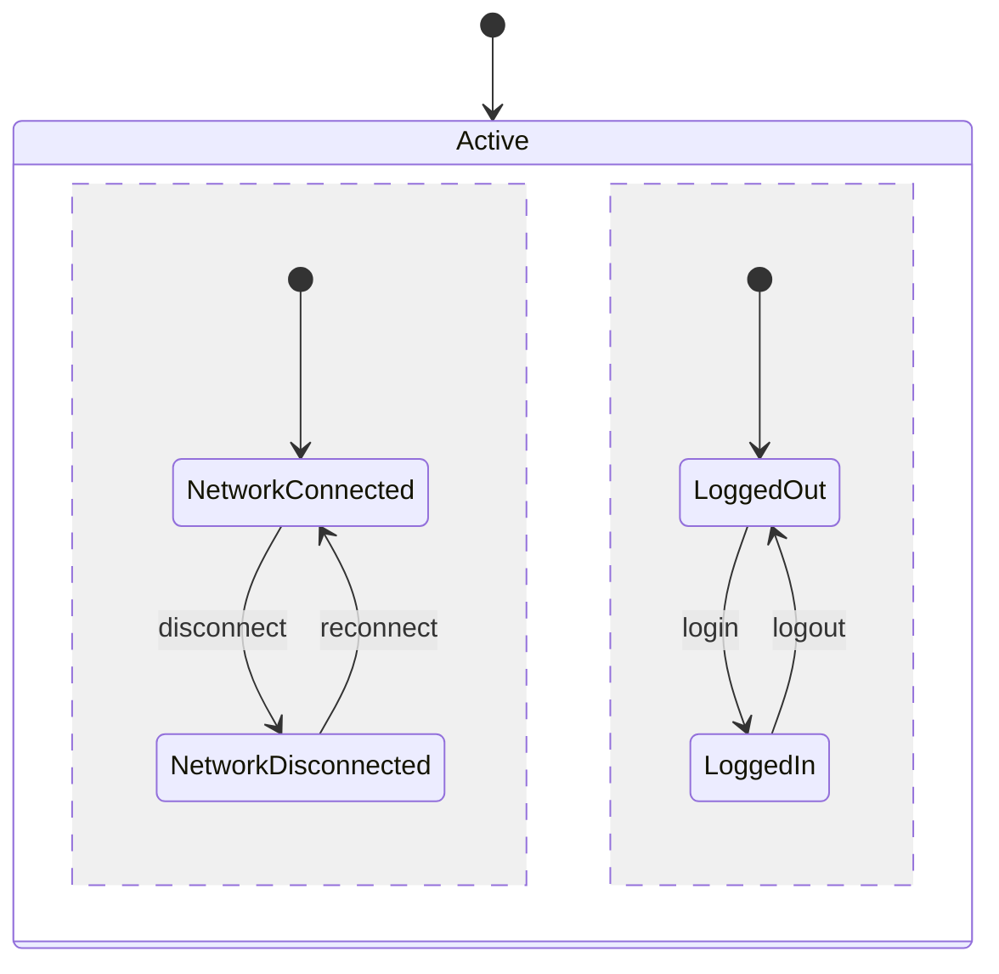
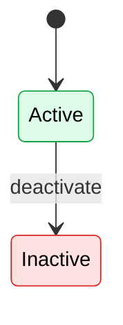
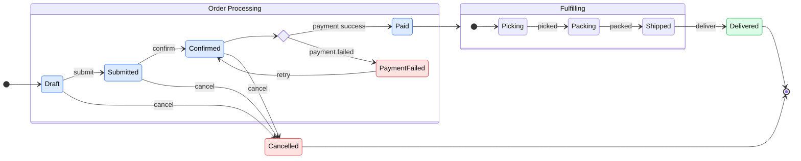
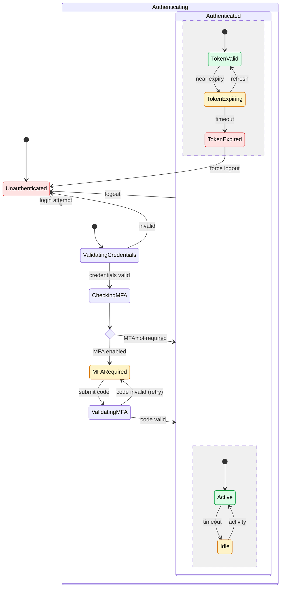

# State Diagrams Reference

State diagrams model state machines — lifecycle management, workflow states, session handling, and protocol states.

**Keyword:** `stateDiagram-v2` (always use v2 for modern syntax)

---

## Basic States



- `[*]` — Start state (initial) or end state (final)
- `-->` — Transition arrow
- `: label` — Transition trigger/event

---

## State Descriptions

Add descriptions inside states:

```
state "Waiting for approval" as Waiting
```

Or with line breaks:



---

## Composite (Nested) States

States can contain sub-states:



### Deeply Nested



---

## Choice (Conditional Branching)



---

## Fork and Join (Parallel States)



---

## Concurrent Regions

Use `--` to separate concurrent state regions within a composite state:



---

## Notes

```
note right of StateName
    This is a note about the state.
    It can span multiple lines.
end note

note left of StateName : Short note
```

---

## Direction

```
stateDiagram-v2
    direction LR
```

Options: `TB` (default), `BT`, `LR`, `RL`

---

## Styling

### State-level styling via classDef



---

## Complete Examples

### Order Lifecycle



### Authentication Session


