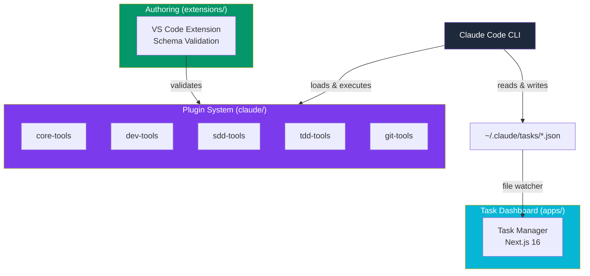
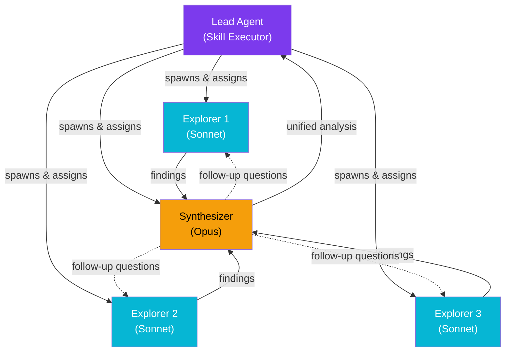
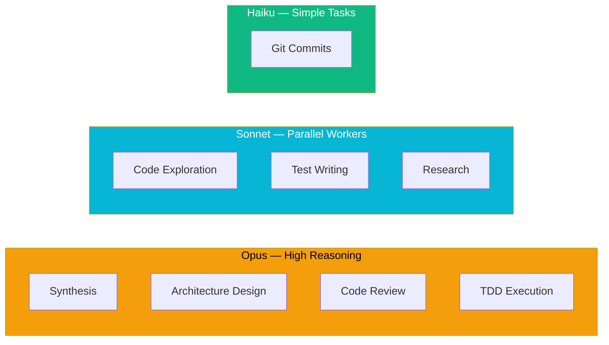
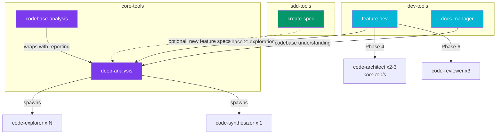
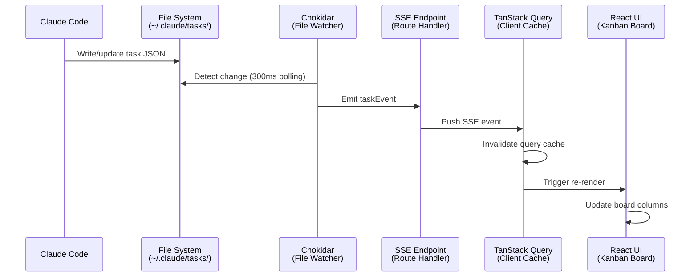

# Architecture

Agent Alchemy extends Claude Code into a structured development platform through three integrated pillars: a markdown-as-code plugin system, a real-time task dashboard, and a VS Code authoring extension. This page explains how these components are designed, how they interact, and the key patterns that hold the system together.

## System Overview

At a high level, Agent Alchemy is a monorepo organized around three independent but complementary subsystems. The plugin system defines development workflows as markdown files that Claude Code executes directly. The task manager provides visibility into those workflows through a real-time Kanban board. The VS Code extension supports plugin authoring with schema validation and autocompletion.



### Repository Structure

```
agent-alchemy/
├── claude/                        # Plugin system (markdown-as-code)
│   ├── .claude-plugin/            # Plugin marketplace registry
│   ├── core-tools/                # Codebase analysis, deep exploration
│   │   ├── skills/                # deep-analysis, codebase-analysis, ...
│   │   ├── agents/                # code-explorer, code-synthesizer, code-architect
│   │   └── hooks/                 # Lifecycle hooks (auto-approve)
│   ├── dev-tools/                 # Feature dev, code review, docs
│   │   ├── skills/                # feature-dev, docs-manager, ...
│   │   └── agents/                # code-reviewer, changelog-manager, ...
│   ├── sdd-tools/                 # Spec-Driven Development pipeline
│   │   ├── skills/                # create-spec, create-tasks, execute-tasks, ...
│   │   └── agents/                # researcher, spec-analyzer, task-executor
│   ├── tdd-tools/                 # Test-Driven Development workflows
│   │   ├── skills/                # tdd-cycle, generate-tests, analyze-coverage
│   │   └── agents/                # tdd-executor, test-writer, test-reviewer
│   ├── git-tools/                 # Git commit automation
│   │   └── skills/                # git-commit
│   └── plugin-tools/              # Plugin porting and ecosystem health
│       ├── skills/                # port-plugin, validate-adapter, ...
│       └── agents/                # researcher, port-converter
├── apps/
│   └── task-manager/              # Next.js 16 real-time Kanban dashboard
├── extensions/
│   └── vscode/                    # VS Code extension for plugin authoring
└── internal/                      # Internal documentation and analysis
```

---

## Markdown-as-Code

Agent Alchemy's core innovation is encoding AI agent instructions, workflows, and team coordination logic in plain markdown files. Instead of writing code to orchestrate agents, you write structured markdown that Claude Code interprets and executes directly.

### Why Markdown?

Traditional agent frameworks require you to write orchestration code in Python, TypeScript, or another programming language. Agent Alchemy takes a different approach: the markdown **is** the program. This means:

- **No runtime dependencies** — plugins are just files, no build step required
- **Human-readable workflows** — anyone can read a SKILL.md and understand what it does
- **Version-controlled prompts** — skills live alongside code and evolve with `git`
- **Composable by design** — skills load other skills through file reads, like imports

### Skills and Agents

The plugin system is built on two primitives: **skills** and **agents**.

=== "Skill (SKILL.md)"

    A skill is a workflow definition. The YAML frontmatter declares metadata, tool permissions, and invocation rules. The markdown body contains the step-by-step instructions Claude Code follows.

    ```yaml title="claude/git-tools/skills/git-commit/SKILL.md"
    ---
    name: git-commit
    description: Commit staged changes with conventional commit message.
    model: haiku
    user-invocable: true
    disable-model-invocation: false
    allowed-tools: Bash, AskUserQuestion
    ---

    # Git Commit

    Create a commit with a conventional commit message...

    ## Workflow
    ### Step 1: Check Repository State
    ...
    ```

=== "Agent ({name}.md)"

    An agent is a specialized worker that a skill can spawn. The frontmatter declares the model tier, available tools, and skills the agent loads into its context.

    ```yaml title="claude/core-tools/agents/code-explorer.md"
    ---
    name: code-explorer
    description: Explores codebases to find relevant files and map architecture
    model: sonnet
    tools:
      - Read
      - Glob
      - Grep
      - Bash
      - SendMessage
      - TaskUpdate
      - TaskGet
      - TaskList
    skills:
      - project-conventions
      - language-patterns
    ---

    # Code Explorer Agent

    You are a code exploration specialist working as part of a
    collaborative analysis team...
    ```

### Progressive Knowledge Loading

Large knowledge bases are externalized into `references/` subdirectories within each skill. Rather than loading everything upfront, skills load reference material on demand as specific phases require it. The project contains 30+ reference files across skills, keeping individual skill files focused while making detailed guidance available when needed.

```
claude/sdd-tools/skills/create-spec/
├── SKILL.md                              # Main workflow (664 lines)
└── references/
    ├── interview-questions.md            # Loaded during interview phase
    ├── recommendation-triggers.md        # Loaded when generating recommendations
    └── recommendation-format.md          # Loaded when formatting output
```

!!! info "Plugin Inventory"
    The platform ships with **6 plugin groups**, **28 skills**, **16 agents**, and **30+ reference files**. See the [Plugins](plugins/index.md) documentation for the full catalog.

---

## Plugin Composition Patterns

Skills do not compose through function calls or import statements. Instead, a skill loads another skill's markdown file at runtime, injecting its full instructions into the current context. This is **composition through prompt injection**.

### Skill Loading via Prompt Injection

When `feature-dev` needs codebase exploration, it reads the `deep-analysis` SKILL.md and follows its workflow as if it were part of its own instructions:

```markdown title="claude/dev-tools/skills/feature-dev/SKILL.md (Phase 2)"
## Phase 2: Codebase Exploration

1. **Run deep-analysis workflow:**
   - Read `${CLAUDE_PLUGIN_ROOT}/../core-tools/skills/deep-analysis/SKILL.md`
     and follow its workflow
   - Pass the feature description from Phase 1 as the analysis context
```

The `${CLAUDE_PLUGIN_ROOT}` variable resolves to the current plugin's root directory at runtime. Cross-plugin references use the `/../{source-dir-name}/` pattern to navigate between plugin groups.

!!! warning "Cross-Plugin Reference Convention"
    Always use `${CLAUDE_PLUGIN_ROOT}/../{source-dir-name}/` for cross-plugin references (e.g., `/../core-tools/`). Same-plugin references use `${CLAUDE_PLUGIN_ROOT}/` directly. Never use full marketplace names in path references.

### Hub-and-Spoke Team Coordination

The `deep-analysis` skill implements a hub-and-spoke pattern for parallel codebase exploration. A lead agent (the skill executor) performs reconnaissance, composes a team plan, spawns N explorer agents and 1 synthesizer agent, then coordinates their work:



Key characteristics:

- **Explorers work independently** — no cross-worker messaging (hub-and-spoke topology)
- **Synthesizer can ask follow-ups** — resolves conflicts and fills gaps by messaging specific explorers
- **Synthesizer has Bash access** — can investigate git history, dependency trees, and run static analysis when file reads are insufficient
- **Task dependencies enforce order** — the synthesis task is blocked by all exploration tasks

### Phase Workflows with Completeness Enforcement

Complex skills use numbered phases with explicit enforcement directives to prevent Claude from stopping prematurely. This is a critical pattern because language models tend to treat intermediate outputs as final results.

```markdown title="Phase enforcement pattern"
**CRITICAL: Complete ALL 7 phases.** The workflow is not complete until
Phase 7: Summary is finished. After completing each phase, immediately
proceed to the next phase without waiting for user prompts.
```

Skills using this pattern:

| Skill | Phases | Purpose |
|-------|--------|---------|
| `feature-dev` | 7 | Discovery through Exploration, Design, Implementation, Review, and Summary |
| `deep-analysis` | 6 | Session Setup through Recon, Approval, Assembly, Exploration, and Synthesis |
| `tdd-cycle` | 7 | Discovery through Analysis, Plan, RED, GREEN, REFACTOR, and Report |
| `bug-killer` | 5 | Triage through Investigation, Root Cause, Fix & Verify, and Wrap-up |

### Agent Tool Restrictions

Agents enforce separation of concerns through their tool permissions. Architect and reviewer agents are **read-only** — they can analyze code but cannot modify it. This ensures design and review phases cannot accidentally alter the codebase:

| Agent | Model | Tools | Access Level |
|-------|-------|-------|-------------|
| `code-explorer` | Sonnet | Read, Glob, Grep, Bash, SendMessage | Read-only |
| `code-synthesizer` | Opus | Read, Glob, Grep, Bash, SendMessage | Read-only |
| `code-architect` (core-tools) | Opus | Read, Glob, Grep, SendMessage | Read-only |
| `code-reviewer` (dev-tools) | Opus | Read, Glob, Grep, SendMessage | Read-only |
| `bug-investigator` (dev-tools) | Sonnet | Read, Glob, Grep, Bash, SendMessage | Read-only |
| `task-executor` | — | Read, Write, Edit, Glob, Grep, Bash | Full access |
| `tdd-executor` | Opus | Read, Write, Edit, Glob, Grep, Bash | Full access |

### AskUserQuestion Enforcement

All interactive skills route user interaction through the `AskUserQuestion` tool rather than plain text output. This ensures structured, parseable responses and prevents skills from continuing without explicit user input when a decision point is reached.

---

## Model Tiering Strategy

Agent Alchemy assigns Claude models to agents based on the cognitive demands of their task. This balances quality against cost and latency.



| Tier | Model | Used For | Rationale |
|------|-------|----------|-----------|
| **Opus** | Most capable | Synthesis, architecture, review, TDD execution | Tasks requiring deep reasoning, cross-cutting analysis, and judgment calls |
| **Sonnet** | Balanced | Exploration, test writing, research | Parallelizable tasks that benefit from broad search rather than deep reasoning |
| **Haiku** | Fastest | Git commits | Simple, well-defined tasks where speed matters more than reasoning depth |

!!! tip "Cost Optimization"
    The hub-and-spoke pattern in `deep-analysis` uses Sonnet for N parallel explorers (the expensive, parallelized part) and reserves a single Opus instance for the synthesizer. This keeps costs proportional to codebase complexity while maintaining synthesis quality.

---

## Cross-Plugin Dependency Graph

The `deep-analysis` skill in `core-tools` is the **keystone skill** of the entire platform. Four skills across three plugin groups depend on it for codebase understanding:



### Key Composition Chains

The full end-to-end workflows chain multiple skills and agents together:

```
feature-dev
  └─ deep-analysis (Phase 2)
       ├─ code-explorer (Sonnet) x N  — parallel exploration
       └─ code-synthesizer (Opus) x 1 — merge + investigate
  └─ code-architect (core-tools, Opus) x 2-3 — competing designs (Phase 4)
  └─ code-reviewer (Opus) x 3        — parallel review focuses (Phase 6)

create-spec
  └─ deep-analysis (optional)        — codebase context for new features
  └─ researcher agent                — technical research

create-tasks → reads spec → generates task JSON
execute-tasks → task-executor agent x N per wave

tdd-cycle → tdd-executor (Opus) x 1 per feature
  └─ 7-phase RED-GREEN-REFACTOR lifecycle

bug-killer (quick track)
  └─ read error location, targeted investigation
  └─ fix + regression test → project-learnings

bug-killer (deep track)
  └─ code-explorer (core-tools, Sonnet) x 2-3
  └─ bug-investigator (Sonnet) x 1-3
  └─ code-quality for fix validation
  └─ project-learnings
```

---

## Real-Time Data Flow (Task Manager)

The task manager provides a real-time Kanban board that visualizes task files written by Claude Code during workflow execution. It uses a file-system-first architecture — no database, no message queue. The file system **is** the data store.



### Pipeline Components

**File Watcher (Server-Side)**

The `FileWatcher` class uses Chokidar to monitor `~/.claude/tasks/` with 300ms polling. It emits typed events (`task:created`, `task:updated`, `task:deleted`) when JSON files change:

```typescript title="apps/task-manager/src/lib/fileWatcher.ts"
// Global singleton pattern for development hot reload
// Prevents multiple file watchers during Next.js HMR
const globalForWatcher = globalThis as unknown as {
  fileWatcher: FileWatcher | undefined
}

export const fileWatcher = globalForWatcher.fileWatcher ?? new FileWatcher()

if (process.env.NODE_ENV !== 'production') {
  globalForWatcher.fileWatcher = fileWatcher
}
```

!!! note "GlobalThis Singleton"
    The `globalThis` pattern is essential for Next.js development. Without it, every hot module replacement cycle would create a new `FileWatcher`, leaking file handles and producing duplicate events.

**SSE Bridge (Server to Client)**

A Next.js Route Handler at `/api/events` converts `FileWatcher` events into Server-Sent Events. Each connected client receives a persistent stream scoped to a specific task list.

**Cache Invalidation (Client-Side)**

The `useSSE` hook listens for SSE events and invalidates the relevant TanStack Query cache entries, triggering React to re-fetch and re-render:

```typescript title="apps/task-manager/src/hooks/useSSE.ts"
const handleTaskEvent = () => {
  queryClient.invalidateQueries({ queryKey: taskKeys.list(taskListId) })
  queryClient.invalidateQueries({ queryKey: taskListKeys.all })
  router.refresh()
}

eventSource.addEventListener('task:created', handleTaskEvent)
eventSource.addEventListener('task:updated', handleTaskEvent)
eventSource.addEventListener('task:deleted', handleTaskEvent)
```

---

## Lifecycle Hooks

Plugins can register lifecycle hooks that run before or after Claude Code tool invocations. Hooks are defined in `hooks/hooks.json` within a plugin group and execute shell commands with a timeout.

```json title="claude/core-tools/hooks/hooks.json"
{
  "hooks": {
    "PreToolUse": [
      {
        "matcher": "Write|Edit|Bash",
        "hooks": [
          {
            "type": "command",
            "command": "bash ${CLAUDE_PLUGIN_ROOT}/hooks/auto-approve-da-session.sh",
            "timeout": 5
          }
        ]
      }
    ]
  }
}
```

In this example, the `core-tools` plugin auto-approves file operations targeting deep-analysis session directories (`~/.claude/sessions/`), so checkpointing and cache writes do not require manual user confirmation.

---

## Technology Stack

### Plugin System

| Component | Technology | Purpose |
|-----------|-----------|---------|
| Skill definitions | YAML frontmatter + Markdown | Workflow instructions and metadata |
| Agent definitions | YAML frontmatter + Markdown | Worker specialization and tool permissions |
| Reference files | Markdown | Progressive knowledge loading |
| Lifecycle hooks | JSON config + shell scripts | Pre/post tool-use automation |
| Runtime | Claude Code CLI | Skill execution, agent spawning, team coordination |

### Task Manager

| Component | Technology | Purpose |
|-----------|-----------|---------|
| Framework | Next.js 16 | App Router, Server Components, Route Handlers |
| UI Library | React 19 | Component rendering |
| State | TanStack Query 5 | Server state caching and invalidation |
| Styling | Tailwind CSS 4 | Utility-first CSS |
| Components | shadcn/ui (Radix) | Accessible UI primitives |
| File watching | Chokidar 5 | File system change detection |
| Theming | next-themes | SSR-safe dark/light mode |

### VS Code Extension

| Component | Technology | Purpose |
|-----------|-----------|---------|
| Validation engine | Ajv | JSON Schema validation for YAML frontmatter |
| Schema format | JSON Schema | 7 schemas for plugin file types |
| Build tool | esbuild | Fast extension bundling |
| Activation | `workspaceContains` | Auto-activates in plugin workspaces |

!!! example "Validated File Types"
    The VS Code extension validates seven file types: skill frontmatter, agent frontmatter, `plugin.json`, `hooks.json`, `.mcp.json`, `.lsp.json`, and `marketplace.json`. See [VS Code Extension](vscode-extension.md) for details.

---

## Design Decisions

### Markdown over code for agent orchestration

Agent instructions are inherently natural language. Encoding them in markdown eliminates the impedance mismatch between "what you want the agent to do" and "how you express it." Skills are readable by humans and executable by Claude Code without a compilation step.

### File system as the integration layer

The task manager reads JSON files that Claude Code writes to disk. This avoids coupling the dashboard to Claude Code's internals. Any process that writes correctly-shaped JSON to `~/.claude/tasks/` becomes visible on the board, and the task manager never writes back — it is purely observational.

### Separation of analysis and execution

Read-only agents (explorers, architects, reviewers) cannot modify the codebase. Write-capable agents (executors) cannot make architectural decisions. This separation enforces a review-then-act workflow and prevents accidental changes during analysis phases.

### Model tiering for cost control

Running Opus for every agent would be prohibitively expensive at scale. By reserving Opus for synthesis and judgment tasks while using Sonnet for parallelizable exploration, the system keeps costs proportional to the depth of reasoning required rather than the breadth of search.
