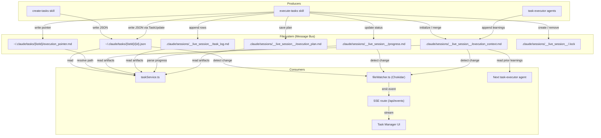
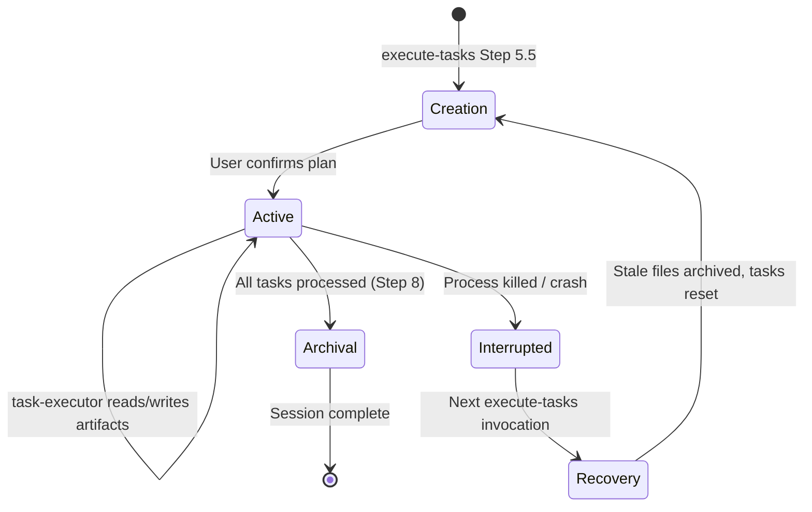
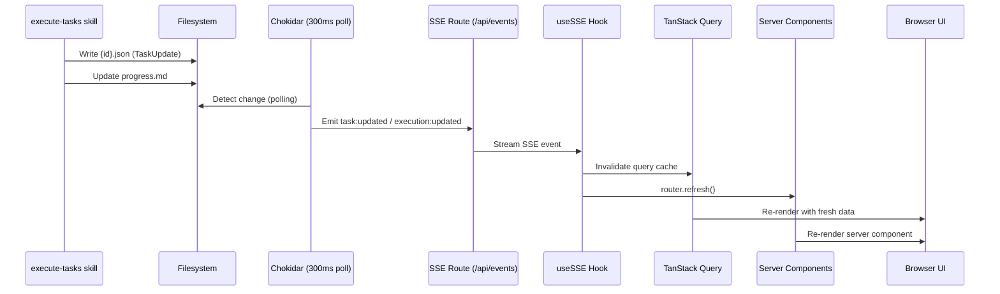
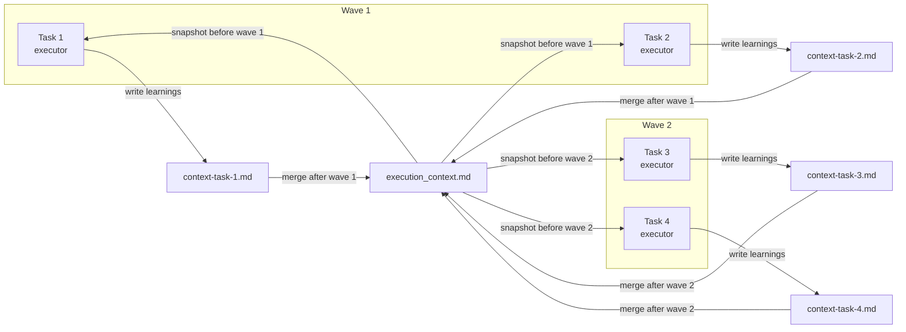

<!-- docs/architecture/filesystem-message-bus.md -->
# Filesystem Message Bus

Claude Alchemy's three subsystems -- the SDD plugin, the Tools plugin, and the Task Manager app -- communicate through a **filesystem-as-message-bus** pattern. There is no shared runtime code, no database, and no IPC. Every interaction between subsystems happens through reading and writing files on disk.

This architectural decision keeps each subsystem fully decoupled. The SDD plugin writes task JSON files and session artifacts; the Task Manager app watches those files for changes and renders them in a real-time Kanban UI. Neither subsystem imports code from the other, and neither needs to be running for the other to function.

## Design Rationale

!!! info "Why the filesystem?"
    Claude Code plugins are markdown-only with no build step and no ability to expose HTTP endpoints or import shared libraries. The filesystem is the only communication channel available that works across all three subsystems without introducing runtime coupling.

The pattern offers several advantages:

- **Zero coupling** -- Producers and consumers share no code, no types, and no protocol definitions beyond file format conventions
- **Crash resilience** -- All state is persisted to disk the moment it is created; no in-memory state to lose
- **Debuggability** -- Every message is a human-readable file you can inspect with `cat` or any text editor
- **Replay** -- Archived sessions can be re-read at any time for post-mortem analysis
- **Simplicity** -- No message broker, no serialization library, no connection management

## Producers and Consumers

Every piece of data in the system has a clear producer (writer) and one or more consumers (readers). The filesystem path and file format serve as the implicit contract between them.

| Data | Producer | Consumer | Format |
|------|----------|----------|--------|
| Task files (`{id}.json`) | Claude Code `TaskCreate`/`TaskUpdate`, `create-tasks` skill | `taskService.ts` via `getTasks()`, Task Manager UI | JSON conforming to `Task` interface |
| `execution_pointer.md` | `execute-tasks` skill (Step 5.5) | `taskService.ts` via `getExecutionDir()` | Plain text: single absolute path |
| `execution_context.md` | `execute-tasks` + `task-executor` agents | `taskService.ts` (as artifact), next `task-executor` agent | Markdown with 5 sections |
| `task_log.md` | `execute-tasks` orchestrator (Step 7d) | `taskService.ts` (as artifact) | Markdown table |
| `progress.md` | `execute-tasks` orchestrator | `taskService.ts` via `parseProgressMd()` | Markdown with Status/Wave/Active Tasks |
| `execution_plan.md` | `execute-tasks` (Step 5.5) | `taskService.ts` (as artifact) | Markdown |
| `.lock` file | `execute-tasks` (Step 5.5) | `execute-tasks` (stale detection, >4h expiry) | Metadata: execution ID + timestamp |
| `context-task-{id}.md` | `task-executor` agents (concurrent mode) | `execute-tasks` orchestrator (wave merge) | Markdown with learnings |



## File Paths and Locations

The bus uses two distinct directories on disk, each serving a different purpose.

### Task Directory (`~/.claude/tasks/{listId}/`)

This directory lives under the user's home directory and is managed by Claude Code's native task system. The `listId` is configured via `CLAUDE_CODE_TASK_LIST_ID` in `.claude/settings.json`.

```
~/.claude/tasks/{listId}/
├── 1.json                    # Task file
├── 2.json                    # Task file
├── 3.json                    # Task file
└── execution_pointer.md      # Absolute path to live session dir
```

### Session Directory (`.claude/sessions/`)

This directory lives within the project repository (relative to the working directory) and holds execution artifacts for the current and past sessions.

```
.claude/sessions/
├── __live_session__/          # Current active session
│   ├── .lock                  # Concurrency guard
│   ├── execution_plan.md      # Saved execution plan
│   ├── execution_context.md   # Shared learnings across tasks
│   ├── task_log.md            # Row-per-task result log
│   ├── progress.md            # Real-time wave/task progress
│   ├── context-task-5.md      # Per-task context (concurrent mode, temporary)
│   ├── context-task-6.md      # Per-task context (concurrent mode, temporary)
│   └── tasks/                 # Archived completed task JSONs
│       ├── 1.json
│       └── 2.json
├── user-auth-20260205-143022/ # Archived session
│   ├── execution_plan.md
│   ├── execution_context.md
│   ├── task_log.md
│   ├── progress.md
│   ├── session_summary.md
│   ├── .lock
│   └── tasks/
└── interrupted-20260206-091500/  # Recovered interrupted session
    └── ...
```

!!! note "The execution pointer bridges two directories"
    The `execution_pointer.md` file in the task directory contains the **absolute path** to `.claude/sessions/__live_session__/`. This is the only cross-reference between the two directory trees. The Task Manager reads the pointer to locate session artifacts.

## File Format Contracts

Each file type has a specific format that producers must write and consumers must parse. These formats are the implicit API contracts of the message bus.

### Task JSON (`{id}.json`)

``` json title="~/.claude/tasks/claude-alchemy/1.json"
{
  "id": "1",
  "subject": "Implement user authentication middleware",
  "description": "Add JWT-based auth middleware to the API layer...",
  "status": "pending",
  "blocks": ["3", "4"],
  "blockedBy": [],
  "activeForm": "",
  "metadata": {
    "priority": "high",
    "complexity": "M",
    "task_group": "user-auth",
    "spec_path": "SPEC-user-auth.md",
    "source_section": "Section 2"
  }
}
```

The consumer (`parseTask()` in `taskService.ts`) applies defensive normalization:

- Coerces `id` to string (accepts number or string)
- Defaults `status` to `"pending"` if invalid
- Ensures `blocks` and `blockedBy` are string arrays
- Defaults `description` to empty string
- Rejects tasks with no `subject` field

Valid `status` values: `pending`, `in_progress`, `completed`

### Execution Pointer (`execution_pointer.md`)

``` text title="~/.claude/tasks/claude-alchemy/execution_pointer.md"
/Users/sequenzia/dev/repos/my-project/.claude/sessions/__live_session__/
```

A single line containing the absolute path to the live session directory. The consumer (`resolveExecutionDir()` in `taskService.ts`) validates the path:

1. Resolves the path to an absolute form
2. Checks that the resolved path is under `$HOME` using `path.relative()`
3. Returns `null` if the path escapes the home directory (path traversal guard)

### Execution Context (`execution_context.md`)

``` markdown title=".claude/sessions/__live_session__/execution_context.md"
# Execution Context

## Project Patterns
- TypeScript strict mode throughout
- Barrel exports in each module directory
- Error handling at service boundaries only

## Key Decisions
- Chose Zod over io-ts for runtime validation
- API routes use middleware chain pattern

## Known Issues
- Test runner requires Node 18+ for fetch support

## File Map
- src/lib/auth.ts — JWT verification and token refresh
- src/middleware.ts — Express middleware chain

## Task History
### Task [1]: Implement auth middleware - PASS
- Files modified: src/middleware.ts, src/lib/auth.ts
- Key learnings: Project uses barrel exports, middleware chain pattern
- Issues encountered: None
```

The five sections are populated incrementally. Task executors read the context at the start of their run and append to it after completion. In concurrent mode, agents write to separate `context-task-{id}.md` files, and the orchestrator merges them into the shared context after each wave.

### Task Log (`task_log.md`)

``` markdown title=".claude/sessions/__live_session__/task_log.md"
# Task Execution Log

| Task ID | Subject | Status | Attempts | Duration | Token Usage |
|---------|---------|--------|----------|----------|-------------|
| 1 | Implement auth middleware | PASS | 1/3 | 2m 34s | N/A |
| 2 | Add rate limiting | PARTIAL | 2/3 | 5m 12s | N/A |
| 3 | Create user endpoints | FAIL | 3/3 | 8m 45s | N/A |
```

Each row is appended as a task completes or exhausts retries. The orchestrator writes this file; task executors do not.

### Progress (`progress.md`)

``` markdown title=".claude/sessions/__live_session__/progress.md"
# Execution Progress
Status: Executing
Wave: 2 of 4
Max Parallel: 5
Updated: 2026-02-05T14:35:22Z

## Active Tasks
- [5] Add input validation — Phase 2 — Implementing
- [6] Create error handler — Phase 3 — Verifying

## Completed This Session
- [1] Implement auth middleware — PASS (2m 34s)
- [2] Add rate limiting — PASS (3m 12s)
- [3] Create user endpoints — PASS (4m 5s)
- [4] Set up database schema — PASS (1m 48s)
```

The Task Manager parses this file via `parseProgressMd()` in `taskService.ts`, which extracts:

- `status` -- Current execution state (Initializing, Executing, Complete)
- `wave` / `totalWaves` -- Current and total wave numbers
- `maxParallel` -- Configured concurrency limit
- `activeTasks` -- Array of `{ id, subject, phase }` from the Active Tasks section
- `completedTasks` -- Array of `{ id, subject, result }` from the Completed section

### Lock File (`.lock`)

``` markdown title=".claude/sessions/__live_session__/.lock"
task_execution_id: user-auth-20260205-143022
timestamp: 2026-02-05T14:30:22Z
pid: orchestrator
```

The lock prevents concurrent execution sessions. The `execute-tasks` skill checks for this file before starting:

- **Lock exists, age < 4 hours** -- Prompts the user to force-start or cancel
- **Lock exists, age >= 4 hours** -- Treats as stale, deletes it, and proceeds
- **No lock** -- Proceeds normally

The lock is archived along with all other session files when the session completes.

## Session Lifecycle

A session progresses through four distinct phases. Each transition is driven by filesystem operations.



### 1. Creation

Triggered by `execute-tasks` Step 5.5 after the user confirms the execution plan.

1. **Stale session check** -- If `__live_session__/` contains leftover files, archive them to `interrupted-{YYYYMMDD-HHMMSS}/`
2. **Task recovery** -- Any tasks left as `in_progress` from the interrupted session are reset to `pending`
3. **Concurrency guard** -- Check for `.lock` file; enforce the single-session invariant
4. **Session ID generation** (three-tier):
    - `--task-group` flag provided: `{task_group}-{YYYYMMDD}-{HHMMSS}`
    - All open tasks share a `task_group`: `{task_group}-{YYYYMMDD}-{HHMMSS}`
    - Fallback: `exec-session-{YYYYMMDD}-{HHMMSS}`
5. **File creation** -- `.lock`, `execution_plan.md`, `execution_context.md` (template), `task_log.md` (headers), `progress.md` (initial status), `tasks/` directory
6. **Pointer creation** -- `execution_pointer.md` written to `~/.claude/tasks/{listId}/` with the absolute path to `__live_session__/`

### 2. Active Execution

The session is active while the orchestrator runs the execution loop (Step 7).

- **Orchestrator writes**: `task_log.md` (append per task), `progress.md` (update per wave/task), task JSON archives to `tasks/`
- **Task executors read**: `execution_context.md` (prior learnings), skill references
- **Task executors write**: `context-task-{id}.md` (concurrent mode) or `execution_context.md` (sequential mode)
- **Orchestrator merges**: After each wave, `context-task-{id}.md` files are merged into `execution_context.md` and deleted
- **Task Manager watches**: Chokidar detects changes to JSON files and session artifacts, triggers SSE events

### 3. Archival

When all tasks have been processed (Step 8):

1. `progress.md` is updated with final status (`Status: Complete`)
2. `session_summary.md` is written to `__live_session__/`
3. All contents of `__live_session__/` (including `.lock`) are moved to `.claude/sessions/{task_execution_id}/`
4. `__live_session__/` is left as an empty directory
5. `execution_pointer.md` continues to point to `__live_session__/` (now empty)

### 4. Interrupted Recovery

If a session is interrupted (process killed, crash, timeout), the next invocation of `execute-tasks` detects the stale state:

1. Finds files remaining in `__live_session__/`
2. Archives them to `.claude/sessions/interrupted-{YYYYMMDD-HHMMSS}/`
3. Cross-references `task_log.md` (if present) to identify tasks from the interrupted session
4. Resets those `in_progress` tasks back to `pending` via `TaskUpdate`
5. Proceeds with a fresh session

!!! warning "No automatic re-execution"
    Interrupted recovery resets task statuses but does not automatically re-execute tasks. The user must invoke `execute-tasks` again to resume work. Tasks that were completed before the interruption remain completed.

## Real-Time Data Flow

The Task Manager app observes filesystem changes in real time through a Chokidar-to-SSE pipeline. This is how the Kanban board updates automatically as the `execute-tasks` skill runs.



### Chokidar Configuration

The `FileWatcher` singleton in `fileWatcher.ts` is configured with:

- **Polling interval**: 300ms (`usePolling: true, interval: 300`)
- **Watch depth**: 2 levels from `~/.claude/tasks/`
- **Ignore initial**: Does not fire events for files that exist when the watcher starts
- **HMR safety**: Uses `globalThis` singleton pattern to survive Next.js hot module replacement

``` typescript title="apps/task-manager/src/lib/fileWatcher.ts"
this.watcher = watch(this.basePath, {
  persistent: true,
  ignoreInitial: true,
  usePolling: true,
  interval: 300,
  depth: 2,
})
```

The watcher emits two event types:

| Event | Trigger | Payload |
|-------|---------|---------|
| `taskEvent` | `.json` file added, changed, or deleted | `{ type, taskListId, taskId, task? }` |
| `executionEvent` | `.md` or `.txt` file changed in a watched execution dir | `{ type: 'execution:updated', taskListId }` |

!!! tip "Execution directory watching is dynamic"
    The watcher does not automatically monitor session directories. When the SSE route receives a connection for a `taskListId`, it calls `fileWatcher.watchExecutionDir(taskListId, execDir)` to start watching the resolved execution directory. This avoids watching directories that do not exist yet.

### SSE Event Types

The SSE route at `/api/events` streams four event types to the browser:

| SSE Event | Source | Consumer Action |
|-----------|--------|-----------------|
| `task:created` | New `.json` file detected | Invalidate task list + task queries, refresh server components |
| `task:updated` | `.json` file content changed | Invalidate task list + task queries, refresh server components |
| `task:deleted` | `.json` file removed | Invalidate task list + task queries, refresh server components |
| `execution:updated` | `.md` file changed in session dir | Invalidate execution context query, refresh server components |

### Dual Invalidation Strategy

When the `useSSE` hook receives an event, it performs **two** invalidation actions:

1. **TanStack Query cache invalidation** -- Forces client-side queries to refetch fresh data from the API routes, which in turn read the filesystem
2. **`router.refresh()`** -- Forces Next.js to re-run Server Components, which fetch data directly from `taskService.ts`

This dual approach ensures both the client-side cache and the server-rendered HTML stay in sync with the filesystem.

## Security Boundaries

The filesystem bus requires security checks at the consumer side to prevent path traversal and data corruption.

| Check | Location | Mechanism |
|-------|----------|-----------|
| Execution pointer path traversal | `resolveExecutionDir()` in `taskService.ts` | Uses `path.relative(home, resolved)` to ensure the pointer target stays under `$HOME`. Returns `null` if the relative path starts with `..` |
| List ID validation | API routes | Rejects `listId` values containing `..` or `/` |
| Task JSON normalization | `parseTask()` in `taskService.ts` | Defaults invalid status to `pending`, coerces arrays, requires `subject` field, converts `id` to string |
| Concurrency guard | `.lock` file in `__live_session__/` | Prevents multiple `execute-tasks` sessions from writing to the same session directory simultaneously |

!!! danger "Trust boundary"
    The filesystem bus trusts that producers write well-formed data. There is no schema validation layer between the plugin (producer) and the Task Manager (consumer) beyond the defensive parsing in `parseTask()`. If a plugin writes malformed JSON, the task is silently skipped.

## Cross-Task Knowledge Sharing

The `execution_context.md` file is the mechanism that allows later tasks to learn from earlier ones. It acts as a persistent, append-only knowledge base within a session.



**Concurrency safety**: Within a wave, agents write to isolated `context-task-{id}.md` files rather than the shared `execution_context.md`. The orchestrator merges these files between waves. This prevents write contention when multiple agents run in parallel.

**Cross-session inheritance**: When a new execution session starts, the orchestrator looks for the most recent archived session in `.claude/sessions/` and merges its learnings (Project Patterns, Key Decisions, Known Issues, File Map) into the fresh context. Task History entries are compacted after 10 entries to prevent unbounded growth.

## Tradeoffs and Limitations

!!! question "When does this pattern break down?"

**Latency**: The 300ms Chokidar polling interval introduces up to 300ms of latency between a file write and the UI update. This is acceptable for a development tool but would not suit sub-second real-time requirements.

**No guaranteed delivery**: If the Task Manager is not running when a file changes, the change is not queued. The next page load will read the current state from disk, so data is never lost, but transient events (such as a task briefly entering `in_progress` before completing) may not be observed.

**No schema enforcement**: The file formats are conventions, not enforced schemas. A producer writing an unexpected field or missing a required one will cause silent failures or fallback behavior in the consumer.

**Single-machine only**: The filesystem bus assumes all subsystems run on the same machine and can access the same paths. There is no support for distributed or networked operation.

**Concurrency limitations**: Only one `execute-tasks` session can run at a time per project, enforced by the `.lock` file. Multiple Task Manager instances can read simultaneously (read-only consumers), but multiple concurrent writers would require additional coordination.

## Related Pages

- [Task Manager Architecture](../task-manager/overview.md) -- How the Next.js app consumes filesystem events
- [SDD Plugin](../plugins/sdd-plugin.md) -- The plugin that produces most of the bus traffic
