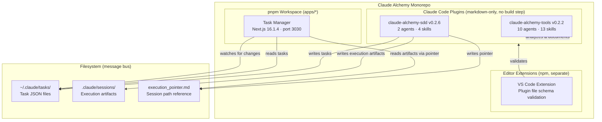
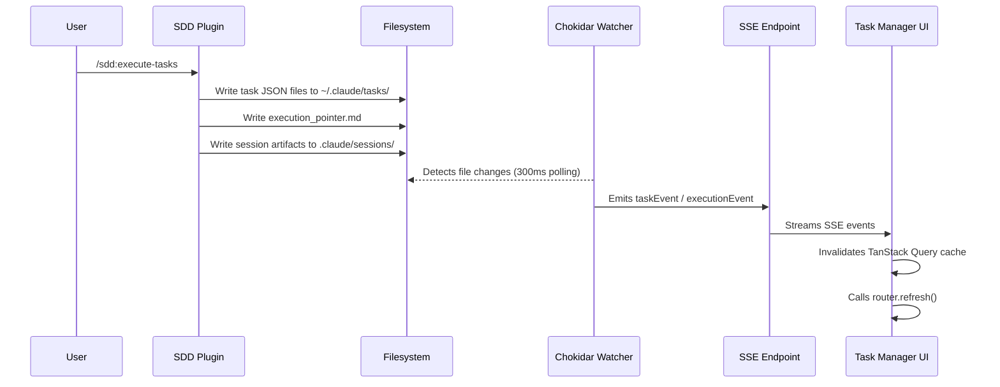

<!-- docs/architecture/overview.md -->
# Architecture Overview

Claude Alchemy is a pnpm monorepo consisting of three subsystems that communicate exclusively through the filesystem. There is no shared runtime code, no database, and no IPC mechanism -- the filesystem itself serves as the message bus between components.

This page provides a high-level tour of the monorepo structure, the relationships between subsystems, and the key design decisions that shape the project.

## System Architecture



## Monorepo Structure

```
claude-alchemy/
├── apps/
│   └── task-manager/          # Next.js 16.1.4 app (pnpm workspace member)
├── plugins/
│   ├── tools/                 # Developer tools plugin (markdown-only)
│   └── sdd/                   # Spec-driven development plugin (markdown-only)
├── extensions/
│   └── vscode/                # VS Code extension (npm, separate)
├── internal/
│   └── docs/                  # Internal documentation and cheatsheets
├── pnpm-workspace.yaml        # Only includes apps/*
├── .claude-plugin/
│   └── marketplace.json       # Plugin registry with versions
└── CLAUDE.md                  # Project conventions for Claude Code
```

!!! info "Workspace Boundaries"
    The `pnpm-workspace.yaml` file only includes `apps/*`. Plugins are pure markdown with no `package.json` and no build step -- they are excluded from the pnpm workspace entirely. The VS Code extension manages its own dependencies with npm.

## The Three Subsystems

### 1. Task Manager (`apps/task-manager/`)

A Next.js 16.1.4 web application that provides a real-time Kanban board for visualizing and monitoring Claude Code task execution. It runs on port 3030 and is the only subsystem with a runtime build step.

| Layer | Technology |
|-------|-----------|
| Framework | Next.js 16.1.4 (App Router) |
| UI | React 19.2.3, Tailwind CSS v4, shadcn/ui (Radix primitives) |
| State | TanStack Query v5.90.20 |
| Real-time | Chokidar 5 (filesystem watching), Server-Sent Events |
| Language | TypeScript 5 |

**Key responsibilities:**

- Read task JSON files from `~/.claude/tasks/` and display them in a three-column Kanban board (Pending, In Progress, Completed)
- Watch the filesystem for changes and push real-time updates to the browser via SSE
- Display execution progress, artifacts, and session context from the SDD plugin's execution sessions
- Provide search, filtering, task list selection, and dark/light theme switching

The Task Manager never writes to the filesystem. It is a read-only consumer of data produced by the plugins.

### 2. Developer Tools Plugin (`plugins/tools/`)

The `claude-alchemy-tools` plugin (v0.2.2) provides general-purpose development skills and agents for Claude Code. It covers feature development workflows, codebase analysis, documentation management, Git operations, and release automation.

| Component | Count | Examples |
|-----------|-------|---------|
| Agents | 10 | `code-explorer`, `code-architect`, `code-reviewer`, `codebase-synthesizer`, `docs-writer`, `researcher` |
| User-invocable skills | 7 | `feature-dev`, `codebase-analysis`, `docs-manager`, `git-commit`, `release`, `bump-plugin-version`, `teams-deep-analysis` |
| Supporting skills | 6 | `architecture-patterns`, `language-patterns`, `project-conventions`, `code-quality`, `changelog-format`, `deep-analysis` |

Skills are invoked with the `/tools:` prefix (e.g., `/tools:feature-dev`, `/tools:git-commit`). Each skill is defined as a `SKILL.md` file with YAML frontmatter specifying metadata, allowed tools, and arguments.

### 3. SDD Plugin (`plugins/sdd/`)

The `claude-alchemy-sdd` plugin (v0.2.6) implements a Spec-Driven Development workflow. It handles the full lifecycle from specification creation through task decomposition to autonomous, wave-based parallel execution.

| Component | Count | Examples |
|-----------|-------|---------|
| Agents | 2 | `task-executor`, `spec-analyzer` |
| Skills | 4 | `create-spec`, `analyze-spec`, `create-tasks`, `execute-tasks` |

Skills are invoked with the `/sdd:` prefix (e.g., `/sdd:create-spec`, `/sdd:execute-tasks`). The `execute-tasks` skill is the most complex component in the system -- it orchestrates wave-based parallel task execution with dependency resolution, retry logic, shared execution context, and session management.

!!! tip "SDD Workflow"
    The typical SDD workflow is: `/sdd:create-spec` to define requirements, `/sdd:analyze-spec` to review the spec, `/sdd:create-tasks` to decompose it into tasks, then `/sdd:execute-tasks` to run them autonomously.

### 4. VS Code Extension (`extensions/vscode/`)

A development-time editor extension that validates Claude Code plugin files (SKILL.md and agent markdown files) against their expected schemas. It provides:

- **Diagnostics**: Real-time validation of YAML frontmatter in skill and agent files
- **Completions**: Autocomplete for frontmatter keys and enum values
- **Hover info**: Documentation tooltips for frontmatter fields

The extension is not part of the pnpm workspace and manages its own dependencies via npm.

## Filesystem as Message Bus

The defining architectural pattern of Claude Alchemy is the use of the filesystem as the sole communication channel between subsystems. No subsystem imports code from another, calls an API on another, or shares a database.



For a deep dive into this pattern, see [Filesystem Message Bus](filesystem-message-bus.md).

### What Gets Written Where

| Path | Writer | Reader | Contents |
|------|--------|--------|----------|
| `~/.claude/tasks/{listId}/*.json` | SDD plugin (`create-tasks`, `execute-tasks`) | Task Manager (`taskService.ts`) | Individual task definitions (id, subject, status, dependencies) |
| `~/.claude/tasks/{listId}/execution_pointer.md` | SDD plugin (`execute-tasks`) | Task Manager (`taskService.ts`) | Absolute path to the active `__live_session__/` directory |
| `.claude/sessions/__live_session__/` | SDD plugin (`execute-tasks`) | Task Manager (via pointer) | `execution_context.md`, `task_log.md`, `progress.md`, `execution_plan.md`, `.lock` |
| `.claude/sessions/{session-id}/` | SDD plugin (session archive) | Task Manager (via pointer) | Archived session artifacts after execution completes |

!!! warning "Path Security"
    The Task Manager's `resolveExecutionDir()` function guards against path traversal attacks. It uses `path.relative()` to verify that any execution pointer target stays within the user's home directory. Pointers that resolve outside `$HOME` are rejected.

## Real-Time Data Flow

The Task Manager achieves real-time updates through a three-layer pipeline:

```
~/.claude/tasks/*.json → Chokidar → SSE route → useSSE hook → TanStack Query invalidation → UI
```

1. **Chokidar singleton** watches `~/.claude/tasks/` with 300ms polling interval. A `globalThis` singleton pattern prevents duplicate watchers during Next.js HMR in development.

2. **SSE route** (`/api/events`) creates a `ReadableStream` per client connection. It subscribes to the file watcher's `taskEvent` and `executionEvent` emitters, filtering events by `taskListId`. A heartbeat keeps connections alive.

3. **`useSSE` hook** on the client opens an `EventSource` connection and listens for `task:created`, `task:updated`, `task:deleted`, and `execution:updated` events. Each event triggers dual invalidation: TanStack Query cache invalidation plus `router.refresh()` to update Server Component data.

For the complete data flow details, see [Data Flow](data-flow.md).

## Plugin Architecture

Both plugins follow the same structural conventions:

```
plugins/{name}/
├── agents/
│   └── {agent-name}.md        # Agent definitions (kebab-case)
├── skills/
│   └── {skill-name}/
│       ├── SKILL.md            # Skill definition with YAML frontmatter
│       └── references/         # Reference materials loaded at runtime
├── hooks/                      # Optional: PreToolUse/PostToolUse hooks
└── README.md
```

### Skills and Agents

**Skills** are the user-facing entry points. Each `SKILL.md` file contains:

- YAML frontmatter with metadata (`name`, `description`, `user-invocable`, `allowed-tools`, `arguments`)
- Markdown body with instructions, workflow phases, and behavioral guidelines

**Agents** are sub-processes launched by skills via Claude Code's `Task` tool. They run with a specified model tier:

| Model Tier | Used For |
|------------|----------|
| `opus` | Complex reasoning: architecture design, code review, codebase synthesis, documentation writing |
| `sonnet` | Exploration and analysis: code exploration, pattern detection |
| `haiku` | Mechanical tasks: git commits, version bumping, changelog formatting |
| `inherit` | Uses the parent's model: research, feature development orchestration |

### Hooks

The SDD plugin includes a `PreToolUse` hook (`auto-approve-session.sh`) that auto-approves file operations targeting execution session directories. This enables the `execute-tasks` skill to run autonomously without prompting the user for permission on every session file write.

!!! note "Hook Scope"
    The auto-approve hook only applies to paths matching `~/.claude/tasks/*/execution_pointer.md` and `*/.claude/sessions/*`. All other file operations follow the normal Claude Code permission flow.

## Tech Stack Summary

| Category | Technology | Version |
|----------|-----------|---------|
| Runtime | Node.js | >= 18 |
| Package Manager | pnpm | >= 8 |
| Framework | Next.js | 16.1.4 |
| UI Library | React | 19.2.3 |
| Type System | TypeScript | 5 |
| Server State | TanStack Query | 5.90.20 |
| Styling | Tailwind CSS | 4 |
| Component Library | shadcn/ui | Radix primitives |
| File Watching | Chokidar | 5 |
| Theme | next-themes | SSR-safe dark/light mode |

## Design Decisions

### Why Filesystem as Message Bus?

Claude Code plugins run as markdown instructions -- they have no build step, no runtime, and no way to call APIs or import shared code. The filesystem is the only communication channel available to them. Rather than fighting this constraint, Claude Alchemy embraces it: tasks are JSON files, execution state is markdown, and the web app watches for changes with Chokidar.

This constraint produces several benefits:

- **Inspectability**: Every piece of state is a human-readable file you can `cat` or open in an editor
- **Resilience**: Interrupted sessions leave files on disk that can be recovered
- **Simplicity**: No message broker, no database migrations, no connection pooling
- **Debuggability**: `ls` and `cat` are your debugging tools

### Why Markdown-Only Plugins?

Claude Code plugins are loaded as context at the start of a conversation. They need no compilation, no bundling, and no runtime dependencies. Making them pure markdown means:

- Zero build step for plugin development
- Skills and agents can be edited and tested immediately
- Reference materials are loaded alongside instructions at runtime
- The VS Code extension provides schema validation as a development aid

### Why Server-Sent Events Over WebSockets?

SSE is a simpler protocol that fits the unidirectional data flow: file changes flow from the filesystem to the browser, never the other way. The Task Manager is read-only, so there is no need for bidirectional communication. SSE also works natively with Next.js route handlers without additional infrastructure.

## Related Pages

- [Filesystem Message Bus](filesystem-message-bus.md) -- Deep dive into the filesystem communication pattern
- [Data Flow](data-flow.md) -- Complete data flow from file changes to UI updates
