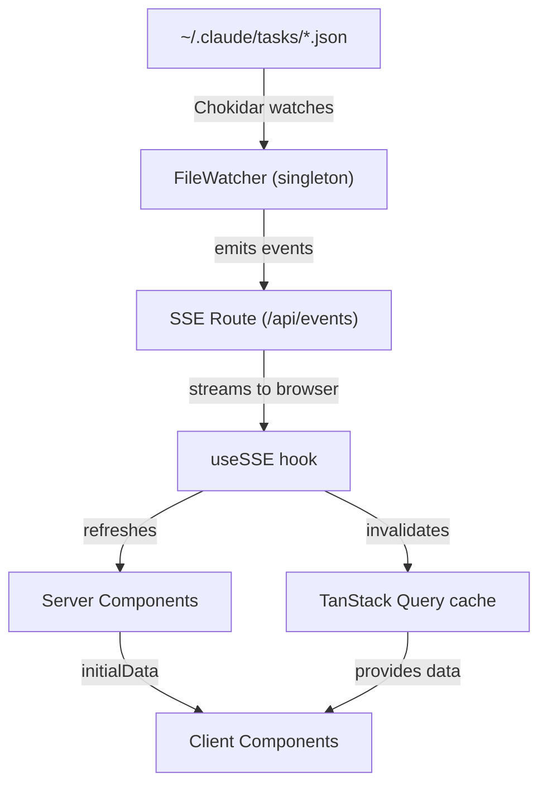

<!-- docs/development/contributing.md -->
# Contributing Guide

This guide covers everything you need to contribute to Claude Alchemy, whether you are working on the Task Manager app, adding skills and agents to the plugins, or extending the VS Code extension. For initial environment setup, see the [Development Setup](setup.md) page.

## Quick Start

```bash
# 1. Clone the repository
git clone git@github.com:sequenzia/claude-alchemy.git
cd claude-alchemy

# 2. Install dependencies (workspace packages only)
pnpm install

# 3. Start the Task Manager dev server
pnpm dev:task-manager
```

The Task Manager will be available at **http://localhost:3030**.

!!! note "Plugins require no installation"
    The two Claude Code plugins (`plugins/tools/` and `plugins/sdd/`) are markdown-only and have no build step. Changes to plugin files take effect on the next Claude Code session — no restart of the dev server is needed.

## Project Areas

Claude Alchemy has four distinct areas of contribution. Each has different tooling, conventions, and workflows.

### Task Manager

| Detail      | Value                                  |
|-------------|----------------------------------------|
| Location    | `apps/task-manager/`                   |
| Stack       | Next.js 16, React 19, TypeScript, TanStack Query v5, Tailwind CSS v4, shadcn/ui |
| Build       | `pnpm build:task-manager`              |
| Dev server  | `pnpm dev:task-manager` (port 3030)    |
| Lint        | `pnpm lint`                            |

The Task Manager is a Next.js App Router application. Its key directories are:

```
apps/task-manager/src/
├── app/            # Server Components, route handlers, layouts
├── components/     # Client Components (KanbanBoard, TaskDetail, etc.)
│   └── ui/         # shadcn/ui primitives (do not edit manually)
├── hooks/          # TanStack Query hooks, SSE connection (useSSE)
├── lib/            # Core services: taskService.ts, fileWatcher.ts, api.ts
└── types/          # TypeScript type definitions: task.ts, execution.ts
```

!!! tip "Server vs. Client Components"
    Server Components in `app/` fetch data from the filesystem and pass it as `initialData` to Client Components in `components/`. Client Components manage interactivity and real-time updates via TanStack Query and SSE. If you are adding a new feature, decide early which layer it belongs in.

### Tools Plugin

| Detail      | Value                                           |
|-------------|------------------------------------------------ |
| Location    | `plugins/tools/`                                |
| Invoke      | `/tools:{skill-name}`                           |
| Format      | Markdown-only, no build step                    |
| Current     | 13 skills, 10 agents (v0.2.2)                   |

Skills include `codebase-analysis`, `deep-analysis`, `feature-dev`, `git-commit`, `docs-manager`, `release`, and more. Agents include `code-explorer`, `code-architect`, `code-reviewer`, `codebase-synthesizer`, and `researcher`.

### SDD Plugin

| Detail      | Value                                           |
|-------------|------------------------------------------------ |
| Location    | `plugins/sdd/`                                  |
| Invoke      | `/sdd:{skill-name}`                             |
| Format      | Markdown-only, no build step                    |
| Current     | 4 skills, 2 agents (v0.2.6)                     |

The SDD (Spec-Driven Development) plugin provides the `create-spec`, `analyze-spec`, `create-tasks`, and `execute-tasks` workflow. It also includes a PreToolUse hook for autonomous session file operations.

### VS Code Extension

| Detail      | Value                                           |
|-------------|------------------------------------------------ |
| Location    | `extensions/vscode/`                            |
| Stack       | TypeScript, esbuild                             |
| Install     | `cd extensions/vscode && npm install`           |
| Build       | `npm run build`                                 |
| Package     | `npm run package` (produces `.vsix`)            |

!!! warning "Separate Package Manager"
    The VS Code extension uses **npm**, not pnpm. It is a standalone project and is **not** part of the pnpm workspace.

## Git Workflow

### Conventional Commits

All commits follow the [Conventional Commits](https://www.conventionalcommits.org/) specification:

```
type(scope): description
```

**Types:**

| Type       | When to use                              |
|------------|------------------------------------------|
| `feat`     | New feature or capability                |
| `fix`      | Bug fix                                  |
| `docs`     | Documentation-only change                |
| `style`    | Formatting, whitespace (no logic change) |
| `refactor` | Code restructure with no behavior change |
| `test`     | Adding or updating tests                 |
| `chore`    | Maintenance, dependency bumps, releases  |

**Scopes** correspond to the subsystem being changed:

- `tools` — the claude-alchemy-tools plugin
- `sdd` — the claude-alchemy-sdd plugin
- `task-manager` — the Next.js application
- `vscode` — the VS Code extension
- `release` — version bumps and release automation

**Examples:**

```
feat(task-manager): add search filtering to Kanban board
fix(sdd): handle stale lock expiry after 4-hour timeout
docs(tools): update skill reference table
refactor(task-manager): extract SSE reconnection logic into useSSE
chore(release): bump claude-alchemy-tools to v0.2.2
```

### Commit Best Practices

1. **Keep commits atomic** — each commit represents a single logical change
2. **Explain why, not what** — the diff shows what changed; the message should explain intent
3. **Split cross-subsystem changes** — if a feature touches the plugin and the Task Manager, consider separate commits when each is independently meaningful

!!! example "Good vs. Bad Commit Messages"

    ```
    # Good — explains the motivation
    feat(sdd): add wave-based concurrent task execution

    # Bad — restates the diff
    feat(sdd): add new function runWave and update execute-tasks SKILL.md
    ```

## Adding a New Skill

Skills are the primary way to extend Claude Code plugin functionality. Each skill is a `SKILL.md` file with YAML frontmatter that defines metadata and runtime constraints.

### Step 1: Create the Skill File

Create a new directory and skill file:

```
plugins/{plugin}/skills/{skill-name}/SKILL.md
```

For example, to add a `lint-fix` skill to the tools plugin:

```
plugins/tools/skills/lint-fix/SKILL.md
```

### Step 2: Write YAML Frontmatter

Every skill requires a YAML frontmatter block at the top of the file:

```yaml title="plugins/tools/skills/lint-fix/SKILL.md"
---
name: lint-fix
description: Automatically fix linting errors in the current project. Use when the user asks to fix lint issues or code style problems.
model: sonnet
user-invocable: true
disable-model-invocation: false
allowed-tools: Bash, Read, Edit, Glob, Grep
argument-hint: "[file or directory to lint]"
---

# Lint Fix

Your skill instructions go here...
```

**Frontmatter fields:**

| Field                      | Required | Description                                                  |
|----------------------------|----------|--------------------------------------------------------------|
| `name`                     | Yes      | Skill identifier, used in `/tools:{name}` invocation         |
| `description`              | Yes      | Tells Claude when to auto-invoke this skill                  |
| `model`                    | Yes      | Model tier: `sonnet`, `opus`, `haiku`, or `inherit`          |
| `user-invocable`           | Yes      | Whether users can call it directly via slash command          |
| `disable-model-invocation` | No       | Set `true` to prevent Claude from auto-selecting this skill  |
| `allowed-tools`            | No       | Comma-separated list of tools the skill can use              |
| `argument-hint`            | No       | Placeholder text shown in the slash command menu             |

### Step 3: Add Reference Materials (Optional)

If your skill needs supporting documentation, add markdown files under a `references/` subdirectory:

```
plugins/tools/skills/lint-fix/
├── SKILL.md
└── references/
    └── eslint-rules.md
```

Reference materials are loaded at runtime and made available to the skill as context.

### Step 4: Test the Skill

Invoke the skill from a Claude Code session:

```
/tools:lint-fix
```

!!! tip "Iterating on Skills"
    Claude Code reads plugin files at the start of each session. If you modify a skill mid-session, start a new Claude Code session to pick up the changes.

## Adding a New Agent

Agents are subagent definitions that skills orchestrate via the Task tool. Each agent is a single markdown file with YAML frontmatter.

### Step 1: Create the Agent File

Create a new file in the plugin's `agents/` directory using kebab-case naming:

```
plugins/{plugin}/agents/{agent-name}.md
```

For example:

```
plugins/tools/agents/test-writer.md
```

### Step 2: Write the Agent Definition

```yaml title="plugins/tools/agents/test-writer.md"
---
description: Writes unit and integration tests based on implementation code and testing patterns
tools:
  - Read
  - Glob
  - Grep
  - Bash
  - Edit
  - Write
model: sonnet
skills:
  - project-conventions
  - language-patterns
---

# Test Writer Agent

You are a testing specialist. Your job is to write comprehensive tests
for the provided implementation code.

## Your Mission

Given source files and a testing strategy, you will:
1. Analyze the implementation to identify testable behavior
2. Write tests following the project's established patterns
3. Verify tests pass before reporting completion

...
```

**Frontmatter fields:**

| Field         | Required | Description                                                |
|---------------|----------|------------------------------------------------------------|
| `description` | Yes      | What this agent does (used by skills when selecting agents)|
| `tools`       | Yes      | List of tools the agent can use                            |
| `model`       | Yes      | Model tier for this agent                                  |
| `skills`      | No       | Skills this agent has access to                            |

### Step 3: Choose the Right Model Tier

Select a model tier based on the agent's task complexity:

| Tier       | Use Case                                         | Examples                                  |
|------------|--------------------------------------------------|-------------------------------------------|
| **Haiku**  | Simple, well-defined tasks                       | `git-commit`, `bump-plugin-version`       |
| **Sonnet** | Exploration, code reading, pattern matching      | `code-explorer`, `researcher`             |
| **Opus**   | Synthesis, architecture, complex decision-making | `codebase-synthesizer`, `code-architect`  |

!!! info "The `inherit` Model"
    Setting `model: inherit` causes the agent or skill to use the calling skill's model. This is useful for reference skills like `changelog-format` that should run at whatever tier invoked them.

### Step 4: Wire It Up

Agents become available to skills via the Task tool. In the orchestrating skill, reference the agent by its `subagent_type`:

```markdown
Use the Task tool with subagent_type: "test-writer" to delegate test creation.
```

## Modifying the Task Manager

### Architecture at a Glance



### Key Files

| File | Role |
|------|------|
| `src/lib/taskService.ts` | Server-side: reads task JSON from filesystem, parses defensively |
| `src/lib/fileWatcher.ts` | Chokidar singleton (survives HMR via `globalThis`) |
| `src/app/api/events/route.ts` | SSE endpoint, streams filtered filesystem events |
| `src/hooks/useSSE.ts` | Client-side SSE connection, dual invalidation (TanStack Query + router.refresh) |
| `src/hooks/useTasks.ts` | TanStack Query hook with query key factory |
| `src/types/task.ts` | Task, TaskStatus, TaskMetadata type definitions |
| `src/types/execution.ts` | ExecutionContext type definitions |

### Adding a New Feature

1. **Define types** in `src/types/` if new data shapes are needed
2. **Add server-side logic** in `src/lib/` (data fetching, parsing)
3. **Create or update route handlers** in `src/app/api/` if a new endpoint is needed
4. **Build the Server Component** in `src/app/` to fetch and pass data
5. **Build the Client Component** in `src/components/` for interactivity
6. **Add a TanStack Query hook** in `src/hooks/` with a query key factory
7. **Wire up SSE invalidation** in `useSSE.ts` if real-time updates are needed

### Conventions to Follow

- Use the `@/*` path alias for all imports (maps to `./src/*`)
- Server Components are the default; add `'use client'` only when state or interactivity is needed
- shadcn/ui components in `src/components/ui/` are generated and should not be manually edited
- Follow the existing defensive parsing pattern when reading external data (see [Conventions](conventions.md#defensive-parsing))
- Guard against path traversal when resolving file paths from external input (see [Conventions](conventions.md#path-traversal-protection))

## Code Style

### General Rules

- **TypeScript strict mode** is enforced across the project
- **Self-documenting code** — use clear naming; add comments only when the "why" is not obvious
- **Small, focused functions** — prefer single-responsibility over do-everything helpers
- **Delete dead code** rather than commenting it out

### Naming Conventions

| Context                         | Style              | Example                            |
|---------------------------------|--------------------|------------------------------------|
| Functions, variables, hooks     | `camelCase`        | `parseTask`, `useTasks`, `listId`  |
| React components, classes       | `PascalCase`       | `KanbanBoard`, `FileWatcher`       |
| TypeScript types and interfaces | `PascalCase`       | `TaskStatus`, `ExecutionContext`   |
| Plugin files (skills, agents)   | `kebab-case`       | `code-explorer.md`, `SKILL.md`    |
| App file names (components)     | `PascalCase`       | `TaskDetail.tsx`, `Providers.tsx`  |
| Directories                     | `kebab-case`       | `task-manager`, `create-spec`     |
| Constants                       | `UPPER_SNAKE_CASE` | `TASKS_DIR`, `SSE_RETRY_DELAY`    |

### TypeScript

- Use `type` for unions and aliases, `interface` for object shapes
- Export types that cross module boundaries; keep internal types unexported
- Define domain types in dedicated files under `src/types/`

For the full set of patterns and conventions, see the [Conventions](conventions.md) page.

## Versioning and Releases

### Plugin Versions

Plugin versions are tracked in **two** locations that must stay in sync:

1. `plugins/{name}/.claude-plugin/plugin.json` — the plugin's own manifest
2. `.claude-plugin/marketplace.json` — the root-level plugin registry

!!! warning "Always Update Both Files"
    Forgetting to update one of these files will cause version mismatches. Use the built-in `/tools:bump-plugin-version` skill to automate this.

To bump a plugin version from a Claude Code session:

```
/tools:bump-plugin-version
```

The skill will discover available plugins, prompt for the bump level (patch, minor, major), and update both manifest files.

### Changelog

Each plugin maintains a `CHANGELOG.md` following the [Keep a Changelog](https://keepachangelog.com/) format:

- Reverse chronological order (newest first)
- Each version gets its own section with an ISO date
- Changes grouped by category: **Added**, **Changed**, **Deprecated**, **Removed**, **Fixed**, **Security**
- An `[Unreleased]` section at the top collects in-progress changes

```markdown title="CHANGELOG.md"
# Changelog

## [Unreleased]

### Added
- New lint-fix skill for automated code style corrections

## [0.2.2] - 2025-02-08

### Changed
- Restructured docs-manager skill to support dual-mode documentation

### Fixed
- Corrected model tier assignment for team agents
```

## Contribution Checklist

Before submitting your changes, verify:

- [ ] Code follows the project's [naming conventions](conventions.md#naming-conventions)
- [ ] TypeScript compiles without errors (`pnpm build:task-manager` for app changes)
- [ ] Linting passes (`pnpm lint`)
- [ ] Commit messages follow [Conventional Commits](#conventional-commits) format
- [ ] New skills have complete YAML frontmatter with all required fields
- [ ] New agents specify the correct model tier for their complexity level
- [ ] Plugin version bumps are reflected in both `plugin.json` and `marketplace.json`
- [ ] CHANGELOG.md is updated for user-facing changes

## Further Reading

- [Development Setup](setup.md) — installation, build commands, troubleshooting
- [Conventions](conventions.md) — code patterns, naming rules, versioning details
- [Architecture Overview](../architecture/overview.md) — system design and component relationships
- [Tools Plugin](../plugins/tools-plugin.md) — full skill and agent reference
- [SDD Plugin](../plugins/sdd-plugin.md) — spec-driven development workflow
