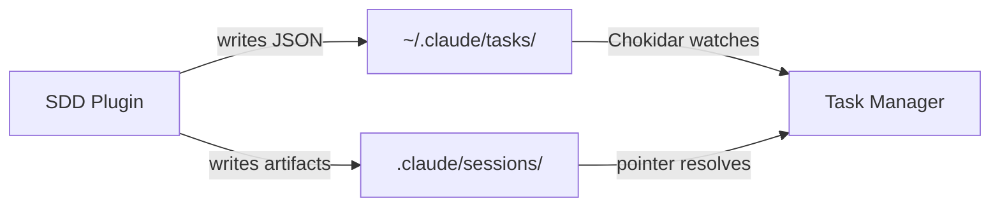

<!-- docs/development/conventions.md -->
# Development Conventions

This page documents the coding conventions, naming rules, and established patterns used throughout Claude Alchemy. Following these conventions keeps the codebase consistent across its three subsystems — two Claude Code plugins and a Next.js Task Manager app.

## Git Conventions

### Conventional Commits

All commit messages follow the [Conventional Commits](https://www.conventionalcommits.org/) specification:

```
type(scope): description
```

**Commit types:**

| Type         | Purpose                                      | Example                                              |
|--------------|----------------------------------------------|------------------------------------------------------|
| `feat`       | New feature                                  | `feat(sdd): add interactive HTML review`             |
| `fix`        | Bug fix                                      | `fix(sdd): prevent card collapse on textarea click`  |
| `docs`       | Documentation only                           | `docs(tools): update skill reference table`          |
| `style`      | Formatting, whitespace (no logic change)     | `style(task-manager): fix lint warnings`             |
| `refactor`   | Code restructure with no behavior change     | `refactor(tools): extract deep-analysis skill`       |
| `test`       | Adding or updating tests                     | `test(task-manager): add parseTask edge cases`       |
| `chore`      | Maintenance, dependency bumps, releases      | `chore(release): bump claude-alchemy-tools to v0.2.2`|

**Scopes** correspond to the subsystem being changed:

- `tools` — the claude-alchemy-tools plugin
- `sdd` — the claude-alchemy-sdd plugin
- `task-manager` — the Next.js application
- `release` — version bumps and release automation
- `schemas` — plugin schema validation
- `vscode` — VS Code extension

!!! tip "Writing Good Commit Messages"
    Focus on **why** the change was made, not a mechanical description of what changed. The diff already shows *what*; the message should explain *intent*.

    ```
    # Good — explains why
    feat(sdd): add wave-based concurrent task execution

    # Bad — restates the diff
    feat(sdd): add new function runWave and update execute-tasks SKILL.md
    ```

### Atomic Commits

Each commit should represent a single logical change. If a feature touches the plugin **and** the Task Manager, consider whether the changes can be split into separate, independently meaningful commits.

## Plugin Conventions

### Naming

Plugin packages follow the pattern `claude-alchemy-{category}`:

| Plugin                  | Directory         | Description                               |
|-------------------------|-------------------|-------------------------------------------|
| `claude-alchemy-tools`  | `plugins/tools/`  | Developer tools, Git workflows, analysis  |
| `claude-alchemy-sdd`    | `plugins/sdd/`    | Spec-driven development workflow          |

### File Structure

Plugins are **markdown-only** with no build step and are **not** part of the pnpm workspace. Each plugin follows this layout:

```
plugins/{name}/
├── .claude-plugin/
│   └── plugin.json          # Package metadata and version
├── agents/
│   └── {kebab-case-name}.md # Agent definitions
├── skills/
│   └── {skill-name}/
│       ├── SKILL.md          # Skill definition with YAML frontmatter
│       └── references/       # Supporting materials loaded at runtime
│           └── *.md
└── hooks/                    # Optional PreToolUse/PostToolUse hooks
    └── *.sh
```

### Skill Files

Skills are `SKILL.md` files with YAML frontmatter that defines metadata and constraints:

```yaml title="plugins/tools/skills/git-commit/SKILL.md"
---
name: git-commit
description: Commit staged changes with conventional commit message.
model: haiku
user-invocable: true
disable-model-invocation: false
allowed-tools: Bash, AskUserQuestion
---

# Git Commit

Create a commit with a conventional commit message...
```

**Key frontmatter fields:**

| Field                      | Purpose                                                 |
|----------------------------|---------------------------------------------------------|
| `name`                     | Skill identifier, used in `/tools:{name}` invocation    |
| `description`              | When Claude should auto-invoke this skill               |
| `model`                    | Model tier: `sonnet`, `opus`, `haiku`, or `inherit`     |
| `user-invocable`           | Whether users can call it directly via slash command     |
| `disable-model-invocation` | Prevents Claude from auto-selecting this skill           |
| `allowed-tools`            | Restricts which tools the skill can use                 |

### Agent Files

Agents are `{kebab-case-name}.md` files with YAML frontmatter:

```yaml title="plugins/tools/agents/code-explorer.md"
---
description: Explores codebases to find relevant files and map architecture
tools:
  - Read
  - Glob
  - Grep
  - Bash
model: sonnet
skills:
  - project-conventions
  - language-patterns
---

# Code Explorer Agent

You are a code exploration specialist...
```

### Model Tiering

Skills and agents are assigned to model tiers based on task complexity:

| Tier       | Use Case                                           | Examples                                        |
|------------|----------------------------------------------------|-------------------------------------------------|
| **Haiku**  | Simple, well-defined tasks                         | `git-commit`, `bump-plugin-version`             |
| **Sonnet** | Exploration, code reading, pattern matching        | `code-explorer`, `researcher`                   |
| **Opus**   | Synthesis, architecture, complex decision-making   | `codebase-synthesizer`, `code-architect`         |
| `inherit`  | Uses the calling skill's model                     | `changelog-format` (reference skill)            |

### Skill Invocation

Users invoke skills with a slash-command prefix matching the plugin name:

```
/tools:git-commit
/tools:codebase-analysis
/sdd:create-spec
/sdd:execute-tasks
```

## Code Patterns

### Filesystem-as-Message-Bus

All cross-system communication happens through file reads and writes. There is no shared runtime code, no database, and no IPC mechanism between the three subsystems.



!!! info "Why Filesystem?"
    Claude Code plugins run as markdown instructions inside the Claude agent — they have no persistent runtime. The filesystem is the only shared state available across plugin executions and the Task Manager app.

For a deeper explanation, see the [Filesystem Message Bus](../architecture/filesystem-message-bus.md) architecture page.

### Defensive Parsing

Server-side code that reads external data (task JSON files written by plugins) must handle missing or malformed fields gracefully. The canonical example is `parseTask()` in `taskService.ts`:

```typescript title="apps/task-manager/src/lib/taskService.ts"
function parseTask(content: string, filename: string): Task | null {
  try {
    const data = JSON.parse(content)

    // Coerce id to string, fall back to filename
    if (typeof data.id !== 'string' && typeof data.id !== 'number') {
      data.id = basename(filename, '.json')
    } else {
      data.id = String(data.id)
    }

    // Normalize invalid status to 'pending'
    if (!isValidTaskStatus(data.status)) {
      data.status = 'pending'
    }

    // Ensure arrays exist even if missing from JSON
    data.blocks = Array.isArray(data.blocks) ? data.blocks.map(String) : []
    data.blockedBy = Array.isArray(data.blockedBy) ? data.blockedBy.map(String) : []

    return data as Task
  } catch (error) {
    console.error(`Error parsing task file ${filename}:`, error)
    return null
  }
}
```

**Key principles:**

- Return `null` on failure rather than throwing
- Default missing fields to safe values (`'pending'`, `[]`, `''`)
- Coerce types when possible (`id` can be number or string in JSON)
- Log warnings for debugging but do not crash

### Path Traversal Protection

Any function that resolves file paths from user-controlled or externally-written input must verify the target stays under `$HOME`:

```typescript title="apps/task-manager/src/lib/taskService.ts"
function resolveExecutionDir(pointerContent: string): string | null {
  const raw = pointerContent.trim()
  if (!raw) return null

  const home = homedir()
  const resolved = raw.startsWith('/') ? resolve(raw) : resolve(home, raw)

  // Guard against path traversal
  const rel = relative(home, resolved)
  if (rel.startsWith('..') || resolve(home, rel) !== resolved) {
    console.warn(`Execution pointer path escapes home directory: ${raw}`)
    return null
  }

  return resolved
}
```

API routes also validate `listId` parameters against `..` and `/` patterns before constructing file paths.

### Global Singleton via globalThis

The `FileWatcher` class uses `globalThis` to survive Next.js hot module replacement (HMR) in development. Without this, each HMR cycle would spin up a new Chokidar instance:

```typescript title="apps/task-manager/src/lib/fileWatcher.ts"
// Survives HMR — only one watcher instance per process
const globalForWatcher = globalThis as unknown as {
  fileWatcher: FileWatcher | undefined
}

export const fileWatcher = globalForWatcher.fileWatcher ?? new FileWatcher()
globalForWatcher.fileWatcher = fileWatcher
```

### Server-to-Client Data Handoff

Server Components fetch filesystem data and pass it to Client Components as `initialData` for TanStack Query. This avoids double-fetching while still enabling client-side cache invalidation:

```typescript title="apps/task-manager/src/app/lists/[listId]/page.tsx"
// Server Component — runs at request time
export default async function TaskListPage({ params }) {
  const tasks = await getTasks(params.listId)
  return <TaskBoardClient listId={params.listId} initialTasks={tasks} />
}
```

```typescript title="apps/task-manager/src/hooks/useTasks.ts"
// Client hook — uses server data as initial cache seed
export function useTasks(taskListId: string | null, initialData?: Task[]) {
  return useQuery({
    queryKey: taskKeys.list(taskListId ?? ''),
    queryFn: () => fetchTasks(taskListId!),
    enabled: !!taskListId,
    initialData,
  })
}
```

### Query Key Factories

Each TanStack Query hook exports a `Keys` object for consistent, type-safe cache invalidation:

```typescript title="apps/task-manager/src/hooks/useTasks.ts"
export const taskKeys = {
  all: ['tasks'] as const,
  list: (listId: string) => [...taskKeys.all, listId] as const,
}
```

Other hooks follow the same pattern (`taskListKeys`, `executionContextKeys`). This ensures SSE event handlers invalidate exactly the right cache entries.

### Dual Invalidation

When an SSE event arrives, the `useSSE` hook performs two invalidation steps to keep both data layers in sync:

1. **TanStack Query** — `queryClient.invalidateQueries()` refetches client-side cached data
2. **Server Components** — `router.refresh()` re-runs Server Component data fetching

```typescript title="apps/task-manager/src/hooks/useSSE.ts"
const handleTaskEvent = () => {
  queryClient.invalidateQueries({ queryKey: taskKeys.list(taskListId) })
  queryClient.invalidateQueries({ queryKey: taskListKeys.all })
  router.refresh()
}
```

## TypeScript Conventions

### Compiler Configuration

TypeScript strict mode is enabled across the project:

```json title="apps/task-manager/tsconfig.json"
{
  "compilerOptions": {
    "strict": true,
    "target": "ES2017",
    "module": "esnext",
    "moduleResolution": "bundler",
    "jsx": "react-jsx",
    "paths": {
      "@/*": ["./src/*"]
    }
  }
}
```

**Path alias:** All imports within the Task Manager use `@/` to reference `src/`:

```typescript
import type { Task } from '@/types/task'
import { fetchTasks } from '@/lib/api'
```

### Type Definitions

- Define domain types in dedicated files under `src/types/`
- Use `type` for unions and aliases, `interface` for object shapes
- Export types that cross module boundaries; keep internal types unexported

```typescript title="apps/task-manager/src/types/task.ts"
export type TaskStatus = 'pending' | 'in_progress' | 'completed'

export interface Task {
  id: string
  subject: string
  description: string
  status: TaskStatus
  blocks: string[]
  blockedBy: string[]
  metadata?: TaskMetadata
}
```

### React Conventions

- **React 19** with the App Router (Server Components by default)
- Client Components are marked with `'use client'` at the top of the file
- shadcn/ui components live in `src/components/ui/` and are used as-is from the generator

## Naming Conventions

| Context                         | Style              | Example                            |
|---------------------------------|--------------------|------------------------------------|
| Functions, variables, hooks     | `camelCase`        | `parseTask`, `useTasks`, `listId`  |
| React components, classes       | `PascalCase`       | `KanbanBoard`, `FileWatcher`       |
| TypeScript types and interfaces | `PascalCase`       | `TaskStatus`, `ExecutionContext`   |
| Plugin files (skills, agents)   | `kebab-case`       | `code-explorer.md`, `SKILL.md`    |
| App file names (components)     | `PascalCase`       | `TaskDetail.tsx`, `Providers.tsx`  |
| Directories                     | `kebab-case`       | `task-manager`, `create-spec`     |
| Constants                       | `UPPER_SNAKE_CASE` | `TASKS_DIR`, `SSE_RETRY_DELAY`    |

## Versioning

### Plugin Versions

Plugin versions are tracked in **two** locations that must stay in sync:

=== "plugin.json"

    ```json title="plugins/tools/.claude-plugin/plugin.json"
    {
      "name": "claude-alchemy-tools",
      "version": "0.2.2"
    }
    ```

=== "marketplace.json"

    ```json title=".claude-plugin/marketplace.json"
    {
      "plugins": [
        {
          "name": "claude-alchemy-tools",
          "version": "0.2.2",
          "source": "./plugins/tools/"
        }
      ]
    }
    ```

!!! warning "Keep Versions in Sync"
    When bumping a plugin version, update **both** `plugins/{name}/.claude-plugin/plugin.json` and `.claude-plugin/marketplace.json`. The `/tools:bump-plugin-version` skill automates this.

### Current Versions

| Package                | Version | Location                    |
|------------------------|---------|-----------------------------|
| `claude-alchemy-tools` | v0.2.2  | `plugins/tools/`            |
| `claude-alchemy-sdd`   | v0.2.6  | `plugins/sdd/`              |
| Task Manager           | v0.1.0  | `apps/task-manager/`        |

### Changelog Format

Changelogs follow the [Keep a Changelog](https://keepachangelog.com/) specification:

- Reverse chronological order (newest first)
- Each version gets its own section with an ISO date
- Changes grouped by category: Added, Changed, Deprecated, Removed, Fixed, Security
- An `[Unreleased]` section at the top collects in-progress changes

```markdown title="CHANGELOG.md"
# Changelog

## [Unreleased]

### Added
- New deep-analysis skill for focused codebase investigation

## [0.2.2] - 2025-02-08

### Changed
- Restructured docs-manager skill to support dual-mode documentation

### Fixed
- Corrected model tier assignment for team agents
```

## Markdown-as-Code

All plugin logic lives in markdown files — there is no compiled code in the plugins. This means:

- **Skills** are authored as structured markdown with YAML frontmatter
- **Agents** are system prompts written in markdown
- **Reference materials** are markdown documents loaded at runtime by skills
- **Hooks** are the only exception — they are shell scripts (`*.sh`) for PreToolUse/PostToolUse automation

!!! note "No Build Step"
    Plugins have no `package.json`, no `node_modules`, and no build pipeline. They are consumed directly as markdown by the Claude Code runtime. This is why they are excluded from the pnpm workspace.
