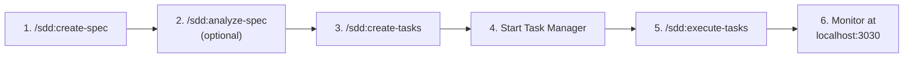

<!-- docs/getting-started.md -->
# Getting Started

Claude Alchemy is a monorepo that pairs two Claude Code plugins with a real-time Task Manager application. The plugins add structured development workflows to Claude Code via slash commands, and the Task Manager gives you a visual Kanban board to monitor task execution in real time. This guide walks you through installation, first run, and your first end-to-end workflow.

## Prerequisites

Before you begin, make sure you have the following installed:

| Requirement | Minimum Version | Check Command |
|-------------|-----------------|---------------|
| Node.js | 18.0.0 | `node --version` |
| pnpm | 8.0.0 | `pnpm --version` |
| Claude Code CLI | Latest | `claude --version` |

!!! info "Claude Code CLI"
    Claude Code must be installed and authenticated before you can use the plugins. Visit the [Claude Code documentation](https://docs.anthropic.com/en/docs/claude-code) for setup instructions if you haven't configured it yet.

## Installation

Clone the repository and install dependencies:

```bash
git clone git@github.com:sequenzia/claude-alchemy.git
cd claude-alchemy
pnpm install
```

!!! note "Workspace Scope"
    Only `apps/*` is included in the pnpm workspace (see `pnpm-workspace.yaml`). The plugins under `plugins/` are pure markdown files with no build step -- `pnpm install` only pulls dependencies for the Task Manager.

## Running the Task Manager

Start the development server:

```bash
pnpm dev:task-manager
```

The Task Manager launches at [http://localhost:3030](http://localhost:3030). It reads task JSON files from `~/.claude/tasks/` and renders them on a three-column Kanban board (Pending, In Progress, Completed).

If no tasks exist yet, you will see an empty board. That is expected -- tasks are created through the SDD plugin workflow described below.

!!! tip "Real-Time Updates"
    The Task Manager watches `~/.claude/tasks/` with Chokidar and streams changes over SSE. As the SDD plugin creates or updates task files, the board updates automatically without a page refresh.

## Using the Plugins

The two plugins are loaded automatically by Claude Code when you start a session inside the `claude-alchemy` repository. They provide slash commands that trigger structured, multi-phase workflows.

### Tools Plugin (`/tools:`)

The Tools plugin (`claude-alchemy-tools` v0.2.2) provides general-purpose development skills:

| Command | Description |
|---------|-------------|
| `/tools:feature-dev` | 7-phase feature development workflow (discovery through summary) |
| `/tools:codebase-analysis` | Structured codebase analysis with exploration and synthesis |
| `/tools:docs-manager` | Documentation generation and management |
| `/tools:git-commit` | Generate conventional commit messages |
| `/tools:deep-analysis` | Reusable exploration and synthesis pattern |
| `/tools:teams-deep-analysis` | Team-based collaborative analysis with multiple agents |
| `/tools:bump-plugin-version` | Increment plugin versions across manifest files |
| `/tools:release` | Python release workflow |

### SDD Plugin (`/sdd:`)

The SDD plugin (`claude-alchemy-sdd` v0.2.6) implements the Spec-Driven Development workflow -- a four-step process that takes you from idea to autonomous implementation:

| Command | Description |
|---------|-------------|
| `/sdd:create-spec` | Create a specification through an adaptive interview process |
| `/sdd:analyze-spec` | Quality review and analysis of an existing spec |
| `/sdd:create-tasks` | Decompose a specification into executable task files |
| `/sdd:execute-tasks` | Autonomous task execution with real-time progress tracking |

## Your First SDD Workflow

The Spec-Driven Development workflow is the best way to experience Claude Alchemy end-to-end. It takes you from a high-level idea through specification, task decomposition, and autonomous execution -- all with real-time visibility in the Task Manager.

### Step 1: Create a Specification

```
/sdd:create-spec
```

Claude will start an adaptive interview, asking questions to understand your feature requirements. At the end, it produces a structured specification file saved to `specs/SPEC-<name>.md`.

### Step 2: Analyze the Specification (Optional)

```
/sdd:analyze-spec specs/SPEC-myproject.md
```

This runs a quality review on the spec, checking for completeness, ambiguities, and potential issues. It is optional but recommended for complex features.

### Step 3: Generate Tasks

```
/sdd:create-tasks specs/SPEC-myproject.md
```

Claude decomposes the specification into individual task JSON files written to `~/.claude/tasks/`. Each task captures its subject, description, status, dependencies, and metadata.

### Step 4: Start the Task Manager

```bash
pnpm dev:task-manager
```

Open [http://localhost:3030](http://localhost:3030) to see your tasks on the Kanban board. All tasks start in the **Pending** column.

### Step 5: Execute Tasks

```
/sdd:execute-tasks
```

Claude begins autonomous execution, working through tasks in dependency order. As each task progresses, the Task Manager board updates in real time -- tasks move from Pending to In Progress to Completed.

### Step 6: Monitor Progress

Watch the Kanban board at [http://localhost:3030](http://localhost:3030) as tasks flow through the columns. The Task Manager provides:

- **Live status updates** as tasks transition between states
- **Execution context** showing the current phase and active work
- **Task details** accessible by clicking any task card
- **Progress tracking** with summary statistics at the top of the board



## Project Structure

```
claude-alchemy/
├── apps/
│   └── task-manager/          # Next.js 16 real-time Kanban board
├── plugins/
│   ├── tools/                 # Developer tools plugin (13 skills, 10 agents)
│   └── sdd/                   # Spec-driven development plugin (4 skills, 2 agents)
├── extensions/
│   └── vscode/                # VS Code extension for plugin file validation
├── internal/
│   └── docs/                  # Internal documentation and cheatsheets
├── docs/                      # MkDocs documentation site (you are here)
├── .claude-plugin/
│   └── marketplace.json       # Plugin registry with versions
├── mkdocs.yml                 # Documentation configuration
├── pnpm-workspace.yaml        # Workspace definition (apps/* only)
└── package.json               # Monorepo root scripts
```

!!! note "Plugin Isolation"
    The plugins are **not** part of the pnpm workspace. They are pure markdown -- no `node_modules`, no build artifacts, no transpilation. Claude Code reads them directly as context.

## Next Steps

Now that you have the project running, explore these pages to go deeper:

- **[Architecture Overview](architecture/overview.md)** -- Understand the system design and how the three subsystems communicate through the filesystem
- **[Task Manager](task-manager/overview.md)** -- Learn about the real-time Kanban board, its components, and the SSE-based update system
- **[Plugin System](plugins/overview.md)** -- Explore skills, agents, hooks, and how the plugin architecture works
- **[SDD Workflow](plugins/sdd-workflow.md)** -- Deep dive into the spec-driven development lifecycle
- **[Development Setup](development/setup.md)** -- Full development environment details for contributing to the project
