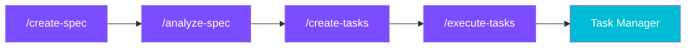

# Agent Alchemy

A plugin suite and developer toolkit that extends Claude Code into a structured development platform — from specs to tasks to autonomous execution.

## What is Agent Alchemy?

Agent Alchemy is an open-source toolkit for AI and software engineers who use [Claude Code](https://docs.anthropic.com/en/docs/claude-code). It adds structured development workflows through **markdown-as-code plugins**, a **real-time task dashboard**, and a **VS Code extension** — all designed to work together as an integrated pipeline.



## Key Features

- **Spec-Driven Development** — Transform ideas into structured specifications through adaptive interviews, then decompose specs into dependency-ordered tasks that execute autonomously ([SDD Tools](plugins/sdd-tools.md))
- **Test-Driven Development** — RED-GREEN-REFACTOR workflows with framework auto-detection for pytest, Jest, and Vitest ([TDD Tools](plugins/tdd-tools.md))
- **Deep Codebase Analysis** — Multi-agent hub-and-spoke exploration with intelligent caching ([Core Tools](plugins/core-tools.md))
- **Feature Development** — Structured implementation with architect and reviewer agent teams ([Dev Tools](plugins/dev-tools.md))
- **Real-Time Task Dashboard** — Kanban board that visualizes task execution as it happens ([Task Manager](task-manager.md))
- **Plugin Authoring** — Schema validation and autocomplete for building your own plugins ([VS Code Extension](vscode-extension.md))

## Quick Start

```bash
# Install Claude Code plugins
claude plugins install agent-alchemy/agent-alchemy-sdd-tools
claude plugins install agent-alchemy/agent-alchemy-core-tools
claude plugins install agent-alchemy/agent-alchemy-dev-tools
claude plugins install agent-alchemy/agent-alchemy-tdd-tools
claude plugins install agent-alchemy/agent-alchemy-git-tools
```

Then try:

```
/create-spec           # Start a spec interview
/deep-analysis         # Explore a codebase
/feature-dev           # Implement a feature
/generate-tests        # Generate tests from code
```

For a full walkthrough, see the [Getting Started](getting-started.md) guide.

## Documentation

| Section | Description |
|---------|-------------|
| [Getting Started](getting-started.md) | Installation, prerequisites, and first steps |
| [Architecture](architecture.md) | System design, plugin composition, and data flow |
| [Plugins](plugins/index.md) | All 6 plugin groups with skills, agents, and usage guides |
| [Task Manager](task-manager.md) | Real-time Kanban dashboard setup and API reference |
| [VS Code Extension](vscode-extension.md) | Schema validation and autocomplete for plugin authoring |
| [Configuration](configuration.md) | Settings reference for all plugin behaviors |
| [Contributing](contributing.md) | Development setup, conventions, and how to help |

## Project Status

Agent Alchemy is in active development. Current plugin versions:

| Plugin | Version | Status |
|--------|---------|--------|
| Core Tools | 0.1.1 | Stable |
| Dev Tools | 0.1.1 | Stable |
| SDD Tools | 0.1.4 | Stable |
| TDD Tools | 0.1.2 | Stable |
| Git Tools | 0.1.0 | Stable |
| Plugin Tools | 0.1.1 | Stable |

## License

MIT — see [LICENSE](https://github.com/sequenzia/agent-alchemy/blob/main/LICENSE) for details.
