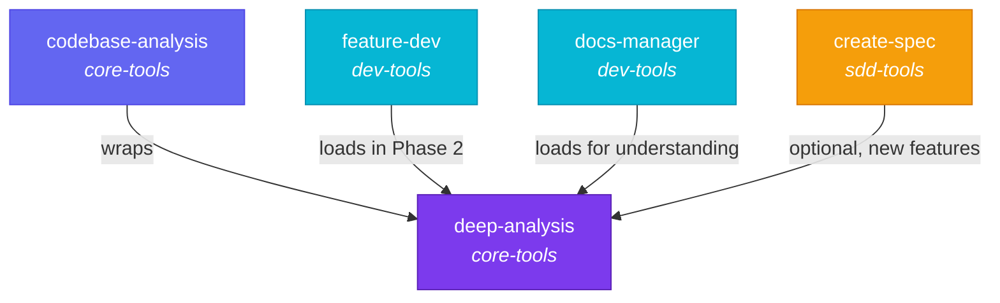
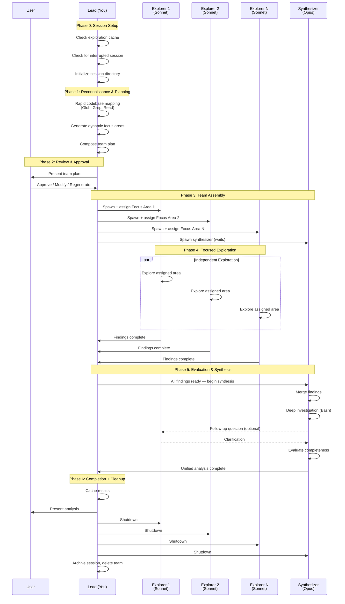
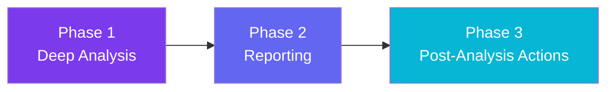
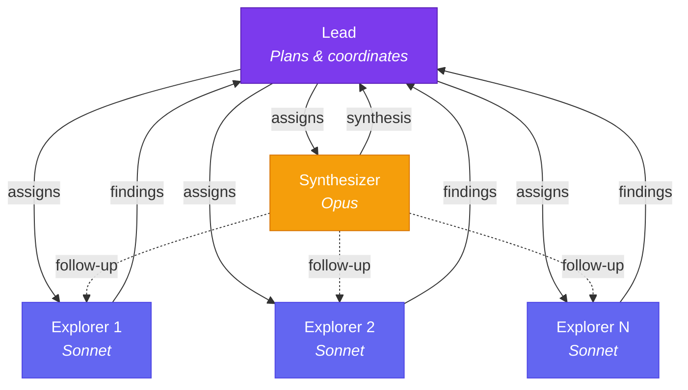

# Core Tools

Core Tools (v0.2.0) provides the foundational analysis and exploration capabilities for Agent Alchemy. It contains the **deep-analysis** skill — the keystone of the entire plugin ecosystem — along with supporting skills and agents that power codebase understanding across all plugin groups.

## Overview

| | |
|---|---|
| **Version** | 0.2.0 |
| **Skills** | 4 (2 user-invocable, 2 agent-loaded) |
| **Agents** | 3 (code-explorer, code-synthesizer, code-architect) |
| **Hooks** | 1 (auto-approve session file operations) |

Core Tools is the most composed plugin in Agent Alchemy. Its `deep-analysis` skill is loaded by four other skills across three different plugin groups, making it the engine behind every workflow that needs to understand a codebase before acting on it.



## Skills

### `/deep-analysis` — The Keystone Skill

!!! abstract "Quick Reference"
    - **Invocable:** `/deep-analysis <analysis-context or focus-area>`
    - **Lines:** 521
    - **Phases:** 6 (Session Setup through Completion)
    - **Team pattern:** Hub-and-spoke (N explorers + 1 synthesizer)
    - **Source:** `claude/core-tools/skills/deep-analysis/SKILL.md`

Deep-analysis is the core engine that powers codebase understanding across Agent Alchemy. It performs rapid reconnaissance, dynamically plans focus areas tailored to the actual codebase structure, assembles a team of explorer and synthesizer agents, and produces a unified analysis.

#### The 6 Phases



#### Phase 0: Session Setup

Before any exploration begins, deep-analysis checks for existing work:

1. **Exploration Cache Check** — If caching is enabled (`cache-ttl-hours > 0`), it looks for a valid cached analysis in `.claude/sessions/exploration-cache/manifest.md`. A cache hit is valid when the analysis context matches, the codebase path matches, the timestamp is within the TTL, and config files haven't been modified. In skill-invoked mode, valid caches are auto-accepted. In direct invocation, the user is offered a choice.

2. **Interrupted Session Check** — If checkpointing is enabled, it looks for `.claude/sessions/__da_live__/checkpoint.md` to detect a prior run that didn't complete. The user can resume from the last completed phase or start fresh.

3. **Session Initialization** — Creates the `.claude/sessions/__da_live__/` directory with `checkpoint.md` and `progress.md` files to track the run.

!!! tip "Skipping Phase 0"
    If both caching and checkpointing are disabled (`cache-ttl-hours: 0` and `enable-checkpointing: false`), Phase 0 is skipped entirely for faster startup.

#### Phase 1: Reconnaissance & Planning

The lead performs a rapid (1-2 minute) codebase scan:

- **Directory structure** — `Glob` maps top-level layout
- **Language/framework detection** — Reads `package.json`, `tsconfig.json`, `pyproject.toml`, etc.
- **File distribution** — Gauges size and shape of different areas
- **Key documentation** — Reads `README.md`, `CLAUDE.md` for project context
- **Hotspot identification** — For feature-focused analysis, `Grep` finds feature-related code; for general analysis, identifies the most architecturally significant directories

From these findings, the lead generates **dynamic focus areas** (typically 2-4, based on codebase size) with specific directories, starting files, search terms, and complexity estimates. Static fallback templates are available if reconnaissance fails.

!!! example "Dynamic Focus Area Example"
    ```markdown
    #### Focus Area 1: API layer in src/api/
    - **Directories:** src/api/, src/middleware/
    - **Starting files:** src/api/routes.ts, src/api/auth.ts
    - **Search patterns:** "router", "middleware", "authenticate"
    - **Complexity:** Medium
    - **Assigned to:** explorer-1 (sonnet)
    ```

#### Phase 2: Review & Approval

The team plan is presented for user review. Approval behavior depends on how deep-analysis was invoked:

| Invocation Mode | Default Behavior | Setting |
|---|---|---|
| Direct (`/deep-analysis`) | Requires approval | `direct-invocation-approval: true` |
| Loaded by another skill | Auto-approved | `invocation-by-skill-approval: false` |

When approval is required, the user can **Approve**, **Modify** (up to 3 cycles), or **Regenerate** (up to 2 cycles) the plan.

#### Phase 3: Team Assembly

Using the approved plan, the lead:

1. Creates a team via `TeamCreate` named `deep-analysis-{timestamp}`
2. Spawns **N explorer agents** (Sonnet) — one per focus area
3. Spawns **1 synthesizer agent** (Opus)
4. Creates tasks for each focus area and a blocked synthesis task
5. Assigns exploration tasks with a **status guard** — tasks are only assigned if `status === pending` and `owner === empty`, preventing duplicate work

#### Phase 4: Focused Exploration

Explorers work independently in a hub-and-spoke topology:

- No cross-worker communication — each explorer handles its assigned focus area
- The lead monitors progress by checking task statuses
- Completed findings are checkpointed to `.claude/sessions/__da_live__/explorer-{N}-findings.md`
- The lead waits for all exploration tasks to complete before proceeding

!!! warning "Duplicate Prevention"
    The status-guard pattern is the primary mechanism for preventing duplicate work. The lead never re-assigns a task that is `completed` or `in_progress`. If a task is `pending` with an owner set, the explorer received the assignment but hasn't started — the lead waits without re-sending.

#### Phase 5: Evaluation & Synthesis

The synthesizer (Opus) performs a multi-step process:

1. **Structural completeness check** — Verifies all explorers produced content. Failed explorations trigger follow-up tasks.
2. **Merge findings** — Deduplicates and reconciles reports across explorers
3. **Deep investigation** — Uses Bash for git history, dependency trees, and static analysis
4. **Follow-up questions** — Messages explorers to resolve conflicts or fill gaps
5. **Completeness evaluation** — Assesses confidence and notes open questions

#### Phase 6: Completion + Cleanup

1. Writes the exploration cache (for future reuse within the TTL window)
2. Presents results to the user (standalone) or returns to the calling skill
3. Sends shutdown requests to all agents
4. Archives the session directory and deletes the team

---

### `/codebase-analysis` — Structured Analysis Wrapper

!!! abstract "Quick Reference"
    - **Invocable:** `/codebase-analysis <analysis-context or feature-description>`
    - **Phases:** 3 (Deep Analysis, Reporting, Post-Analysis Actions)
    - **Source:** `claude/core-tools/skills/codebase-analysis/SKILL.md`

Codebase-analysis wraps deep-analysis with structured reporting and interactive post-analysis actions. It is the primary user-facing entry point for codebase understanding.

#### Workflow



**Phase 1: Deep Analysis** — Loads and executes the deep-analysis skill. Since it's skill-invoked, the team plan is auto-approved by default and cache hits are auto-accepted.

**Phase 2: Reporting** — Structures the synthesis into a report with these sections:

- Executive Summary
- Architecture Overview
- Critical Files (5-10 most important)
- Patterns & Conventions
- Relationship Map
- Challenges & Risks
- Recommendations

**Phase 3: Post-Analysis Actions** — Presents an interactive menu (multi-select) of follow-up actions:

| Action | Description |
|---|---|
| Save report as Markdown | Writes the full report to a file |
| Update README.md | Adds architecture/structure insights |
| Update CLAUDE.md | Adds patterns/conventions for AI context |
| Keep condensed summary in memory | Retains a quick reference in conversation |
| Address actionable insights | Fix challenges and implement recommendations interactively |

!!! note "Action Ordering"
    "Address actionable insights" always runs last, since code changes could invalidate analysis if documentation is generated afterward. It is also the most interactive action.

---

### `language-patterns` — Language-Specific Best Practices

!!! info "Agent Skill"
    This skill is **not user-invocable**. It is loaded by the `code-explorer` and `code-synthesizer` agents to inform their work.

Provides patterns and idioms for three languages/frameworks:

=== "TypeScript"

    - Type safety (`unknown` over `any`, discriminated unions, type guards)
    - Null handling (optional chaining, nullish coalescing)
    - Async patterns (`async`/`await`, `Promise.all`, `Promise.allSettled`)
    - Import organization (external, internal, relative)

=== "Python"

    - Type hints and dataclasses
    - Pydantic validation
    - Pythonic patterns (comprehensions, context managers, `pathlib`)
    - Custom error hierarchies

=== "React"

    - Functional components with hooks
    - Custom hooks for logic reuse
    - State management hierarchy (local, lifted, context, external store)
    - Performance (memoization, lazy loading, error boundaries)

**Source:** `claude/core-tools/skills/language-patterns/SKILL.md`

---

### `project-conventions` — Convention Discovery Guide

!!! info "Agent Skill"
    This skill is **not user-invocable**. It is loaded by the `code-explorer` and `code-synthesizer` agents.

Guides agents through a structured process for discovering project-specific conventions:

1. **Project Configuration** — Reads `.eslintrc`, `.prettierrc`, `tsconfig.json`, `pyproject.toml`, `CONTRIBUTING.md`, etc.
2. **Existing Code Patterns** — Studies file organization, naming patterns, and import styles from the actual codebase
3. **Similar Features** — Finds features analogous to the analysis target and studies their implementation

The skill also provides a **Convention Application Checklist** covering code style, structure, patterns, testing, and documentation — ensuring agents match the project's existing practices rather than imposing generic standards.

**Source:** `claude/core-tools/skills/project-conventions/SKILL.md`

---

## Agents

### code-architect (Opus)

The blueprint designer. Spawned by feature-dev (dev-tools) to generate competing implementation approaches.

| Property | Value |
|---|---|
| **Model** | Opus |
| **Tools** | Read, Glob, Grep, SendMessage, TaskUpdate, TaskGet, TaskList |
| **Loaded Skills** | None |
| **Source** | `claude/core-tools/agents/code-architect.md` |

!!! warning "Read-Only by Design"
    Like the explorer and synthesizer, the architect has no Write or Edit access. It designs blueprints but never modifies code — only the lead (feature-dev) applies changes.

**Design approaches:**

1. **Minimal/Simple** — Fewest files changed, direct implementation, inline solutions
2. **Flexible/Extensible** — Abstractions where reuse is likely, extension points
3. **Project-Aligned** — Match existing patterns exactly, follow team conventions

**Output format:** Implementation blueprints with files to create/modify, data flow, API changes, error handling, risks/mitigations, and testing strategy.

---

### code-explorer (Sonnet)

The exploration workhorse of the deep-analysis team. Each instance is assigned a single focus area and works independently.

| Property | Value |
|---|---|
| **Model** | Sonnet |
| **Tools** | Read, Glob, Grep, Bash, SendMessage, TaskUpdate, TaskGet, TaskList |
| **Loaded Skills** | `project-conventions`, `language-patterns` |
| **Source** | `claude/core-tools/agents/code-explorer.md` |

!!! warning "Read-Only by Design"
    Explorers use Read, Glob, Grep, and Bash for investigation — they do not have Write or Edit access. This enforces separation of concerns: explorers observe, they do not modify.

**Exploration strategies:**

1. **Start from entry points** — Routes, CLI commands, UI components, then trace execution paths
2. **Follow the data** — Models, schemas, validation, transformation, persistence
3. **Find similar features** — Search for analogous implementations to understand patterns
4. **Map dependencies** — Shared utilities, configuration, external dependencies

**Output format:** Structured markdown with Key Files table, Code Patterns, Important Functions/Classes, Integration Points, Potential Challenges, and Recommendations.

**Team communication:**

- Acknowledges task assignments immediately
- Prevents duplicate work by checking task status before re-exploring
- Responds to follow-up questions from the synthesizer with specific file paths, function names, and line numbers

---

### code-synthesizer (Opus)

The analytical brain of the deep-analysis team. Merges findings from all explorers into a unified analysis with deep investigation capabilities.

| Property | Value |
|---|---|
| **Model** | Opus |
| **Tools** | Read, Glob, Grep, Bash, SendMessage, TaskUpdate, TaskGet, TaskList |
| **Loaded Skills** | `project-conventions`, `language-patterns` |
| **Source** | `claude/core-tools/agents/code-synthesizer.md` |

**Synthesis process (8 steps):**

1. **Merge findings** — Combine and deduplicate across all explorer reports
2. **Identify conflicts and gaps** — Flag disagreements, thin coverage, missing connections
3. **Read critical files** — Verify by reading high-relevance files directly
4. **Deep investigation** — Use Bash for git history, dependency trees, static analysis
5. **Map relationships** — Trace imports, calls, data flow between components
6. **Identify patterns** — Catalog conventions, shared abstractions, deviations
7. **Assess challenges** — Technical risks, coupling hotspots, test coverage gaps
8. **Evaluate completeness** — Confirm all critical areas are covered, note confidence levels

**Deep investigation capabilities (via Bash):**

| Investigation Type | Example Commands |
|---|---|
| Git history | `git blame`, `git log --stat`, `git diff branch..HEAD` |
| Dependency trees | `npm ls`, `pip show`, `cargo tree` |
| Static analysis | Linters, type checkers, build config inspection |
| Cross-cutting concerns | Tracing patterns across 3+ modules |
| Security audit | Auth flows, secret handling, common vulnerabilities |
| Performance | N+1 queries, hot paths, bundle sizes |

!!! tip "Interactive Synthesis"
    Unlike a passive aggregator, the synthesizer can message explorers with targeted follow-up questions to resolve conflicts. If an explorer is unresponsive, the synthesizer investigates directly rather than blocking.

---

## Hub-and-Spoke Coordination Pattern

The deep-analysis team uses a hub-and-spoke topology — not a mesh. This is a deliberate architectural choice.



| Role | Communicates With | Never Communicates With |
|---|---|---|
| Lead | All agents | — |
| Explorer | Lead, Synthesizer (when asked) | Other explorers |
| Synthesizer | Lead, any explorer (follow-ups) | — |

**Why hub-and-spoke?**

- **Predictability** — No emergent cross-worker conversations that could diverge
- **Efficiency** — Explorers focus purely on their assigned area without coordination overhead
- **Fault isolation** — One explorer failing doesn't cascade to others
- **Duplicate prevention** — The lead is the single source of truth for task assignment

---

## Hooks

Core Tools includes one lifecycle hook that auto-approves file operations targeting deep-analysis session directories:

```bash title="claude/core-tools/hooks/auto-approve-da-session.sh"
# Auto-approves Write/Edit/Bash operations targeting:
#   .claude/sessions/__da_live__/*         (active session)
#   .claude/sessions/exploration-cache/*   (cached results)
#   .claude/sessions/da-*/*               (archived sessions)
```

This hook is registered in `claude/core-tools/hooks/hooks.json` as a `PreToolUse` hook matching `Write|Edit|Bash` tools. It enables autonomous session management without prompting the user for every checkpoint write or cache update.

!!! note "Safety Design"
    The hook never exits non-zero. If it encounters an unexpected error, it exits cleanly with no output (the "no opinion" response), allowing the normal permission prompt to appear. Operations outside session directories are always passed through to the standard permission flow.

---

## Cross-Plugin Dependency Map

Deep-analysis is the keystone skill — the most-composed building block in Agent Alchemy. Understanding how it integrates with other plugins is essential for understanding the platform.

| Consumer Skill | Plugin | How It Uses Deep-Analysis |
|---|---|---|
| `codebase-analysis` | core-tools | Wraps it with reporting and post-analysis actions |
| `feature-dev` | dev-tools | Loads in Phase 2 for codebase exploration before architecture planning |
| `docs-manager` | dev-tools | Loads for codebase understanding before generating documentation |
| `create-spec` | sdd-tools | Optionally loads for "new feature" type specs that need codebase context |

**Cross-plugin reference convention:**

Skills reference deep-analysis using the relative path pattern:

```
${CLAUDE_PLUGIN_ROOT}/../core-tools/skills/deep-analysis/SKILL.md
```

Same-plugin references (like `codebase-analysis` loading `deep-analysis`) use:

```
${CLAUDE_PLUGIN_ROOT}/skills/deep-analysis/SKILL.md
```

!!! danger "Never Use Marketplace Names in Paths"
    Path references always use the short source directory name (`core-tools`, `dev-tools`, `sdd-tools`), never the full marketplace name (`agent-alchemy-core-tools`).

---

## Configuration

All deep-analysis settings are stored in `.claude/agent-alchemy.local.md` (not committed to version control). Settings are read at the start of every deep-analysis run.

### Settings Reference

| Setting | Default | Description |
|---|---|---|
| `direct-invocation-approval` | `true` | Require user approval of the team plan when `/deep-analysis` is invoked directly |
| `invocation-by-skill-approval` | `false` | Require approval when deep-analysis is loaded by another skill (e.g., `feature-dev`) |
| `cache-ttl-hours` | `24` | Hours before exploration cache expires. Set to `0` to disable caching entirely |
| `enable-checkpointing` | `true` | Write session checkpoints at phase boundaries for crash recovery |
| `enable-progress-indicators` | `true` | Display `[Phase N/6]` progress messages during execution |

### Session Recovery

When checkpointing is enabled and a run is interrupted, the next invocation detects the incomplete session and offers to resume:

| Interrupted At | Recovery Strategy |
|---|---|
| Phase 1 | Restart from Phase 1 (reconnaissance is fast, ~1-2 min) |
| Phase 2 | Load saved `team_plan.md`, re-present for approval |
| Phase 3 | Load approved plan, restart team assembly |
| Phase 4 | Load completed explorer findings, only re-run missing explorers |
| Phase 5 | Load all explorer findings, spawn fresh synthesizer |
| Phase 6 | Load `synthesis.md`, skip to present results and cleanup |

!!! tip "Disabling Session Features"
    For lightweight runs where persistence overhead isn't wanted, set both `cache-ttl-hours: 0` and `enable-checkpointing: false`. Phase 0 will be skipped entirely.

---

## Error Handling

Deep-analysis includes structured error handling at every phase:

| Failure | Response |
|---|---|
| Settings file malformed | Warn user, proceed with defaults |
| Reconnaissance fails | Fall back to static focus area templates |
| Max approval cycles exhausted | Offer "Approve current" or "Abort" |
| Single worker fails | Create follow-up task for the missed area |
| Two workers fail | Attempt follow-ups; if those fail, synthesize with partial results |
| All workers fail | Inform user, offer retry or abort |
| Synthesizer fails | Present raw exploration results directly |

---

## Directory Structure

```
claude/core-tools/
├── agents/
│   ├── code-architect.md             # Opus — blueprint design agent
│   ├── code-explorer.md              # Sonnet — exploration worker
│   └── code-synthesizer.md           # Opus — synthesis agent
├── hooks/
│   ├── hooks.json                    # Hook registration
│   └── auto-approve-da-session.sh    # Auto-approve session file ops
├── skills/
│   ├── deep-analysis/
│   │   └── SKILL.md                  # Keystone skill (521 lines)
│   ├── codebase-analysis/
│   │   ├── SKILL.md                  # 3-phase analysis wrapper
│   │   └── references/
│   │       ├── report-template.md    # Structured report format
│   │       └── actionable-insights-template.md
│   ├── language-patterns/
│   │   └── SKILL.md                  # TS/Python/React patterns
│   └── project-conventions/
│       └── SKILL.md                  # Convention discovery guide
└── README.md
```
