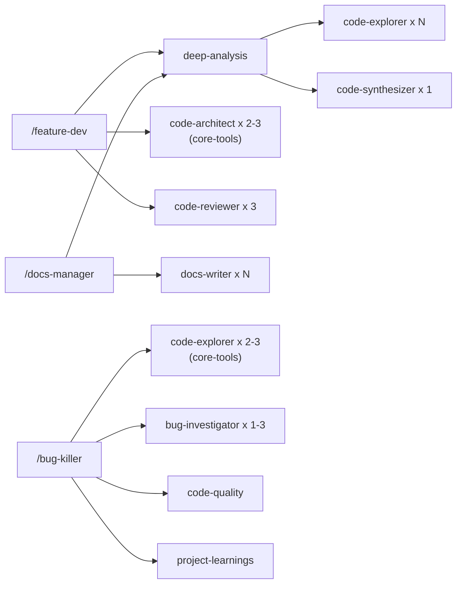

# Dev Tools

**Version:** 0.3.1 | **Skills:** 9 | **Agents:** 4

Dev Tools provides the development lifecycle toolkit — from feature implementation through code review, documentation, and changelog management.

## Skills

### `/feature-dev` — Feature Development Workflow

The primary skill for implementing new features or significant changes. Runs a structured **7-phase workflow**:

1. **Discovery** — Understand feature requirements from user input
2. **Codebase Exploration** — Deep-analysis maps relevant code areas (loads [Core Tools deep-analysis](core-tools.md#deep-analysis-the-keystone-skill))
3. **Clarifying Questions** — Resolve ambiguities with the user
4. **Architecture Design** — Spawn code-architect agents (Opus) to design implementation blueprints
5. **Implementation** — Build the feature following the approved architecture
6. **Quality Review** — Spawn code-reviewer agents (Opus) for correctness, security, and maintainability review
7. **Summary** — Document what was accomplished

```bash
# Usage
/feature-dev Add dark mode toggle to the settings page
/feature-dev Implement WebSocket support for real-time notifications
```

!!! info "Composition Chain"
    feature-dev orchestrates multiple agent teams:

    - **Phase 2:** Loads deep-analysis for codebase exploration (code-explorer x N + code-synthesizer x 1)
    - **Phase 4:** Spawns 2-3 code-architect agents (from core-tools) for blueprint design
    - **Phase 6:** Spawns 3 code-reviewer agents for quality review

### `/docs-manager` — Documentation Management

Manages MkDocs sites, standalone markdown files, and change summaries through a 6-phase interactive workflow. Supports generating new documentation, updating existing pages, and creating changelogs.

```bash
/docs-manager                    # Interactive discovery
/docs-manager README             # Generate a README.md
/docs-manager mkdocs             # Set up MkDocs site
/docs-manager changelog          # Create change summary
```

### `/bug-killer` — Hypothesis-Driven Debugging

A systematic debugging skill that enforces investigation before fixes. Every bug gets a hypothesis journal, evidence gathering, and root cause confirmation before any code changes are applied.

```bash
/bug-killer TypeError: Cannot read property 'id' of undefined
/bug-killer tests/test_auth.py::test_login_fails --deep
```

**5-Phase Workflow:**

1. **Triage & Reproduction** — Reproduce the bug, form an initial hypothesis, route to quick or deep track
2. **Investigation** — Gather evidence with language-specific debugging techniques
3. **Root Cause Analysis** — Confirm root cause through hypothesis testing
4. **Fix & Verify** — Apply minimal fix, run tests, write regression test
5. **Wrap-up & Report** — Document the investigation trail, capture project learnings

#### Track Routing

The triage phase routes bugs to one of two investigation tracks:

| Track | Trigger | Investigation | Agents |
|-------|---------|--------------|--------|
| **Quick** | Localized bug (1-2 files), clear error, obvious fix | Read error location + immediate callers | None |
| **Deep** | Multi-file bug, unclear root cause, concurrency/state issues, `--deep` flag | 2-3 code-explorer agents (core-tools) + 1-3 bug-investigator agents | Sonnet workers |

!!! info "Auto-Escalation"
    If 2 hypotheses are rejected during the quick track, the workflow automatically escalates to the deep track. All hypothesis journal entries are preserved across escalation.

#### Hypothesis Journal

The core artifact of every debugging session. Each hypothesis follows a structured format with evidence for/against, a test plan, and status (Pending/Confirmed/Rejected). Rejected hypotheses are never deleted — they provide context for the investigation trail.

#### Deep Track Agent Teams

On the deep track, bug-killer orchestrates two types of agent teams:

- **Phase 2:** Spawns 2-3 `code-explorer` agents (from core-tools, Sonnet) to explore focus areas related to the bug
- **Phase 3:** Spawns 1-3 `bug-investigator` agents (Sonnet) to test specific hypotheses in parallel
- **Phase 4:** Loads `code-quality` skill for fix validation and scans for related issues across the codebase

After the fix, bug-killer loads the `project-learnings` skill to evaluate whether the bug reveals project-specific knowledge worth capturing in CLAUDE.md.

---

### `/document-changes` — Session Change Reports

Generates a structured markdown report documenting codebase changes from the current working session. Captures files added, modified, and deleted, along with commit history and a human-readable summary.

```bash
/document-changes                    # Auto-infer scope from changes
/document-changes auth refactor      # Specify scope for the report
```

**4-Step Workflow:**

1. **Validate** — Confirm the directory is a git repository
2. **Gather** — Collect uncommitted changes, staged changes, and recent commits via git
3. **Locate** — Determine report path (default: `internal/reports/<scope>-YYYY-MM-DD.md`)
4. **Generate** — Write a structured markdown report with metadata, file table, change details, git status, and commit log

The report is suitable for team reviews, handoff documentation, or personal session records.

---

### `/release` — Python Package Release

Automates Python package releases using `uv` and `ruff`. Handles version calculation, changelog updates, and tag creation. Runs on the Haiku model for speed.

```bash
/release              # Auto-calculate next version
/release 1.2.0        # Specify version override
```

### Supporting Skills (Agent-loaded)

These skills are not directly invoked — they're loaded by agents as reference knowledge:

| Skill | Purpose | Used By |
|-------|---------|---------|
| `architecture-patterns` | MVC, event-driven, microservices, CQRS pattern knowledge | code-architect agent |
| `code-quality` | SOLID, DRY, testing strategies, review best practices | code-reviewer agent, bug-killer (deep track) |
| `changelog-format` | Keep a Changelog specification and entry writing guidelines | changelog-manager agent |
| `project-learnings` | Captures project-specific patterns and anti-patterns into CLAUDE.md | bug-killer (Phase 5), feature-dev |

## Agents

| Agent | Model | Tools | Purpose |
|-------|-------|-------|---------|
| **code-reviewer** | Opus | Read, Glob, Grep (read-only) | Reviews code for correctness, security, maintainability with confidence scores |
| **bug-investigator** | Sonnet | Read, Glob, Grep, Bash (read-only) | Executes diagnostic investigation tasks to test debugging hypotheses |
| **changelog-manager** | Sonnet | Bash, Read, Edit, Glob, Grep | Analyzes git history and updates CHANGELOG.md |
| **docs-writer** | Opus | Read, Glob, Grep, Bash | Generates MkDocs or GitHub-flavored markdown documentation |

> **Note:** `code-architect` (Opus, read-only) has moved to **[Core Tools](core-tools.md)**. Feature-dev spawns it cross-plugin using the qualified name `agent-alchemy-core-tools:code-architect`.

!!! note "Read-Only Enforcement"
    The code-reviewer agent intentionally has no write tools. This enforces separation of concerns — reviewers audit but don't modify code directly. The code-architect agent (now in core-tools) follows the same pattern. Only the lead (feature-dev) applies changes.

## Composition Chains


