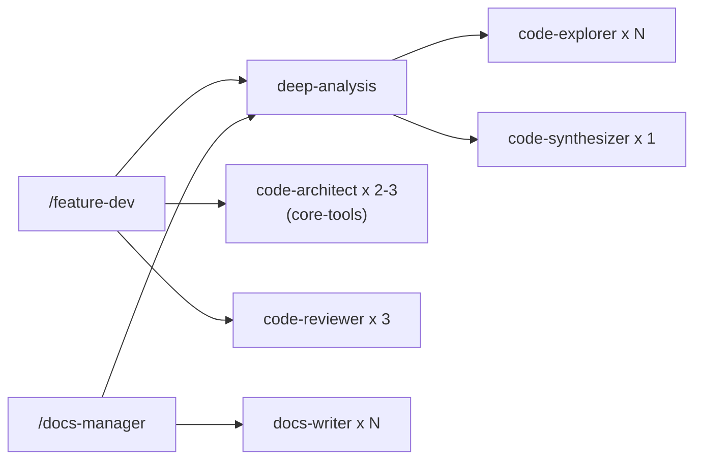

# Dev Tools

**Version:** 0.1.1 | **Skills:** 6 | **Agents:** 3

Dev Tools provides the development lifecycle toolkit — from feature implementation through code review, documentation, and changelog management.

## Skills

### `/feature-dev` — Feature Development Workflow

The primary skill for implementing new features or significant changes. Runs a structured **7-phase workflow**:

1. **Discovery** — Understand feature requirements from user input
2. **Codebase Exploration** — Deep-analysis maps relevant code areas (loads [Core Tools deep-analysis](core-tools.md#deep-analysis-the-keystone-skill))
3. **Clarifying Questions** — Resolve ambiguities with the user
4. **Architecture Design** — Spawn code-architect agents (Opus) to design implementation blueprints
5. **Implementation** — Build the feature following the approved architecture
6. **Quality Review** — Spawn code-reviewer agents (Opus) for correctness, security, and maintainability review
7. **Summary** — Document what was accomplished

```bash
# Usage
/feature-dev Add dark mode toggle to the settings page
/feature-dev Implement WebSocket support for real-time notifications
```

!!! info "Composition Chain"
    feature-dev orchestrates multiple agent teams:

    - **Phase 2:** Loads deep-analysis for codebase exploration (code-explorer x N + code-synthesizer x 1)
    - **Phase 4:** Spawns 2-3 code-architect agents (from core-tools) for blueprint design
    - **Phase 6:** Spawns 3 code-reviewer agents for quality review

### `/docs-manager` — Documentation Management

Manages MkDocs sites, standalone markdown files, and change summaries through a 6-phase interactive workflow. Supports generating new documentation, updating existing pages, and creating changelogs.

```bash
/docs-manager                    # Interactive discovery
/docs-manager README             # Generate a README.md
/docs-manager mkdocs             # Set up MkDocs site
/docs-manager changelog          # Create change summary
```

### `/release` — Python Package Release

Automates Python package releases using `uv` and `ruff`. Handles version calculation, changelog updates, and tag creation. Runs on the Haiku model for speed.

```bash
/release              # Auto-calculate next version
/release 1.2.0        # Specify version override
```

### Supporting Skills (Agent-loaded)

These skills are not directly invoked — they're loaded by agents as reference knowledge:

| Skill | Purpose | Used By |
|-------|---------|---------|
| `architecture-patterns` | MVC, event-driven, microservices, CQRS pattern knowledge | code-architect agent |
| `code-quality` | SOLID, DRY, testing strategies, review best practices | code-reviewer agent |
| `changelog-format` | Keep a Changelog specification and entry writing guidelines | changelog-manager agent |

## Agents

| Agent | Model | Tools | Purpose |
|-------|-------|-------|---------|
| **code-reviewer** | Opus | Read, Glob, Grep (read-only) | Reviews code for correctness, security, maintainability with confidence scores |
| **changelog-manager** | Sonnet | Bash, Read, Edit, Glob, Grep | Analyzes git history and updates CHANGELOG.md |
| **docs-writer** | Opus | Read, Glob, Grep, Bash | Generates MkDocs or GitHub-flavored markdown documentation |

> **Note:** `code-architect` (Opus, read-only) has moved to **[Core Tools](core-tools.md)**. Feature-dev spawns it cross-plugin using the qualified name `agent-alchemy-core-tools:code-architect`.

!!! note "Read-Only Enforcement"
    The code-reviewer agent intentionally has no write tools. This enforces separation of concerns — reviewers audit but don't modify code directly. The code-architect agent (now in core-tools) follows the same pattern. Only the lead (feature-dev) applies changes.

## Composition Chains


