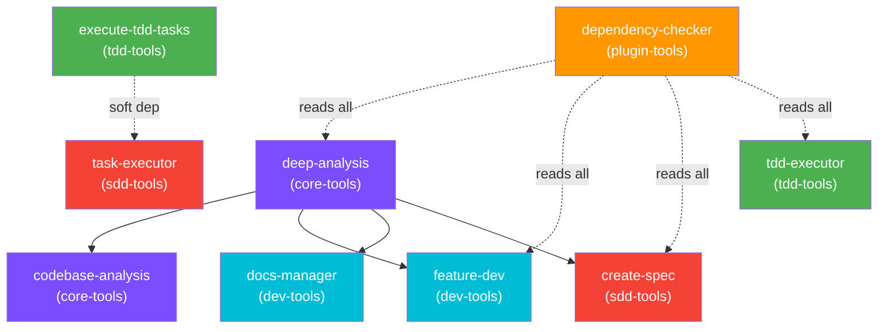

# Plugin Overview

Agent Alchemy extends Claude Code through six plugin groups, each targeting a different phase of the development lifecycle. Plugins are installed independently — pick only what you need.

## At a Glance

| Plugin | Focus | Skills | Agents | Version |
|--------|-------|--------|--------|---------|
| [Core Tools](core-tools.md) | Codebase analysis and exploration | 5 | 3 | 0.2.1 |
| [Dev Tools](dev-tools.md) | Feature development, review, docs | 9 | 4 | 0.3.1 |
| [SDD Tools](sdd-tools.md) | Spec-Driven Development pipeline | 4 | 4 | 0.2.1 |
| [TDD Tools](tdd-tools.md) | Test-Driven Development workflows | 5 | 3 | 0.2.0 |
| [Git Tools](git-tools.md) | Git commit automation | 1 | 0 | 0.1.0 |
| [Plugin Tools](plugin-tools.md) | Plugin porting and ecosystem health | 5 | 2 | 0.1.1 |

## How Plugins Work

Plugins are **markdown-as-code** — skills, agents, and hooks are all defined as markdown files with YAML frontmatter. Claude Code loads them at runtime and executes the instructions directly, with no compilation or build step.

Each plugin contains up to four component types:

| Component | Format | Purpose |
|-----------|--------|---------|
| **Skills** | `skills/{name}/SKILL.md` | Multi-step workflows invoked as slash commands |
| **Agents** | `agents/{name}.md` | Specialized subagents with defined tools and models |
| **Hooks** | `hooks/hooks.json` | Event-driven lifecycle automation |
| **References** | `skills/{name}/references/` | Supporting materials loaded on demand |

For details on the underlying architecture, see the [Architecture](../architecture.md) page.

## Installation

Install plugins individually via the Claude Code CLI:

```bash
# Core analysis and exploration
claude plugins install agent-alchemy/agent-alchemy-core-tools

# Development lifecycle (feature dev, review, docs)
claude plugins install agent-alchemy/agent-alchemy-dev-tools

# Spec-Driven Development pipeline
claude plugins install agent-alchemy/agent-alchemy-sdd-tools

# Test-Driven Development workflows
claude plugins install agent-alchemy/agent-alchemy-tdd-tools

# Git commit automation
claude plugins install agent-alchemy/agent-alchemy-git-tools

# Plugin porting, validation, and ecosystem analysis
claude plugins install agent-alchemy/agent-alchemy-plugin-tools
```

## Plugin Groups

### Core Tools

The foundation layer. Provides deep codebase exploration via multi-agent hub-and-spoke teams, language-specific patterns, and project convention discovery. The **deep-analysis** skill is the keystone — loaded by 4 other skills across 3 plugin groups.

**Key skills:** `/deep-analysis`, `/codebase-analysis`

[Read the full Core Tools guide →](core-tools.md)

### Dev Tools

The development lifecycle toolkit. Covers feature implementation with architect/reviewer agent teams, documentation generation (MkDocs and standalone markdown), code quality patterns, and changelog management.

**Key skills:** `/feature-dev`, `/docs-manager`, `/changelog-format`

[Read the full Dev Tools guide →](dev-tools.md)

### SDD Tools

The structured development pipeline. Transforms ideas into specs via adaptive interviews, decomposes specs into dependency-ordered tasks, and executes them autonomously with wave-based parallelism.

**Key skills:** `/create-spec` → `/analyze-spec` → `/create-tasks` → `/execute-tasks`

[Read the full SDD Tools guide →](sdd-tools.md)

### TDD Tools

Test-Driven Development workflows. Automates the RED-GREEN-REFACTOR cycle, generates behavior-driven tests from acceptance criteria or source code, analyzes test coverage, and orchestrates TDD task execution with wave-based parallelism. Auto-detects pytest, Jest, and Vitest.

**Key skills:** `/tdd-cycle`, `/generate-tests`, `/analyze-coverage`, `/create-tdd-tasks`, `/execute-tdd-tasks`

[Read the full TDD Tools guide →](tdd-tools.md)

### Git Tools

Lightweight git automation. A single skill that analyzes staged changes and generates conventional commit messages using the Haiku model for fast, low-cost operation.

**Key skill:** `/git-commit`

[Read the full Git Tools guide →](git-tools.md)

### Plugin Tools

Plugin lifecycle management. Ports Agent Alchemy plugins to other platforms using an adapter framework with live research, validates adapters against current platform documentation, applies incremental updates to ported plugins, and analyzes ecosystem health across all plugin groups.

**Key skills:** `/port-plugin`, `/validate-adapter`, `/dependency-checker`, `/bump-plugin-version`

[Read the full Plugin Tools guide →](plugin-tools.md)

## Cross-Plugin Dependencies

Plugins are designed to be independent, but some skills compose across boundaries:



- **deep-analysis** (core-tools) is loaded by 4 skills across core-tools, dev-tools, and sdd-tools
- **execute-tdd-tasks** (tdd-tools) has a soft dependency on `task-executor` from sdd-tools for non-TDD task routing
- **dependency-checker** (plugin-tools) reads all plugin groups to build its dependency graph
- All other cross-references are optional — skills degrade gracefully when dependencies are missing

## Model Usage

Plugins use three model tiers to balance quality and cost:

| Tier | Model | Used For | Examples |
|------|-------|----------|----------|
| High | Opus | Synthesis, architecture, review | code-synthesizer, code-architect, code-reviewer, tdd-executor |
| Medium | Sonnet | Exploration, parallel workers | code-explorer, test-writer, researcher (plugin-tools) |
| Low | Haiku | Simple, fast tasks | git-commit |
