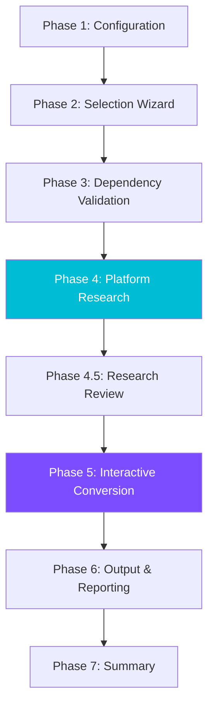
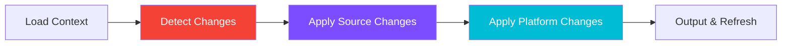
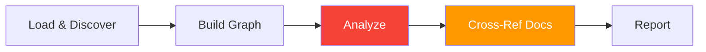

# Plugin Tools

Plugin Tools provides lifecycle management for cross-platform plugin porting, adapter validation, incremental updates to ported plugins, and ecosystem health analysis. It uses an extensible adapter framework with real-time platform research and interactive workflows.

**Plugin:** `agent-alchemy-plugin-tools` | **Version:** 0.1.1 | **Skills:** 5 | **Agents:** 2

## Plugin Inventory

| Component | Type | Model | Description |
|-----------|------|-------|-------------|
| `port-plugin` | Skill | -- | Guided conversion wizard for porting plugins to target platforms |
| `validate-adapter` | Skill | -- | Validates adapter files against live platform documentation |
| `update-ported-plugin` | Skill | -- | Incremental updates when source plugins or target platforms change |
| `dependency-checker` | Skill | -- | Ecosystem health analysis with 7 detection passes and doc drift checks |
| `bump-plugin-version` | Skill | -- | Version bumping across all ecosystem files with drift detection and changelog |
| `researcher` | Agent | Sonnet | Investigates target platform plugin architectures via web search and documentation |
| `port-converter` | Agent | Sonnet | Converts a single plugin component to a target platform format |

---

## Port Plugin (`/port-plugin`)

The flagship skill. A guided conversion wizard that ports Agent Alchemy plugins to target platforms using an extensible adapter framework. The adapter defines mapping rules between Claude Code's plugin format and the target platform's architecture.

### Workflow Overview



### Phase Details

#### Phase 1: Configuration

Parses arguments, loads settings, validates the target platform adapter, and loads the marketplace registry for plugin metadata.

#### Phase 2: Selection Wizard

Interactive component selection. Choose which plugin groups and individual components (skills, agents, hooks, references) to include in the conversion.

#### Phase 3: Dependency Validation

Builds a dependency graph of selected components, detects cross-plugin references, and alerts on missing dependencies that could cause the ported plugin to malfunction.

#### Phase 4: Platform Research

Spawns a `researcher` agent to investigate the target platform's latest plugin architecture using web search, documentation fetching, and Context7. Produces a structured platform profile.

#### Phase 4.5: Research Review

Presents research findings for user review. The user can request additional research, clarify findings, or proceed with the conversion.

#### Phase 5: Interactive Conversion

Converts components one at a time using the adapter framework. When incompatibilities are detected (features that don't map cleanly to the target platform), the workflow pauses for user decisions:

- **Drop** the feature
- **Approximate** with a workaround
- **Defer** for manual implementation

#### Phase 6: Output & Reporting

Writes converted files to the output directory, generates a `MIGRATION-GUIDE.md` with `PORT-METADATA` for future updates, and produces a gap report listing unsupported features.

#### Phase 7: Summary

Displays conversion results including fidelity scores (per-component and overall), file manifest, and recommended next steps.

!!! info "Adapter Framework"
    The conversion engine is adapter-driven -- each target platform has a dedicated adapter file (`references/adapters/{platform}.md`) that defines 9 mapping sections: skills, agents, hooks, references, MCP configs, manifest format, directory structure, naming conventions, and feature parity. Adding a new target platform means adding a new adapter file.

---

## Validate Adapter (`/validate-adapter`)

Validates adapter files against live platform documentation to detect stale mappings, missing features, and outdated version information. Can optionally apply updates in-place.

### Four-Phase Workflow


1. **Load & Parse** -- Reads the adapter file, extracts all 9 mapping sections, and displays a summary of current content.
2. **Platform Research** -- Spawns a `researcher` agent to fetch the target platform's latest documentation and compare against the adapter's claims.
3. **Compare & Analyze** -- Diffs each section against research findings. Classifies each mapping as:

    | Status | Meaning |
    |--------|---------|
    | Current | Mapping matches live docs |
    | Stale | Mapping exists but is outdated |
    | Missing | Feature exists on platform but not in adapter |
    | Removed | Feature in adapter but removed from platform |
    | Uncertain | Could not verify (research inconclusive) |

4. **Report & Apply** -- Presents a validation report with section-by-section findings. Optionally applies updates to the adapter file with user confirmation.

---

## Update Ported Plugin (`/update-ported-plugin`)

Updates previously-ported plugins when the source Agent Alchemy plugin changes or the target platform evolves. Uses dual-track change detection to identify what needs updating.

### Five-Phase Workflow



1. **Load Context** -- Parses `MIGRATION-GUIDE.md` PORT-METADATA from the previous port, locates ported files, and validates metadata integrity.
2. **Detect Changes** -- Dual-track detection:
    - **Source track**: Git diff between the original commit hash (from PORT-METADATA) and HEAD to find modified, added, or deleted components
    - **Platform track**: Runs `validate-adapter` (phases 1-3) to detect stale or missing platform mappings
3. **Apply Source Changes** -- Re-converts modified components using the adapter framework. Handles new components (added since last port) and deleted components (removes ported equivalents).
4. **Apply Platform Changes** -- Updates ported files to reflect stale adapter mappings and applies additive features newly available on the target platform.
5. **Output & Refresh** -- Writes updated files, refreshes PORT-METADATA with new commit hash and timestamp, and updates the gap report.

---

## Dependency Checker (`/dependency-checker`)

Analyzes the entire Agent Alchemy plugin ecosystem to detect dependency issues, structural problems, and documentation drift. Reads all plugin groups and produces an interactive findings report.

### Five-Phase Workflow



1. **Load & Discover** -- Parses arguments, loads settings, enumerates all skills, agents, references, and hooks across every plugin group.
2. **Build Dependency Graph** -- Extracts dependency edges from path patterns (`${CLAUDE_PLUGIN_ROOT}`), agent spawning declarations, skill bindings, and hook scripts.
3. **Analyze** -- Runs 7 detection passes:

    | Pass | Detects |
    |------|---------|
    | 1 | Circular dependencies |
    | 2 | Missing dependencies (referenced but not found) |
    | 3 | Broken paths (invalid `${CLAUDE_PLUGIN_ROOT}` references) |
    | 4 | Orphaned components (defined but never referenced) |
    | 5 | Agent-skill mismatches (agents referencing non-existent skills) |
    | 6 | Marketplace inconsistencies (plugin.json vs actual components) |
    | 7 | Hook integrity (hook scripts referencing missing files) |

4. **Cross-Reference Documentation** -- Compares the dependency graph against `CLAUDE.md` and `README.md` files to detect inventory drift, composition chain drift, and line count drift.
5. **Report** -- Interactive findings browser with severity grouping, plugin filtering, graph visualization, and optional markdown export.

### Configuration

All settings are under the `plugin-tools.dependency-checker` key in `.claude/agent-alchemy.local.md`:

| Setting | Default | Options | Description |
|---------|---------|---------|-------------|
| `severity-threshold` | `low` | `critical`, `high`, `medium`, `low` | Minimum severity level to include in report |
| `check-docs-drift` | `true` | `true`, `false` | Run Phase 4 documentation cross-referencing |
| `line-count-tolerance` | `10` | `0`-`100` | Percentage tolerance for line count drift detection |

---

## Bump Plugin Version (`/bump-plugin-version`)

Automates version bumping across all ecosystem files. Scans 5 version locations per plugin for drift, applies consistent updates, generates a CHANGELOG entry, and creates a conventional commit.

### Six-Phase Workflow


1. **Discovery** -- Reads `marketplace.json` and builds a plugin inventory with current versions.
2. **Drift Check** -- Scans all 5 version locations for inconsistencies against the marketplace registry. Offers to fix, skip, or abort on drift.
3. **Selection** -- Multi-select plugins to bump and choose bump level (patch/minor/major). Computes new versions and displays a bump plan. Supports `--dry-run` to stop here.
4. **Bump** -- Edits all 5 locations per plugin: marketplace.json, root CLAUDE.md, docs/index.md, docs/plugins/index.md, and per-plugin doc files.
5. **Changelog** -- Adds grouped entries under `## [Unreleased]` in CHANGELOG.md.
6. **Commit** -- Stages only modified files and creates a conventional commit (`chore(marketplace): bump ...`).

---

## Agents

### researcher (Sonnet)

A platform research specialist that investigates target platform plugin architectures. Spawned by `port-plugin`, `validate-adapter`, and `update-ported-plugin` to gather live documentation.

**Key characteristics:**

- Model: **Sonnet** (parallelizable research tasks)
- Tools: WebSearch, WebFetch, Read, Glob, Grep, Context7
- Produces structured platform profiles with section-by-section findings
- Used by three of the five skills in this plugin

### port-converter (Sonnet)

A component conversion specialist that transforms a single Claude Code plugin component to a target platform format. Spawned by `port-plugin` as part of a wave-based conversion team — multiple converters run in parallel for independent components.

**Key characteristics:**

- Model: **Sonnet** (parallelizable conversion tasks)
- Tools: Read, Glob, Grep, Write
- Reads shared session files (`conversion_knowledge.md`, `resolution_cache.md`, `dependency_graph.md`) for conversion context
- Loads type-specific converter references on demand (agent-converter, hook-converter, reference-converter, mcp-converter)
- Handles 5 component types: skills, agents, hooks, references, and MCP configs
- Detects incompatibilities and classifies them by severity (critical, functional, cosmetic)
- Calculates per-component fidelity scores with a weighted formula
- Works autonomously — defers user decisions to the orchestrator via inline markers

---

## Shared References

Plugin Tools uses a shared `references/` directory containing the adapter framework and converter logic. These files are loaded by skills on demand during conversion workflows.

| File | Description |
|------|-------------|
| `adapter-format.md` | Adapter file format specification (9 mapping sections) |
| `agent-converter.md` | Agent conversion logic (frontmatter mapping, body transformation) |
| `hook-converter.md` | Hook conversion logic (event mapping, behavioral classification) |
| `reference-converter.md` | Reference file conversion logic (discovery, path transformation) |
| `mcp-converter.md` | MCP config conversion logic (server mapping, transport types) |
| `incompatibility-resolver.md` | Incompatibility detection, interactive resolution, decision tracking |
| `adapters/` | Per-platform adapter files (one markdown file per target platform) |

!!! tip "MVP Target"
    The initial release targets **OpenCode** as the first supported conversion target. The adapter framework is designed to support additional platforms by adding new adapter files to `references/adapters/`.

---

## Directory Structure

```
plugin-tools/
├── .claude-plugin/
│   └── plugin.json             # Plugin manifest
├── agents/
│   ├── port-converter.md       # Component conversion agent
│   └── researcher.md           # Platform research agent
├── references/                 # Shared reference files
│   ├── adapter-format.md
│   ├── agent-converter.md
│   ├── hook-converter.md
│   ├── incompatibility-resolver.md
│   ├── mcp-converter.md
│   ├── reference-converter.md
│   └── adapters/
│       └── opencode.md         # OpenCode platform adapter
├── skills/
│   ├── port-plugin/
│   │   └── SKILL.md            # Conversion wizard (~2,750 lines)
│   ├── validate-adapter/
│   │   └── SKILL.md            # Adapter validation (~625 lines)
│   ├── update-ported-plugin/
│   │   └── SKILL.md            # Incremental updater (~800 lines)
│   ├── dependency-checker/
│   │   └── SKILL.md            # Ecosystem health analyzer (~650 lines)
│   └── bump-plugin-version/
│       └── SKILL.md            # Version bumper (~380 lines)
└── README.md
```
