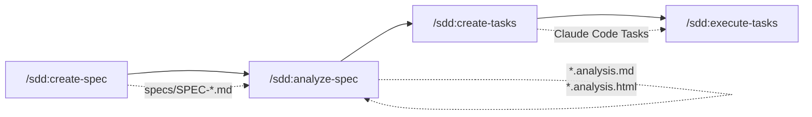
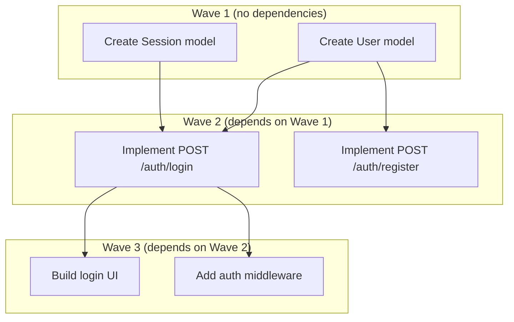
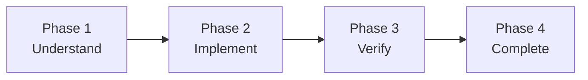
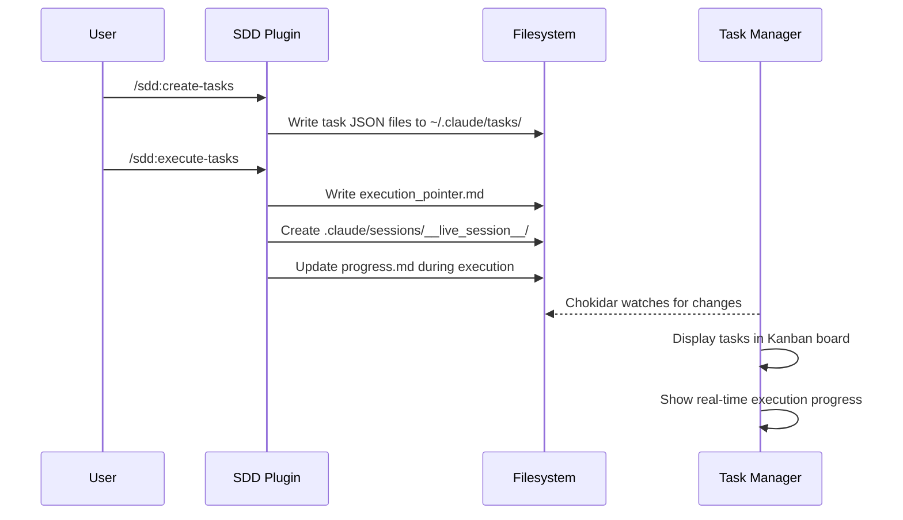

<!-- docs/plugins/sdd-plugin.md -->
# SDD Plugin

The `claude-alchemy-sdd` plugin (v0.2.6) implements a **Spec-Driven Development** workflow for Claude Code. It covers the full lifecycle from specification authoring through quality analysis and task decomposition to autonomous, wave-based parallel execution.

All four skills are user-invocable with the `/sdd:` prefix. The plugin is pure markdown with no build step -- skills, agents, and reference materials are loaded as context at runtime.

| | |
|---|---|
| **Package** | `claude-alchemy-sdd` |
| **Version** | 0.2.6 |
| **Skills** | 4 (all user-invocable) |
| **Agents** | 2 |
| **Hooks** | 1 (`PreToolUse`) |
| **License** | MIT |

## Workflow Overview

The SDD plugin is designed around a four-step pipeline. Each step maps to a skill:



1. **Create Spec** -- Define requirements through an adaptive interview
2. **Analyze Spec** -- Review the spec for quality issues
3. **Create Tasks** -- Decompose the spec into dependency-aware tasks
4. **Execute Tasks** -- Run tasks autonomously with wave-based parallelism

!!! tip "Typical Usage"
    You do not have to run all four skills sequentially. Each skill works independently. You can analyze an existing spec, create tasks from a hand-written document, or execute tasks that were created manually.

## Directory Structure

```
plugins/sdd/
├── .claude-plugin/
│   └── plugin.json              # Plugin manifest (name, version, metadata)
├── agents/
│   ├── task-executor.md         # Per-task execution agent
│   └── spec-analyzer.md         # Spec quality analysis agent
├── hooks/
│   └── auto-approve-session.sh  # PreToolUse hook for session files
├── skills/
│   ├── create-spec/
│   │   ├── SKILL.md
│   │   └── references/
│   │       ├── interview-questions.md
│   │       ├── recommendation-format.md
│   │       ├── recommendation-triggers.md
│   │       └── templates/
│   │           ├── high-level.md
│   │           ├── detailed.md
│   │           └── full-tech.md
│   ├── analyze-spec/
│   │   ├── SKILL.md
│   │   ├── references/
│   │   │   ├── analysis-criteria.md
│   │   │   ├── common-issues.md
│   │   │   ├── html-review-guide.md
│   │   │   └── report-template.md
│   │   └── templates/
│   │       └── review-template.html
│   ├── create-tasks/
│   │   ├── SKILL.md
│   │   └── references/
│   │       ├── decomposition-patterns.md
│   │       ├── dependency-inference.md
│   │       └── testing-requirements.md
│   └── execute-tasks/
│       ├── SKILL.md
│       └── references/
│           ├── execution-workflow.md
│           ├── orchestration.md
│           └── verification-patterns.md
└── README.md
```

---

## Skills

### create-spec

Creates a new specification document through an adaptive, multi-round interview process with proactive recommendations and optional external research.

| | |
|---|---|
| **Invocation** | `/sdd:create-spec` |
| **Model** | inherit |
| **Allowed tools** | `AskUserQuestion`, `Task`, `Read`, `Write`, `Glob`, `Grep` |
| **Output** | `specs/SPEC-{name}.md` |

#### 7-Phase Workflow

| Phase | Name | Description |
|-------|------|-------------|
| 1 | Settings Check | Load user configuration from `.claude/claude-alchemy.local.md` |
| 2 | Initial Inputs | Gather spec name, type (new product / new feature), depth level, and description |
| 3 | Adaptive Interview | Multi-round depth-aware interview with trigger-based recommendations |
| 4 | Recommendations Round | Dedicated round for accumulated best-practice suggestions |
| 5 | Pre-Compilation Summary | Present gathered requirements for user confirmation |
| 6 | Spec Compilation | Generate spec from depth-appropriate template and write to file |
| 7 | Post-Compilation Analysis Offer | Offer to analyze the spec for quality issues |

#### Spec Depth Levels

The interview adapts its scope and output template based on the chosen depth:

=== "High-Level Overview"

    - **Rounds**: 2-3 interview rounds, 6-10 questions total
    - **Focus**: Problem, goals, key features, success metrics
    - **Template**: `references/templates/high-level.md`
    - **Use case**: Executive summaries, stakeholder alignment, initial scoping

=== "Detailed Specifications"

    - **Rounds**: 3-4 interview rounds, 12-18 questions total
    - **Focus**: Balanced coverage of all categories, acceptance criteria, technical constraints
    - **Template**: `references/templates/detailed.md`
    - **Use case**: Standard development specs with clear requirements

=== "Full Technical Documentation"

    - **Rounds**: 4-5 interview rounds, 18-25 questions total
    - **Focus**: Deep technical probing, API endpoints, data models, performance targets
    - **Template**: `references/templates/full-tech.md`
    - **Use case**: Complex features requiring API specs, data models, and architecture diagrams

#### Interview Categories

Questions are drawn from four categories, with depth adjusted per level:

1. **Problem & Goals** -- Problem statement, success metrics, user personas, business value
2. **Functional Requirements** -- Features, user stories, acceptance criteria, workflows
3. **Technical Specs** -- Architecture, tech stack, data models, APIs, constraints
4. **Implementation** -- Phases, dependencies, risks, out-of-scope items

#### Proactive Recommendations

The skill monitors user responses for patterns that indicate opportunities for best-practice suggestions. Trigger domains include authentication, scale and performance, security and compliance, real-time features, file and media handling, API design, search and discovery, testing, and accessibility.

- **Inline insights**: Up to 2 brief suggestions per round when triggers are detected
- **Recommendations round**: Accumulated recommendations presented in Phase 4 for user approval
- Recommendations are always presented for acceptance, modification, or rejection -- never assumed

#### External Research

Research can be invoked on-demand when the user requests it, or proactively (up to 2 times per interview) for high-value topics such as compliance requirements (GDPR, HIPAA, PCI DSS) or when the user expresses uncertainty.

#### Early Exit

If the user signals they want to wrap up early, the skill gracefully truncates the interview, presents a summary of what was gathered, and generates the spec with a `Draft (Partial)` status marker.

#### Example

```
/sdd:create-spec
```

The skill will prompt for the spec name, type, depth, and description, then begin the adaptive interview.

---

### analyze-spec

Launches the `spec-analyzer` agent to perform a comprehensive quality review of an existing specification. Generates both a markdown report and an interactive HTML review page.

| | |
|---|---|
| **Invocation** | `/sdd:analyze-spec specs/SPEC-*.md` |
| **Model** | inherit |
| **Arguments** | `spec-path` (required) -- path to the spec file |
| **Allowed tools** | `AskUserQuestion`, `Task`, `Read`, `Glob` |
| **Output** | `.analysis.md` report and `.analysis.html` interactive review |

#### 5-Phase Analysis

| Phase | Name | Description |
|-------|------|-------------|
| 1 | Structure Scan | Verify all required sections for the depth level exist |
| 2 | Consistency Scan | Build glossary, track priorities, map goals to metrics, find contradictions |
| 3 | Completeness Scan | Check features for expected attributes, find missing dependencies |
| 4 | Clarity Scan | Flag vague quantifiers, ambiguous pronouns, open-ended lists |
| 5 | Interactive Resolution | Walk through findings with the user to apply fixes |

#### Finding Categories

| Category | What It Catches |
|----------|----------------|
| **Inconsistencies** | Feature naming mismatches, priority contradictions, conflicting requirements |
| **Missing Information** | Absent sections, undefined terms, features without acceptance criteria |
| **Ambiguities** | Vague quantifiers ("fast", "scalable"), unclear pronouns, open-ended lists |
| **Structure Issues** | Missing sections, misplaced content, formatting inconsistencies |

#### Severity Levels

| Severity | Meaning | Example |
|----------|---------|---------|
| **Critical** | Would cause implementation to fail | Auth required but no auth requirements defined |
| **Warning** | Could cause confusion or implementation problems | "Search should be fast" without defining "fast" |
| **Suggestion** | Quality improvements, not blocking | Inconsistent user story formatting |

#### Depth-Aware Analysis

The analysis adapts to the spec's depth level. A high-level spec is not flagged for missing API specifications, and a full-tech spec is scrutinized for technical completeness. Depth is auto-detected from content or read from the `**Spec Depth**:` metadata field.

#### Review Modes

After generating the report, the user chooses how to review findings:

=== "Interactive HTML Review (Recommended)"

    Opens a self-contained `.analysis.html` file in the browser. The user can:

    - Filter findings by status, severity, and category
    - Approve or reject each finding
    - Add comments
    - Click **Copy Prompt** to generate a natural-language prompt
    - Paste the prompt back into Claude Code to apply approved changes

=== "CLI Update Mode"

    Walks through each finding interactively in the terminal. For each finding, the user can:

    - **Apply** the proposed fix
    - **Modify** with custom text
    - **Skip** with an optional reason

=== "Reports Only"

    Keeps the `.analysis.md` and `.analysis.html` files as-is with no interactive resolution.

#### Example

```
/sdd:analyze-spec specs/SPEC-User-Authentication.md
```

---

### create-tasks

Decomposes a specification into Claude Code native Tasks with acceptance criteria, dependency relationships, testing requirements, and task UIDs for merge tracking.

| | |
|---|---|
| **Invocation** | `/sdd:create-tasks specs/SPEC-*.md` |
| **Model** | inherit |
| **Arguments** | `spec-path` (required) -- path to the spec file |
| **Allowed tools** | `AskUserQuestion`, `Read`, `Glob`, `Grep`, `TaskCreate`, `TaskUpdate`, `TaskList`, `TaskGet` |
| **Output** | Claude Code native Tasks |

#### 8-Phase Workflow

| Phase | Name | Description |
|-------|------|-------------|
| 1 | Validate & Load | Validate spec file, read content, check settings, load reference files |
| 2 | Detect Depth & Check Existing | Detect spec depth level, check for existing tasks (merge mode) |
| 3 | Analyze Spec | Extract features, requirements, priorities, and structure |
| 4 | Decompose Tasks | Break features into atomic tasks with categorized acceptance criteria |
| 5 | Infer Dependencies | Map blocking relationships between tasks |
| 6 | Preview & Confirm | Show summary, get user approval before creating |
| 7 | Create Tasks | Create tasks via `TaskCreate`/`TaskUpdate` (fresh or merge mode) |
| 8 | Error Handling | Handle spec parsing issues, circular deps, missing info |

#### Task Granularity by Depth

| Depth | Tasks per Feature | Granularity | Example |
|-------|-------------------|-------------|---------|
| High-Level | 1-2 | Feature-level deliverables | "Implement user authentication" |
| Detailed | 3-5 | Functional decomposition | "Implement login endpoint", "Add password validation" |
| Full-Tech | 5-10 | Technical decomposition | "Create User model", "Implement POST /auth/login", "Add auth middleware" |

#### Task Decomposition Pattern

For each feature, the skill applies a standard layer pattern:

```
1. Data Model Tasks      → "Create {Entity} data model"
2. API/Service Tasks     → "Implement {endpoint} endpoint"
3. Business Logic Tasks  → "Implement {feature} business logic"
4. UI/Frontend Tasks     → "Build {feature} UI component"
5. Test Tasks            → "Add tests for {feature}"
```

#### Task Metadata

Every task includes structured metadata for tracking and execution:

| Field | Description | Example |
|-------|-------------|---------|
| `priority` | Mapped from P0-P3 | `critical`, `high`, `medium`, `low` |
| `complexity` | Estimated size | `XS`, `S`, `M`, `L`, `XL` |
| `source_section` | Spec section reference | `"7.3 Data Models"` |
| `spec_path` | Source spec file | `"specs/SPEC-Auth.md"` |
| `feature_name` | Parent feature | `"User Authentication"` |
| `task_uid` | Unique ID for merge tracking | `"specs/SPEC-Auth.md:user-auth:model:001"` |
| `task_group` | Group name from spec title | `"user-authentication"` |

!!! warning "task_group is Required"
    The `task_group` field is set on every task. The `execute-tasks` skill relies on `metadata.task_group` for `--task-group` filtering and session ID generation. Tasks without `task_group` will be invisible to group-filtered execution runs.

#### Acceptance Criteria Categories

Each task's acceptance criteria are organized into four categories:

| Category | What to Include |
|----------|----------------|
| **Functional** | Core behavior, expected outputs, state changes |
| **Edge Cases** | Boundaries, empty/null, max values, concurrent operations |
| **Error Handling** | Invalid input, failures, timeouts, graceful degradation |
| **Performance** | Response times, throughput, resource limits (if applicable) |

#### Dependency Inference

Dependencies are inferred automatically from three sources:

1. **Layer dependencies** -- Data Model → API → UI → Tests
2. **Phase dependencies** -- Phase 2 tasks blocked by Phase 1 completion
3. **Explicit spec dependencies** -- Section 10 "requires X" → `blockedBy` X
4. **Cross-feature dependencies** -- Shared data models, shared services, auth dependencies

#### Merge Mode

When tasks already exist for a spec (matched by `task_uid`), the skill enters merge mode:

| Existing Status | Action |
|-----------------|--------|
| `pending` | Update description if changed |
| `in_progress` | Preserve status, optionally update description |
| `completed` | Never modify |
| No match | Create as new task |
| No spec requirement | Flag as potentially obsolete, ask user |

#### Example

```
/sdd:create-tasks specs/SPEC-User-Authentication.md
```

---

### execute-tasks

Orchestrates autonomous task execution with wave-based concurrent parallelism, dependency-aware ordering, shared execution context, and session management.

| | |
|---|---|
| **Invocation** | `/sdd:execute-tasks` |
| **Model** | inherit |
| **Arguments** | `task-id` (optional), `--task-group <group>`, `--retries <n>` (default 3), `--max-parallel <n>` (default 5) |
| **Allowed tools** | `Task`, `Read`, `Write`, `Glob`, `Grep`, `Bash`, `AskUserQuestion`, `TaskList`, `TaskGet`, `TaskUpdate` |
| **Output** | Completed tasks, session artifacts in `.claude/sessions/` |

#### 10-Step Orchestration Loop

| Step | Name | Description |
|------|------|-------------|
| 1 | Load Task List | Retrieve tasks, apply `--task-group` filter if specified |
| 2 | Validate State | Handle empty list, all completed, blocked tasks, circular deps |
| 3 | Build Execution Plan | Build dependency graph, assign tasks to waves by topological level |
| 4 | Check Settings | Read `.claude/claude-alchemy.local.md` for execution preferences |
| 5 | Initialize Execution Directory | Create session directory, `.lock` file, archive stale sessions |
| 6 | Present Plan & Confirm | Display plan, ask user to confirm before executing |
| 7 | Initialize Execution Context | Read or merge prior execution context |
| 8 | Execute Loop | Wave-based execution with parallel agent launches and retry handling |
| 9 | Session Summary | Display results, archive session from `__live_session__/` |
| 10 | Update CLAUDE.md | Add project-wide learnings discovered during execution |

#### Wave-Based Execution

Tasks are organized into waves based on their dependency graph. Within each wave, up to `max_parallel` tasks execute concurrently:



Within each wave, tasks are sorted by priority (critical > high > medium > low), with ties broken by which task unblocks the most downstream work.

#### Session Management

The skill manages execution sessions through a dedicated directory structure:

```
.claude/sessions/
├── __live_session__/              # Active session (only one at a time)
│   ├── .lock                      # Concurrency guard
│   ├── execution_plan.md          # Saved execution plan
│   ├── execution_context.md       # Shared learnings across tasks
│   ├── task_log.md                # Task results table
│   ├── progress.md                # Real-time progress for Task Manager
│   └── tasks/                     # Archived completed task JSONs
├── user-auth-20260208-143022/     # Archived session
└── interrupted-20260207-091500/   # Auto-recovered interrupted session
```

!!! info "Execution Pointer"
    An `execution_pointer.md` file is written to `~/.claude/tasks/{listId}/` containing the absolute path to `__live_session__/`. The Task Manager reads this pointer to locate and display execution artifacts.

**Concurrency guard**: A `.lock` file in `__live_session__/` prevents concurrent execution sessions. Stale locks older than 4 hours auto-expire.

**Interrupted session recovery**: If a stale `__live_session__/` directory is found from a previous interrupted run, it is automatically archived and any `in_progress` tasks are reset to `pending`.

#### Shared Execution Context

Tasks within a session share learnings through `execution_context.md`:

- **Before each wave**: The orchestrator snapshots the context file so all agents in the wave read the same baseline
- **During execution**: Each concurrent agent writes to an isolated `context-task-{id}.md` file to avoid write contention
- **After each wave**: The orchestrator merges per-task context files into the shared `execution_context.md`
- **Sections tracked**: Project Patterns, Key Decisions, Known Issues, File Map, Task History

This enables later tasks to benefit from discoveries made by earlier tasks, and retry attempts to learn from previous failures.

#### Retry Behavior

Failed tasks are retried up to `--retries` times (default 3). Each retry includes the previous attempt's failure details so the agent can try a different approach. Failed tasks with retries remaining are re-launched immediately within the current wave.

After all retries are exhausted, tasks remain `in_progress` (not falsely marked completed) and execution continues with the next wave.

#### Configurable Parameters

| Parameter | Default | Source Precedence |
|-----------|---------|-------------------|
| `max_parallel` | 5 | CLI `--max-parallel` > `.claude/claude-alchemy.local.md` > default |
| `retries` | 3 | CLI `--retries` > default |

#### Session ID Generation

The `task_execution_id` is generated using three-tier resolution:

1. If `--task-group` provided: `{task_group}-{YYYYMMDD}-{HHMMSS}`
2. Else if all open tasks share the same `task_group`: `{task_group}-{YYYYMMDD}-{HHMMSS}`
3. Else: `exec-session-{YYYYMMDD}-{HHMMSS}`

#### Examples

```bash
# Execute all unblocked tasks
/sdd:execute-tasks

# Execute a specific task
/sdd:execute-tasks 5

# Execute tasks for a specific group
/sdd:execute-tasks --task-group user-authentication

# Execute with limited parallelism
/sdd:execute-tasks --max-parallel 2

# Execute sequentially (no concurrency)
/sdd:execute-tasks --max-parallel 1

# Execute with custom retry limit and parallelism
/sdd:execute-tasks --task-group payments --max-parallel 3 --retries 1
```

---

## Agents

### task-executor

A per-task execution agent that implements code changes autonomously through a 4-phase workflow. Spawned by the `execute-tasks` skill -- one agent instance per task.

| | |
|---|---|
| **Model** | inherit |
| **Spawned by** | `execute-tasks` skill |
| **Skills loaded** | `execute-tasks` (for reference files and verification patterns) |
| **Tools** | `Read`, `Write`, `Edit`, `Glob`, `Grep`, `Bash`, `TaskGet`, `TaskUpdate`, `TaskList` |

#### 4-Phase Execution



**Phase 1 -- Understand**: Load execution context, read task details, classify the task (spec-generated vs. general), parse acceptance criteria, explore the codebase, and plan the implementation.

**Phase 2 -- Implement**: Read all target files before modifying them. Follow the project's implementation order (data → service → interface → tests). Match existing coding patterns. Run mid-implementation checks (linter, existing tests) to catch issues early.

**Phase 3 -- Verify**: Walk each acceptance criteria category (Functional, Edge Cases, Error Handling, Performance) for spec-generated tasks, or infer a checklist from the description for general tasks. Run the test suite. Determine pass/fail status.

**Phase 4 -- Complete**: Update task status via `TaskUpdate`, append learnings to the execution context, and return a structured verification report.

#### Task Classification

| Detection Check | Result |
|----------------|--------|
| Description contains `**Acceptance Criteria:**` with categorized criteria | Spec-generated |
| Metadata contains `spec_path` | Spec-generated |
| Description contains `Source: {path} Section {number}` | Spec-generated |
| None of the above | General task |

#### Status Determination

| Condition | Status |
|-----------|--------|
| All Functional criteria pass + Tests pass | **PASS** → task marked `completed` |
| All Functional pass + Tests pass + Edge/Error/Perf issues | **PARTIAL** → task stays `in_progress` |
| Any Functional criterion fails | **FAIL** → task stays `in_progress` |
| Any test failure | **FAIL** → task stays `in_progress` |

!!! note "Honest Reporting"
    The agent never marks a task as completed if verification fails. PARTIAL and FAIL results leave the task as `in_progress` for the orchestrator to decide whether to retry.

#### Key Behaviors

- **No user interaction**: Works entirely autonomously once launched
- **No sub-agents**: Does not use the `Task` tool; handles everything directly
- **Read before write**: Always reads files before modifying them
- **Minimal changes**: Only modifies what the task requires
- **Context sharing**: Appends learnings to the execution context even on failure

---

### spec-analyzer

A comprehensive spec quality analysis agent that generates reports and guides users through interactive resolution of findings.

| | |
|---|---|
| **Model** | inherit |
| **Spawned by** | `analyze-spec` skill (also launchable from `create-spec` Phase 7) |
| **Skills loaded** | `analyze-spec` |
| **Tools** | `AskUserQuestion`, `Read`, `Write`, `Edit`, `Glob`, `Grep` |

#### Analysis Process

1. **Load Knowledge** -- Read analysis criteria, common issue patterns, report template, and HTML review guide
2. **Systematic Analysis** -- Four-pass scan (Structure, Consistency, Completeness, Clarity)
3. **Categorize Findings** -- Assign category, severity, location, and recommendation to each finding
4. **Generate Report** -- Save `.analysis.md` with summary statistics and findings by severity
5. **Generate HTML Review** -- Produce a self-contained `.analysis.html` with interactive filtering and approval
6. **Present Results** -- Show summary and offer review mode selection (HTML review, CLI update, reports only)

#### HTML Review Generation

The agent produces a self-contained HTML file by injecting two JSON data structures into a template:

- **SPEC_CONTENT** -- Spec path, name, depth level, timestamp, and full markdown content
- **FINDINGS_DATA** -- Array of findings with id, title, category, severity, location, line number, current text, issue description, proposed fix, and status

The resulting HTML file requires no external dependencies and can be opened directly in any browser.

---

## Hook

### auto-approve-session.sh

A `PreToolUse` hook that enables unattended execution by auto-approving file operations targeting session directories. Without this hook, the `execute-tasks` skill would prompt for permission on every session file write, making autonomous execution impractical.

| | |
|---|---|
| **Type** | PreToolUse |
| **Matches** | `Write`, `Edit`, `Bash` tool invocations |
| **Location** | `plugins/sdd/hooks/auto-approve-session.sh` |

#### Approval Rules

| Tool | Pattern | Action |
|------|---------|--------|
| `Write` / `Edit` | `~/.claude/tasks/*/execution_pointer.md` | Auto-approve |
| `Write` / `Edit` | `*/.claude/sessions/*` | Auto-approve |
| `Bash` | Commands with `mkdir` or `mv` targeting `.claude/sessions/` | Auto-approve |
| Any other | Any other path | No opinion (normal permission flow) |

!!! warning "Scope is Intentionally Narrow"
    The hook only approves operations on execution session paths and the execution pointer file. All other file operations -- including writes to application code, configuration, and spec files -- go through the normal Claude Code permission flow. This keeps the autonomy boundary tight.

---

## Reference Materials

Each skill loads reference materials at runtime to guide its behavior. These markdown files are never shown to the user directly but inform how the skill operates.

### create-spec References

| File | Purpose |
|------|---------|
| `interview-questions.md` | Question bank organized by category and depth level |
| `recommendation-triggers.md` | Trigger patterns for proactive recommendations across domains |
| `recommendation-format.md` | Templates for presenting recommendations to the user |
| `templates/high-level.md` | Streamlined executive overview spec template |
| `templates/detailed.md` | Standard spec template with all sections |
| `templates/full-tech.md` | Extended template with API specs, data models, architecture |

### analyze-spec References

| File | Purpose |
|------|---------|
| `analysis-criteria.md` | Depth-specific checklists and detection algorithms |
| `common-issues.md` | Issue pattern library with examples |
| `html-review-guide.md` | HTML review generation instructions and JSON data schemas |
| `report-template.md` | Standard analysis report format |
| `templates/review-template.html` | Self-contained interactive HTML review template |

### create-tasks References

| File | Purpose |
|------|---------|
| `decomposition-patterns.md` | Feature decomposition patterns by type |
| `dependency-inference.md` | Automatic dependency inference rules |
| `testing-requirements.md` | Test type mappings and acceptance criteria patterns |

### execute-tasks References

| File | Purpose |
|------|---------|
| `orchestration.md` | 10-step orchestration loop with retry handling and session summary |
| `execution-workflow.md` | Detailed phase-by-phase procedures for the 4-phase workflow |
| `verification-patterns.md` | Task classification, criterion verification, and pass/fail rules |

---

## Integration with Task Manager

The SDD plugin communicates with the [Task Manager](../task-manager/overview.md) exclusively through the filesystem:



| File Written by SDD | Read by Task Manager | Content |
|---------------------|---------------------|---------|
| `~/.claude/tasks/{listId}/*.json` | `taskService.ts` | Task definitions (id, subject, status, dependencies) |
| `~/.claude/tasks/{listId}/execution_pointer.md` | `taskService.ts` | Absolute path to `__live_session__/` |
| `.claude/sessions/__live_session__/progress.md` | Via execution pointer | Real-time execution status |
| `.claude/sessions/__live_session__/execution_context.md` | Via execution pointer | Shared learnings and context |
| `.claude/sessions/__live_session__/task_log.md` | Via execution pointer | Task results table |

## Configuration

The SDD plugin reads optional settings from `.claude/claude-alchemy.local.md` in the project root. This file is not required -- all settings have sensible defaults.

Supported settings:

| Setting | Used by | Description |
|---------|---------|-------------|
| Output path | `create-spec`, `create-tasks` | Custom directory for spec output |
| Author name | `create-spec`, `analyze-spec` | Attribution in spec metadata |
| `max_parallel` | `execute-tasks` | Default concurrent task limit (overridden by `--max-parallel` CLI arg) |

## Related Pages

- [Architecture Overview](../architecture/overview.md) -- System-wide architecture and design decisions
- [Task Manager Overview](../task-manager/overview.md) -- The web UI that visualizes SDD execution
- [Filesystem Message Bus](../architecture/filesystem-message-bus.md) -- How plugins communicate through the filesystem
