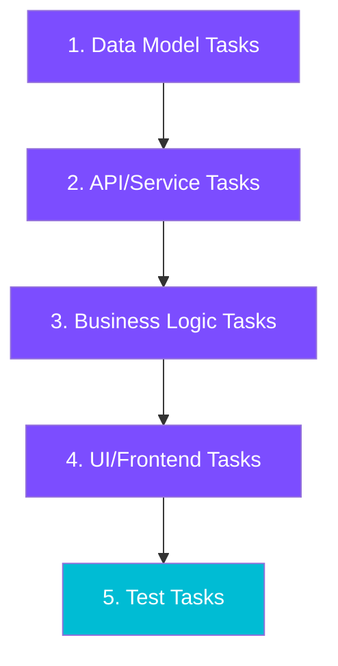
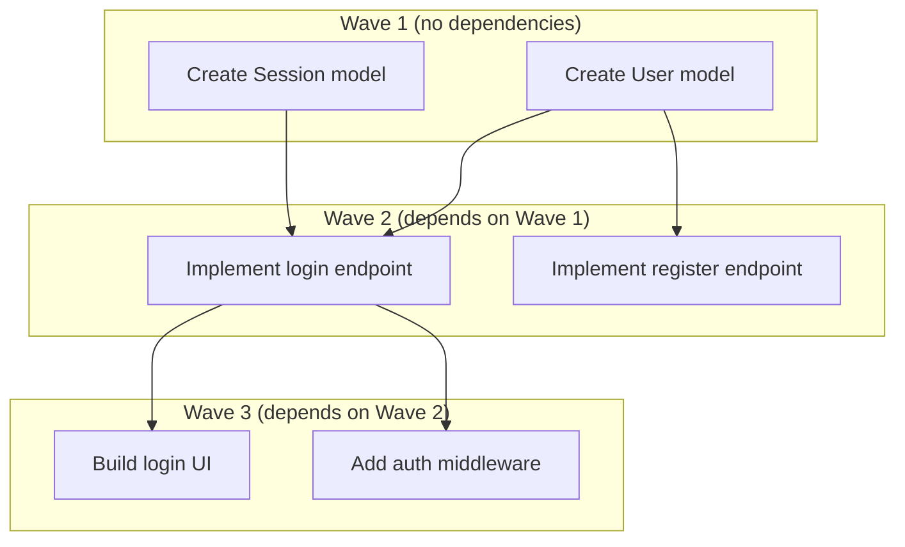

# SDD Tools

Spec-Driven Development (SDD) Tools is the core workflow engine of Agent Alchemy. It provides a structured pipeline that transforms ideas into specifications, decomposes specifications into executable tasks, and runs autonomous implementation with wave-based parallelism.

**Plugin:** `agent-alchemy-sdd-tools` | **Version:** 0.1.3 | **Skills:** 4 | **Agents:** 3

## The SDD Pipeline

The SDD pipeline is a four-stage workflow. Each stage produces an artifact that feeds into the next, creating a traceable chain from requirements to working code.


| Stage | Skill | Input | Output |
|-------|-------|-------|--------|
| 1. Specify | `/create-spec` | User interview | `specs/SPEC-{name}.md` |
| 2. Analyze | `/analyze-spec` | Spec file | `.analysis.md` + `.analysis.html` |
| 3. Decompose | `/create-tasks` | Spec file | Claude Code Tasks with metadata |
| 4. Execute | `/execute-tasks` | Task list | Implemented code, session artifacts |

!!! tip "TDD Variant (via tdd-tools)"
    The `tdd-tools` plugin extends this pipeline with test-first development. After `/create-tasks`, run `/create-tdd-tasks` (tdd-tools) to generate RED-GREEN test pairs, then `/execute-tdd-tasks` (tdd-tools) for TDD-aware execution. See the [TDD Tools documentation](tdd-tools.md) for details.

---

## Skills

### `/create-spec` -- Adaptive Interview

Creates structured specifications through a multi-round adaptive interview. The interview adjusts its depth, question count, and topic coverage based on the requested detail level.

**Invocation:**

```
/agent-alchemy-sdd:create-spec
```

#### Depth Levels

| Level | Rounds | Questions | Focus |
|-------|--------|-----------|-------|
| High-level overview | 2-3 | 6-10 | Problem, goals, key features, success metrics |
| Detailed specifications | 3-4 | 12-18 | Balanced coverage with acceptance criteria |
| Full technical documentation | 4-5 | 18-25 | API endpoints, data models, architecture |

#### Six-Phase Workflow

1. **Settings Check** -- Loads configuration from `.claude/agent-alchemy.local.md`
2. **Initial Inputs** -- Gathers spec name, type (new product or new feature), depth, and description
3. **Adaptive Interview** -- Multi-round depth-aware interview with proactive recommendations
4. **Recommendations Round** -- Dedicated round for accumulated best-practice suggestions
5. **Pre-Compilation Summary** -- Presents gathered requirements for user confirmation
6. **Spec Compilation** -- Generates spec from depth-appropriate template and writes to file

#### Key Features

- **Proactive recommendations** -- Detects patterns in responses (authentication, scale, compliance) and suggests industry best practices
- **Codebase exploration** -- For "new feature" type specs, optionally runs `deep-analysis` from core-tools to understand existing patterns, conventions, and integration points
- **External research** -- Invokes the `researcher` agent for on-demand technical documentation lookup or proactive compliance/regulatory research (max 2 proactive calls per interview)
- **Early exit** -- Gracefully handles requests to wrap up early, generating a `Draft (Partial)` spec with available information
- **Three spec templates** -- Dedicated templates for each depth level: `high-level.md`, `detailed.md`, `full-tech.md`

!!! note "Question Categories"
    The interview covers four categories: **Problem & Goals**, **Functional Requirements**, **Technical Specs**, and **Implementation**. The depth level determines how deeply each category is probed.

#### Output Format

Specs follow a structured format with prioritized requirements:

```markdown title="specs/SPEC-User-Auth.md"
# User Authentication PRD

**Status**: Draft
**Spec Type**: New feature
**Spec Depth**: Detailed specifications
**Description**: OAuth2-based authentication for the dashboard

## 1. Overview
...

### REQ-001: User Login

**Priority**: P0 (Critical)

**Description**: Users can authenticate via email/password or OAuth2 providers.

**Acceptance Criteria**:
- [ ] Login form validates email format
- [ ] OAuth2 flow completes within 3 seconds
- [ ] Failed attempts are rate-limited after 5 tries
```

---

### `/analyze-spec` -- Quality Review

Performs a comprehensive quality analysis of an existing spec, checking for inconsistencies, missing information, ambiguities, and structure issues. Generates both a markdown report and an interactive HTML review.

**Invocation:**

```
/agent-alchemy-sdd:analyze-spec specs/SPEC-User-Authentication.md
```

#### Analysis Categories

| Category | What It Checks |
|----------|---------------|
| **Inconsistencies** | Contradictory requirements, naming mismatches, priority conflicts |
| **Missing Information** | Absent sections, undefined terms, features without acceptance criteria |
| **Ambiguities** | Vague quantifiers ("fast", "scalable"), ambiguous pronouns, open-ended lists |
| **Structure Issues** | Missing sections, misplaced content, formatting inconsistencies |

#### Severity Levels

| Severity | Meaning | Example |
|----------|---------|---------|
| **Critical** | Would cause implementation to fail | Auth required but no auth spec defined |
| **Warning** | Could cause confusion | "Search should be fast" without metrics |
| **Suggestion** | Quality improvement | Inconsistent user story formatting |

#### Depth-Aware Analysis

The analyzer detects the spec's depth level (high-level, detailed, or full-tech) and only flags issues appropriate to that level. A high-level spec is never penalized for missing API specifications.

#### Three Review Modes

After generating the report, the analyzer offers three review modes:

1. **Interactive HTML Review** -- Open `.analysis.html` in a browser, approve/reject findings, then copy a prompt back to apply changes
2. **CLI Update Mode** -- Walk through each finding interactively with Apply, Modify, or Skip options
3. **Reports Only** -- Keep the `.analysis.md` and `.analysis.html` files without interactive resolution

#### Output Files

- `specs/SPEC-{name}.analysis.md` -- Structured markdown report with findings
- `specs/SPEC-{name}.analysis.html` -- Self-contained interactive HTML review page

---

### `/create-tasks` -- Spec-to-Task Decomposition

Transforms a specification into dependency-ordered Claude Code Tasks with rich metadata, categorized acceptance criteria, and testing requirements.

**Invocation:**

```
/agent-alchemy-sdd:create-tasks specs/SPEC-User-Authentication.md
```

#### Eight-Phase Workflow

1. **Validate & Load** -- Reads the spec, loads decomposition references
2. **Detect Depth & Check Existing** -- Detects spec depth, checks for existing tasks (merge mode)
3. **Analyze Spec** -- Extracts features, requirements, priorities from each spec section
4. **Decompose Tasks** -- Breaks features into atomic tasks using the layer pattern
5. **Infer Dependencies** -- Maps blocking relationships between tasks
6. **Preview & Confirm** -- Shows a summary and gets user approval
7. **Create Tasks** -- Creates tasks via `TaskCreate`/`TaskUpdate`
8. **Error Handling** -- Handles parsing issues, circular dependencies, missing information

#### Task Granularity by Depth

| Spec Depth | Tasks per Feature | Granularity |
|-----------|-------------------|-------------|
| High-level | 1-2 | Feature-level deliverables |
| Detailed | 3-5 | Functional decomposition |
| Full-tech | 5-10 | Technical decomposition (models, endpoints, middleware) |

#### Layer Decomposition Pattern

Each feature is decomposed following a standard layer pattern:



#### Task Metadata

Every task carries structured metadata for filtering, execution, and traceability:

| Field | Description | Example |
|-------|-------------|---------|
| `priority` | Mapped from spec P0-P3 | `critical`, `high`, `medium`, `low` |
| `complexity` | Estimated size | `XS`, `S`, `M`, `L`, `XL` |
| `spec_path` | Source specification | `specs/SPEC-Auth.md` |
| `source_section` | Spec section reference | `5.1 User Authentication` |
| `feature_name` | Parent feature | `User Authentication` |
| `task_uid` | Unique ID for merge tracking | `specs/SPEC-Auth.md:user-auth:api-login:001` |
| `task_group` | Group slug from spec title | `user-authentication` |

!!! warning "task_group is Required"
    The `task_group` field must be set on every task. The `/execute-tasks` skill relies on `metadata.task_group` for `--task-group` filtering and session ID generation. Tasks without `task_group` will be invisible to group-filtered execution runs.

#### Acceptance Criteria Categories

Each task includes categorized acceptance criteria:

| Category | What It Covers |
|----------|---------------|
| **Functional** | Core behavior, expected outputs, state changes |
| **Edge Cases** | Boundaries, empty/null values, max values, concurrent operations |
| **Error Handling** | Invalid input, failures, timeouts, graceful degradation |
| **Performance** | Response times, throughput, resource limits (when applicable) |

#### Merge Mode

When re-running `/create-tasks` on an updated spec, the skill uses `task_uid` to intelligently merge:

| Existing Status | Action |
|-----------------|--------|
| `pending` | Updated if spec changed |
| `in_progress` | Preserved, optionally updated |
| `completed` | Never modified |
| New requirement | Created as new task |
| No longer in spec | Flagged as potentially obsolete |

---

### `/execute-tasks` -- Wave-Based Execution

Orchestrates autonomous task execution with dependency-aware wave scheduling, per-task agent isolation, shared execution context, and adaptive verification.

**Invocation:**

```
/agent-alchemy-sdd:execute-tasks --task-group user-authentication
```

**Arguments:**

| Argument | Default | Description |
|----------|---------|-------------|
| `[task-id]` | -- | Execute a single specific task |
| `--task-group <group>` | -- | Filter to tasks matching this group |
| `--retries <n>` | 3 | Retry attempts for failed tasks |
| `--max-parallel <n>` | 5 | Max concurrent agents per wave |

#### 4-Phase Task Workflow

Each task is executed by a `task-executor` agent (Opus model) through four phases:


| Phase | What Happens |
|-------|-------------|
| **Understand** | Load execution context, classify task, parse acceptance criteria, explore affected files, read `CLAUDE.md` for conventions |
| **Implement** | Read target files, make changes following project patterns (data -> service -> interface -> tests), run mid-implementation checks |
| **Verify** | Walk acceptance criteria (spec-generated) or infer checklist (general), run tests, determine PASS/PARTIAL/FAIL |
| **Complete** | Update task status, write learnings to per-task context file, return structured verification report |

#### Verification Status Rules

| Condition | Status |
|-----------|--------|
| All Functional criteria pass + Tests pass | **PASS** |
| All Functional pass + Tests pass + Edge/Error/Perf issues | **PARTIAL** |
| Any Functional criterion fails | **FAIL** |
| Any test failure | **FAIL** |

!!! info "Adaptive Verification"
    The executor detects whether a task is **spec-generated** (has `**Acceptance Criteria:**` sections, `metadata.spec_path`, or `Source:` references) or a **general task**. Spec-generated tasks are verified criterion-by-criterion. General tasks use an inferred checklist based on the description.

#### Wave-Based Execution

Tasks are organized into waves based on dependency levels:



- Tasks within a wave run in parallel (up to `max_parallel` concurrent agents)
- After each wave, newly unblocked tasks form the next wave
- Failed tasks with retries remaining are re-launched immediately within the wave
- Within waves, tasks are sorted by priority (critical > high > medium > low)

#### Session Management

Each execution creates a session directory at `.claude/sessions/__live_session__/` containing:

| File | Purpose |
|------|---------|
| `execution_plan.md` | Saved wave plan with task assignments |
| `execution_context.md` | Shared learnings: patterns, decisions, issues, file map |
| `task_log.md` | Per-task results with status, duration, and token usage |
| `progress.md` | Real-time progress tracking for the Task Manager |
| `tasks/` | Subdirectory for archived completed task files |

!!! tip "Execution Context Sharing"
    Each agent writes learnings to an isolated `context-task-{id}.md` file. After all agents in a wave complete, the orchestrator merges per-task files into the shared `execution_context.md`. This eliminates write contention while letting later tasks benefit from earlier discoveries.

#### Key Behaviors

- **Autonomous execution loop** -- After the user confirms the plan, the loop runs without interruption
- **Configurable parallelism** -- Set `--max-parallel 1` for sequential execution
- **Retry with context** -- Each retry includes the previous attempt's failure details
- **Interrupted session recovery** -- Stale sessions are detected, archived, and `in_progress` tasks reset to `pending`
- **Concurrency guard** -- A `.lock` file prevents multiple execution sessions from running simultaneously
- **CLAUDE.md updates** -- After execution, meaningful project-wide changes are added to `CLAUDE.md`

---

---

## Dependency Inference

The `/create-tasks` skill automatically infers blocking relationships between tasks using several strategies.

### Layer-Based Dependencies

Higher layers depend on lower layers:

```
Layer 0: Infrastructure/Config
    |
Layer 1: Data Models
    |
Layer 2: API/Service
    |
Layer 3: Business Logic
    |
Layer 4: UI/Frontend
    |
Layer 5: Integration/E2E Tests
```

| Task Type | Depends On | Blocks |
|-----------|-----------|--------|
| Data Model | Infrastructure tasks | API tasks, Service tasks |
| API Endpoint | Data Model it uses | UI tasks calling it |
| UI Component | API endpoint it calls | E2E tests |
| Unit Test | Implementation it tests | Nothing |

### Phase Dependencies

When the spec defines implementation phases, all tasks in Phase N are blocked by completion of Phase N-1.

### Cross-Feature Dependencies

Tasks that share data models, services, or authentication requirements are linked through their common dependencies. For example, if both Feature A and Feature B use the User model, both depend on the "Create User model" task.

### Keyword-Based Detection

Dependency signals are detected from task descriptions:

- `"using {Entity}"` -- depends on Entity model task
- `"calls {endpoint}"` -- depends on endpoint task
- `"extends {Component}"` -- depends on component task
- `"requires {Setup}"` -- depends on setup task

### Circular Dependency Handling

If a circular dependency is detected during task creation or TDD pair insertion, the system breaks the cycle at the weakest link (scored by relationship type) and flags the affected task with `needs_review: true` in metadata.

---

## Agents

### researcher

| Property | Value |
|----------|-------|
| **Model** | Opus |
| **Tools** | WebSearch, WebFetch, Context7 (resolve-library-id, query-docs) |
| **Used by** | `/create-spec` |

Researches technical documentation, domain knowledge, competitive landscape, and compliance requirements during the spec interview. Uses Context7 as the primary source for library/framework documentation, falling back to web search for general topics.

### spec-analyzer

| Property | Value |
|----------|-------|
| **Model** | Opus |
| **Tools** | AskUserQuestion, Read, Write, Edit, Glob, Grep |
| **Used by** | `/analyze-spec` |

Performs systematic analysis across four categories (inconsistencies, missing information, ambiguities, structure issues) and guides users through resolving findings interactively. Read-only access to the codebase with write access limited to the spec and report files.

### task-executor

| Property | Value |
|----------|-------|
| **Model** | Opus |
| **Tools** | Read, Write, Edit, Glob, Grep, Bash, TaskGet, TaskUpdate, TaskList |
| **Used by** | `/execute-tasks`, `/execute-tdd-tasks` (for non-TDD tasks) |

Executes a single task autonomously through the 4-phase workflow (Understand, Implement, Verify, Complete). Works without user interaction, writes learnings to per-task context files, and reports honest verification results.

---

## Task Manager Integration

The `/execute-tasks` skill (and `/execute-tdd-tasks` from tdd-tools) produces session artifacts that integrate with the Agent Alchemy Task Manager -- a real-time Kanban dashboard.

### How It Works

1. The execution orchestrator writes `progress.md` to `.claude/sessions/__live_session__/` as tasks execute
2. Task status updates flow through Claude Code's native Task system (`~/.claude/tasks/`)
3. An `execution_pointer.md` file at `~/.claude/tasks/{list_id}/` links the Task Manager to the active session
4. The Task Manager watches `~/.claude/tasks/` via Chokidar and pushes updates to the browser via SSE

### What You See

- **Task cards** move between Pending, In Progress, and Completed columns in real time
- **Wave progress** shows which execution wave is active
- **Session files** (execution plan, context, task log) are accessible from the session directory

!!! tip "Running the Task Manager"
    Start the Task Manager alongside your execution session for real-time visibility:

    ```bash
    pnpm dev:task-manager
    # Open http://localhost:3030
    ```

---

## Configuration

Settings are stored in `.claude/agent-alchemy.local.md` (not committed to version control).

### Available Settings

| Setting | Default | Description |
|---------|---------|-------------|
| `author` | -- | Author name included in spec metadata |
| `spec-output-path` | `specs/` | Directory for generated spec files |
| `execute-tasks.max_parallel` | `5` | Max concurrent agents per wave (overridden by `--max-parallel`) |

### Example Settings File

```markdown title=".claude/agent-alchemy.local.md"
# Agent Alchemy Settings

## General
- author: Jane Smith
- spec-output-path: docs/specs/

## Execution
- execute-tasks.max_parallel: 3
```

---

## Hooks

SDD Tools includes a single PreToolUse hook that auto-approves file operations within execution session directories, enabling autonomous task execution without permission prompts.

| Hook | Event | Matcher | Timeout |
|------|-------|---------|---------|
| `auto-approve-session.sh` | PreToolUse | `Write\|Edit\|Bash` | 5s |

**What it approves:**

- `Write`/`Edit` operations targeting `$HOME/.claude/tasks/*/execution_pointer.md`
- `Write`/`Edit` operations targeting any file inside `.claude/sessions/`
- `Bash` commands targeting `.claude/sessions/`

All other operations pass through to the normal permission flow.

---

## Directory Structure

```
sdd-tools/
├── agents/
│   ├── researcher.md              # Technical/domain research agent
│   ├── spec-analyzer.md           # Spec quality analysis agent
│   └── task-executor.md           # Autonomous implementation agent
├── hooks/
│   ├── hooks.json                 # PreToolUse hook configuration
│   └── auto-approve-session.sh    # Session file auto-approve script
└── skills/
    ├── create-spec/
    │   ├── SKILL.md               # Adaptive interview workflow (664 lines)
    │   └── references/
    │       ├── interview-questions.md
    │       ├── recommendation-triggers.md
    │       ├── recommendation-format.md
    │       └── templates/
    │           ├── high-level.md
    │           ├── detailed.md
    │           └── full-tech.md
    ├── analyze-spec/
    │   ├── SKILL.md               # Quality analysis workflow
    │   ├── references/
    │   │   ├── analysis-criteria.md
    │   │   ├── common-issues.md
    │   │   ├── html-review-guide.md
    │   │   └── report-template.md
    │   └── templates/
    │       └── review-template.html
    ├── create-tasks/
    │   ├── SKILL.md               # Task decomposition (653 lines)
    │   └── references/
    │       ├── decomposition-patterns.md
    │       ├── dependency-inference.md
    │       └── testing-requirements.md
    └── execute-tasks/
        ├── SKILL.md               # Execution orchestrator (262 lines)
        └── references/
            ├── orchestration.md
            ├── execution-workflow.md
            └── verification-patterns.md
```

---

## Quick Reference

### Common Workflows

=== "Standard Pipeline"

    ```bash
    # 1. Create a spec
    /agent-alchemy-sdd:create-spec

    # 2. Analyze for quality issues
    /agent-alchemy-sdd:analyze-spec specs/SPEC-My-Feature.md

    # 3. Generate tasks
    /agent-alchemy-sdd:create-tasks specs/SPEC-My-Feature.md

    # 4. Execute all tasks
    /agent-alchemy-sdd:execute-tasks --task-group my-feature
    ```

=== "TDD Pipeline (via tdd-tools)"

    ```bash
    # 1-3. Same as standard pipeline
    /agent-alchemy-sdd:create-spec
    /agent-alchemy-sdd:analyze-spec specs/SPEC-My-Feature.md
    /agent-alchemy-sdd:create-tasks specs/SPEC-My-Feature.md

    # 4. Add TDD test pairs (tdd-tools plugin)
    /agent-alchemy-tdd:create-tdd-tasks --task-group my-feature

    # 5. Execute with TDD enforcement (tdd-tools plugin)
    /agent-alchemy-tdd:execute-tdd-tasks --task-group my-feature
    ```

=== "Single Task"

    ```bash
    # Execute one specific task
    /agent-alchemy-sdd:execute-tasks 5

    # Execute with extra retries
    /agent-alchemy-sdd:execute-tasks 5 --retries 5
    ```

=== "Re-run After Spec Update"

    ```bash
    # Merge mode: updates pending, preserves completed
    /agent-alchemy-sdd:create-tasks specs/SPEC-My-Feature.md

    # Execute newly created/updated tasks
    /agent-alchemy-sdd:execute-tasks --task-group my-feature
    ```
