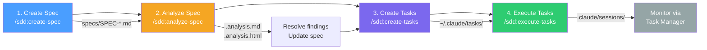
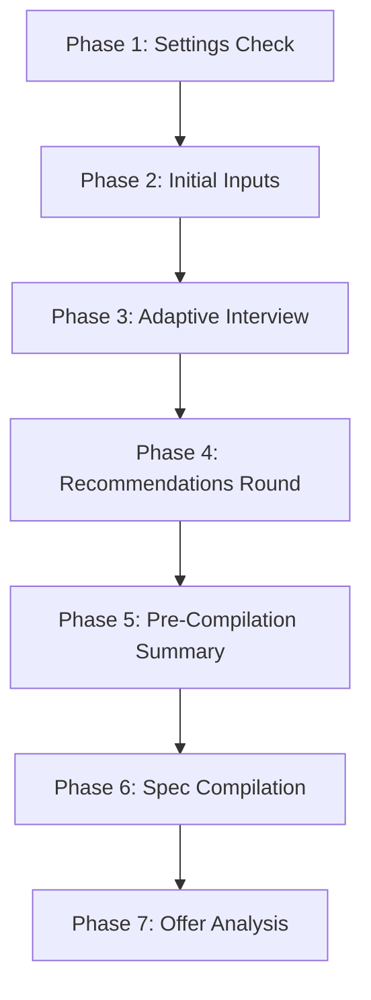
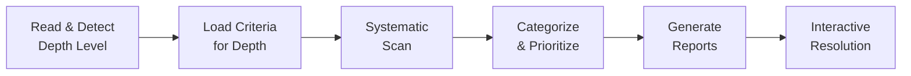
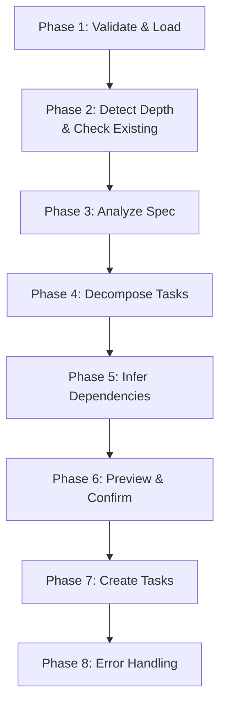
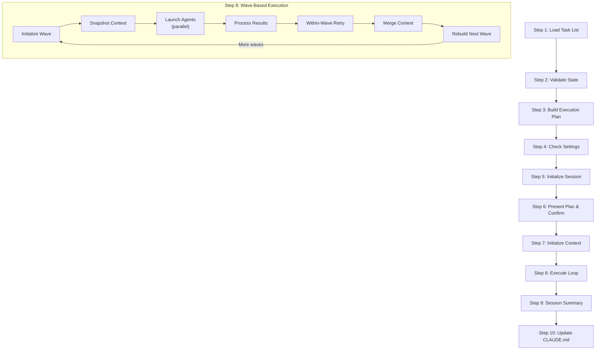
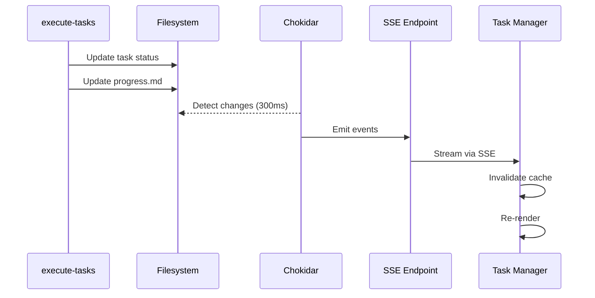

<!-- docs/plugins/sdd-workflow.md -->
# SDD Workflow

The Spec-Driven Development (SDD) plugin (`claude-alchemy-sdd`) implements a four-stage pipeline that takes you from an idea to a fully implemented feature -- with autonomous execution handling the heavy lifting. Each stage produces artifacts that feed into the next, creating a traceable chain from requirements to code.



## Quick Start

The fastest path from idea to implementation:

```bash
# Step 1: Create a spec from your requirements
/sdd:create-spec

# Step 2 (optional but recommended): Analyze spec quality
/sdd:analyze-spec specs/SPEC-User-Auth.md

# Step 3: Decompose spec into executable tasks
/sdd:create-tasks specs/SPEC-User-Auth.md

# Step 4: Execute tasks autonomously
/sdd:execute-tasks
```

!!! tip "You can chain steps"
    After `create-spec` completes, it offers to run `analyze-spec` automatically. After analysis, you can invoke `create-tasks` on the updated spec, then `execute-tasks` to run everything.

---

## Step 1: Create Spec

**Skill:** `/sdd:create-spec`
**Output:** `specs/SPEC-{name}.md`

The `create-spec` skill generates a comprehensive specification document through an adaptive, multi-round interview process. It gathers requirements interactively, offers proactive recommendations based on industry best practices, and optionally performs codebase exploration and external research.

### 7-Phase Workflow



#### Phase 1: Settings Check

Loads user configuration from `.claude/claude-alchemy.local.md` if it exists. This file can specify a custom output path, author name, and other preferences.

#### Phase 2: Initial Inputs

Collects four pieces of starting information using `AskUserQuestion`:

| Input | Options |
|-------|---------|
| **Spec Name** | Free text -- a descriptive name for the spec |
| **Type** | "New product" or "New feature" |
| **Depth** | High-Level Overview, Detailed Specifications, or Full Technical Documentation |
| **Description** | Free text -- problem statement, key features, and constraints |

#### Phase 3: Adaptive Interview

The interview adapts its depth and coverage based on the depth level chosen in Phase 2:

| Depth Level | Rounds | Questions | Focus |
|-------------|--------|-----------|-------|
| **High-Level** | 2-3 | 6-10 | Problem, goals, key features, success metrics |
| **Detailed** | 3-4 | 12-18 | Balanced coverage with acceptance criteria |
| **Full-Tech** | 4-5 | 18-25 | Deep probing with API endpoints, data models |

Each round follows a structured pattern:

1. Summarize what has been learned so far
2. Ask 3-5 focused questions (mix of multiple choice and open text)
3. Detect recommendation triggers in responses
4. Offer 1-2 inline insights if high-priority triggers are found
5. Acknowledge responses before moving to the next round

Questions cover four categories: **Problem & Goals**, **Functional Requirements**, **Technical Specs**, and **Implementation**.

!!! info "Codebase Exploration"
    For "New feature" type specs, the skill offers to explore the existing codebase to understand patterns, conventions, integration points, and data models that should inform the new feature's design. This exploration uses `Glob`, `Grep`, and `Read` tools.

!!! info "External Research"
    Research can be triggered two ways:

    - **On-demand**: When you explicitly ask ("Research the Stripe API docs", "Look up WCAG requirements")
    - **Proactive**: The skill may auto-research up to 2 topics per interview for compliance mentions (GDPR, HIPAA, PCI DSS), user uncertainty ("what do you recommend?"), or complex trade-offs

    Research is performed by the `research-agent` sub-agent using WebSearch and Context7 MCP tools.

#### Phase 4: Recommendations Round

After the main interview, accumulated best-practice recommendations are presented for review. This phase is skipped for high-level specs or when no triggers were detected.

Recommendations are organized by category (Architecture, Security, User Experience, Operational) and presented individually for accept/modify/skip decisions.

#### Phase 5: Pre-Compilation Summary

A comprehensive summary of all gathered requirements is presented for confirmation before spec generation. The summary clearly distinguishes user-provided requirements from agent recommendations. You must explicitly approve the summary before compilation proceeds.

#### Phase 6: Spec Compilation

The skill selects a depth-appropriate template and generates the spec document:

| Depth | Template | Sections Included |
|-------|----------|-------------------|
| High-Level | `templates/high-level.md` | Executive summary, problem statement, solution overview, feature table with priorities |
| Detailed | `templates/detailed.md` | All above + numbered requirements (REQ-001), user stories, acceptance criteria, technical architecture, implementation phases |
| Full-Tech | `templates/full-tech.md` | All above + API endpoint specs, data model schemas, testing strategy, code examples |

The output file is written to `specs/SPEC-{name}.md` (or a custom path from settings).

#### Phase 7: Post-Compilation Analysis Offer

After the spec is saved, you are offered three options:

- **"Yes, analyze it"** -- Launches the spec analyzer agent immediately
- **"Yes, clear context first"** -- Provides instructions to clear the conversation and run analysis with a fresh context window
- **"No, I'm done"** -- Ends the workflow

!!! tip "Early Exit"
    You can wrap up the interview early at any time. The skill will generate a spec from whatever information has been gathered and mark it as `Draft (Partial)`.

---

## Step 2: Analyze Spec

**Skill:** `/sdd:analyze-spec specs/SPEC-{name}.md`
**Output:** `specs/SPEC-{name}.analysis.md` + `specs/SPEC-{name}.analysis.html`
**Status:** Optional but recommended

The `analyze-spec` skill performs a comprehensive quality review of an existing specification, identifying inconsistencies, missing information, ambiguities, and structural issues. It launches the `spec-analyzer` agent to conduct a systematic 5-phase analysis.

### Analysis Pipeline



### Analysis Categories

The analyzer scans for four categories of issues:

| Category | What It Catches |
|----------|----------------|
| **Inconsistencies** | Feature naming conflicts, priority mismatches, contradictory requirements, metric/goal misalignment |
| **Missing Information** | Absent required sections, undefined terms, features without acceptance criteria, unlisted dependencies |
| **Ambiguities** | Vague quantifiers ("fast", "scalable"), undefined priority language, ambiguous pronouns, open-ended lists |
| **Structure Issues** | Missing sections for depth level, misplaced content, inconsistent formatting, orphaned references |

### Severity Levels

Each finding is assigned a severity:

| Severity | Meaning | Example |
|----------|---------|---------|
| **Critical** | Would cause implementation failure | "Auth required" but no auth requirements defined |
| **Warning** | Could cause confusion or problems | "Search should be fast" without defining "fast" |
| **Suggestion** | Would improve quality but not blocking | Inconsistent user story formatting |

!!! warning "Depth-Aware Analysis"
    The analyzer respects the spec's depth level. A high-level spec will not be flagged for missing API specifications, and a detailed spec will not be expected to include data model schemas. Only issues appropriate to the document's depth are reported.

### Report Outputs

**Markdown Report** (`.analysis.md`): A structured report with summary statistics, findings organized by severity, and an overall assessment.

**Interactive HTML Review** (`.analysis.html`): A self-contained HTML file you can open in any browser. It provides:

- Side-by-side spec content and findings panels
- Severity and status filtering
- Approve/reject buttons per finding
- Comment fields for notes
- A "Copy Prompt" button that generates a natural language prompt you can paste back into Claude Code to apply approved changes

### Resolution Modes

After analysis completes, you choose how to address findings:

=== "Interactive HTML Review (Recommended)"

    1. Open the `.analysis.html` file in your browser
    2. Review findings -- click to expand details
    3. Click **Approve** or **Reject** on each finding
    4. Add optional comments
    5. Click **Copy Prompt** to copy a natural language change request
    6. Paste the prompt back into Claude Code to apply approved changes

=== "CLI Update Mode"

    Walk through each finding interactively in the terminal:

    - **Apply** -- Use the proposed fix
    - **Modify** -- Provide your own text
    - **Skip** -- Leave as-is (with optional reason)

    Progress is tracked: `Finding 3/12 (2 resolved, 1 skipped)`

=== "Reports Only"

    Keep both report files as reference without making any changes to the spec. Useful for team review before editing.

---

## Step 3: Create Tasks

**Skill:** `/sdd:create-tasks specs/SPEC-{name}.md`
**Output:** Tasks in `~/.claude/tasks/{listId}/`

The `create-tasks` skill transforms a specification into actionable Claude Code Tasks with acceptance criteria, testing requirements, dependency relationships, and metadata for traceability back to the spec.

### 8-Phase Workflow



### Task Granularity by Depth

The number of tasks generated scales with the spec's depth level:

| Depth | Tasks per Feature | Decomposition Style | Example |
|-------|------------------|--------------------:|---------|
| **High-Level** | 1-2 | Feature-level deliverables | "Implement user authentication" |
| **Detailed** | 3-5 | Functional decomposition | "Implement login endpoint", "Add password validation" |
| **Full-Tech** | 5-10 | Technical decomposition | "Create User model", "Implement POST /auth/login", "Add auth middleware" |

### Task Decomposition Pattern

Each feature is decomposed following a standard layer pattern:

```
1. Data Model Tasks       → "Create {Entity} data model"
2. API/Service Tasks      → "Implement {endpoint} endpoint"
3. Business Logic Tasks   → "Implement {feature} business logic"
4. UI/Frontend Tasks      → "Build {feature} UI component"
5. Test Tasks             → "Add tests for {feature}"
```

### Task Structure

Every generated task includes:

- **Subject**: Imperative mood ("Create User data model")
- **Active form**: Present continuous ("Creating User data model")
- **Description**: What needs to be done, technical details, and categorized acceptance criteria
- **Acceptance criteria**: Grouped into Functional, Edge Cases, Error Handling, and Performance
- **Testing requirements**: Inferred from task type + extracted from spec
- **Source reference**: Spec path and section number for traceability
- **Metadata**: Priority, complexity, feature name, task UID, task group

### Dependency Inference

Dependencies are automatically inferred using three mechanisms:

**Layer dependencies:**

```
Data Model → API → UI → Tests
```

**Phase dependencies** (from spec implementation plan):

```
Phase 1 tasks ← Phase 2 tasks ← Phase 3 tasks
```

**Cross-feature dependencies:**

- Shared data models: both features depend on model creation
- Shared services: both features depend on service implementation
- Auth: all protected features depend on auth setup

!!! info "Explicit Overrides"
    Explicit dependencies from Section 10 of the spec always override inferred dependencies. The skill also detects circular dependencies and breaks them at the weakest link.

### Task UIDs and Merge Mode

Each task receives a unique identifier in the format:

```
{spec_path}:{feature_slug}:{task_type}:{sequence}
```

For example: `specs/SPEC-Auth.md:user-auth:api-login:001`

When you re-run `create-tasks` on a spec that already has tasks, the skill enters **merge mode**:

| Existing Task Status | Merge Behavior |
|---------------------|----------------|
| `pending` | Update description if spec changed |
| `in_progress` | Preserve status, optionally update description |
| `completed` | Never modified |
| Not in spec | Flagged as potentially obsolete -- you decide to keep or remove |

### Preview and Confirmation

Before creating any tasks, you see a summary:

```
━━━━━━━━━━━━━━━━━━━━━━━━━━━━━━━━━━━━
TASK GENERATION PREVIEW
━━━━━━━━━━━━━━━━━━━━━━━━━━━━━━━━━━━━
Spec: User Authentication
Depth: Detailed

SUMMARY:
• Total tasks: 14
• By priority: 3 critical, 5 high, 4 medium, 2 low
• By complexity: 2 XS, 4 S, 5 M, 2 L, 1 XL

FEATURES:
• User Registration → 4 tasks
• Login/Logout → 5 tasks
• Session Management → 3 tasks
• Password Reset → 2 tasks

DEPENDENCIES:
• 18 dependency relationships inferred
• Longest chain: 5 tasks

FIRST TASKS (no blockers):
• Create User data model (critical)
• Create Session data model (critical)
━━━━━━━━━━━━━━━━━━━━━━━━━━━━━━━━━━━━
```

You can request full task details before confirming creation.

---

## Step 4: Execute Tasks

**Skill:** `/sdd:execute-tasks`
**Output:** `.claude/sessions/__live_session__/` (then archived to `.claude/sessions/{session-id}/`)

The `execute-tasks` skill is the most complex component in the SDD pipeline. It orchestrates autonomous, wave-based parallel execution of tasks with dependency resolution, retry logic, shared execution context, and session management.

### 10-Step Orchestration



### Wave-Based Concurrent Execution

Tasks are organized into waves based on their dependency relationships:

- **Wave 1**: All tasks with no dependencies (can run immediately)
- **Wave 2**: Tasks whose dependencies are all in Wave 1
- **Wave 3**: Tasks whose dependencies are all in Wave 1 or Wave 2
- And so on...

Within each wave, tasks run simultaneously (up to `max_parallel` concurrent agents). Tasks are sorted by priority within each wave: critical first, then high, medium, low.

```
Wave 1: [Create User model] [Create Session model]     ← parallel
            ↓                       ↓
Wave 2: [Implement login API] [Implement register API]  ← parallel, after Wave 1
            ↓                       ↓
Wave 3: [Build login UI] [Build register UI]            ← parallel, after Wave 2
            ↓               ↓
Wave 4: [Add E2E tests]                                 ← after Wave 3
```

### Configurable Parallelism

| Source | Setting | Precedence |
|--------|---------|------------|
| CLI argument | `--max-parallel 3` | Highest |
| Settings file | `max_parallel` in `.claude/claude-alchemy.local.md` | Medium |
| Default | 5 | Lowest |

Set `--max-parallel 1` for sequential execution (no concurrency).

### Task Executor Agent (4-Phase Workflow)

Each task is executed by a dedicated `task-executor` agent that follows a strict 4-phase workflow:

=== "Phase 1: Understand"

    - Read the execute-tasks skill and reference files
    - Read shared `execution_context.md` for learnings from prior tasks
    - Load task details and classify as spec-generated or general
    - Parse acceptance criteria or infer requirements from description
    - Explore affected files using Glob/Grep/Read
    - Read `CLAUDE.md` for project conventions

=== "Phase 2: Implement"

    - Read all target files before modifying them
    - Follow dependency order: data layer, service layer, interface layer, tests
    - Match existing coding patterns and conventions
    - Write tests if specified in testing requirements
    - Run mid-implementation checks (linter, existing tests) to catch issues early

=== "Phase 3: Verify"

    **Spec-generated tasks**: Walk each acceptance criteria category:

    - **Functional** (ALL must pass for PASS)
    - **Edge Cases** (flagged but don't block)
    - **Error Handling** (flagged but don't block)
    - **Performance** (flagged but don't block)
    - Run full test suite

    **General tasks**: Verify core change works, no test regressions, no linter violations.

=== "Phase 4: Complete"

    - Determine status: **PASS**, **PARTIAL**, or **FAIL**
    - If PASS: mark task as `completed`
    - If PARTIAL/FAIL: leave as `in_progress` for retry or manual review
    - Append learnings to execution context (files modified, patterns discovered, issues hit)
    - Return structured verification report

### Verification Status Rules

| Condition | Status | Task Updated? |
|-----------|--------|---------------|
| All Functional pass + Tests pass | **PASS** | Marked `completed` |
| All Functional pass + Tests pass + Edge/Error/Perf issues | **PARTIAL** | Left as `in_progress` |
| Any Functional criteria fail | **FAIL** | Left as `in_progress` |
| Any test failure | **FAIL** | Left as `in_progress` |

### Retry Logic

Failed tasks are retried up to 3 times by default (configurable with `--retries`):

- Retries happen immediately within the current wave -- no waiting for other agents
- Each retry receives the previous attempt's failure details and recommendations
- The agent checks for partial changes from previous attempts before retrying
- After retries are exhausted, the task stays as `in_progress` and execution continues

### Shared Execution Context

Tasks share knowledge through `.claude/sessions/__live_session__/execution_context.md`:

| Section | Contents |
|---------|----------|
| **Project Patterns** | Coding patterns, conventions, tech stack details |
| **Key Decisions** | Architecture choices made during execution |
| **Known Issues** | Problems encountered, workarounds applied |
| **File Map** | Important files discovered and their purposes |
| **Task History** | Brief log of task outcomes with relevant context |

During concurrent execution, write contention is avoided through per-task context files (`context-task-{id}.md`). These are merged into the shared context after each wave completes.

### Session Management

**Lock file**: A `.lock` file in `__live_session__/` prevents concurrent execution sessions. Stale locks older than 4 hours auto-expire.

**Interrupted recovery**: If a previous session was interrupted, stale files are archived to `.claude/sessions/interrupted-{timestamp}/` and any `in_progress` tasks are automatically reset to `pending`.

**Session archival**: After execution completes, all session artifacts are moved from `__live_session__/` to `.claude/sessions/{task_execution_id}/` for historical reference.

### Session Files

| File | Purpose |
|------|---------|
| `execution_plan.md` | The wave-based plan showing task ordering |
| `execution_context.md` | Shared knowledge base across tasks |
| `task_log.md` | Table of task results with duration and token usage |
| `progress.md` | Real-time status for the Task Manager to display |
| `session_summary.md` | Final execution results (created at completion) |
| `.lock` | Concurrency guard |
| `tasks/` | Archive of completed task JSON files |

### Usage Examples

```bash
# Execute all unblocked tasks (default: 5 parallel, 3 retries)
/sdd:execute-tasks

# Execute a specific task by ID
/sdd:execute-tasks 5

# Execute only tasks from a specific spec
/sdd:execute-tasks --task-group user-authentication

# Limit parallelism
/sdd:execute-tasks --max-parallel 2

# Sequential execution (no concurrency)
/sdd:execute-tasks --max-parallel 1

# Custom retry limit
/sdd:execute-tasks --retries 1

# Combine options
/sdd:execute-tasks --task-group payments --max-parallel 3 --retries 1
```

---

## Monitoring Execution

The Task Manager web application provides real-time visibility into task execution.

### Setup

```bash
# Start the Task Manager (from the monorepo root)
pnpm dev:task-manager
```

Then open [http://localhost:3030](http://localhost:3030) in your browser.

### What You See

The Task Manager displays:

1. **Kanban Board** -- Three-column view (Pending, In Progress, Completed) showing all tasks with their priority, complexity, and dependency information. Updates in real-time as the `execute-tasks` skill progresses.

2. **Execution Progress Bar** -- Shows the current wave number, active tasks count, and overall completion percentage.

3. **Execution Dialog** -- Click to expand and see:
    - **Execution Plan**: The wave-based plan with task ordering
    - **Progress**: Current wave status and active tasks
    - **Execution Context**: Shared knowledge accumulated across tasks
    - **Task Log**: Table of completed tasks with status, duration, and token usage

### Real-Time Data Flow



The Task Manager watches `~/.claude/tasks/` for task file changes and `.claude/sessions/__live_session__/` for execution artifacts via a Chokidar file watcher, streaming updates to the browser through Server-Sent Events.

!!! tip "Task Manager is read-only"
    The Task Manager never writes to the filesystem. It is a pure consumer of data produced by the SDD plugin. You can safely open and close it at any point during execution without affecting the running session.

---

## End-to-End Example

Here is a complete walkthrough of building a user authentication feature using the SDD pipeline:

### 1. Create the Spec

```bash
/sdd:create-spec
```

- **Name**: User Authentication
- **Type**: New feature
- **Depth**: Detailed specifications
- **Description**: Add email/password authentication with login, registration, password reset, and session management

The interview covers functional requirements, security considerations, and technical constraints across 3-4 rounds. The skill detects security-related triggers and offers recommendations for bcrypt hashing, rate limiting, and CSRF protection.

Output: `specs/SPEC-User-Authentication.md`

### 2. Analyze the Spec

```bash
/sdd:analyze-spec specs/SPEC-User-Authentication.md
```

The analyzer detects the spec is at "Detailed" depth and runs a full quality scan. It finds 8 findings: 1 critical (missing session expiry requirement), 3 warnings (vague performance targets), and 4 suggestions (formatting improvements).

You open the `.analysis.html` file in your browser, approve all findings, click "Copy Prompt", and paste it back to apply changes.

Output: Updated `specs/SPEC-User-Authentication.md`

### 3. Create Tasks

```bash
/sdd:create-tasks specs/SPEC-User-Authentication.md
```

The skill decomposes the spec into 14 tasks across 4 features, infers 18 dependency relationships, and identifies the longest dependency chain (5 tasks). You review the preview and confirm.

Output: 14 tasks in `~/.claude/tasks/{listId}/`

### 4. Execute Tasks

```bash
# In a separate terminal, start the Task Manager
pnpm dev:task-manager

# Back in Claude Code
/sdd:execute-tasks --task-group user-authentication
```

Execution proceeds in 4 waves:

- **Wave 1**: Create User model, Create Session model (2 parallel)
- **Wave 2**: Implement login API, Implement register API, Create auth middleware (3 parallel)
- **Wave 3**: Build login UI, Build register UI, Add route protection (3 parallel)
- **Wave 4**: Integration tests, E2E tests (2 parallel)

The Task Manager at `localhost:3030` shows progress in real-time. After completion, a session summary reports 14/14 tasks passed, and `CLAUDE.md` is updated with any new project-wide patterns discovered during execution.

---

## Related Pages

- [Architecture Overview](../architecture/overview.md) -- System architecture and design decisions
- [Filesystem Message Bus](../architecture/filesystem-message-bus.md) -- How subsystems communicate through files
- [Task Manager Overview](../task-manager/overview.md) -- Task Manager features and setup
- [Real-Time System](../task-manager/real-time-system.md) -- How real-time updates flow from files to UI
