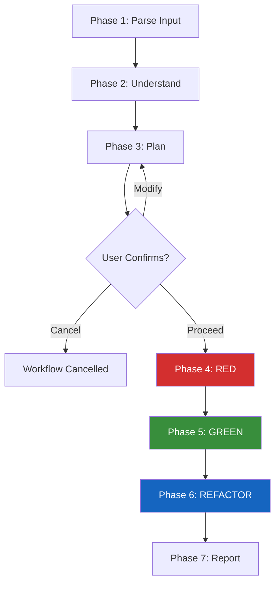
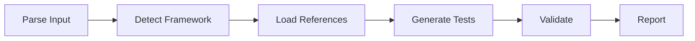
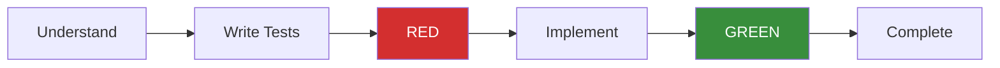
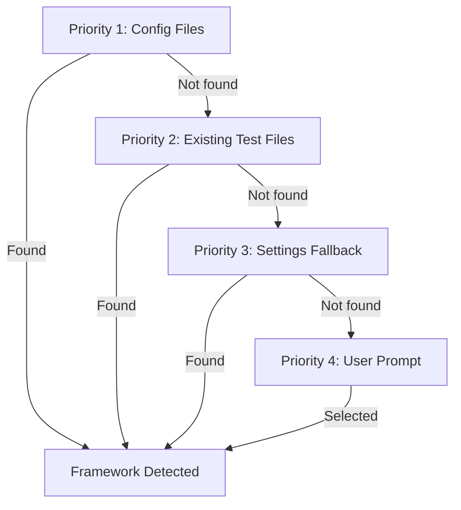
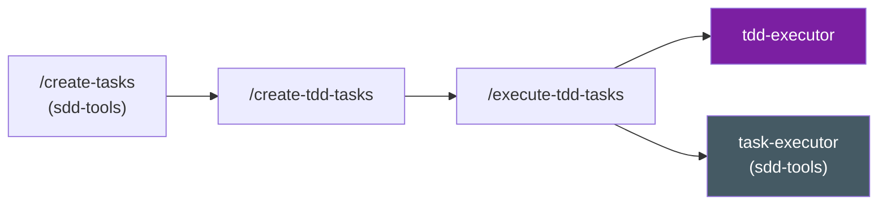

# TDD Tools

The TDD Tools plugin (`v0.1.2`) brings Test-Driven Development workflows to Agent Alchemy. It provides five skills and three agents that automate the RED-GREEN-REFACTOR cycle, generate behavior-driven tests, analyze test coverage, and orchestrate TDD task execution -- all with framework auto-detection and deep integration into the SDD pipeline.

## Philosophy

TDD Tools follows five core principles:

1. **Tests before implementation** -- Tests define what the code should do. Implementation follows from tests, never the reverse.
2. **Minimal implementation** -- Write only the code needed to make failing tests pass. No extra features, no premature optimization.
3. **Behavior over implementation** -- Test what code does (inputs, outputs, side effects), not how it does it internally.
4. **Phase gate enforcement** -- Each phase must complete and verify before the next begins. RED verification is mandatory. GREEN verification is mandatory.
5. **Regression protection** -- Existing tests must continue passing at every phase. Zero tolerance for regressions.

## Plugin Inventory

| Component | Type | Model | Description |
|-----------|------|-------|-------------|
| `tdd-cycle` | Skill | -- | Full 7-phase RED-GREEN-REFACTOR workflow |
| `generate-tests` | Skill | -- | Test generation from criteria or existing code |
| `analyze-coverage` | Skill | -- | Coverage analysis with gap identification |
| `create-tdd-tasks` | Skill | -- | Transform SDD tasks into test-first TDD task pairs |
| `execute-tdd-tasks` | Skill | -- | TDD-aware wave execution with agent routing |
| `tdd-executor` | Agent | Opus | Executes the 6-phase TDD cycle per task |
| `test-writer` | Agent | Sonnet | Generates test files (parallelizable) |
| `test-reviewer` | Agent | Opus | Evaluates test quality against a behavior-driven rubric |

---

## TDD Cycle (`/tdd-cycle`)

The flagship skill. It drives the entire TDD lifecycle through 7 sequential phases, from understanding the feature to delivering a final compliance report.

### Workflow Overview



!!! info "Autonomous After Confirmation"
    The user confirms the plan once in Phase 3. After that, Phases 4 through 7 run autonomously without interruption.

### Phase Details

#### Phase 1: Parse Input

Determines the input type and resolves context. Supports three input modes:

| Input Type | Trigger | Example |
|------------|---------|---------|
| Feature description | Free-text or file path | `/tdd-cycle add user login with email validation` |
| Task ID | Numeric ID with optional prefix | `/tdd-cycle #5` or `/tdd-cycle task-12` |
| Spec section | Spec file path with section ref | `/tdd-cycle specs/SPEC-auth.md Section 5.1` |

#### Phase 2: Understand

Loads project conventions, detects the test framework, and explores the relevant codebase. This phase also snapshots the existing test suite to establish a baseline (total tests, pass count, fail count) used for regression detection in later phases.

Key actions:

- Reads `CLAUDE.md` and TDD settings from `.claude/agent-alchemy.local.md`
- Loads cross-plugin skills (`language-patterns`, `project-conventions`)
- Runs framework auto-detection (see [Supported Frameworks](#supported-frameworks))
- Reads 2-3 existing test files to learn project conventions
- Runs the existing test suite to record a baseline

#### Phase 3: Plan

Builds and presents a TDD plan covering feature scope, test cases (organized by Functional, Edge Cases, Error Handling), file locations, and implementation approach. The user confirms, modifies, or cancels via interactive prompt.

#### Phase 4: RED

!!! danger "RED Phase"
    Write failing tests, then verify they all fail. No implementation code is written during this phase.

Tests are written from the planned requirements using the AAA pattern (Arrange-Act-Assert). After writing, the full test suite runs to confirm every new test fails with an appropriate error (`ImportError`, `AssertionError`, etc.).

The strictness level controls what happens if tests pass unexpectedly:

| Strictness | If new tests pass | Action |
|------------|-------------------|--------|
| `strict` | Any test passes | **Abort** the workflow |
| `normal` | Some tests pass | Log warning, investigate, continue |
| `relaxed` | Any outcome | Log results, continue |

#### Phase 5: GREEN

!!! success "GREEN Phase"
    Implement the minimal code to make all failing tests pass. Fix the implementation, never the tests.

Implementation follows dependency-aware order: data layer, service layer, API/interface layer, configuration. If tests still fail after 5 iterations, the workflow reports FAIL.

Regressions (a previously-passing test now failing) take priority over making new tests pass.

#### Phase 6: REFACTOR

!!! info "REFACTOR Phase"
    Clean up the implementation while keeping all tests green. Each refactoring change is individually verified.

Looks for code duplication, unclear naming, overly complex logic, and missing abstractions. If a refactoring change breaks a test, it is reverted immediately -- no attempt to fix both simultaneously.

#### Phase 7: Report

Collects results from all phases, optionally runs coverage tools, and presents a final TDD compliance report:

```markdown title="Example Report"
## TDD Cycle Complete: User Authentication

**Status**: PASS
**Strictness**: normal

### Phase Results

| Phase | Status | Details |
|-------|--------|---------|
| Understand | Complete | Framework: pytest, Baseline: 42 tests |
| RED | Verified | 8/8 new tests failed as expected |
| GREEN | Verified | 50/50 tests pass, 0 regressions |
| REFACTOR | Complete | Extracted 2 helpers, improved naming |

### TDD Compliance

- RED verified: Yes
- GREEN verified: Yes
- Refactored: Yes
```

### Integration Modes

The TDD cycle supports three operating modes:

=== "Standalone"

    Invoked directly with a feature description:

    ```
    /tdd-cycle add user login with email and password validation
    /tdd-cycle src/auth/login.py
    ```

=== "SDD Pipeline"

    Receives a task ID from `execute-tdd-tasks` or the user:

    ```
    /tdd-cycle #5
    /tdd-cycle task-12
    ```

    Loads task details via `TaskGet`, extracts acceptance criteria, and updates task status on completion.

=== "Retrofit"

    Adds tests to existing untested code:

    ```
    /tdd-cycle --retrofit src/utils/helpers.py
    ```

    Skips RED phase (implementation already exists), generates characterization tests, and uses relaxed strictness automatically.

---

## Test Generation (`/generate-tests`)

Generates high-quality, behavior-driven test files without running the full TDD cycle. Operates in two modes and spawns `test-writer` agents in parallel for multi-file generation.

### Modes

=== "Criteria-Driven"

    Generates tests from acceptance criteria in specs or tasks.

    ```
    /generate-tests specs/SPEC-auth.md
    /generate-tests #5
    /generate-tests specs/SPEC-auth.md Section 5.1
    ```

    **Process:**

    1. Parse acceptance criteria into categories (Functional, Edge Cases, Error Handling, Performance)
    2. Map each criterion to one or more test cases
    3. Spawn `test-writer` agents (one per feature) in parallel
    4. Validate syntax and convention compliance
    5. Report generated files and criteria coverage

=== "Code-Analysis"

    Generates characterization tests from existing source files.

    ```
    /generate-tests src/utils.py
    /generate-tests src/services/
    ```

    **Process:**

    1. Analyze source files for public functions, classes, and methods
    2. Generate tests for the public interface (inputs, outputs, side effects)
    3. Identify untested edge cases (boundary conditions, error paths)
    4. Preserve existing test files (writes supplementary files with `_additional` suffix)

### Six-Phase Workflow



1. **Parse Input** -- Determine mode (criteria-driven or code-analysis) and resolve paths
2. **Detect Framework** -- Auto-detect pytest, Jest, or Vitest from project configuration
3. **Load References** -- Load test patterns, framework templates, and project conventions
4. **Generate Tests** -- Spawn `test-writer` agents to produce test files
5. **Validate** -- Syntax check each generated file, verify convention compliance
6. **Report** -- Present summary with file list, test counts, criteria coverage, and next steps

!!! tip "RED State Awareness"
    If no implementation exists, generated tests are flagged as being in RED state -- they will fail when run. If implementation already exists, a warning is displayed noting that tests may pass immediately.

---

## Coverage Analysis (`/analyze-coverage`)

Runs real coverage tools, parses results into structured reports, and identifies gaps with actionable test suggestions. Optionally maps coverage against spec acceptance criteria.

### Usage

```
/analyze-coverage                              # Current project, default threshold
/analyze-coverage /path/to/project             # Specific project path
/analyze-coverage --spec specs/SPEC-auth.md    # Map against spec criteria
/analyze-coverage --threshold 90               # Override coverage threshold
```

### Six-Phase Workflow

1. **Detect Environment** -- Auto-detect project type, test runner, coverage tool, and source package
2. **Run Coverage** -- Execute the appropriate coverage command (`pytest --cov`, `npx jest --coverage`, etc.)
3. **Parse Results** -- Parse JSON coverage reports into structured per-file data
4. **Analyze Gaps** -- Identify uncovered files, functions, and branches; optionally map against spec criteria
5. **Generate Report** -- Produce a structured markdown report with gap priorities (P0--P3)
6. **Suggest Next Steps** -- Recommend specific `/generate-tests` and `/tdd-cycle` commands

### Gap Priority Levels

| Priority | Description | Example |
|----------|-------------|---------|
| P0 | Completely uncovered files (0%) | New module with no tests |
| P1 | Uncovered functions/methods | Public API with zero execution |
| P2 | Uncovered branches | Partial coverage, untaken paths |
| P3 | Files below threshold | 45% coverage vs 80% target |

### Spec-to-Coverage Mapping

When `--spec` is provided, each acceptance criterion is mapped to source code locations and classified:

- **TESTED** -- All mapped locations have coverage > 0
- **PARTIAL** -- Some mapped locations covered, others not
- **UNTESTED** -- No coverage for mapped locations

!!! warning "Coverage Tool Required"
    If the coverage tool is not installed, the skill provides the exact install command (`pip install pytest-cov` or `npm install -D @vitest/coverage-v8`) and stops. It does not attempt to estimate coverage.

---

## Agents

### tdd-executor (Opus)

The heavyweight agent that runs the complete 6-phase TDD workflow for a single task. It works autonomously without user interaction after being launched.



**Key characteristics:**

- Model: **Opus** (high-reasoning tasks)
- Full tool access: Read, Write, Edit, Glob, Grep, Bash, TaskGet, TaskUpdate, TaskList
- Loads `language-patterns` and `project-conventions` skills for project awareness
- Writes per-task learnings to execution context for downstream tasks
- Reports structured results with per-phase status and TDD compliance metrics
- Supports retry with context from previous failure

### test-writer (Sonnet)

A test generation specialist spawned in parallel for multi-file test creation. Focused on producing a single, complete test file per invocation.

**Key characteristics:**

- Model: **Sonnet** (parallelizable worker tasks)
- Tools: Read, Write, Edit, Glob, Grep, Bash
- Supports both criteria-driven and code-analysis modes
- Follows the AAA pattern (Arrange-Act-Assert)
- Flags RED state compliance -- warns if implementation already exists
- Loads `language-patterns` and `project-conventions` for consistency

### test-reviewer (Opus)

A read-only agent that evaluates test quality across four weighted dimensions. It produces confidence-scored findings with line references.

**Key characteristics:**

- Model: **Opus** (nuanced quality evaluation)
- Tools: Read, Glob, Grep (read-only -- cannot modify files)
- Scores four dimensions with explicit weights:

| Dimension | Weight | Focus |
|-----------|--------|-------|
| Meaningful Assertions | 35% | Behavior verification over implementation details |
| Edge Case Coverage | 25% | Boundary conditions, error paths, unusual scenarios |
| Test Independence | 20% | Isolation, no shared mutable state, order independence |
| Readability | 20% | Clear names, AAA structure, consistent style |

- Overall score: weighted average (0--100)
- Only reports issues with confidence >= 80 to avoid false positives
- Recognizes acceptable implementation-detail testing (security-critical algorithms, external service calls, protocol compliance)

---

## Supported Frameworks

TDD Tools auto-detects the test framework using a four-level detection chain:

### Detection Chain



### Framework Details

=== "pytest (Python)"

    **Detection signals:**

    - `pyproject.toml` with `[tool.pytest.ini_options]`
    - `setup.cfg` with `[tool:pytest]`
    - `pytest.ini` or `conftest.py` present
    - `test_*.py` or `*_test.py` file patterns

    **Test conventions:**

    ```python title="tests/test_user_registration.py"
    import pytest

    class TestUserRegistration:
        def test_register_creates_user_with_valid_email(self, db_session):
            # Arrange
            email = "user@example.com"
            password = "secure-password-123"

            # Act
            user = register_user(email=email, password=password)

            # Assert
            assert user.email == email
            assert user.id is not None

        @pytest.mark.parametrize("invalid_email", [
            "", "not-an-email", "@missing-local", "missing-domain@",
        ])
        def test_register_rejects_invalid_email_formats(self, invalid_email):
            with pytest.raises(InvalidEmailError):
                register_user(email=invalid_email, password="any-password")
    ```

    **Coverage command:** `pytest --cov={package} --cov-report=term-missing --cov-report=json --cov-branch`

=== "Jest (JavaScript/TypeScript)"

    **Detection signals:**

    - `jest.config.*` exists
    - `package.json` with `jest` in dependencies/devDependencies
    - `package.json` with `"jest": {}` config section

    **Test conventions:**

    ```typescript title="src/__tests__/user-registration.test.ts"
    describe("UserRegistration", () => {
      describe("register", () => {
        it("should create a user with a valid email", async () => {
          // Arrange
          const email = "user@example.com";
          const password = "secure-password-123";

          // Act
          const user = await register({ email, password });

          // Assert
          expect(user.email).toBe(email);
          expect(user.id).toBeDefined();
        });

        it.each(["", "not-an-email", "@missing-local", "missing-domain@"])(
          "should reject invalid email format: %s",
          async (invalidEmail) => {
            await expect(
              register({ email: invalidEmail, password: "any-password" })
            ).rejects.toThrow("Invalid email");
          }
        );
      });
    });
    ```

    **Coverage command:** `npx jest --coverage --coverageReporters=json --coverageReporters=text`

=== "Vitest (JavaScript/TypeScript)"

    **Detection signals:**

    - `vitest.config.*` exists (takes priority over Jest)
    - `package.json` with `vitest` in dependencies/devDependencies
    - `*.test.ts` / `*.spec.ts` with `vitest` imports

    **Test conventions:**

    ```typescript title="src/__tests__/user-registration.test.ts"
    import { describe, it, expect, vi } from "vitest";

    describe("UserRegistration", () => {
      describe("register", () => {
        it("should create a user with a valid email", async () => {
          // Arrange
          const email = "user@example.com";
          const password = "secure-password-123";

          // Act
          const user = await register({ email, password });

          // Assert
          expect(user.email).toBe(email);
          expect(user.id).toBeDefined();
        });
      });
    });
    ```

    **Key difference from Jest:** Explicit imports from `vitest`, `vi.fn()` and `vi.mock()` instead of `jest.fn()` and `jest.mock()`.

    **Coverage command:** `npx vitest run --coverage --coverage.reporter=json --coverage.reporter=text`

!!! tip "Framework Override"
    If auto-detection picks the wrong framework, override it in `.claude/agent-alchemy.local.md` with `tdd.framework: pytest | jest | vitest`.

---

## SDD Pipeline Integration

TDD Tools extends the Spec-Driven Development pipeline with two skills that bridge SDD task generation and TDD execution.

### Task Flow



### `/create-tdd-tasks`

Transforms SDD implementation tasks into test-first TDD task pairs. For each implementation task, it creates a paired test task that **blocks** it -- enforcing test-first development at the pipeline level.

- Preserves existing SDD dependency chains
- Detects and skips existing TDD pairs (merge mode)
- Converts acceptance criteria into test descriptions for the paired test task
- Adds minimal metadata: `tdd_mode`, `tdd_phase`, `paired_task_id`

### `/execute-tdd-tasks`

Orchestrates wave-based execution of TDD task pairs. Routes tasks to the appropriate agent:

| Task Type | Agent | Source | Workflow |
|-----------|-------|--------|----------|
| TDD task (`tdd_mode: true`) | `tdd-executor` (Opus) | Same plugin | 6-phase RED-GREEN-REFACTOR |
| Non-TDD task | `task-executor` | sdd-tools (cross-plugin) | Standard implementation |

Reports aggregate TDD compliance across all executed task pairs.

!!! note "Soft Dependency on sdd-tools"
    `execute-tdd-tasks` routes non-TDD tasks to the `task-executor` agent from `sdd-tools`. Since the TDD pipeline requires `/create-tasks` (sdd-tools) to generate tasks in the first place, sdd-tools is always installed when this skill runs. Claude Code resolves agent names globally across installed plugins.

---

## Configuration

All TDD settings are stored in `.claude/agent-alchemy.local.md` (not committed to version control).

### Settings Reference

```yaml
tdd:
  framework: auto                    # auto | pytest | jest | vitest
  coverage-threshold: 80             # Minimum coverage percentage (0-100)
  strictness: normal                 # strict | normal | relaxed
  test-review-threshold: 70          # Minimum test quality score (0-100)
  test-review-on-generate: false     # Run test-reviewer after generate-tests
```

### Setting Details

| Setting | Default | Used By | Description |
|---------|---------|---------|-------------|
| `tdd.framework` | `auto` | All skills | Override framework auto-detection. Set to `pytest`, `jest`, or `vitest` to skip the detection chain. |
| `tdd.coverage-threshold` | `80` | `analyze-coverage`, `tdd-cycle` | Target coverage percentage. Files below this threshold are flagged. |
| `tdd.strictness` | `normal` | `tdd-cycle`, `tdd-executor` | RED phase enforcement level. See Strictness Levels below. |
| `tdd.test-review-threshold` | `70` | `test-reviewer` | Minimum overall score (0--100) for tests to pass review. |
| `tdd.test-review-on-generate` | `false` | `generate-tests` | Automatically run `test-reviewer` after test generation completes. |

### Strictness Levels

The strictness setting controls how the RED phase handles tests that pass before implementation exists.

=== "Strict"

    RED phase failure is mandatory. If **any** new test passes before implementation, the workflow aborts immediately.

    **Best for:** Greenfield development, enforcing rigorous TDD discipline.

=== "Normal (default)"

    RED phase failure is expected. If tests pass, a warning is logged with details. The passing tests are investigated (existing implementation? weak tests?) before continuing.

    **Best for:** Standard development, iterating on existing features.

=== "Relaxed"

    RED phase is informational only. Results are recorded but the workflow proceeds regardless of pass/fail outcome.

    **Best for:** Retrofitting tests onto existing code, characterization testing.

---

## Reference Materials

TDD Tools includes extensive reference materials loaded by skills and agents during execution:

| File | Lines | Loaded By | Content |
|------|-------|-----------|---------|
| `tdd-workflow.md` | ~325 | `tdd-cycle`, `tdd-executor` | Phase definitions, verification rules, strictness levels |
| `test-patterns.md` | ~776 | `tdd-cycle`, `generate-tests`, `tdd-executor` | Framework-specific test patterns, behavior-driven guidance |
| `framework-templates.md` | — | `generate-tests` | Auto-detection chain, boilerplate templates |
| `coverage-patterns.md` | — | `analyze-coverage` | Coverage tool integration, JSON parsing, gap analysis |
