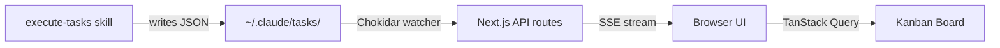
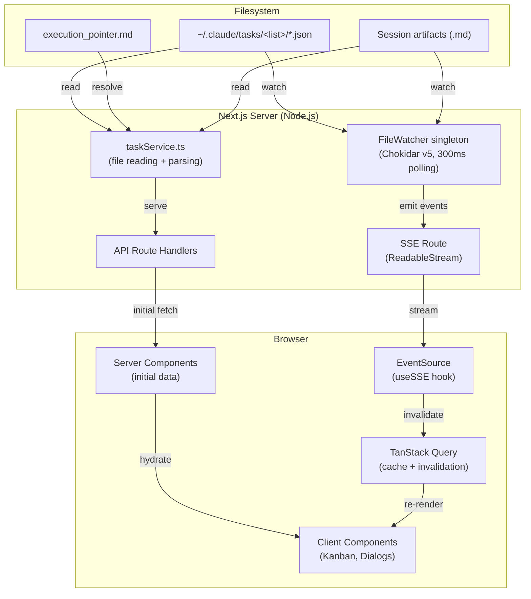

# Task Manager

The Task Manager is a real-time Kanban dashboard that visualizes autonomous task execution driven by the [SDD Tools](plugins/sdd-tools.md) pipeline. It watches `~/.claude/tasks/` for JSON task files produced by `execute-tasks` and `execute-tdd-tasks`, displaying each task's status, dependencies, metadata, and execution artifacts as they update in near real-time.

## Overview

When the SDD tools execute a task plan, they write individual JSON files into `~/.claude/tasks/<list-name>/`. The Task Manager picks up every file creation, update, and deletion through a filesystem watcher and pushes changes over Server-Sent Events (SSE) to the browser. The result is a live view of task progress without polling or manual refresh.



Key capabilities:

- **Three-column Kanban board** — tasks grouped into Pending, In Progress, and Completed
- **Live updates** — filesystem changes appear in the UI within ~300ms
- **Execution context viewer** — tabbed display of session artifacts (plan, log, context, progress, summary)
- **Task detail dialog** — full task metadata with dependency navigation
- **Search filtering** — filter tasks by subject or description text
- **Dark mode** — system-aware theme toggle, defaults to dark

## Getting Started

### Prerequisites

| Requirement | Version |
|-------------|---------|
| Node.js     | >= 18   |
| pnpm        | >= 8    |

The Task Manager reads from `~/.claude/tasks/`. This directory is created automatically when you run the `execute-tasks` or `execute-tdd-tasks` skills from [SDD Tools](plugins/sdd-tools.md). You can also create it manually for testing.

### Installation and Running

```bash
# From the repository root
pnpm install

# Start the development server on port 3030
pnpm dev:task-manager
```

Open [http://localhost:3030](http://localhost:3030) in your browser.

!!! tip "First launch with no tasks"
    If `~/.claude/tasks/` is empty or does not exist, the dashboard shows a message prompting you to create task files. Run `/execute-tasks` against a spec to populate the directory, or create a sample task list manually (see [Task File Format](#task-file-format) below).

### Production Build

```bash
pnpm build:task-manager
cd apps/task-manager && pnpm start
```

## UI Features

### Kanban Board

The main view is a three-column board that groups tasks by status:

| Column | Status | Color |
|--------|--------|-------|
| Pending | `pending` | Slate |
| In Progress | `in_progress` | Blue |
| Completed | `completed` | Green |

Each task card shows:

- **Task ID** — monospace `#id` identifier
- **Subject** — the task title, truncated to two lines
- **Active badge** — appears when the task has an `activeForm` value (currently being worked on)
- **Dependency indicators** — red "Blocked by N" and orange "Blocks N" counts

### Summary Statistics Bar

A horizontal stat bar appears above the board when tasks are loaded, displaying:

- **Total** task count
- **Pending** count
- **In Progress** count
- **Completed** count
- **Blocked** count (tasks with non-empty `blockedBy`)
- **Completion rate** as a percentage

### Search

The search input in the header filters tasks across all three columns by matching against `subject` and `description` fields. The filter is case-insensitive and updates instantly as you type. Click the X button or clear the input to reset.

### Task Detail Dialog

Click any task card to open a detail dialog showing:

- **Status badge** with color-coded styling
- **Description** — full task description, preserving whitespace
- **Active Form** — what the agent is currently doing (if present)
- **Blocked By / Blocks** — clickable task ID links that navigate to the referenced task
- **Metadata** — priority badge, complexity badge, phase indicator, and all custom metadata fields
- **View Execution Context** button — opens the execution details dialog (when execution data is available)

!!! info "Dependency Navigation"
    Clicking a `#id` link in the Blocked By or Blocks sections switches the detail dialog to that task, letting you trace dependency chains without closing the dialog.

### Task List Selector

The dropdown in the header lists all task lists found in `~/.claude/tasks/`. Each entry shows the list name and task count. Selecting a list navigates to `/lists/<listId>`, loading that list's tasks via a Server Component.

### Execution Context Viewer

When an execution session is active (indicated by an `execution_pointer.md` file in the task list directory), the execution dialog becomes available. It renders session artifacts as tabbed content:

| Tab | Artifact File | Description |
|-----|---------------|-------------|
| Plan | `execution_plan.md` | The wave-based execution plan |
| Progress | `progress.md` | Live wave/task status with active and completed indicators |
| Context | `execution_context.md` | Session-level context and configuration |
| Log | `task_log.md` | Chronological execution log |
| Summary | `session_summary.md` | Final session results |

The **Progress** tab has a dedicated view showing:

- Execution status badge (Initializing, Executing, Complete)
- Current wave number out of total waves
- Maximum parallelism setting
- Active tasks with animated pulse indicators
- Completed tasks with PASS/FAIL result badges

All markdown artifacts are rendered with full GitHub-flavored Markdown support, including tables and code blocks.

### Execution Progress Bar

When a session is actively executing, a compact progress indicator appears in the header:

- Animated green pulse dot
- Current wave / total waves
- Active task count
- Completed task count

Clicking this bar opens the full Execution Context Viewer.

### Dark Mode

The theme toggle in the header switches between light, dark, and system themes. The default is dark mode. The implementation uses `next-themes` with SSR-safe hydration.

## Architecture

### Data Flow Pipeline



### Key Technical Patterns

#### Global Singleton FileWatcher

The `FileWatcher` class extends Node.js `EventEmitter` and is stored on `globalThis` to survive Next.js hot module replacement during development. Only one Chokidar instance runs regardless of how many times the module is re-evaluated.

```typescript title="src/lib/fileWatcher.ts"
const globalForWatcher = globalThis as unknown as {
  fileWatcher: FileWatcher | undefined
}

export const fileWatcher = globalForWatcher.fileWatcher ?? new FileWatcher()

if (process.env.NODE_ENV !== 'production') {
  globalForWatcher.fileWatcher = fileWatcher
}
```

#### SSE Streaming

The `/api/events` route creates a `ReadableStream` that subscribes to the `FileWatcher` singleton. Events are filtered by `taskListId` and sent as named SSE events (`task:created`, `task:updated`, `task:deleted`, `execution:updated`). A 30-second heartbeat keeps the connection alive.

#### Query Invalidation Cycle

The `useSSE` hook connects an `EventSource` to the SSE endpoint and invalidates the appropriate TanStack Query cache keys when events arrive. This triggers a refetch of the data, which the Kanban board picks up through its reactive subscription to the query.

```typescript title="src/hooks/useSSE.ts"
eventSource.addEventListener('task:updated', () => {
  queryClient.invalidateQueries({ queryKey: taskKeys.list(taskListId) })
  queryClient.invalidateQueries({ queryKey: taskListKeys.all })
  router.refresh()  // Also refresh Server Component data
})
```

#### Path Traversal Protection

Both the `/api/tasks/[listId]` and `/api/execution-context/[listId]` routes reject `listId` values containing `..` or `/`. The `resolveExecutionDir` function in `taskService.ts` additionally validates that the resolved execution pointer path does not escape the user's home directory.

#### Server/Client Component Boundary

The list page (`/lists/[listId]/page.tsx`) is a Server Component that fetches tasks, task lists, and execution context in parallel via `Promise.all`. This data is passed as `initialData` to TanStack Query in the `TaskBoardClient` client component, enabling instant rendering with no loading flash.

## API Reference

All routes are read-only (GET). There are no mutation endpoints — task state is managed entirely through the filesystem by the SDD tools.

### `GET /api/health`

Health check endpoint.

**Response:**

```json
{
  "status": "ok",
  "timestamp": "2026-02-15T12:00:00.000Z"
}
```

### `GET /api/task-lists`

Returns all task lists found in `~/.claude/tasks/`. Each subdirectory containing at least one `.json` file is treated as a task list.

**Response:**

```json
{
  "taskLists": [
    { "id": "my-feature", "name": "my-feature", "taskCount": 12 }
  ]
}
```

### `GET /api/tasks/:listId`

Returns all tasks for a specific list, sorted numerically by ID.

**Parameters:**

| Parameter | Location | Required | Description |
|-----------|----------|----------|-------------|
| `listId` | Path | Yes | Task list directory name |

!!! warning "Path Traversal Validation"
    The `listId` is validated to reject values containing `..` or `/`. Invalid values return a `400` response.

**Response:**

```json
{
  "tasks": [
    {
      "id": "1",
      "subject": "Implement authentication middleware",
      "description": "Add JWT validation to API routes",
      "status": "in_progress",
      "activeForm": "Writing middleware function",
      "blocks": ["2", "3"],
      "blockedBy": [],
      "metadata": {
        "priority": "high",
        "complexity": "M",
        "task_uid": "auth-middleware-001"
      }
    }
  ]
}
```

### `GET /api/events`

Server-Sent Events stream for real-time task and execution updates.

**Parameters:**

| Parameter | Location | Required | Description |
|-----------|----------|----------|-------------|
| `taskListId` | Query | No | Filter events to a specific list |

**Event Types:**

| Event | Data | Trigger |
|-------|------|---------|
| `connected` | `{}` | Initial connection |
| `task:created` | `FileWatcherEvent` | New `.json` file in watched directory |
| `task:updated` | `FileWatcherEvent` | Existing `.json` file modified |
| `task:deleted` | `FileWatcherEvent` | `.json` file removed |
| `execution:updated` | `ExecutionWatcherEvent` | `.md` or `.txt` file changed in execution directory |

The stream sends a heartbeat comment (`:heartbeat`) every 30 seconds to maintain the connection.

### `GET /api/execution-context/:listId`

Returns execution session artifacts for a task list. Requires an `execution_pointer.md` file in the task list directory that contains the absolute path to the session folder.

**Parameters:**

| Parameter | Location | Required | Description |
|-----------|----------|----------|-------------|
| `listId` | Path | Yes | Task list directory name |

**Response:**

```json
{
  "executionContext": {
    "executionDir": "/Users/you/.claude/sessions/__live_session__",
    "artifacts": [
      {
        "name": "execution_plan",
        "content": "# Execution Plan\n...",
        "lastModified": 1739612400000
      }
    ],
    "progress": {
      "status": "Executing",
      "wave": 2,
      "totalWaves": 4,
      "maxParallel": 3,
      "activeTasks": [
        { "id": "5", "subject": "Add error handling", "phase": "Implementation" }
      ],
      "completedTasks": [
        { "id": "3", "subject": "Create data model", "result": "PASS" }
      ]
    }
  }
}
```

Returns `{ "executionContext": null }` when no execution pointer exists or the session directory is not found.

## Task File Format

Task files are JSON stored in `~/.claude/tasks/<list-name>/<id>.json`. The `taskService.ts` parser is lenient: it normalizes missing fields and coerces types where possible.

```json title="~/.claude/tasks/my-feature/1.json"
{
  "id": "1",
  "subject": "Implement user authentication",
  "description": "Add JWT-based authentication to all API routes",
  "status": "pending",
  "blocks": ["2", "3"],
  "blockedBy": [],
  "activeForm": null,
  "metadata": {
    "priority": "high",
    "complexity": "M",
    "phase": 1,
    "task_uid": "auth-impl-001",
    "source_section": "Authentication Requirements"
  }
}
```

**Field Reference:**

| Field | Type | Required | Description |
|-------|------|----------|-------------|
| `id` | `string` | Yes | Unique identifier (falls back to filename without extension) |
| `subject` | `string` | Yes | Task title |
| `description` | `string` | No | Detailed description |
| `status` | `string` | No | `pending`, `in_progress`, or `completed` (defaults to `pending`) |
| `blocks` | `string[]` | No | IDs of tasks this task blocks |
| `blockedBy` | `string[]` | No | IDs of tasks blocking this task |
| `activeForm` | `string` | No | What the agent is currently doing |
| `metadata.priority` | `string` | No | `critical`, `high`, `medium`, or `low` |
| `metadata.complexity` | `string` | No | `XS`, `S`, `M`, `L`, or `XL` |
| `metadata.phase` | `number` | No | Execution wave/phase number |
| `metadata.task_uid` | `string` | No | Globally unique task identifier from SDD tools |
| `metadata.*` | `unknown` | No | Any additional metadata fields are displayed in the detail dialog |

## Integration with SDD Tools

The Task Manager is the visual counterpart to the SDD execution pipeline. Here is how the pieces connect:

```mermaid
sequenceDiagram
    participant User
    participant create-tasks
    participant execute-tasks
    participant FileSystem as ~/.claude/tasks/
    participant TaskManager as Task Manager UI

    User->>create-tasks: Run against spec
    create-tasks->>FileSystem: Write task JSON files
    FileSystem-->>TaskManager: Chokidar detects new files
    TaskManager->>TaskManager: Board shows pending tasks

    User->>execute-tasks: Start execution
    execute-tasks->>FileSystem: Write execution_pointer.md
    execute-tasks->>FileSystem: Update task status to in_progress
    FileSystem-->>TaskManager: SSE: task:updated
    TaskManager->>TaskManager: Card moves to In Progress

    execute-tasks->>FileSystem: Write progress.md, task_log.md
    FileSystem-->>TaskManager: SSE: execution:updated
    TaskManager->>TaskManager: Progress bar updates

    execute-tasks->>FileSystem: Update task status to completed
    FileSystem-->>TaskManager: SSE: task:updated
    TaskManager->>TaskManager: Card moves to Completed
```

### Execution Pointer

When `execute-tasks` starts a session, it writes `execution_pointer.md` into the task list directory. This file contains a single line: the absolute path to the session's artifact folder. The Task Manager reads this pointer to locate and display execution artifacts.

!!! note "Session Lifecycle"
    The execution pointer persists after a session ends, so you can review artifacts from completed sessions. Starting a new session overwrites the pointer with the new session path.

## Technology Stack

| Technology | Version | Role |
|------------|---------|------|
| [Next.js](https://nextjs.org/) | 16 | App Router framework with Server Components |
| [React](https://react.dev/) | 19 | UI rendering |
| [TanStack Query](https://tanstack.com/query) | 5 | Client-side data caching and invalidation |
| [Tailwind CSS](https://tailwindcss.com/) | 4 | Utility-first styling |
| [shadcn/ui](https://ui.shadcn.com/) | — | Radix-based component library (new-york variant) |
| [Chokidar](https://github.com/paulmillr/chokidar) | 5 | Cross-platform filesystem watching |
| [next-themes](https://github.com/pacocoursey/next-themes) | — | SSR-safe dark/light theme switching |
| [react-markdown](https://github.com/remarkjs/react-markdown) | — | Markdown rendering for execution artifacts |

### Project Structure

```
apps/task-manager/
├── src/
│   ├── app/
│   │   ├── layout.tsx                          # Root layout with Providers
│   │   ├── page.tsx                            # Redirects to first task list
│   │   ├── lists/[listId]/
│   │   │   ├── page.tsx                        # Server Component — parallel data fetch
│   │   │   └── loading.tsx                     # Loading skeleton
│   │   └── api/
│   │       ├── health/route.ts                 # Health check
│   │       ├── task-lists/route.ts             # List task lists
│   │       ├── tasks/[listId]/route.ts         # Tasks for a list
│   │       ├── events/route.ts                 # SSE stream
│   │       └── execution-context/[listId]/route.ts  # Execution artifacts
│   ├── components/
│   │   ├── TaskBoardClient.tsx                 # Main client wrapper
│   │   ├── KanbanBoard.tsx                     # Three-column board
│   │   ├── TaskDetail.tsx                      # Task detail dialog
│   │   ├── ExecutionDialog.tsx                 # Execution context viewer
│   │   ├── ExecutionProgressBar.tsx            # Header progress indicator
│   │   ├── SummaryStats.tsx                    # Statistics bar
│   │   └── ui/                                 # shadcn/ui primitives
│   ├── hooks/
│   │   ├── useSSE.ts                           # SSE connection + query invalidation
│   │   ├── useTasks.ts                         # TanStack Query for tasks
│   │   ├── useTaskLists.ts                     # TanStack Query for task lists
│   │   └── useExecutionContext.ts              # TanStack Query for execution data
│   ├── lib/
│   │   ├── taskService.ts                      # Server-side file reading + parsing
│   │   ├── fileWatcher.ts                      # Chokidar singleton + event emission
│   │   └── api.ts                              # Client-side fetch functions
│   └── types/
│       ├── task.ts                             # Task, TaskList, SSE event types
│       └── execution.ts                        # ExecutionContext types
├── package.json
├── next.config.ts
└── tsconfig.json
```
