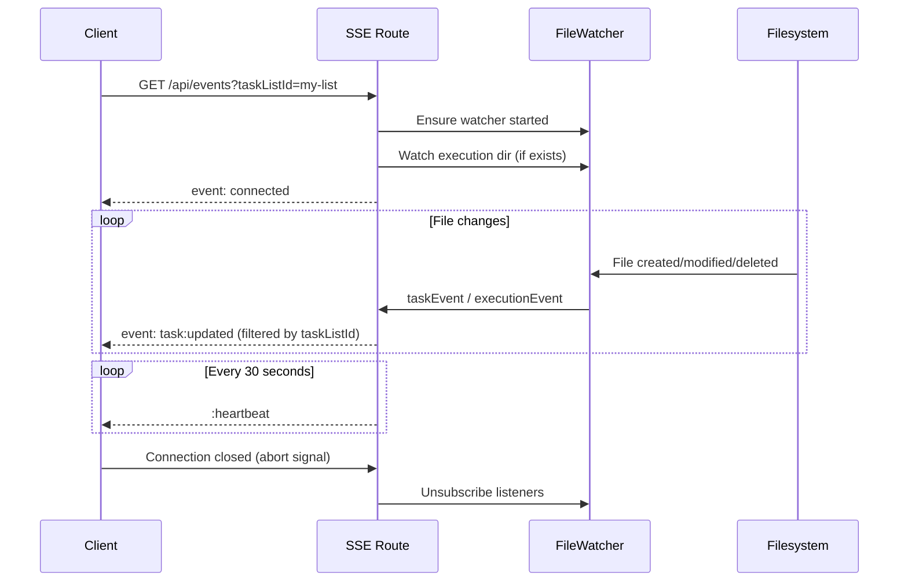
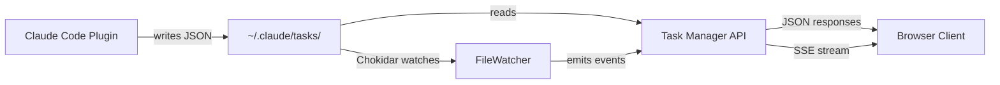

<!-- docs/task-manager/api-reference.md -->
# Task Manager API Reference

The Task Manager exposes a read-only REST API over Next.js App Router route handlers. All endpoints serve JSON (except the SSE stream) and read task data from the filesystem at `~/.claude/tasks/`. There are no mutations — task files are created and modified externally by Claude Code plugins.

**Base URL:** `http://localhost:3000/api` (default development port)

---

## Endpoints Overview

| Method | Endpoint | Description |
|--------|----------|-------------|
| `GET` | [`/api/health`](#get-apihealth) | Health check |
| `GET` | [`/api/task-lists`](#get-apitask-lists) | List all task lists |
| `GET` | [`/api/tasks/:listId`](#get-apitaskslistid) | Get tasks in a list |
| `GET` | [`/api/execution-context/:listId`](#get-apiexecution-contextlistid) | Get execution artifacts |
| `GET` | [`/api/events`](#get-apievents) | SSE stream for real-time updates |

---

## `GET /api/health`

Simple health check endpoint. Returns the server status and current timestamp.

**Source:** `src/app/api/health/route.ts`

### Response

```json title="200 OK"
{
  "status": "ok",
  "timestamp": "2025-01-15T09:32:17.045Z"
}
```

| Field | Type | Description |
|-------|------|-------------|
| `status` | `string` | Always `"ok"` |
| `timestamp` | `string` | ISO-8601 UTC timestamp of the response |

### Example

```bash title="cURL"
curl http://localhost:3000/api/health
```

---

## `GET /api/task-lists`

Returns all task list directories under `~/.claude/tasks/` that contain at least one `.json` file. Results are sorted alphabetically by name.

**Source:** `src/app/api/task-lists/route.ts` &rarr; `taskService.getTaskLists()`

### Response

```json title="200 OK"
{
  "taskLists": [
    {
      "id": "claude-alchemy",
      "name": "claude-alchemy",
      "taskCount": 12
    },
    {
      "id": "my-project",
      "name": "my-project",
      "taskCount": 5
    }
  ]
}
```

| Field | Type | Description |
|-------|------|-------------|
| `taskLists` | [`TaskList[]`](#tasklist) | Array of task list objects |

!!! info "Empty Response"
    If `~/.claude/tasks/` does not exist or contains no directories with `.json` files, the response will be `{ "taskLists": [] }`.

### Error Response

```json title="500 Internal Server Error"
{
  "error": "Failed to fetch task lists"
}
```

### Example

```bash title="cURL"
curl http://localhost:3000/api/task-lists
```

---

## `GET /api/tasks/:listId`

Returns all tasks in a specific task list, parsed from individual JSON files in `~/.claude/tasks/<listId>/`. Tasks are sorted by numeric ID when possible, falling back to alphabetical sort.

**Source:** `src/app/api/tasks/[listId]/route.ts` &rarr; `taskService.getTasks()`

### Path Parameters

| Parameter | Type | Required | Description |
|-----------|------|----------|-------------|
| `listId` | `string` | Yes | The task list directory name |

!!! warning "Input Validation"
    The `listId` parameter is validated against path traversal attacks. Requests containing `..` or `/` in the `listId` will be rejected with a `400` error. This validation occurs before any filesystem access.

### Response

```json title="200 OK"
{
  "tasks": [
    {
      "id": "1",
      "subject": "Set up project scaffolding",
      "description": "Initialize the monorepo with pnpm workspaces",
      "status": "completed",
      "blocks": ["2", "3"],
      "blockedBy": [],
      "metadata": {
        "priority": "high",
        "complexity": "M",
        "phase": 1
      }
    },
    {
      "id": "2",
      "subject": "Implement authentication",
      "description": "Add OAuth2 login flow with JWT tokens",
      "status": "in_progress",
      "blocks": [],
      "blockedBy": ["1"],
      "activeForm": "Setting up OAuth provider configuration",
      "metadata": {
        "priority": "critical",
        "complexity": "L",
        "phase": 2,
        "feature_name": "auth"
      }
    }
  ]
}
```

| Field | Type | Description |
|-------|------|-------------|
| `tasks` | [`Task[]`](#task) | Array of task objects, sorted by ID |

### Error Responses

=== "400 Bad Request"

    Returned when `listId` contains path traversal characters.

    ```json
    {
      "error": "Invalid task list ID"
    }
    ```

=== "500 Internal Server Error"

    Returned on unexpected filesystem or parsing errors.

    ```json
    {
      "error": "Failed to fetch tasks"
    }
    ```

!!! note "Missing Task List"
    If the specified `listId` directory does not exist, the endpoint returns `200 OK` with an empty array: `{ "tasks": [] }`. This is not treated as an error.

### Parsing Behavior

The `parseTask()` function in `taskService.ts` applies defensive normalization when reading task JSON files:

| Field | Behavior |
|-------|----------|
| `id` | Coerced to `string`. Falls back to the filename (without `.json`) if missing or invalid |
| `subject` | Required. Tasks without a string `subject` are silently skipped |
| `status` | Defaults to `"pending"` if the value is not a valid `TaskStatus` |
| `blocks` | Defaults to `[]`. Each element is coerced to `string` |
| `blockedBy` | Defaults to `[]`. Each element is coerced to `string` |
| `description` | Defaults to `""` if missing or non-string |
| `activeForm` | Removed from the task object if present but not a string |

### Example

```bash title="cURL"
curl http://localhost:3000/api/tasks/claude-alchemy
```

---

## `GET /api/execution-context/:listId`

Returns the execution context for a task list, including session artifacts and progress information. The execution context is resolved from an `execution_pointer.md` file located in the task list directory, which contains an absolute path to the active session's execution directory.

**Source:** `src/app/api/execution-context/[listId]/route.ts` &rarr; `taskService.getExecutionContext()`

### Path Parameters

| Parameter | Type | Required | Description |
|-----------|------|----------|-------------|
| `listId` | `string` | Yes | The task list directory name |

!!! warning "Input Validation"
    The `listId` parameter is validated identically to the tasks endpoint. Requests containing `..` or `/` are rejected with `400`.

!!! danger "Path Traversal Guard"
    The `resolveExecutionDir()` function applies a secondary security check: the resolved execution directory path must be under the user's home directory. Pointer files that resolve to paths outside `$HOME` are rejected and return `null`.

### Response — Active Execution

```json title="200 OK"
{
  "executionContext": {
    "executionDir": "/Users/you/.claude/sessions/__live_session__",
    "artifacts": [
      {
        "name": "execution_context",
        "content": "# Execution Context\n\nProject: claude-alchemy\n...",
        "lastModified": 1705312337045
      },
      {
        "name": "task_log",
        "content": "# Task Log\n\n## [1] Set up scaffolding\n- Status: completed\n...",
        "lastModified": 1705312400123
      },
      {
        "name": "execution_plan",
        "content": "# Execution Plan\n\nWave 1: Tasks 1, 4\nWave 2: Tasks 2, 3\n...",
        "lastModified": 1705312337045
      },
      {
        "name": "progress",
        "content": "Status: executing\nWave: 2 of 3\nMax Parallel: 2\nUpdated: 2025-01-15T09:32:17Z\n...",
        "lastModified": 1705312500789
      }
    ],
    "progress": {
      "status": "executing",
      "wave": 2,
      "totalWaves": 3,
      "maxParallel": 2,
      "updated": "2025-01-15T09:32:17Z",
      "activeTasks": [
        {
          "id": "2",
          "subject": "Implement authentication",
          "phase": "implementation"
        }
      ],
      "completedTasks": [
        {
          "id": "1",
          "subject": "Set up project scaffolding",
          "result": "completed successfully"
        }
      ]
    }
  }
}
```

### Response — No Execution

When there is no active execution (no pointer file, invalid pointer, or empty execution directory):

```json title="200 OK"
{
  "executionContext": null
}
```

### Artifact Sort Order

Artifacts are returned in a fixed priority order:

| Priority | Artifact Name | Description |
|----------|--------------|-------------|
| 1 | `execution_context` | Session configuration and parameters |
| 2 | `task_log` | Chronological log of task execution |
| 3 | `execution_plan` | Wave-based execution plan |
| 4 | `session_summary` | Post-execution summary |
| 5+ | *(alphabetical)* | Any other `.md` artifacts |

!!! note "Filtered Artifacts"
    Temporary per-wave context files (those with names starting with `context-task-`) are filtered out and never returned in the response.

### Error Responses

=== "400 Bad Request"

    ```json
    {
      "error": "Invalid task list ID"
    }
    ```

=== "500 Internal Server Error"

    ```json
    {
      "error": "Failed to fetch execution context"
    }
    ```

### Example

```bash title="cURL"
curl http://localhost:3000/api/execution-context/claude-alchemy
```

---

## `GET /api/events`

Server-Sent Events (SSE) endpoint for real-time push updates. The client opens a persistent HTTP connection and receives events whenever task files or execution artifacts change on disk.

**Source:** `src/app/api/events/route.ts`

!!! info "Runtime Requirements"
    This route is configured with `dynamic = 'force-dynamic'` and `runtime = 'nodejs'` to ensure it runs as a streaming Node.js handler, bypassing Next.js static optimization and edge runtime.

### Query Parameters

| Parameter | Type | Required | Description |
|-----------|------|----------|-------------|
| `taskListId` | `string` | No | Filter events to a specific task list. If provided, the server also begins watching the list's execution directory for artifact changes. |

### Response Headers

| Header | Value | Purpose |
|--------|-------|---------|
| `Content-Type` | `text/event-stream` | Identifies the response as an SSE stream |
| `Cache-Control` | `no-cache, no-transform` | Prevents caching by browsers and proxies |
| `Connection` | `keep-alive` | Maintains the persistent connection |
| `X-Accel-Buffering` | `no` | Disables nginx response buffering |

### Connection Lifecycle



### Event Types

#### `connected`

Sent immediately after the connection is established. Contains no meaningful data.

```
event: connected
data: {}
```

#### `task:created`

Emitted when a new `.json` task file is added to the watched directory.

```
event: task:created
data: {"type":"task:created","taskListId":"claude-alchemy","taskId":"5","task":{"id":"5","subject":"New task","description":"","status":"pending","blocks":[],"blockedBy":[]}}
```

#### `task:updated`

Emitted when an existing `.json` task file is modified.

```
event: task:updated
data: {"type":"task:updated","taskListId":"claude-alchemy","taskId":"2","task":{"id":"2","subject":"Implement auth","description":"...","status":"completed","blocks":[],"blockedBy":["1"]}}
```

#### `task:deleted`

Emitted when a `.json` task file is removed. The `task` field is absent for delete events.

```
event: task:deleted
data: {"type":"task:deleted","taskListId":"claude-alchemy","taskId":"5"}
```

#### `execution:updated`

Emitted when any `.md` or `.txt` file changes in the watched execution directory.

```
event: execution:updated
data: {"type":"execution:updated","taskListId":"claude-alchemy"}
```

#### Heartbeat

A comment-only keepalive sent every 30 seconds to prevent connection timeouts. This is not a named event and will not trigger `EventSource` event listeners.

```
:heartbeat
```

### Client Usage

The Task Manager connects to this endpoint via the `useSSE` hook, which manages the `EventSource` lifecycle and triggers TanStack Query cache invalidation on each event.

```typescript title="Connecting from a browser client"
const eventSource = new EventSource(
  `/api/events?taskListId=${encodeURIComponent(listId)}`
);

eventSource.addEventListener('connected', () => {
  console.log('SSE connection established');
});

eventSource.addEventListener('task:updated', (event) => {
  const data = JSON.parse(event.data);
  console.log(`Task ${data.taskId} updated in ${data.taskListId}`);
  // Invalidate relevant queries to refresh the UI
});

eventSource.addEventListener('execution:updated', (event) => {
  const data = JSON.parse(event.data);
  console.log(`Execution context updated for ${data.taskListId}`);
});

eventSource.onerror = () => {
  eventSource.close();
  // Reconnect after delay
  setTimeout(() => { /* re-create EventSource */ }, 3000);
};
```

!!! tip "Automatic Reconnection"
    The built-in `useSSE` hook automatically reconnects after a 3-second delay when the connection drops. If you implement a custom client, you should handle reconnection similarly.

### Example

```bash title="cURL (streaming)"
curl -N http://localhost:3000/api/events?taskListId=claude-alchemy
```

---

## Data Models

### Task

Represents a single task parsed from a JSON file in `~/.claude/tasks/<listId>/<id>.json`.

```typescript title="src/types/task.ts"
interface Task {
  id: string
  subject: string
  description: string
  status: TaskStatus
  blocks: string[]
  blockedBy: string[]
  activeForm?: string
  metadata?: TaskMetadata
}

type TaskStatus = 'pending' | 'in_progress' | 'completed'
```

| Field | Type | Required | Description |
|-------|------|----------|-------------|
| `id` | `string` | Yes | Unique identifier, typically a numeric string. Derived from the filename if not present in the JSON. |
| `subject` | `string` | Yes | Short title of the task. Tasks without a subject are skipped during parsing. |
| `description` | `string` | Yes | Detailed task description. Defaults to `""`. |
| `status` | `TaskStatus` | Yes | One of `"pending"`, `"in_progress"`, or `"completed"`. Defaults to `"pending"`. |
| `blocks` | `string[]` | Yes | IDs of tasks that this task blocks. Defaults to `[]`. |
| `blockedBy` | `string[]` | Yes | IDs of tasks that block this task. Defaults to `[]`. |
| `activeForm` | `string` | No | Free-text description of current work being done on this task. |
| `metadata` | [`TaskMetadata`](#taskmetadata) | No | Extensible metadata bag for priority, complexity, and other attributes. |

### TaskMetadata

```typescript title="src/types/task.ts"
interface TaskMetadata {
  priority?: 'critical' | 'high' | 'medium' | 'low'
  complexity?: 'XS' | 'S' | 'M' | 'L' | 'XL'
  source_section?: string
  prd_path?: string
  feature_name?: string
  task_uid?: string
  phase?: number
  [key: string]: unknown
}
```

| Field | Type | Description |
|-------|------|-------------|
| `priority` | `string` | Task priority: `"critical"`, `"high"`, `"medium"`, or `"low"` |
| `complexity` | `string` | T-shirt size estimate: `"XS"`, `"S"`, `"M"`, `"L"`, or `"XL"` |
| `source_section` | `string` | Reference to the PRD section that generated this task |
| `prd_path` | `string` | Filesystem path to the source PRD document |
| `feature_name` | `string` | Name of the feature this task belongs to |
| `task_uid` | `string` | External unique identifier for cross-referencing |
| `phase` | `number` | Execution phase number |
| `[key: string]` | `unknown` | Arbitrary additional metadata (extensible index signature) |

### TaskList

```typescript title="src/types/task.ts"
interface TaskList {
  id: string
  name: string
  taskCount: number
}
```

| Field | Type | Description |
|-------|------|-------------|
| `id` | `string` | Directory name under `~/.claude/tasks/` |
| `name` | `string` | Display name (currently identical to `id`) |
| `taskCount` | `number` | Number of `.json` files in the directory |

### ExecutionContext

```typescript title="src/types/execution.ts"
interface ExecutionContext {
  executionDir: string
  artifacts: ExecutionArtifact[]
  progress?: ExecutionProgress | null
}
```

| Field | Type | Description |
|-------|------|-------------|
| `executionDir` | `string` | Absolute path to the resolved execution session directory |
| `artifacts` | [`ExecutionArtifact[]`](#executionartifact) | Markdown files from the execution directory, sorted by priority |
| `progress` | [`ExecutionProgress`](#executionprogress) | Parsed progress data from `progress.md`, or `null` if unavailable |

### ExecutionArtifact

```typescript title="src/types/execution.ts"
interface ExecutionArtifact {
  name: string
  content: string
  lastModified: number
}
```

| Field | Type | Description |
|-------|------|-------------|
| `name` | `string` | Artifact name (filename without `.md` extension) |
| `content` | `string` | Full text content of the markdown file |
| `lastModified` | `number` | Last modified time in milliseconds since epoch (`Date.now()` format) |

### ExecutionProgress

Parsed from the `progress.md` artifact using structured markdown conventions.

```typescript title="src/types/execution.ts"
interface ExecutionProgress {
  status: string
  wave: number
  totalWaves: number
  maxParallel?: number
  updated: string
  activeTasks: ActiveTask[]
  completedTasks: CompletedTask[]
}

interface ActiveTask {
  id: string
  subject: string
  phase: string
}

interface CompletedTask {
  id: string
  subject: string
  result: string
}
```

| Field | Type | Description |
|-------|------|-------------|
| `status` | `string` | Current execution status (e.g., `"executing"`, `"completed"`) |
| `wave` | `number` | Current execution wave number |
| `totalWaves` | `number` | Total number of planned waves |
| `maxParallel` | `number` | Maximum parallel tasks per wave (optional) |
| `updated` | `string` | Timestamp of the last progress update |
| `activeTasks` | `ActiveTask[]` | Tasks currently being executed |
| `completedTasks` | `CompletedTask[]` | Tasks completed in the current session |

### SSE Event Types

```typescript title="src/types/task.ts"
// Task file events
interface SSEEvent {
  type: 'task:created' | 'task:updated' | 'task:deleted'
  taskListId: string
  taskId: string
  task?: Task  // Present for created/updated, absent for deleted
}

// Execution artifact events
interface ExecutionSSEEvent {
  type: 'execution:updated'
  taskListId: string
}
```

---

## Architecture Notes

### Filesystem as Data Source

The API is entirely read-only. Task files are created and modified by Claude Code plugins (specifically the `execute-tasks` skill), and the Task Manager simply reads and serves them. There is no database, no write endpoints, and no shared runtime between the plugins and the web app.



### File Watcher

The `FileWatcher` class (`src/lib/fileWatcher.ts`) is a Chokidar-based singleton that watches `~/.claude/tasks/` for changes. It uses a `globalThis` pattern to survive Next.js hot module replacement during development, preventing duplicate watchers.

Key configuration:

- **Polling interval:** 300ms (`usePolling: true`)
- **Watch depth:** 2 directories deep
- **Initial scan:** Ignored (`ignoreInitial: true`)
- **Persistence:** Runs as long as the Next.js server is alive

### Security

All endpoints that accept a `listId` parameter apply two layers of protection:

1. **Route-level validation** — The `listId` is checked for `..` and `/` characters before any filesystem access.
2. **Execution pointer validation** — The `resolveExecutionDir()` function uses `path.relative()` to verify that resolved execution paths remain under the user's home directory.

!!! danger "Security Boundary"
    These validations assume the Task Manager runs as a local development tool. The API has no authentication and binds to `localhost` by default. Do not expose it to untrusted networks.
