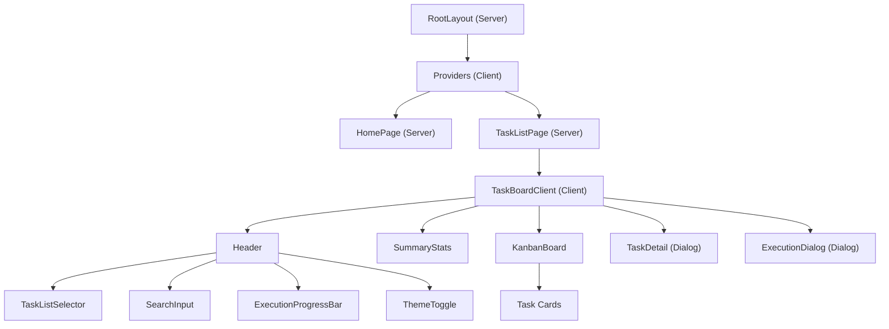
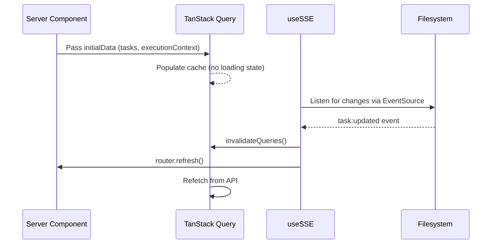

<!-- docs/task-manager/components.md -->
# Components Reference

The Task Manager UI is built from a layered component hierarchy that separates server-side data fetching from client-side interactivity. Server Components handle initial data loading, while Client Components manage state, real-time updates, and user interaction through TanStack Query and Server-Sent Events.

## Component Hierarchy



## Page-Level Components

### RootLayout

Server Component that wraps the entire application with fonts and the `Providers` client boundary.

``` typescript title="src/app/layout.tsx"
export default function RootLayout({
  children,
}: Readonly<{ children: React.ReactNode }>) {
  return (
    <html lang="en" suppressHydrationWarning>
      <body className={`${geistSans.variable} ${geistMono.variable} antialiased`}>
        <Providers>{children}</Providers>
      </body>
    </html>
  )
}
```

| Responsibility | Detail |
|---|---|
| Fonts | Loads Geist Sans and Geist Mono via `next/font/google` |
| Metadata | Sets page title to "Claude Task Manager" |
| Hydration | Uses `suppressHydrationWarning` for `next-themes` compatibility |

### HomePage

Server Component at `/` that redirects to the first available task list.

``` typescript title="src/app/page.tsx"
export default async function HomePage() {
  const taskLists = await getTaskLists()
  if (taskLists.length > 0) {
    redirect(`/lists/${encodeURIComponent(taskLists[0].id)}`)
  }
  // Fallback: empty state message
}
```

If no task lists exist in `~/.claude/tasks/`, it renders an empty state directing the user to create task files.

### TaskListPage

Server Component at `/lists/[listId]` that performs parallel data fetching and passes results to the client orchestrator.

``` typescript title="src/app/lists/[listId]/page.tsx"
const [taskLists, tasks, executionContext] = await Promise.all([
  getTaskLists(),
  getTasks(decodedListId),
  getExecutionContext(decodedListId),
])
```

| Data Fetched | Passed As |
|---|---|
| `TaskList[]` | `taskLists` |
| `Task[]` | `initialTasks` |
| `ExecutionContext \| null` | `initialExecutionContext` |

All three fetches run in parallel via `Promise.all` for optimal loading performance. If the decoded `listId` does not match any known task list, the page calls `notFound()`.

---

## Core Components

### Providers

**File:** `src/components/Providers.tsx` · **Type:** Client Component

Wraps the entire component tree with TanStack Query and theme support.

``` typescript title="src/components/Providers.tsx"
export function Providers({ children }: { children: React.ReactNode }) {
  const [queryClient] = useState(
    () =>
      new QueryClient({
        defaultOptions: {
          queries: {
            staleTime: 1000 * 60, // 1 minute
            refetchOnWindowFocus: false,
          },
        },
      })
  )

  return (
    <QueryClientProvider client={queryClient}>
      <ThemeProvider
        attribute="class"
        defaultTheme="dark"
        enableSystem
        disableTransitionOnChange
      >
        {children}
      </ThemeProvider>
    </QueryClientProvider>
  )
}
```

| Setting | Value | Purpose |
|---|---|---|
| `staleTime` | 60 seconds | Prevents unnecessary refetches; SSE handles real-time invalidation |
| `refetchOnWindowFocus` | `false` | Avoids disruptive refetches when switching tabs |
| `defaultTheme` | `"dark"` | Dark mode is the default appearance |
| `enableSystem` | `true` | Respects OS-level theme preference |
| `disableTransitionOnChange` | `true` | Prevents flash-of-wrong-theme during toggles |

!!! note "QueryClient Initialization"
    The `QueryClient` is created inside `useState` to ensure a single instance per component lifecycle, avoiding re-creation on every render while remaining safe for React Strict Mode.

---

### TaskBoardClient

**File:** `src/components/TaskBoardClient.tsx` · **Type:** Client Component

The root client-side orchestrator. It composes all hooks and child components, manages UI state, and bridges server-fetched data into the reactive client layer.

``` typescript title="src/components/TaskBoardClient.tsx"
interface TaskBoardClientProps {
  listId: string
  initialTasks: Task[]
  taskLists: TaskList[]
  initialExecutionContext?: ExecutionContext | null
}
```

**State managed:**

| State | Type | Purpose |
|---|---|---|
| `selectedTask` | `Task \| null` | Currently open task in the detail dialog |
| `searchQuery` | `string` | Text filter applied to the Kanban board |
| `executionDialogOpen` | `boolean` | Controls visibility of the execution dialog |

**Hooks composed:**

| Hook | Purpose |
|---|---|
| `useTasks(listId, initialTasks)` | Keeps task data reactive with server-provided initial data |
| `useExecutionContext(listId, initialExecutionContext)` | Polls execution context with 5-second interval |
| `useSSE(listId)` | Opens SSE connection for real-time cache invalidation |

**Layout structure:**

The component renders four main areas in sequence:

1. **Header bar** — `TaskListSelector`, `SearchInput`, `ExecutionProgressBar`, `ThemeToggle`
2. **SummaryStats** — Only rendered when tasks exist
3. **Main content** — `KanbanBoard` or an empty state message
4. **Dialogs** — `TaskDetail` and `ExecutionDialog` (portaled, conditionally visible)

!!! tip "Server-to-Client Data Handoff"
    `initialTasks` and `initialExecutionContext` from the Server Component are passed directly as `initialData` to TanStack Query. This means the page renders instantly with server data, then stays in sync via SSE-triggered invalidations — no loading spinners on initial page load.

---

### KanbanBoard

**File:** `src/components/KanbanBoard.tsx` · **Type:** Client Component

A three-column Kanban grid that groups and displays tasks by status.

``` typescript title="src/components/KanbanBoard.tsx"
interface KanbanBoardProps {
  tasks: Task[]
  searchQuery?: string
  onTaskClick?: (task: Task) => void
}
```

**Columns:**

| Column | Status | Background |
|---|---|---|
| Pending | `pending` | Slate tones |
| In Progress | `in_progress` | Blue tones |
| Completed | `completed` | Green tones |

**Search filtering:** When `searchQuery` is provided, tasks are filtered by case-insensitive match against both `subject` and `description` fields before grouping.

**Task cards** display:

- **Task ID** — monospace `#id` badge
- **Active badge** — blue "Active" pill when `task.activeForm` is set
- **Subject** — truncated to 2 lines via `line-clamp-2`
- **Dependency indicators** — red "Blocked by N" and orange "Blocks N" counts

Each column header shows its title and the count of tasks currently in that column. Empty columns display a "No tasks" placeholder.

!!! info "Responsive Layout"
    The board uses a `grid-cols-1 md:grid-cols-3` layout — stacking vertically on mobile and showing all three columns side-by-side on medium+ screens. Each column scrolls independently via `overflow-y-auto`.

---

### TaskDetail

**File:** `src/components/TaskDetail.tsx` · **Type:** Client Component (Dialog)

A modal dialog that displays the full details of a selected task, including metadata badges and navigable dependency links.

``` typescript title="src/components/TaskDetail.tsx"
interface TaskDetailProps {
  task: Task | null
  onClose: () => void
  onNavigateToTask?: (taskId: string) => void
  onOpenExecutionContext?: () => void
}
```

**Sections rendered:**

| Section | Condition | Content |
|---|---|---|
| Header | Always | Task ID, subject, status badge, active badge |
| Description | `task.description` exists | Full description text with preserved whitespace |
| Active Form | `task.activeForm` exists | Current active form label |
| Blocked By | `blockedBy.length > 0` | Clickable `#id` links (red) |
| Blocks | `blocks.length > 0` | Clickable `#id` links (orange) |
| Metadata | `metadata` has keys | Priority badge, complexity badge, phase badge, plus any extra key-value pairs |
| Execution Context | `onOpenExecutionContext` provided | "View Execution Context" button |

**Metadata badges:**

=== "Priority"

    | Level | Colors |
    |---|---|
    | Critical | Red background |
    | High | Orange background |
    | Medium | Yellow background |
    | Low | Green background |

=== "Complexity"

    | Size | Colors |
    |---|---|
    | XS | Emerald background |
    | S | Teal background |
    | M | Cyan background |
    | L | Sky background |
    | XL | Indigo background |

**Dependency navigation:** Clicking a `#id` link in the "Blocked By" or "Blocks" sections calls `onNavigateToTask(taskId)`, which in `TaskBoardClient` looks up the target task and opens it in the same dialog — allowing users to traverse the dependency graph without closing the modal.

---

### SummaryStats

**File:** `src/components/SummaryStats.tsx` · **Type:** Client Component

A horizontal stats bar that shows aggregate task metrics, rendered between the header and the Kanban board.

``` typescript title="src/components/SummaryStats.tsx"
interface SummaryStatsProps {
  tasks: Task[]
}
```

Internally delegates to the `useTaskStats` hook for memoized computation. Renders six `StatCard` sub-components:

| Card | Value | Color |
|---|---|---|
| Total | `stats.total` | Slate |
| Pending | `stats.pending` | Slate |
| In Progress | `stats.inProgress` | Blue |
| Completed | `stats.completed` | Green |
| Blocked | `stats.blocked` | Red |
| Completion | `stats.completionRate` + "%" | Emerald |

The stats bar is only rendered when `currentTasks.length > 0` (controlled by `TaskBoardClient`).

---

### ExecutionDialog

**File:** `src/components/ExecutionDialog.tsx` · **Type:** Client Component (Dialog)

A large tabbed modal for viewing execution session artifacts. Renders markdown content with `react-markdown` and `remark-gfm`, or a structured `ProgressView` for the progress tab.

``` typescript title="src/components/ExecutionDialog.tsx"
interface ExecutionDialogProps {
  executionContext: ExecutionContext | null
  open: boolean
  onOpenChange: (open: boolean) => void
}
```

**Tab order and labels:**

| Artifact Name | Tab Label | Rendering |
|---|---|---|
| `execution_plan` | Plan | Markdown |
| `progress` | Progress | `ProgressView` component |
| `execution_context` | Context | Markdown |
| `task_log` | Log | Markdown |
| `session_summary` | Summary | Markdown |

Tabs are sorted in the order shown above. The default tab is `execution_plan` if available, otherwise the first artifact.

**ProgressView sub-component:**

When the progress tab is active and `executionContext.progress` is available, the dialog renders a structured view instead of raw markdown:

- **Status badge** — "Initializing", "Executing", or "Complete" with semantic colors
- **Wave indicator** — "Wave X of Y" with optional max-parallel count
- **Active tasks list** — Each active task shown with an animated green ping dot, task ID, subject, and current phase
- **Completed tasks list** — Each completed task shown with a PASS/FAIL badge, task ID, subject, and result summary

!!! example "Markdown Rendering"
    All non-progress artifact tabs use `react-markdown` with `remark-gfm` for full GitHub-Flavored Markdown support, including tables, strikethrough, and task lists. Content is styled with Tailwind's `prose` typography classes and includes custom overrides for table borders and code block backgrounds.

---

### ExecutionProgressBar

**File:** `src/components/ExecutionProgressBar.tsx` · **Type:** Client Component

A compact live execution indicator displayed in the header. It has two visual modes depending on execution state.

``` typescript title="src/components/ExecutionProgressBar.tsx"
interface ExecutionProgressBarProps {
  progress: ExecutionProgress | null | undefined
  hasExecContext: boolean
  onClick: () => void
}
```

**Rendering modes:**

=== "Active Execution"

    When `progress.status === 'Executing'`:

    ```
    [●] Wave 2/5 | 3 active | 7 done
    ```

    - Animated green ping dot indicates live activity
    - Shows current wave, active task count, and completed task count
    - Entire bar is clickable to open the `ExecutionDialog`

=== "Inactive (Context Available)"

    When execution data exists but is not actively running:

    - Renders a ghost-variant icon button with the `ScrollText` (Lucide) icon
    - Clicking opens the `ExecutionDialog` to review past execution artifacts

=== "No Context"

    When `hasExecContext` is `false`:

    - Returns `null` — the component is not rendered at all

---

### TaskListSelector

**File:** `src/components/TaskListSelector.tsx` · **Type:** Client Component

A dropdown select for switching between task lists, built on Radix `Select` primitives via shadcn/ui.

``` typescript title="src/components/TaskListSelector.tsx"
interface TaskListSelectorProps {
  taskLists: TaskList[]
  currentListId: string
}
```

Selection triggers URL-based navigation via `router.push(`/lists/${encodeURIComponent(value)}`)`. Each option displays the list name and task count (e.g., "claude-alchemy (24)"). When no task lists are available, it renders a muted "No task lists found" message instead of a select.

---

### SearchInput

**File:** `src/components/SearchInput.tsx` · **Type:** Client Component

A text input with search icon and clearable state.

``` typescript title="src/components/SearchInput.tsx"
interface SearchInputProps {
  value: string
  onChange: (value: string) => void
  placeholder?: string  // defaults to "Search tasks..."
}
```

The search icon (`Lucide Search`) is positioned inside the input on the left. When the input has a value, an `X` button appears on the right to clear the field. The search query filters `KanbanBoard` tasks by matching against `subject` and `description`.

---

### ThemeToggle

**File:** `src/components/ThemeToggle.tsx` · **Type:** Client Component

A button that toggles between dark and light themes, with SSR-safe mounting.

``` typescript title="src/components/ThemeToggle.tsx"
export function ThemeToggle() {
  const [mounted, setMounted] = useState(false)
  const { theme, setTheme } = useTheme()

  useEffect(() => { setMounted(true) }, [])

  // Render placeholder during SSR
  if (!mounted) {
    return <Button variant="ghost" size="icon" disabled>
      <Sun className="h-5 w-5" />
    </Button>
  }
  // ...
}
```

!!! warning "Hydration Safety"
    The component renders a disabled placeholder during SSR and only shows the interactive toggle after mounting. This prevents hydration mismatches because `next-themes` reads the theme from `localStorage`, which is not available on the server.

The Sun and Moon icons are animated with CSS transforms — the Sun rotates and scales out when dark mode is active, while the Moon rotates and scales in.

---

## Hooks

### useTasks

**File:** `src/hooks/useTasks.ts`

Fetches and caches tasks for a given list using TanStack Query.

``` typescript title="src/hooks/useTasks.ts"
export const taskKeys = {
  all: ['tasks'] as const,
  list: (listId: string) => [...taskKeys.all, listId] as const,
}

export function useTasks(taskListId: string | null, initialData?: Task[])
```

| Option | Value | Notes |
|---|---|---|
| `queryKey` | `['tasks', listId]` | Scoped per task list |
| `queryFn` | `fetchTasks(taskListId)` | Calls `GET /api/tasks/:listId` |
| `enabled` | `!!taskListId` | Disabled when no list selected |
| `initialData` | Server-provided tasks | Enables instant render |

The exported `taskKeys` factory is used by `useSSE` to invalidate specific query keys on filesystem events.

---

### useTaskLists

**File:** `src/hooks/useTaskLists.ts`

Fetches the list of available task lists.

``` typescript title="src/hooks/useTaskLists.ts"
export const taskListKeys = {
  all: ['task-lists'] as const,
}

export function useTaskLists()
```

| Option | Value |
|---|---|
| `queryKey` | `['task-lists']` |
| `queryFn` | `fetchTaskLists()` |

Uses default `staleTime` (1 minute) from the `QueryClient` configuration. Invalidated by `useSSE` on `task:created`, `task:updated`, and `task:deleted` events to keep task counts accurate.

---

### useExecutionContext

**File:** `src/hooks/useExecutionContext.ts`

Fetches execution context data with aggressive polling for live updates.

``` typescript title="src/hooks/useExecutionContext.ts"
export const executionContextKeys = {
  all: ['execution-context'] as const,
  list: (listId: string) => [...executionContextKeys.all, listId] as const,
}

export function useExecutionContext(
  taskListId: string | null,
  initialData?: ExecutionContext | null
)
```

| Option | Value | Purpose |
|---|---|---|
| `staleTime` | 2 seconds | Execution data changes rapidly during active runs |
| `refetchInterval` | 5 seconds | Polls for updates even without SSE events |
| `initialData` | Server-provided context | Avoids loading state on first render |

!!! info "Dual Update Strategy"
    Execution context updates through two channels: the 5-second polling interval catches progress changes written to `progress.md`, while SSE `execution:updated` events from `useSSE` trigger immediate invalidation for structural changes to session files.

---

### useSSE

**File:** `src/hooks/useSSE.ts`

Establishes a Server-Sent Events connection and performs dual invalidation (TanStack Query cache + Next.js Server Components) on filesystem change events.

``` typescript title="src/hooks/useSSE.ts"
export function useSSE(taskListId: string | null)
```

**Event handling:**

| SSE Event | Action |
|---|---|
| `task:created` | Invalidate `taskKeys.list(id)` + `taskListKeys.all` + `router.refresh()` |
| `task:updated` | Invalidate `taskKeys.list(id)` + `taskListKeys.all` + `router.refresh()` |
| `task:deleted` | Invalidate `taskKeys.list(id)` + `taskListKeys.all` + `router.refresh()` |
| `execution:updated` | Invalidate `executionContextKeys.list(id)` + `router.refresh()` |
| `connected` | Logs connection confirmation |

**Reconnection:** On error, the EventSource is closed and a reconnection attempt is scheduled after 3 seconds by incrementing a `reconnectKey` state variable, which triggers the `useEffect` to re-run and create a new connection.

!!! tip "Dual Invalidation Pattern"
    `router.refresh()` re-runs Server Components to update server-fetched data, while `queryClient.invalidateQueries()` triggers TanStack Query to refetch on the client side. Together, they ensure both the server-rendered initial data and the client-side cache stay consistent with the filesystem.

---

### useTaskStats

**File:** `src/hooks/useTaskStats.ts`

A memoized computation hook that derives aggregate statistics from a task array.

``` typescript title="src/hooks/useTaskStats.ts"
export interface TaskStats {
  total: number
  pending: number
  inProgress: number
  completed: number
  blocked: number
  completionRate: number
}

export function useTaskStats(tasks: Task[]): TaskStats
```

| Stat | Computation |
|---|---|
| `total` | `tasks.length` |
| `pending` | Count where `status === 'pending'` |
| `inProgress` | Count where `status === 'in_progress'` |
| `completed` | Count where `status === 'completed'` |
| `blocked` | Count where `blockedBy.length > 0` |
| `completionRate` | `Math.round((completed / total) * 100)`, or `0` if total is zero |

The computation is wrapped in `useMemo` with `[tasks]` as the dependency, so it only recalculates when the task array reference changes.

---

## Type Definitions

### Task Types

``` typescript title="src/types/task.ts"
export type TaskStatus = 'pending' | 'in_progress' | 'completed'

export interface TaskMetadata {
  priority?: 'critical' | 'high' | 'medium' | 'low'
  complexity?: 'XS' | 'S' | 'M' | 'L' | 'XL'
  source_section?: string
  prd_path?: string
  feature_name?: string
  task_uid?: string
  phase?: number
  [key: string]: unknown  // extensible
}

export interface Task {
  id: string
  subject: string
  description: string
  activeForm?: string
  status: TaskStatus
  blocks: string[]
  blockedBy: string[]
  metadata?: TaskMetadata
}

export interface TaskList {
  id: string
  name: string
  taskCount: number
}
```

### Execution Types

``` typescript title="src/types/execution.ts"
export interface ExecutionArtifact {
  name: string
  content: string
  lastModified: number
}

export interface ActiveTask {
  id: string
  subject: string
  phase: string
}

export interface CompletedTask {
  id: string
  subject: string
  result: string
}

export interface ExecutionProgress {
  status: string          // "Initializing" | "Executing" | "Complete"
  wave: number
  totalWaves: number
  maxParallel?: number
  updated: string
  activeTasks: ActiveTask[]
  completedTasks: CompletedTask[]
}

export interface ExecutionContext {
  executionDir: string
  artifacts: ExecutionArtifact[]
  progress?: ExecutionProgress | null
}
```

### SSE Event Types

``` typescript title="src/types/task.ts"
export type SSEEventType = 'task:created' | 'task:updated' | 'task:deleted'
export type ExecutionSSEEventType = 'execution:updated'

export interface SSEEvent {
  type: SSEEventType
  taskListId: string
  taskId: string
  task?: Task
}

export interface ExecutionSSEEvent {
  type: ExecutionSSEEventType
  taskListId: string
}
```

---

## UI Primitives

All base UI components are provided by [shadcn/ui](https://ui.shadcn.com/) built on Radix primitives:

| Component | Source | Used By |
|---|---|---|
| `Button` | `src/components/ui/button.tsx` | ThemeToggle, SearchInput, TaskDetail, ExecutionProgressBar |
| `Card` | `src/components/ui/card.tsx` | SummaryStats (StatCard) |
| `Dialog` | `src/components/ui/dialog.tsx` | TaskDetail, ExecutionDialog |
| `Input` | `src/components/ui/input.tsx` | SearchInput |
| `Select` | `src/components/ui/select.tsx` | TaskListSelector |
| `Tabs` | `src/components/ui/tabs.tsx` | ExecutionDialog |

---

## Key Patterns

### Server-to-Client Data Handoff

The application uses a "fetch on the server, hydrate on the client" pattern:



### Query Key Factories

Each hook exports a `keys` factory object for consistent cache key management:

``` typescript
// Used by hooks and useSSE for targeted invalidation
taskKeys.all          // ['tasks']
taskKeys.list('abc')  // ['tasks', 'abc']

taskListKeys.all      // ['task-lists']

executionContextKeys.all          // ['execution-context']
executionContextKeys.list('abc')  // ['execution-context', 'abc']
```

### Theme System

The application uses `next-themes` with a `class`-based strategy. Tailwind v4's `dark:` variant applies styles when the `dark` class is present on the `<html>` element. Colors use Tailwind's semantic tokens (`bg-card`, `text-muted-foreground`, `bg-background`) alongside direct color utilities for status-specific styling.
