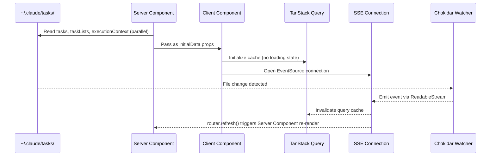
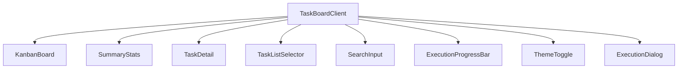

<!-- docs/task-manager/overview.md -->
# Task Manager Overview

The Task Manager is a Next.js 16.1.4 application that provides a real-time Kanban board for visualizing and monitoring Claude AI task files. It reads JSON task files from the filesystem (`~/.claude/tasks/`), renders them in a three-column board (Pending, In Progress, Completed), and keeps the UI synchronized with file changes through Server-Sent Events. The dev server runs on port **3030**.

## Tech Stack

| Layer              | Technology                                      |
|--------------------|--------------------------------------------------|
| Framework          | Next.js 16.1.4 (App Router)                     |
| UI Library         | React 19.2.3                                     |
| State Management   | TanStack Query v5.90.20                          |
| Styling            | Tailwind CSS v4, tailwind-merge                  |
| Components         | shadcn/ui (new-york style) with Radix primitives |
| File Watching      | Chokidar 5 (polling mode, 300ms interval)        |
| Theming            | next-themes (dark/light/system)                  |
| Markdown Rendering | react-markdown 10.1.0 + remark-gfm 4.0.1        |
| Icons              | Lucide React                                     |
| Fonts              | Geist Sans + Geist Mono (via `next/font/google`) |

## Architecture Pattern

The Task Manager follows a **Server-First with Real-Time Hydration** pattern. Server Components fetch all data on initial page load, eliminating loading spinners. The client then takes over with TanStack Query for cache management and an SSE connection for real-time filesystem updates.



### Data Flow in Five Steps

1. **Server Component** (`page.tsx`) fetches `tasks`, `taskLists`, and `executionContext` in parallel via `Promise.all()`, then passes them as `initialData` to `TaskBoardClient`.
2. **Client Component** (`TaskBoardClient`) initializes TanStack Query with the server-provided data — the user sees a fully rendered board immediately.
3. **SSE Connection** (`useSSE` hook) opens an `EventSource` to `/api/events?taskListId=<id>` for real-time updates.
4. **Chokidar** (`fileWatcher.ts`) detects filesystem changes and emits typed events through the SSE `ReadableStream`.
5. **Dual Invalidation** — on every SSE event, the client both invalidates the TanStack Query cache *and* calls `router.refresh()` to re-run the Server Component, keeping both data layers in sync.

!!! info "Why Dual Invalidation?"
    TanStack Query handles client-side cache freshness, but Server Components fetch data independently on navigation. By calling `router.refresh()` alongside cache invalidation, the app guarantees that *both* the client cache and the server-rendered HTML stay current. This prevents stale data if the user navigates away and returns to the page.

## Project Structure

```
apps/task-manager/
├── src/
│   ├── app/
│   │   ├── layout.tsx                  # Root layout with Providers
│   │   ├── page.tsx                    # Redirects to first task list
│   │   ├── globals.css                 # Tailwind CSS + shadcn/ui variables
│   │   ├── lists/[listId]/
│   │   │   ├── page.tsx                # Server Component — parallel data fetch
│   │   │   └── loading.tsx             # Loading skeleton
│   │   └── api/
│   │       ├── task-lists/route.ts     # GET /api/task-lists
│   │       ├── tasks/[listId]/route.ts # GET /api/tasks/:listId
│   │       ├── events/route.ts         # SSE endpoint
│   │       ├── execution-context/
│   │       │   └── [listId]/route.ts   # GET /api/execution-context/:listId
│   │       └── health/route.ts         # Health check
│   ├── components/
│   │   ├── TaskBoardClient.tsx         # Root client component (state + SSE)
│   │   ├── KanbanBoard.tsx             # Three-column Kanban board
│   │   ├── TaskDetail.tsx              # Task detail slide-over dialog
│   │   ├── SummaryStats.tsx            # Task count statistics bar
│   │   ├── TaskListSelector.tsx        # Dropdown to switch task lists
│   │   ├── SearchInput.tsx             # Search/filter input
│   │   ├── ExecutionProgressBar.tsx    # Header progress indicator
│   │   ├── ExecutionDialog.tsx         # Execution artifacts viewer
│   │   ├── ThemeToggle.tsx             # Dark/light mode toggle
│   │   ├── Providers.tsx               # QueryClient + ThemeProvider
│   │   └── ui/                         # shadcn/ui primitives
│   ├── hooks/
│   │   ├── useSSE.ts                   # SSE consumer + dual invalidation
│   │   ├── useTasks.ts                 # TanStack Query — tasks
│   │   ├── useTaskLists.ts             # TanStack Query — task lists
│   │   ├── useExecutionContext.ts       # TanStack Query — execution context
│   │   └── useTaskStats.ts            # Computed task statistics
│   ├── lib/
│   │   ├── taskService.ts             # Server-side filesystem reading
│   │   ├── fileWatcher.ts             # Chokidar singleton + event emission
│   │   ├── api.ts                     # Client-side fetch wrappers
│   │   └── utils.ts                   # cn() classname utility
│   └── types/
│       ├── task.ts                    # Task, TaskList, SSE event types
│       └── execution.ts              # ExecutionContext, artifacts, progress
└── package.json
```

## Key Files

### `src/lib/taskService.ts` — Server-Side Data Layer

The central module for reading task data from the filesystem. All functions are `async` and use Node.js `fs/promises`.

| Function                | Purpose                                                                 |
|-------------------------|-------------------------------------------------------------------------|
| `getTaskLists()`        | Scans `~/.claude/tasks/` for subdirectories containing `.json` files    |
| `getTasks(listId)`      | Reads and parses all `.json` files in a task list directory              |
| `getTask(listId, id)`   | Reads a single task by ID                                               |
| `getExecutionContext(listId)` | Reads `execution_pointer.md`, resolves the session directory, and returns artifacts |
| `getTasksDir()`         | Returns the base tasks directory path                                   |

The `parseTask()` helper defensively normalizes JSON: it defaults `status` to `"pending"` for unknown values, coerces `id` to string, and ensures `blocks`/`blockedBy` are arrays.

For full API details, see [API Reference](api-reference.md).

### `src/lib/fileWatcher.ts` — Chokidar Singleton

A `FileWatcher` class extending Node.js `EventEmitter`, configured with Chokidar 5 for filesystem monitoring.

```python title="Configuration"
# Chokidar watcher settings
usePolling: true    # Required for reliable cross-platform detection
interval: 300       # 300ms polling interval
depth: 2            # Watch two levels deep from base path
ignoreInitial: true # Skip existing files on startup
```

The singleton is stored on `globalThis` to survive Next.js Hot Module Replacement during development:

``` typescript title="src/lib/fileWatcher.ts"
const globalForWatcher = globalThis as unknown as {
  fileWatcher: FileWatcher | undefined
}

export const fileWatcher = globalForWatcher.fileWatcher ?? new FileWatcher()

if (process.env.NODE_ENV !== 'production') {
  globalForWatcher.fileWatcher = fileWatcher
}
```

The watcher emits two event types:

- **`taskEvent`** — fired when `.json` files are created, changed, or deleted
- **`executionEvent`** — fired when `.md` or `.txt` files change in a watched execution directory

For implementation details, see [Real-Time System](real-time-system.md).

### `src/app/api/events/route.ts` — SSE Endpoint

A Next.js Route Handler that creates a `ReadableStream` and subscribes to the `fileWatcher` singleton. Key behaviors:

- Sends an initial `connected` event on stream open
- Filters events by `taskListId` query parameter
- Sends heartbeat comments (`:heartbeat`) every 30 seconds to keep the connection alive
- Cleans up event listeners on `AbortSignal` from the request
- Dynamically registers execution directory watches when a `taskListId` is provided

### `src/hooks/useSSE.ts` — Client-Side SSE Consumer

Opens an `EventSource` to `/api/events` and performs **dual invalidation** on each event:

| SSE Event            | Cache Invalidation                                                         |
|----------------------|----------------------------------------------------------------------------|
| `task:created`       | `taskKeys.list(listId)` + `taskListKeys.all` + `router.refresh()`         |
| `task:updated`       | `taskKeys.list(listId)` + `taskListKeys.all` + `router.refresh()`         |
| `task:deleted`       | `taskKeys.list(listId)` + `taskListKeys.all` + `router.refresh()`         |
| `execution:updated`  | `executionContextKeys.list(listId)` + `router.refresh()`                  |

On connection error, the hook automatically reconnects after a 3-second delay using a `reconnectKey` state variable.

### `src/app/lists/[listId]/page.tsx` — Server Component Entry Point

The main page Server Component. Fetches all data in parallel before rendering:

``` typescript title="src/app/lists/[listId]/page.tsx"
const [taskLists, tasks, executionContext] = await Promise.all([
  getTaskLists(),
  getTasks(decodedListId),
  getExecutionContext(decodedListId),
])
```

If the requested `listId` does not exist in the fetched task lists, the page returns a 404 via `notFound()`.

### `src/components/TaskBoardClient.tsx` — Root Client Component

The top-level client component that wires together state management, real-time updates, and all UI components:



For details on individual components, see [Components](components.md).

## Application Lifecycle

### Startup

1. Root layout (`layout.tsx`) wraps the app in `Providers`, which initializes `QueryClient` (1-minute `staleTime`, no refetch-on-focus) and `ThemeProvider` (defaults to dark mode).
2. The root page (`page.tsx`) fetches task lists and redirects to the first one, or shows an empty state if `~/.claude/tasks/` has no task lists.
3. The `[listId]/page.tsx` Server Component fetches data and renders `TaskBoardClient` with `initialData`.
4. On the client, `TaskBoardClient` calls `useSSE(listId)`, which opens the SSE connection. The SSE route handler lazily starts the Chokidar watcher if not already running.

### Real-Time Update Cycle

1. A Claude AI agent writes or updates a `.json` file in `~/.claude/tasks/<listId>/`.
2. Chokidar detects the change (within ~300ms) and the `FileWatcher` emits a `taskEvent`.
3. The SSE route handler serializes the event and pushes it to the `ReadableStream`.
4. The browser's `EventSource` receives the event and fires the appropriate listener.
5. `useSSE` invalidates the TanStack Query cache and calls `router.refresh()`.
6. TanStack Query re-fetches task data from the API route; the Server Component re-executes on the server.
7. The UI updates without a full page reload.

### Execution Context Monitoring

When the `execute-tasks` plugin skill is running, it writes an `execution_pointer.md` file into the task list directory. This pointer contains the absolute path to the live session directory (e.g., `.claude/sessions/__live_session__/`).

The SSE route handler detects this pointer and dynamically adds the execution directory to the Chokidar watcher. As execution artifacts (`progress.md`, `task_log.md`, `execution_plan.md`) are updated, the watcher emits `execution:updated` events.

The `useExecutionContext` hook has a shorter `staleTime` (2 seconds) and a 5-second `refetchInterval` to keep execution state fresh even if SSE events are missed.

!!! tip "Execution Artifacts"
    Artifacts are sorted in a fixed display order: `execution_context` first, then `task_log`, `execution_plan`, `session_summary`, with any remaining files sorted alphabetically. Temporary per-wave context files (`context-task-*`) are filtered out.

## Task File Format

Task files are JSON stored at `~/.claude/tasks/<list-name>/<id>.json`:

``` json title="Example: ~/.claude/tasks/my-project/1.json"
{
  "id": "1",
  "subject": "Implement user authentication",
  "description": "Add OAuth2 login flow with session management",
  "status": "in_progress",
  "activeForm": "Working on token refresh logic",
  "blocks": ["2", "3"],
  "blockedBy": [],
  "metadata": {
    "priority": "high",
    "complexity": "L"
  }
}
```

| Field         | Type       | Required | Description                                     |
|---------------|------------|----------|-------------------------------------------------|
| `id`          | `string`   | Yes      | Unique identifier (coerced from number if needed) |
| `subject`     | `string`   | Yes      | Short task title                                |
| `description` | `string`   | No       | Detailed description (defaults to `""`)         |
| `status`      | `string`   | No       | `pending`, `in_progress`, or `completed` (defaults to `pending`) |
| `activeForm`  | `string`   | No       | Current work-in-progress note                   |
| `blocks`      | `string[]` | No       | IDs of tasks this task blocks (defaults to `[]`) |
| `blockedBy`   | `string[]` | No       | IDs of tasks blocking this one (defaults to `[]`) |
| `metadata`    | `object`   | No       | Arbitrary metadata (priority, complexity, etc.) |

**Valid `status` values:** `pending` | `in_progress` | `completed`

**Valid `priority` values:** `critical` | `high` | `medium` | `low`

**Valid `complexity` values:** `XS` | `S` | `M` | `L` | `XL`

## API Endpoints

| Method | Endpoint                             | Description                          |
|--------|--------------------------------------|--------------------------------------|
| GET    | `/api/health`                        | Health check                         |
| GET    | `/api/task-lists`                    | List all task lists                  |
| GET    | `/api/tasks/:listId`                 | Get tasks for a specific list        |
| GET    | `/api/execution-context/:listId`     | Get execution context for a list     |
| GET    | `/api/events?taskListId=<id>`        | SSE stream for real-time updates     |

For request/response schemas and detailed endpoint documentation, see [API Reference](api-reference.md).

## Security

The Task Manager implements several security measures to safely read from the filesystem:

- **Path traversal guard** — `resolveExecutionDir()` in `taskService.ts` uses `path.relative()` to verify that execution pointer targets stay under `$HOME`. Paths that escape the home directory are rejected.
- **API route validation** — The `GET /api/tasks/:listId` route rejects `listId` values containing `..` or `/` to prevent directory traversal.
- **Defensive parsing** — `parseTask()` normalizes all fields, defaulting unknown statuses to `"pending"` and coercing types, preventing malformed JSON from crashing the application.
- **Read-only access** — The Task Manager never writes to the filesystem. It is a pure read-only viewer.

For a complete security analysis, see [Security](security.md).

## Running the Application

``` bash title="Development"
cd apps/task-manager
pnpm install
pnpm dev          # Starts on http://localhost:3030
```

``` bash title="Production"
cd apps/task-manager
pnpm build
pnpm start
```

!!! note "Prerequisites"
    Task files must exist in `~/.claude/tasks/` for the board to display data. If no task lists are found, the app shows an empty state with instructions. Task files are typically created by the Claude Alchemy plugin skills — see the [Plugin Architecture](../plugins/overview.md) docs.

## Related Pages

- [API Reference](api-reference.md) — Detailed endpoint documentation with request/response schemas
- [Real-Time System](real-time-system.md) — Deep dive into the Chokidar + SSE pipeline
- [Components](components.md) — UI component breakdown and props reference
- [Security](security.md) — Path traversal guards, input validation, and threat model
