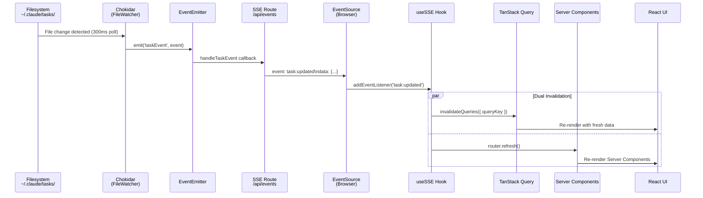
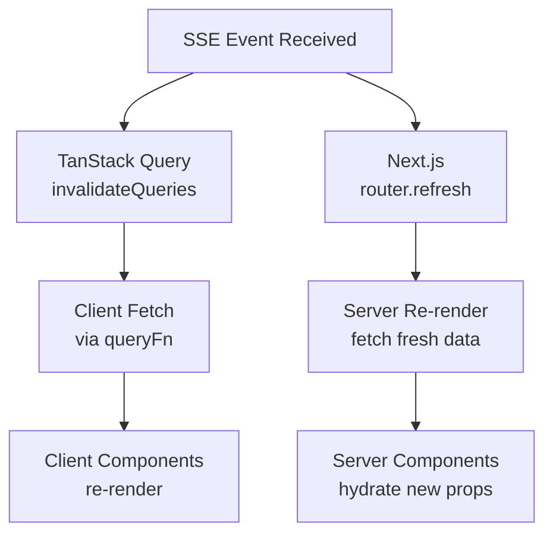

<!-- docs/task-manager/real-time-system.md -->
# Real-Time Update System

The Task Manager delivers live UI updates without polling from the browser. When a task JSON file changes on disk — whether written by a Claude plugin or edited manually — the change propagates through a four-stage pipeline and arrives in the React UI within milliseconds. This page documents every stage of that pipeline, the design decisions behind it, and the configuration that controls its behavior.

## Pipeline Overview

The full data flow from filesystem change to rendered pixel:

```
~/.claude/tasks/*.json
        │
        ▼
  ┌─────────────┐
  │ FileWatcher  │  Chokidar (300ms poll) + Node EventEmitter
  └──────┬──────┘
         │  'taskEvent' / 'executionEvent'
         ▼
  ┌─────────────┐
  │  SSE Route   │  ReadableStream → text/event-stream
  └──────┬──────┘
         │  EventSource (browser)
         ▼
  ┌─────────────┐
  │  useSSE Hook │  TanStack Query invalidation + router.refresh()
  └──────┬──────┘
         │
         ▼
      React UI
```



## Event Types

The system emits two categories of events, defined in `src/types/task.ts`:

| Event | Category | Trigger | Payload |
|-------|----------|---------|---------|
| `task:created` | Task | New `.json` file added | `{ type, taskListId, taskId, task }` |
| `task:updated` | Task | Existing `.json` file changed | `{ type, taskListId, taskId, task }` |
| `task:deleted` | Task | `.json` file removed | `{ type, taskListId, taskId }` |
| `execution:updated` | Execution | `.md` or `.txt` file changed in execution dir | `{ type, taskListId }` |

```typescript title="src/types/task.ts"
export type SSEEventType = 'task:created' | 'task:updated' | 'task:deleted'
export type ExecutionSSEEventType = 'execution:updated'

export interface SSEEvent {
  type: SSEEventType
  taskListId: string
  taskId: string
  task?: Task
}

export interface ExecutionSSEEvent {
  type: ExecutionSSEEventType
  taskListId: string
}
```

---

## Stage 1: FileWatcher

**Source:** `src/lib/fileWatcher.ts`

The `FileWatcher` class wraps [Chokidar](https://github.com/paulmillr/chokidar) in a Node.js `EventEmitter` that translates filesystem events into typed application events.

### Singleton Pattern

Next.js hot module replacement (HMR) re-executes module-level code on every file save during development. Without protection, each HMR cycle would spawn a new Chokidar watcher — leaking file descriptors and emitting duplicate events. The `globalThis` singleton pattern prevents this:

```typescript title="src/lib/fileWatcher.ts"
const globalForWatcher = globalThis as unknown as {
  fileWatcher: FileWatcher | undefined
}

export const fileWatcher = globalForWatcher.fileWatcher ?? new FileWatcher()

if (process.env.NODE_ENV !== 'production') {
  globalForWatcher.fileWatcher = fileWatcher
}
```

In development, the instance is pinned to `globalThis` so it survives HMR. In production, module caching handles deduplication naturally.

### Chokidar Configuration

```typescript title="src/lib/fileWatcher.ts"
this.watcher = watch(this.basePath, {
  persistent: true,
  ignoreInitial: true,
  usePolling: true,
  interval: 300,
  depth: 2,
})
```

| Option | Value | Rationale |
|--------|-------|-----------|
| `persistent` | `true` | Keep the Node process alive for the watcher |
| `ignoreInitial` | `true` | Don't emit events for files that already exist at startup |
| `usePolling` | `true` | Filesystem events (`fsevents`/`inotify`) can miss changes written by external processes. Polling is more reliable for cross-process file watching |
| `interval` | `300` ms | Balance between responsiveness and CPU usage |
| `depth` | `2` | Watch `~/.claude/tasks/<listId>/<file>` — two levels deep from the base path |

### Event Routing

The watcher maps raw Chokidar events to typed application events based on file extension:

```typescript title="src/lib/fileWatcher.ts"
this.watcher
  .on('add', (path) => {
    if (path.endsWith('.json')) {
      this.handleFileChange('task:created', path)
    } else if (this.isExecutionFile(path)) {
      this.handleExecutionChange(path)
    }
  })
  .on('change', (path) => {
    if (path.endsWith('.json')) {
      this.handleFileChange('task:updated', path)
    } else if (this.isExecutionFile(path)) {
      this.handleExecutionChange(path)
    }
  })
  .on('unlink', (path) => {
    if (path.endsWith('.json')) {
      this.handleFileDelete(path)
    } else if (this.isExecutionFile(path)) {
      this.handleExecutionChange(path)
    }
  })
```

- **`.json` files** become `taskEvent` emissions — the handler reads the file, parses it, and includes the full `Task` object in the event payload.
- **`.md` / `.txt` files** become `executionEvent` emissions — lightweight events that carry only the `taskListId`, signaling the client to refetch execution context.

### Dynamic Execution Directory Watching

Execution artifacts (like `progress.md` and `task_log.md`) live outside the base `~/.claude/tasks/` directory, in session-specific paths such as `.claude/sessions/__live_session__/`. The `watchExecutionDir` method dynamically adds these directories to the Chokidar watcher:

```typescript title="src/lib/fileWatcher.ts"
watchExecutionDir(taskListId: string, execDir: string): void {
  if (!this.watcher || !this.started) return

  const existing = this.watchedExecDirs.get(taskListId)
  if (existing === execDir) return

  // If there was a previous exec dir for this list, unwatch it
  if (existing) {
    this.watcher.unwatch(existing)
  }

  this.watchedExecDirs.set(taskListId, execDir)
  this.watcher.add(execDir)
}
```

!!! info "Deduplication"
    The `watchedExecDirs` map (keyed by `taskListId`) ensures only one execution directory is watched per task list at any time. When a new execution session starts and the pointer changes, the old directory is unwatched before the new one is added.

### Event Interfaces

```typescript title="src/lib/fileWatcher.ts"
export interface FileWatcherEvent {
  type: SSEEventType
  taskListId: string
  taskId: string
  task?: Task
}

export interface ExecutionWatcherEvent {
  type: ExecutionSSEEventType
  taskListId: string
}
```

---

## Stage 2: SSE Route

**Source:** `src/app/api/events/route.ts`

The API route bridges the server-side `FileWatcher` to the browser using [Server-Sent Events](https://developer.mozilla.org/en-US/docs/Web/API/Server-sent_events). It uses the Web Streams API (`ReadableStream`) to push events over a long-lived HTTP connection.

### Route Configuration

```typescript title="src/app/api/events/route.ts"
export const dynamic = 'force-dynamic'
export const runtime = 'nodejs'
```

- `force-dynamic` prevents Next.js from caching this route as static.
- `runtime: 'nodejs'` is required because the route depends on Node.js APIs (`EventEmitter`, `chokidar`) that are unavailable in the Edge runtime.

### Connection Lifecycle

```typescript title="src/app/api/events/route.ts"
export async function GET(request: Request) {
  const { searchParams } = new URL(request.url)
  const taskListId = searchParams.get('taskListId')

  // Lazy initialization — watcher starts on first SSE connection
  if (!fileWatcher.isStarted()) {
    await fileWatcher.start()
  }

  // Dynamically watch execution directory for this task list
  if (taskListId) {
    const execDir = await getExecutionDir(taskListId)
    if (execDir) {
      fileWatcher.watchExecutionDir(taskListId, execDir)
    }
  }

  // ... stream setup
}
```

!!! tip "Lazy Start"
    The `FileWatcher` starts only when the first browser connects. This avoids spinning up Chokidar during build or when the SSE endpoint is never called.

### Stream Construction

The route constructs a `ReadableStream` that:

1. Sends an initial `connected` event to confirm the connection is live.
2. Subscribes to `taskEvent` and `executionEvent` on the `FileWatcher`.
3. Filters events by the `taskListId` query parameter — each browser tab only receives events for the task list it is viewing.
4. Sends a heartbeat comment (`:heartbeat`) every 30 seconds to keep the connection alive through proxies and load balancers.
5. Cleans up listeners when the client disconnects (`request.signal.abort`).

```typescript title="src/app/api/events/route.ts"
const stream = new ReadableStream({
  start(controller) {
    controller.enqueue(encoder.encode(`event: connected\ndata: {}\n\n`))

    const handleTaskEvent = (event: FileWatcherEvent) => {
      if (taskListId && event.taskListId !== taskListId) return
      const data = JSON.stringify(event)
      controller.enqueue(encoder.encode(`event: ${event.type}\ndata: ${data}\n\n`))
    }

    const handleExecutionEvent = (event: ExecutionWatcherEvent) => {
      if (taskListId && event.taskListId !== taskListId) return
      const data = JSON.stringify(event)
      controller.enqueue(encoder.encode(`event: ${event.type}\ndata: ${data}\n\n`))
    }

    fileWatcher.on('taskEvent', handleTaskEvent)
    fileWatcher.on('executionEvent', handleExecutionEvent)

    const heartbeat = setInterval(() => {
      try {
        controller.enqueue(encoder.encode(`:heartbeat\n\n`))
      } catch {
        clearInterval(heartbeat)
      }
    }, 30000)

    request.signal.addEventListener('abort', () => {
      clearInterval(heartbeat)
      fileWatcher.off('taskEvent', handleTaskEvent)
      fileWatcher.off('executionEvent', handleExecutionEvent)
    })
  },
})
```

### Response Headers

```typescript title="src/app/api/events/route.ts"
return new Response(stream, {
  headers: {
    'Content-Type': 'text/event-stream',
    'Cache-Control': 'no-cache, no-transform',
    'Connection': 'keep-alive',
    'X-Accel-Buffering': 'no',
  },
})
```

| Header | Purpose |
|--------|---------|
| `Content-Type: text/event-stream` | Standard SSE content type — tells the browser to use `EventSource` protocol |
| `Cache-Control: no-cache, no-transform` | Prevent caching and proxy transformation of the event stream |
| `Connection: keep-alive` | Signal that this is a persistent connection |
| `X-Accel-Buffering: no` | Disable buffering in nginx reverse proxies (common in deployment) |

---

## Stage 3: useSSE Hook

**Source:** `src/hooks/useSSE.ts`

The `useSSE` hook is the client-side consumer. It creates a browser-native `EventSource` connection, listens for typed events, and triggers the dual invalidation strategy.

### Connection Management

```typescript title="src/hooks/useSSE.ts"
export function useSSE(taskListId: string | null) {
  const queryClient = useQueryClient()
  const router = useRouter()
  const eventSourceRef = useRef<EventSource | null>(null)
  const [reconnectKey, setReconnectKey] = useState(0)

  useEffect(() => {
    if (!taskListId) return

    const url = `/api/events?taskListId=${encodeURIComponent(taskListId)}`
    const eventSource = new EventSource(url)
    eventSourceRef.current = eventSource

    // ... event listeners

    return () => {
      eventSource.close()
      eventSourceRef.current = null
    }
  }, [taskListId, queryClient, router, reconnectKey])
}
```

The `useEffect` dependency array includes `reconnectKey` — a piece of state used solely to force the effect to re-run and establish a new `EventSource` connection after an error.

### Event Handlers

```typescript title="src/hooks/useSSE.ts"
const handleTaskEvent = () => {
  queryClient.invalidateQueries({ queryKey: taskKeys.list(taskListId) })
  queryClient.invalidateQueries({ queryKey: taskListKeys.all })
  router.refresh()
}

const handleExecutionEvent = () => {
  queryClient.invalidateQueries({
    queryKey: executionContextKeys.list(taskListId),
  })
  router.refresh()
}

eventSource.addEventListener('task:created', handleTaskEvent)
eventSource.addEventListener('task:updated', handleTaskEvent)
eventSource.addEventListener('task:deleted', handleTaskEvent)
eventSource.addEventListener('execution:updated', handleExecutionEvent)
```

!!! note "Why invalidate `taskListKeys.all` on task events?"
    Task list objects include a `taskCount` field. When a task is created or deleted, the count changes, so the task list query must also be invalidated to keep the sidebar accurate.

### Auto-Reconnection

```typescript title="src/hooks/useSSE.ts"
eventSource.onerror = (error) => {
  console.error('SSE error:', error)
  eventSource.close()

  setTimeout(() => {
    console.log('Attempting SSE reconnection...')
    setReconnectKey((k) => k + 1)
  }, 3000)
}
```

When the connection drops (server restart, network blip), the hook:

1. Closes the broken `EventSource` immediately.
2. Waits 3 seconds to avoid hammering the server.
3. Increments `reconnectKey`, which triggers the `useEffect` cleanup and re-run, establishing a fresh connection.

---

## Stage 4: Dual Invalidation

The system uses two parallel invalidation paths to ensure both client-cached data and server-rendered data stay current.



### Why Both?

The Task Manager uses a **hybrid rendering** architecture:

- **Server Components** (`page.tsx`) fetch initial task data on the server and pass it as props. These components only re-render when `router.refresh()` is called.
- **Client Components** (`KanbanBoard`, `TaskBoardClient`) use TanStack Query for ongoing state. These components re-render when their query cache is invalidated.

If only TanStack Query were invalidated, Server Component data would go stale. If only `router.refresh()` were called, client-side query caches would still hold old data until their `staleTime` expired.

!!! warning "Order Independence"
    Both invalidation paths fire simultaneously (not sequentially). There is no guarantee which update reaches the DOM first. This is safe because both paths converge on the same source of truth — the filesystem.

---

## Query Configuration

### QueryClient Defaults

```typescript title="src/components/Providers.tsx"
const queryClient = new QueryClient({
  defaultOptions: {
    queries: {
      staleTime: 1000 * 60, // 1 minute
      refetchOnWindowFocus: false,
    },
  },
})
```

| Setting | Value | Rationale |
|---------|-------|-----------|
| `staleTime` | 60 seconds | Since SSE pushes updates in real-time, aggressive background refetching is unnecessary. Data stays "fresh" for 1 minute |
| `refetchOnWindowFocus` | `false` | Tab switching should not trigger refetches — SSE ensures data is already current |

### Query Key Factories

Each data domain defines a key factory for consistent cache management:

```typescript title="src/hooks/useTasks.ts"
export const taskKeys = {
  all: ['tasks'] as const,
  list: (listId: string) => [...taskKeys.all, listId] as const,
}
```

```typescript title="src/hooks/useTaskLists.ts"
export const taskListKeys = {
  all: ['task-lists'] as const,
}
```

```typescript title="src/hooks/useExecutionContext.ts"
export const executionContextKeys = {
  all: ['execution-context'] as const,
  list: (listId: string) => [...executionContextKeys.all, listId] as const,
}
```

### Execution Context: Faster Polling

The execution context query uses more aggressive timing because execution progress changes rapidly during active task runs:

```typescript title="src/hooks/useExecutionContext.ts"
export function useExecutionContext(
  taskListId: string | null,
  initialData?: ExecutionContext | null
) {
  return useQuery({
    queryKey: executionContextKeys.list(taskListId ?? ''),
    queryFn: () => fetchExecutionContext(taskListId!),
    enabled: !!taskListId,
    initialData: initialData ?? undefined,
    staleTime: 2000,
    refetchInterval: 5000,
  })
}
```

| Setting | Value | Rationale |
|---------|-------|-----------|
| `staleTime` | 2 seconds | Execution progress data becomes stale almost immediately |
| `refetchInterval` | 5 seconds | Poll every 5s as a fallback in case an SSE event is missed |

!!! info "Belt and Suspenders"
    The execution context uses **both** SSE-driven invalidation and interval-based polling. SSE provides low-latency updates, while the 5-second polling interval acts as a safety net for missed events — particularly useful during high-frequency file writes when Chokidar's 300ms polling might coalesce rapid changes.

---

## Security Considerations

### Path Traversal Protection

The `resolveExecutionDir` function in `taskService.ts` guards against malicious execution pointers that could read arbitrary files:

```typescript title="src/lib/taskService.ts"
function resolveExecutionDir(pointerContent: string): string | null {
  const raw = pointerContent.trim()
  if (!raw) return null

  const home = homedir()
  const resolved = raw.startsWith('/') ? resolve(raw) : resolve(home, raw)

  // Guard against path traversal — execution dir must be under home
  const rel = relative(home, resolved)
  if (rel.startsWith('..') || resolve(home, rel) !== resolved) {
    console.warn(`Execution pointer path escapes home directory: ${raw}`)
    return null
  }

  return resolved
}
```

The `execution_pointer.md` file contains a path to the execution directory. Since this file is written by the plugin, a compromised or malformed pointer could attempt to escape the home directory (e.g., `../../../etc/`). The guard ensures the resolved path always remains under `$HOME`.

### Event Filtering

The SSE route filters events by `taskListId`, preventing a client viewing one task list from receiving events for another. This is a convenience filter (not a security boundary), since all task data is local to the user's machine.

---

## Troubleshooting

### Events Not Arriving in the Browser

!!! tip "Diagnostic Steps"
    1. Open the browser DevTools Network tab and look for the `/api/events` request. It should show as "pending" (long-lived connection).
    2. Check the Console for `SSE connected: {}` — this confirms the `EventSource` opened successfully.
    3. Look for `File watcher started: watching ...` in the Next.js server terminal output.
    4. Verify task files exist in `~/.claude/tasks/<listId>/` and are valid JSON.

### Duplicate Events or Stale Data

The `globalThis` singleton prevents duplicate watchers during development HMR. If you see duplicate events:

1. Restart the Next.js dev server (`pnpm dev`) to clear any orphaned watchers.
2. Check that only one browser tab is connected to the same `taskListId` (multiple tabs are fine, but each opens its own SSE connection).

### SSE Connection Drops

The `useSSE` hook automatically reconnects after a 3-second delay. If connections drop repeatedly:

- Check for proxy or firewall timeout settings shorter than the 30-second heartbeat interval.
- Ensure `X-Accel-Buffering: no` is respected if running behind nginx.

### Execution Context Not Updating

If task events work but execution context does not update:

1. Verify `execution_pointer.md` exists in `~/.claude/tasks/<listId>/` and contains a valid absolute path.
2. Check that the execution directory path resolves to a location under your home directory.
3. Look for `File watcher: now watching execution dir for ...` in the server logs.
