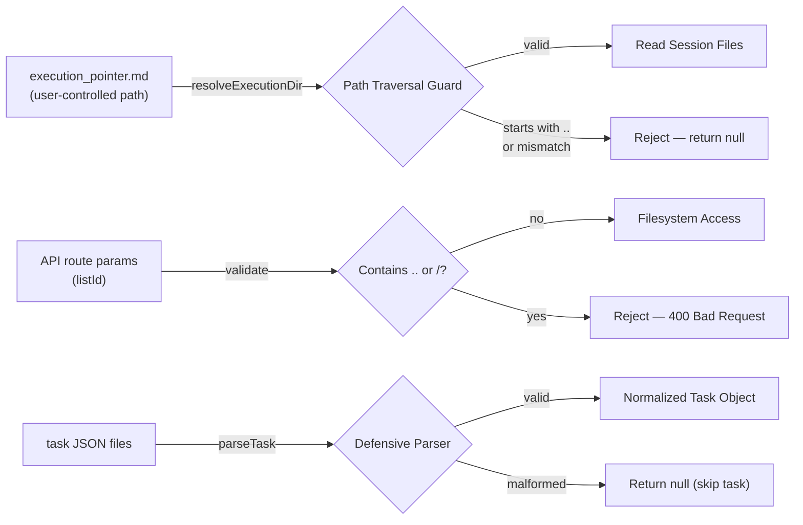

<!-- docs/task-manager/security.md -->
# Security Patterns

The Task Manager reads and displays files from the local filesystem, making input validation and path safety critical. This page documents every security boundary in the application — from path traversal guards to defensive data parsing — and explains the rationale behind each pattern.

## Threat Model

The Task Manager operates as a localhost development tool that reads task data from `~/.claude/tasks/` and execution artifacts from project-local `.claude/sessions/` directories. The primary attack surface is **malicious or malformed file content** — particularly `execution_pointer.md`, which contains a user-controlled file path that the server resolves and reads from.



## Path Traversal Guard

The most critical security boundary in the application. The `resolveExecutionDir()` function in `taskService.ts` prevents `execution_pointer.md` from directing the server to read arbitrary files outside the user's home directory.

### How It Works

The pointer file contains an absolute path to a session directory (e.g., `/Users/sequenzia/dev/repos/my-project/.claude/sessions/__live_session__/`). The guard validates this path in two steps:

1. **Resolve the path** — handles both absolute and relative paths via `path.resolve()`
2. **Verify containment** — uses `path.relative(home, resolved)` and checks that the relative path does not start with `..` and that round-tripping through `resolve(home, rel)` produces the same absolute path

```python title="apps/task-manager/src/lib/taskService.ts"
function resolveExecutionDir(pointerContent: string): string | null {
  const raw = pointerContent.trim()
  if (!raw) return null

  const home = homedir()
  const resolved = raw.startsWith('/') ? resolve(raw) : resolve(home, raw)

  // Guard against path traversal — execution dir must be under home
  const rel = relative(home, resolved)
  if (rel.startsWith('..') || resolve(home, rel) !== resolved) {
    console.warn(`Execution pointer path escapes home directory: ${raw}`)
    return null
  }

  return resolved
}
```

### Why Two Checks

!!! info "Defense in Depth"
    The `rel.startsWith('..')` check catches the obvious case where the resolved path is outside `$HOME`. The round-trip check (`resolve(home, rel) !== resolved`) catches edge cases involving symlinks or path normalization inconsistencies where the relative path might not start with `..` but still resolves to an unexpected location.

### Attack Scenarios Blocked

| Pointer Content | `resolved` | `rel` | Result |
|---|---|---|---|
| `/etc/passwd` | `/etc/passwd` | `../../etc/passwd` | **Rejected** — starts with `..` |
| `../../../etc/shadow` | `/etc/shadow` | `../../etc/shadow` | **Rejected** — starts with `..` |
| `/Users/sequenzia/project/.claude/sessions/` | `/Users/sequenzia/project/.claude/sessions/` | `project/.claude/sessions/` | **Allowed** — under `$HOME` |
| ` ` (empty/whitespace) | — | — | **Rejected** — empty after trim |

!!! warning "Scope Limitation"
    The guard ensures paths stay under `$HOME`, not under a specific project directory. A malicious pointer could still read session files from a *different* project under the same home directory. This is an acceptable trade-off for a local development tool where all projects belong to the same user.

## API Route Input Validation

Both API routes that accept a `listId` parameter validate it before any filesystem access occurs. This prevents path traversal through the URL itself.

### Tasks Route

```python title="apps/task-manager/src/app/api/tasks/[listId]/route.ts"
export async function GET(request: Request, { params }: RouteParams) {
  try {
    const { listId } = await params

    // Validate listId to prevent path traversal
    if (!listId || listId.includes('..') || listId.includes('/')) {
      return NextResponse.json(
        { error: 'Invalid task list ID' },
        { status: 400 }
      )
    }

    const tasks = await getTasks(listId)
    return NextResponse.json({ tasks })
  } catch (error) {
    console.error('Error fetching tasks:', error)
    return NextResponse.json(
      { error: 'Failed to fetch tasks' },
      { status: 500 }
    )
  }
}
```

### Execution Context Route

```python title="apps/task-manager/src/app/api/execution-context/[listId]/route.ts"
export async function GET(request: Request, { params }: RouteParams) {
  try {
    const { listId } = await params

    if (!listId || listId.includes('..') || listId.includes('/')) {
      return NextResponse.json(
        { error: 'Invalid task list ID' },
        { status: 400 }
      )
    }

    const executionContext = await getExecutionContext(listId)
    return NextResponse.json({ executionContext })
  } catch (error) {
    console.error('Error fetching execution context:', error)
    return NextResponse.json(
      { error: 'Failed to fetch execution context' },
      { status: 500 }
    )
  }
}
```

### Validation Logic

Both routes apply identical checks:

- **Empty check** — `!listId` rejects missing or empty parameters
- **`..` check** — `listId.includes('..')` blocks directory traversal sequences
- **`/` check** — `listId.includes('/')` blocks subdirectory access attempts

Since `listId` is joined directly to `TASKS_DIR` (`~/.claude/tasks/`) via `path.join()`, a value like `../../etc` would resolve outside the tasks directory without this guard.

!!! tip "Consistent Pattern"
    Every route that accepts filesystem-derived parameters uses the same validation pattern. When adding new API routes that accept path-like parameters, replicate this check.

## Defensive Task Parsing

The `parseTask()` function in `taskService.ts` handles malformed, incomplete, or unexpected JSON without crashing. Since task files are written by external processes (Claude Code plugins), the parser cannot assume well-formed input.

```python title="apps/task-manager/src/lib/taskService.ts"
function parseTask(content: string, filename: string): Task | null {
  try {
    const data = JSON.parse(content)

    // Validate required fields
    if (typeof data.id !== 'string' && typeof data.id !== 'number') {
      data.id = basename(filename, '.json')
    } else {
      data.id = String(data.id)
    }

    if (typeof data.subject !== 'string') {
      console.warn(`Task ${data.id}: missing subject`)
      return null
    }

    // Normalize status
    if (!isValidTaskStatus(data.status)) {
      data.status = 'pending'
    }

    // Ensure arrays exist
    data.blocks = Array.isArray(data.blocks) ? data.blocks.map(String) : []
    data.blockedBy = Array.isArray(data.blockedBy) ? data.blockedBy.map(String) : []

    // Optional fields
    data.description = typeof data.description === 'string' ? data.description : ''
    if (data.activeForm !== undefined && typeof data.activeForm !== 'string') {
      delete data.activeForm
    }

    return data as Task
  } catch (error) {
    console.error(`Error parsing task file ${filename}:`, error)
    return null
  }
}
```

### Normalization Rules

| Field | Problem | Recovery |
|---|---|---|
| `id` | Missing or wrong type | Falls back to filename (without `.json` extension) |
| `id` | Number instead of string | Coerced to string via `String()` |
| `subject` | Missing or non-string | Returns `null` — task is skipped entirely |
| `status` | Missing, null, or invalid value | Defaults to `'pending'` |
| `blocks` | Missing or non-array | Defaults to empty array `[]` |
| `blockedBy` | Missing or non-array | Defaults to empty array `[]` |
| `blocks`/`blockedBy` items | Numbers instead of strings | Each element coerced to string via `.map(String)` |
| `description` | Missing or non-string | Defaults to empty string `''` |
| `activeForm` | Non-string value | Deleted from the object |
| Entire file | Unparseable JSON | Returns `null` — task is skipped |

!!! note "Fail-Safe Design"
    All `taskService` functions that read from the filesystem return empty arrays or `null` rather than throwing exceptions. Functions like `getTasks()` wrap each file read in try/catch and skip individual failures, ensuring one corrupt task file does not prevent the rest from loading.

## Hook Scoping (SDD Plugin)

The SDD plugin's `auto-approve-session.sh` PreToolUse hook automatically approves file operations needed during task execution — but only for a tightly scoped set of paths and commands. All other operations fall through to the normal Claude Code permission flow.

```bash title="plugins/sdd/hooks/auto-approve-session.sh"
case "$tool_name" in
  Write|Edit)
    file_path=$(echo "$input" | jq -r '.tool_input.file_path // empty')
    [ -z "$file_path" ] && exit 0

    # Match execution_pointer.md in ~/.claude/tasks/*/
    if [[ "$file_path" == "$HOME/.claude/tasks/"*/execution_pointer.md ]]; then
      approve
    fi

    # Match any file inside .claude/sessions/
    if [[ "$file_path" == */.claude/sessions/* ]]; then
      approve
    fi
    ;;

  Bash)
    command=$(echo "$input" | jq -r '.tool_input.command // empty')
    [ -z "$command" ] && exit 0

    # Match mkdir or mv targeting .claude/sessions/
    if [[ "$command" == *".claude/sessions/"* ]]; then
      if [[ "$command" == *mkdir* ]] || [[ "$command" == *mv* ]]; then
        approve
      fi
    fi
    ;;
esac

# No opinion — let normal permission flow handle it
exit 0
```

### Approved Operations

| Tool | Path Pattern | Purpose |
|---|---|---|
| `Write` / `Edit` | `$HOME/.claude/tasks/*/execution_pointer.md` | Create/update execution pointer |
| `Write` / `Edit` | `*/.claude/sessions/*` | Write session artifacts (context, logs, progress) |
| `Bash` (`mkdir`) | Commands containing `.claude/sessions/` | Create session directories |
| `Bash` (`mv`) | Commands containing `.claude/sessions/` | Archive sessions (move `__live_session__/` contents) |

!!! danger "Everything Else Is Denied by Default"
    The hook exits with no output (`exit 0` without JSON) for any operation that does not match the patterns above. This means the normal permission flow applies — the user will be prompted to approve or deny the operation. The hook never explicitly denies; it either approves or abstains.

### Why This Matters

Without this hook, every file write during autonomous task execution would prompt the user for approval, breaking the unattended execution flow. The hook's narrow scope ensures that only session-management operations are auto-approved while all other file operations (source code edits, configuration changes) still require explicit user consent.

## Session Isolation

The `execute-tasks` skill enforces strict session isolation to prevent concurrent execution conflicts and ensure clean recovery from interruptions.

### Concurrency Guard (`.lock` File)

Only one execution session can run at a time per project. A `.lock` file in `__live_session__/` prevents concurrent invocations.

```markdown
<!-- .claude/sessions/__live_session__/.lock -->
task_execution_id: user-auth-20260208-143022
timestamp: 2026-02-08T14:30:22Z
pid: orchestrator
```

**Lock lifecycle:**

1. **Created** at session start (Step 5.5 of orchestration)
2. **Checked** before every new execution — if the lock exists and is less than 4 hours old, the user is prompted to force-start or cancel
3. **Stale locks** older than 4 hours are automatically deleted (the previous session is assumed to have crashed)
4. **Released** when the session completes — the lock file is moved to the archive directory along with all other session files

### Interrupted Session Recovery

When a new execution starts and finds leftover files in `__live_session__/`, the orchestrator:

1. Archives the stale session to `.claude/sessions/interrupted-{YYYYMMDD}-{HHMMSS}/`
2. Cross-references `task_log.md` (if present) to identify which tasks were part of the interrupted session
3. Resets those `in_progress` tasks back to `pending` via `TaskUpdate`
4. Logs each recovered task for auditability

!!! warning "Conservative Recovery"
    If no `task_log.md` is found in the archive (e.g., the session crashed before any tasks started), *all* `in_progress` tasks are reset to `pending`. This errs on the side of re-executing work rather than leaving tasks in a stuck state.

### Agent Isolation

Each task is executed by a fresh `task-executor` agent invocation with its own context window. Agents within the same wave:

- **Read** from a snapshot of `execution_context.md` taken before the wave launched
- **Write** to isolated per-task files (`context-task-{id}.md`) to prevent write contention
- **Cannot** see each other's in-progress changes
- **Cannot** modify each other's task status

The orchestrator merges per-task context files into the shared `execution_context.md` only after all agents in a wave have completed.

## No Authentication on API Routes

!!! danger "Localhost-Only Assumption"
    The Task Manager exposes task data and execution artifacts via HTTP API routes (`/api/tasks/:listId`, `/api/execution-context/:listId`, `/api/events`) without any authentication or authorization. This is acceptable for a local development tool running on `localhost`, but would require authentication if the application were ever deployed to a network-accessible host.

**Current API surface exposed without auth:**

| Endpoint | Data Exposed |
|---|---|
| `GET /api/task-lists` | List of task list names |
| `GET /api/tasks/:listId` | All task data (subjects, descriptions, status, metadata) |
| `GET /api/execution-context/:listId` | Session artifacts (execution context, logs, progress) |
| `GET /api/events?taskListId=:id` | Real-time SSE stream of file change events |
| `GET /api/health` | Server health status |

The SSE endpoint at `/api/events` additionally resolves the execution directory path via `getExecutionDir()`, which applies the path traversal guard documented above — so even unauthenticated access cannot escape the home directory.

## Security Checklist

When modifying the Task Manager or adding new API routes, verify these invariants:

- [ ] Any new route parameter derived from user input is validated against `..` and `/` before filesystem access
- [ ] Any new file path resolved from external content passes through `resolveExecutionDir()` or an equivalent containment check
- [ ] Parser functions return `null` or empty collections on malformed input rather than throwing
- [ ] Error responses do not leak filesystem paths or internal state to the client
- [ ] The `auto-approve-session.sh` hook is updated if new session file paths are introduced
- [ ] No secrets, credentials, or `.env` files are read or served by any route
