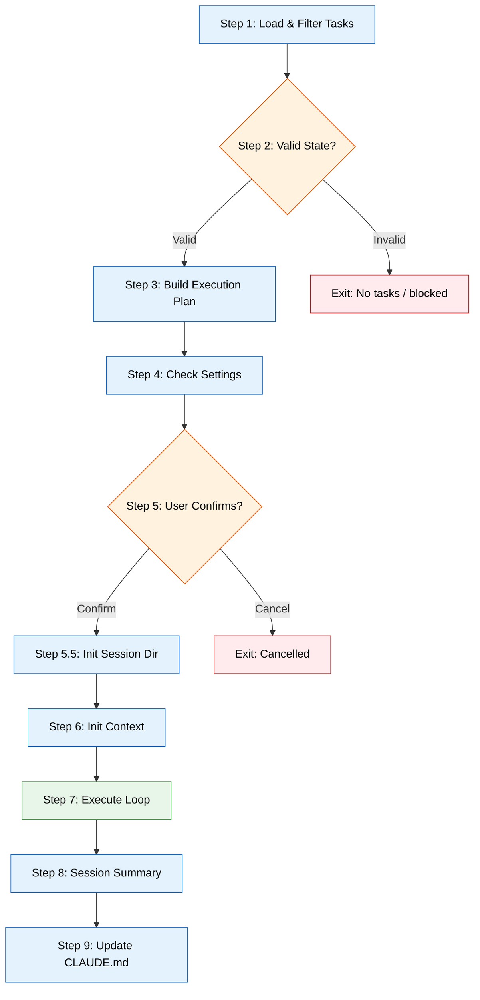
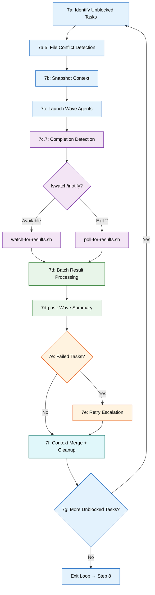
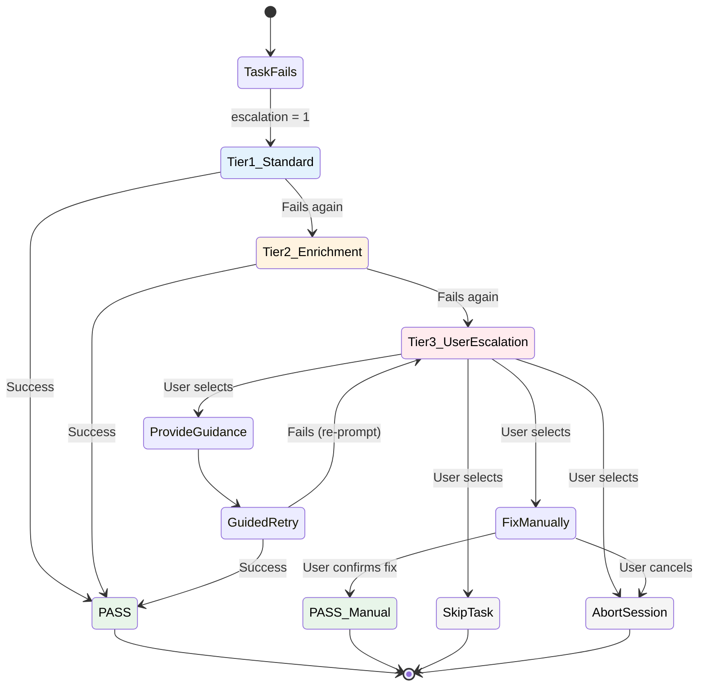
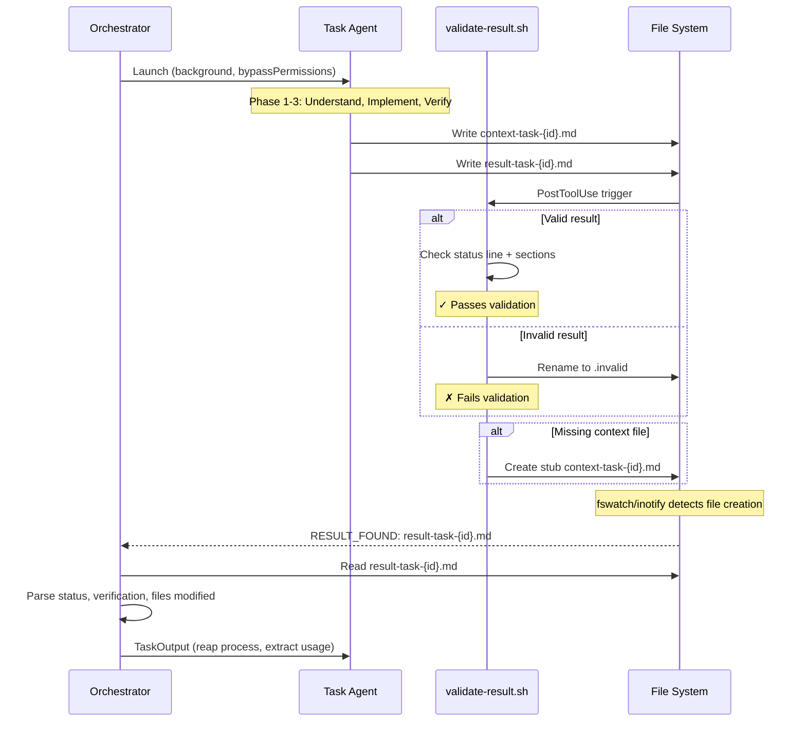
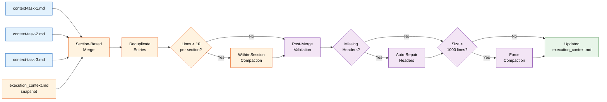

# SDD Orchestration Engine Deep-Dive

> Technical reference for understanding and modifying the `execute-tasks` orchestration engine.
> Generated: 2026-02-22 | Source: `claude/sdd-tools/skills/execute-tasks/`

## Table of Contents

- [1. Overview](#1-overview)
- [2. 10-Step Orchestration Loop](#2-10-step-orchestration-loop)
- [3. Wave-Based Parallelism](#3-wave-based-parallelism)
- [4. Pre-Wave File Conflict Detection](#4-pre-wave-file-conflict-detection)
- [5. Upstream Injection (produces_for)](#5-upstream-injection-produces_for)
- [6. Completion Detection](#6-completion-detection)
- [7. Batch Result Processing](#7-batch-result-processing)
- [8. 3-Tier Retry Escalation](#8-3-tier-retry-escalation)
- [9. Context Merge Protocol](#9-context-merge-protocol)
- [10. Session Management](#10-session-management)
- [11. Hook Integration](#11-hook-integration)
- [12. Key Diagrams](#12-key-diagrams)

---

## 1. Overview

The SDD orchestration engine is the runtime heart of the Spec-Driven Development pipeline. It sits at the end of the artifact chain:

```
/create-spec → spec markdown → /create-tasks → task JSON → /execute-tasks → code + session logs
```

The engine's job: take a set of tasks with dependency relationships, execute them autonomously via parallel agent teams, and produce working code with full session traceability.

### Key Design Goals

| Goal | How It's Achieved |
|------|-------------------|
| **Autonomous execution** | After user confirms the plan, no prompts except Tier 3 retry escalation |
| **Wave-based parallelism** | Topological sort groups tasks by dependency level; up to N agents per wave |
| **Context isolation** | Per-task context/result files prevent write contention between concurrent agents |
| **Progressive learning** | Shared `execution_context.md` merges learnings between waves |
| **Resilient failure handling** | 3-tier retry escalation with user escalation as final safety net |
| **Minimal context consumption** | Result file protocol (~18 lines per task) instead of full agent output (~100+ lines) |

### File Inventory

| File | Lines | Role |
|------|-------|------|
| `skills/execute-tasks/SKILL.md` | 293 | Skill entry point — workflow overview, key behaviors, examples |
| `skills/execute-tasks/references/orchestration.md` | ~1,235 | 10-step orchestration loop with full procedures |
| `skills/execute-tasks/references/execution-workflow.md` | 381 | 4-phase task executor workflow (documentation-only) |
| `skills/execute-tasks/references/verification-patterns.md` | 256 | Task classification, criterion verification, pass/fail rules |
| `skills/execute-tasks/scripts/watch-for-results.sh` | 115 | Event-driven completion detection (fswatch/inotifywait) |
| `skills/execute-tasks/scripts/poll-for-results.sh` | 133 | Adaptive polling fallback for completion detection |
| `agents/task-executor.md` | 414 | Opus-tier agent with embedded 4-phase workflow |
| `hooks/auto-approve-session.sh` | 75 | PreToolUse hook for session file auto-approval |
| `hooks/validate-result.sh` | 100 | PostToolUse hook for result file format validation |
| `hooks/hooks.json` | 30 | Hook registration (PreToolUse + PostToolUse) |

---

## 2. 10-Step Orchestration Loop

The orchestrator executes a deterministic 10-step loop. Each step has clear inputs, outputs, and exit conditions.

### Step-by-Step Summary

| Step | Name | Inputs | Outputs | Can Exit? |
|------|------|--------|---------|-----------|
| **1** | Load Task List | `TaskList`, `--task-group`, `--phase` | Filtered task set | Yes (no tasks match) |
| **2** | Validate State | Task set | Validation result | Yes (empty, all done, circular deps) |
| **3** | Build Execution Plan | Task dependencies, `max_parallel` | Wave assignment, priority ordering | No |
| **4** | Check Settings | `.claude/agent-alchemy.local.md` | Execution preferences | No |
| **5** | Present Plan & Confirm | Execution plan | User confirmation | Yes (user cancels) |
| **5.5** | Initialize Execution Dir | `task_execution_id` | Session directory + files | No |
| **6** | Initialize Execution Context | Prior session context | Seeded `execution_context.md` | No |
| **7** | Execute Loop | Waves of tasks | Completed tasks + session artifacts | No (loops until done) |
| **8** | Session Summary | Task log, progress | Summary display + archive | No |
| **9** | Update CLAUDE.md | Execution context | CLAUDE.md edits (if warranted) | No |

### Step 1: Load Task List

Retrieves all tasks via `TaskList` and applies up to three filters in sequence:

1. **`--task-group`** — matches `metadata.task_group`
2. **`--phase`** — matches `metadata.spec_phase` (comma-separated integers, e.g., `--phase 1,2`)
3. **`task-id`** — single task mode

Tasks without `spec_phase` metadata are excluded when `--phase` is active. If no tasks match after filtering, the orchestrator reports available phases and stops.

### Step 2: Validate State

Catches edge cases before any work happens:

- **Empty task list** — suggests using `/create-tasks`
- **All completed** — reports summary
- **Specific task blocked** — reports blockers
- **No unblocked tasks** — reports blocking chains, detects circular dependencies

### Step 3: Build Execution Plan

Three sub-steps:

**3a: Resolve Max Parallel** — Precedence: CLI `--max-parallel` > `.claude/agent-alchemy.local.md` setting > default 5.

**3b-3c: Topological Wave Assignment** — Tasks assigned to waves by dependency depth:
- Wave 1: no dependencies
- Wave 2: depends only on Wave 1
- Wave N: depends only on Wave 1..N-1

**3d: Within-Wave Sort** — Priority ordering with tie-breaking:
1. `critical` > `high` > `medium` > `low` > unprioritized
2. Ties broken by "unblocks most others" (task appearing in most `blockedBy` lists)
3. Waves exceeding `max_parallel` are split into sub-waves

**3e: Circular Dependency Detection** — Any tasks unassigned after topological sort form a cycle. The orchestrator breaks at the "weakest link" (fewest blockers).

### Step 4: Check Settings

Reads optional `.claude/agent-alchemy.local.md` for user preferences. Non-blocking — proceeds without settings if file missing.

### Step 5: Present Plan & Confirm

Displays a formatted execution plan banner with task counts, wave breakdown, blocked tasks, and completed count. Uses `AskUserQuestion` for confirmation — "Cancel" stops without modifying any tasks.

### Step 5.5: Initialize Execution Directory

The most complex initialization step, handling several concerns:

**Session ID Generation** — Multi-tier resolution:

| Priority | Condition | Format |
|----------|-----------|--------|
| 1 | `--task-group` + `--phase` | `{group}-phase{N}-{YYYYMMDD}-{HHMMSS}` |
| 2 | `--task-group` only | `{group}-{YYYYMMDD}-{HHMMSS}` |
| 3 | `--phase` only + shared group | `{group}-phase{N}-{YYYYMMDD}-{HHMMSS}` |
| 4 | `--phase` only | `phase{N}-{YYYYMMDD}-{HHMMSS}` |
| 5 | All tasks share group | `{group}-{YYYYMMDD}-{HHMMSS}` |
| 6 | Default | `exec-session-{YYYYMMDD}-{HHMMSS}` |

**Stale Session Cleanup** — Archives leftover `__live_session__/` files to `interrupted-{timestamp}/` and resets `in_progress` tasks to `pending`.

**Concurrency Guard** — `.lock` file prevents concurrent execution. Lock age > 4 hours = stale (auto-removed). Lock age < 4 hours = prompts user to force-start or cancel.

**Session Files Created:**

| File | Purpose |
|------|---------|
| `execution_plan.md` | Saved plan from Step 5 |
| `execution_context.md` | 6-section structured template |
| `task_log.md` | Table with Task ID, Subject, Status, Attempts, Duration, Token Usage |
| `progress.md` | Real-time status (Active Tasks, Completed This Session) |
| `tasks/` | Subdirectory for archived completed task JSONs |
| `execution_pointer.md` | Created at `~/.claude/tasks/{id}/` with absolute path to session |

### Step 6: Initialize Execution Context

Seeds `execution_context.md` with the 6-section template. If a prior session exists (most recent timestamped subfolder in `.claude/sessions/`), merges relevant learnings from sections 1-5. Applies cross-session compaction: sections with 10+ entries get summarized; prior Task History entries are condensed to a single summary paragraph.

### Step 7: Execute Loop

The core engine — detailed in sections 3-9 below.

### Step 8: Session Summary

Displays formatted execution summary with pass/fail counts, total execution time, token usage, failed task list, and newly unblocked tasks. Archives the session from `__live_session__/` to `.claude/sessions/{task_execution_id}/`.

### Step 9: Update CLAUDE.md

Reviews execution context for project-wide changes (new patterns, dependencies, commands, structure changes). Makes targeted edits only if meaningful changes occurred.

---

## 3. Wave-Based Parallelism

### Conceptual Model

The orchestrator treats task execution like a build system: tasks form a directed acyclic graph (DAG), and waves represent topological sort levels. All tasks at the same level can run in parallel because they have no mutual dependencies.

```
Wave 1: [Task A] [Task B] [Task C]    ← no dependencies, run in parallel
              ↓       ↓
Wave 2:    [Task D] [Task E]           ← depend on Wave 1 tasks
                  ↓
Wave 3:       [Task F]                 ← depends on Wave 2
```

### Wave Assignment Algorithm

1. Build dependency graph from `blockedBy` relationships
2. Assign tasks to waves using topological levels:
   - Wave 1 = tasks with no `blockedBy` entries
   - Wave N = tasks whose ALL `blockedBy` entries are in waves 1..N-1
3. Sort within each wave by priority (critical > high > medium > low > unprioritized)
4. Break priority ties by "unblocks most others" — tasks appearing in the most `blockedBy` lists of other tasks run first
5. If wave size exceeds `max_parallel`, split into sub-waves preserving priority order

### Dynamic Unblocking

After each wave completes, the orchestrator refreshes the full task state via `TaskList`. Newly unblocked tasks (all `blockedBy` dependencies now completed) form the next wave. This dynamic approach handles cases where:

- Tasks were deferred by file conflict detection
- Retry success unblocks downstream tasks
- User manual fixes via Tier 3 escalation unblock dependents

### Max Parallel Capping

The `max_parallel` setting (default 5) caps concurrent agents per wave. When a wave has more tasks than the cap, it's split into sequential sub-waves. Setting `max_parallel=1` forces fully sequential execution.

---

## 4. Pre-Wave File Conflict Detection

### Problem

When two tasks in the same wave modify the same file, concurrent agents may overwrite each other's changes. This is especially common with configuration files, shared modules, or test fixtures.

### Detection Procedure (Step 7a.5)

**1. Extract file references** from task descriptions and acceptance criteria using three pattern types:

| Pattern Type | Example | Detection Rule |
|-------------|---------|----------------|
| Slash paths | `src/api/handler.ts` | Token containing `/` |
| Known extensions | `SKILL.md`, `config.json` | Token ending in `.md`, `.ts`, `.js`, `.json`, `.sh`, `.py` |
| Glob patterns | `src/api/*.ts` | Token with `*` or `?` plus `/` or known extension |

Surrounding markdown formatting (backticks, bold, list prefixes) is stripped to get clean paths.

**2. Normalize paths** — Remove leading `./`, collapse `//`, trim trailing whitespace.

**3. Detect conflicts** — Build a map of `{file_path → [task_ids]}`. Conflict = any path mapping to 2+ task IDs. For globs, conservative overlap detection: shared directory prefix + overlapping extensions = conflict.

**4. Resolve conflicts:**
- Lowest-ID task stays in current wave
- Higher-ID tasks are deferred to next wave via artificial dependency
- If task conflicts on multiple files, deferred if it loses on any

**5. All-conflict case** — If all tasks conflict, sequentialize: keep only lowest-ID, defer rest.

**6. Logging** — Conflicts logged to `execution_plan.md`. Clean waves (no conflicts) skip logging entirely.

### Error Handling

If file path parsing fails, a warning is logged and the wave proceeds without deferral. Detection failures never block execution.

---

## 5. Upstream Injection (produces_for)

### Problem

Wave-granular context merging (via `execution_context.md`) provides general learnings but lacks specific producer-consumer context. When Task B directly consumes Task A's output (e.g., an API endpoint consuming a data model), the agent needs the producer's specific result data, not just summarized learnings.

### How It Works

**Task JSON Extension:**

```json
{
  "id": "5",
  "subject": "Implement API handler",
  "produces_for": ["8", "12"],
  "blockedBy": ["3"]
}
```

The `produces_for` field is set during `/create-tasks` Phase 7 (Detect Producer-Consumer Relationships) and declares which downstream tasks consume this task's output.

### Injection Procedure (Step 7c)

Before launching wave agents, the orchestrator:

1. **Scans completed tasks** for `produces_for` entries referencing current wave tasks
2. **Reads producer result files** (`result-task-{producer_id}.md`)
3. **Builds injection blocks:**

   For successful producers:
   ```markdown
   ## UPSTREAM TASK OUTPUT (Task #5: Implement API handler)
   {result file content}
   ---
   ```

   For failed producers:
   ```markdown
   ## UPSTREAM TASK #5 FAILED
   Task: Implement API handler
   Status: FAIL
   {failure summary from task_log.md}
   ---
   ```

4. **Injects into agent prompt** after task description, before `CONCURRENT EXECUTION MODE` section
5. **Logs each injection**: `Injecting upstream output from task #5 into task #8`

### Retention Rules

Producer result files with `produces_for` entries pointing to not-yet-completed tasks are **retained** during post-wave cleanup (same rule as FAIL result files). Deleted only after all listed consumers complete.

### No-op Optimization

If no tasks in the set have `produces_for` fields, the injection procedure is skipped entirely — zero overhead.

---

## 6. Completion Detection

### Two-Tier Strategy

The orchestrator uses event-driven filesystem watching as primary, with adaptive polling as fallback:

```
┌──────────────────┐     exit 2      ┌──────────────────┐
│ watch-for-results │ ──────────────> │ poll-for-results  │
│  (fswatch/inotify)│                 │ (adaptive 5s-30s) │
└──────────────────┘                 └──────────────────┘
     exit 0: ALL_DONE                     exit 0: ALL_DONE
     exit 1: TIMEOUT/WATCHER_EXIT         exit 1: TIMEOUT
     exit 2: tools unavailable
```

### Primary: watch-for-results.sh

**File:** `skills/execute-tasks/scripts/watch-for-results.sh` (115 lines)

Uses `fswatch` (macOS) or `inotifywait` (Linux) to watch the session directory for file creation events. Key behaviors:

| Behavior | Implementation |
|----------|----------------|
| Tool detection | Checks `fswatch` first, then `inotifywait`; exits 2 if neither found |
| Pre-existing files | Scans for result files before starting watch (handles fast agents) |
| Signaling | FIFO pipe from watcher process to main loop |
| File filtering | Only processes files matching `result-task-*.md` pattern |
| Timeout | Configurable via `WATCH_TIMEOUT` env var (default 45 min). Uses marker file + kill to unblock the read loop |
| Cleanup | Trap handler kills watcher + timer PIDs, removes FIFO and marker |

**Output protocol:**

| Line | Meaning |
|------|---------|
| `RESULT_FOUND: result-task-{id}.md (N/M)` | Incremental detection |
| `ALL_DONE` | All expected results found |
| `TIMEOUT: Found N/M results` | Watch timed out |
| `WATCHER_EXIT: Found N/M results` | Watcher process exited unexpectedly |

### Fallback: poll-for-results.sh

**File:** `skills/execute-tasks/scripts/poll-for-results.sh` (133 lines)

Adaptive interval polling when filesystem watch tools are unavailable. Key behaviors:

| Behavior | Implementation |
|----------|----------------|
| Starting interval | 5 seconds (configurable via `POLL_START_INTERVAL`) |
| Max interval | 30 seconds (configurable via `POLL_MAX_INTERVAL`) |
| Adaptation | New result found → reset to start interval. No new results → increase by 5s |
| Dedup | Associative array tracks announced results to prevent duplicates |
| Timeout | 45 minutes cumulative (configurable via `POLL_TIMEOUT`) |
| Task ID tracking | When specific IDs provided, checks only those files (more efficient) |

### Orchestrator Integration

The orchestrator always specifies `timeout: 480000` (8 minutes) on Bash invocations. Both scripts handle their own internal timeout (45 min default). The 8-minute Bash timeout prevents the orchestrator from blocking indefinitely on a single detection round.

**Multi-round fallback:** If a poll invocation hits the Bash timeout, the orchestrator re-invokes with only remaining (undetected) task IDs. Cumulative 45-minute ceiling per wave.

---

## 7. Batch Result Processing

### Processing Pipeline (Step 7d)

After completion detection signals all results found (or timeout), the orchestrator processes results in a single batch per wave:

**1. Reap background agents** — For each task, calls `TaskOutput(task_id=<background_task_id>, block=true, timeout=60000)`:
- Terminates the background agent process (prevents lingering subagents)
- Extracts `duration_ms` and `total_tokens` from metadata
- If `TaskOutput` times out: calls `TaskStop` to force-kill, sets duration/tokens to "N/A"

**2. Read result files** — Parses each `result-task-{id}.md`:
- `status` line → PASS, PARTIAL, or FAIL
- `attempt` line → attempt number
- `## Verification` → criterion pass counts
- `## Files Modified` → changed file list
- `## Issues` → failure details

**3. Handle missing result files** (agent crash recovery):
- Checks if `context-task-{id}.md` exists (agent may have crashed between writes)
- Uses `TaskOutput` content as diagnostic
- Treats as FAIL

**4. Batch update session files** — Single read-modify-write cycle per file:
- `task_log.md`: Append all wave rows at once
- `progress.md`: Move completed tasks from Active to Completed

### Duration/Token Formatting

| Duration | Format |
|----------|--------|
| < 60 seconds | `{s}s` |
| < 60 minutes | `{m}m {s}s` |
| ≥ 60 minutes | `{h}h {m}m {s}s` |

| Token Count | Format |
|-------------|--------|
| < 1,000 | Exact (e.g., `823`) |
| 1K–999K | `{N}K` (e.g., `48K`) |
| ≥ 1M | `{N.N}M` (e.g., `1.2M`) |

### Wave Completion Summary (Step 7d-post)

After processing, the orchestrator emits a human-readable wave summary:

```
Wave 3/6 complete: 2/4 tasks passed (4m 12s)
  [8] Implement API handler — PASS (2m 10s, 52K tokens)
  [9] Create database schema — PASS (3m 01s, 67K tokens)
  [10] Update routing config — FAIL (4m 12s, 71K tokens)
  [11] Add validation middleware — PARTIAL (3m 45s, 59K tokens)
```

This is the **primary progress mechanism** — wave-level granularity only, no per-task streaming during a wave.

---

## 8. 3-Tier Retry Escalation

### Overview

Failed tasks progress through three escalation tiers. Each task tracks its own `escalation_level` independently.

| Tier | Level | Strategy | User Interaction |
|------|-------|----------|------------------|
| 1 | Standard | Failure context from previous result | None (autonomous) |
| 2 | Context Enrichment | Full execution context + related task results | None (autonomous) |
| 3 | User Escalation | Pause execution, present failure to user | `AskUserQuestion` with 4 options |

### Tier 1: Standard Retry

- Reads failure details from `result-task-{id}.md` (Issues + Verification sections)
- Deletes old result file before re-launching
- Launches new background agent with failure context in the prompt
- Updates `progress.md`: `Retrying (1/{max}) [Standard]`

### Tier 2: Context Enrichment

Everything from Tier 1, plus:
- Reads full `execution_context.md` (latest merged version, not just snapshot)
- Collects up to 5 related task result files (tasks sharing dependencies or from same wave)
- Injects enrichment block:

```
CONTEXT ENRICHMENT (Retry #2):
The following additional context is provided because the standard retry failed.

Full execution context:
---
{full execution_context.md content}
---

Related task results:
---
{related result-task-{id}.md files}
---
```

### Tier 3: User Escalation

Pauses autonomous execution and presents failure details via `AskUserQuestion`:

| Option | Behavior |
|--------|----------|
| **Fix manually and continue** | User fixes externally, confirms done → marked PASS (manual) |
| **Skip this task** | Logged as FAIL (skipped), execution continues |
| **Provide guidance** | User enters text → guided retry with `USER GUIDANCE (Retry #3)` block |
| **Abort session** | Remaining tasks logged as FAIL (aborted), jumps to session summary |

**Guided retry loop:** If a guided retry also fails, the user is re-prompted with updated failure details. The loop continues until the user selects an option other than "Provide guidance" or a guided retry succeeds.

### Batching Rules

- Tier 1 and Tier 2 retries for all failed tasks in a wave are **batched** (launched in parallel, detected together)
- Tier 3 is **sequential per task** since it requires user interaction
- Each task has an **independent escalation path** — one task at Tier 2 doesn't affect another at Tier 1
- Escalation level tracked in `task_log.md` as `(T{level})` suffix in Attempts column

### Retry Execution and Detection (Step 7e.5)

Retry agents use the same watch → poll fallback pattern as primary wave execution. After detection, retry agents are reaped via `TaskOutput` for usage extraction. Timeout budget resets per wave/retry batch.

---

## 9. Context Merge Protocol

### Purpose

Enable cross-task learning within an execution session. Earlier tasks' discoveries (project conventions, file patterns, key decisions) inform later tasks.

### 6-Section Structured Schema

Both `execution_context.md` and per-task `context-task-{id}.md` files share the same schema:

| # | Section | Purpose | Example Entry |
|---|---------|---------|---------------|
| 1 | `## Project Setup` | Package manager, runtime, frameworks, build tools | `- Runtime: Node.js 22 with pnpm` |
| 2 | `## File Patterns` | Test patterns, component patterns, API routes | `- Tests: __tests__/{name}.test.ts alongside source` |
| 3 | `## Conventions` | Import style, error handling, naming | `- Imports: Named exports, barrel files for public API` |
| 4 | `## Key Decisions` | Architecture choices with task attribution | `- [Task #5] Used Zod for runtime validation` |
| 5 | `## Known Issues` | Problems, workarounds, gotchas | `- Vitest mock.calls resets between tests` |
| 6 | `## Task History` | Compact outcome log per task | `- [12] Create API handler — PASS: added /api/users` |

### Write Isolation

Agents write to `context-task-{id}.md` (per-task file), never to `execution_context.md` directly. This eliminates write contention between concurrent agents. The orchestrator merges per-task files after each wave.

### Merge Procedure (Step 7f)

1. **Read current** `execution_context.md`
2. **Parse into sections** — Split on `## ` markers into `{header → entries}` map
3. **Read per-task files** — All `context-task-{id}.md` files in task ID order, parsed into sections
4. **Merge by section** — For each per-task section, append entries under matching header in `execution_context.md`. Unrecognized section headers → placed under `## Key Decisions` with note
5. **Deduplicate** — Exact text match deduplication within each section (no fuzzy matching)
6. **Write merged file** — Complete `execution_context.md` with all 6 headers in order

### Malformed Context Handling

| Condition | Recovery |
|-----------|----------|
| No `## ` headers at all | Place entire content under `## Key Decisions` with warning |
| Some recognized, some not | Recognized merged normally; orphan content → `## Key Decisions` |
| Agent crashes before writing | Orchestrator writes stub from `TaskOutput` if `LEARNINGS:` section found |

### Within-Session Compaction

After merge, if any section reaches 10+ entries:

| Section | Rule |
|---------|------|
| Sections 1-5 | Keep 5 most recent, summarize older entries into paragraph |
| Task History | Keep 10 most recent, summarize older into "Wave Summary" paragraph |

### Cross-Session Compaction (Step 6)

When seeding from a prior session's context:

- Sections 1-5: Merge learnings, compact if 10+ entries
- Task History: Summarize ALL prior entries into a single "Prior Sessions Summary" paragraph

### Post-Merge Validation

After compaction, the orchestrator validates the merged file:

**Validation checks:**

1. **Header validation** — All 6 required section headers present
2. **Malformed content** — No content lines before first `## ` header (after title)
3. **Size check** — Normal (<500), WARN (500-1000), ERROR (>1000)

**Validation outcomes:**

| Status | Condition | Action |
|--------|-----------|--------|
| OK | All headers, no orphans, size normal | No action |
| WARN | Headers OK but size >500 or orphaned lines | Log to `task_log.md` |
| ERROR | Missing headers or size >1000 | Auto-repair missing headers, force compaction |
| REPAIRED | Headers were missing and re-inserted | Log repair to `task_log.md` |

**Force compaction** (>1000 lines): Aggressive — keep 3 recent entries per section 1-5, keep 5 recent Task History entries.

**Context Health** written to `progress.md` after each wave (latest wave replaces previous).

---

## 10. Session Management

### Directory Layout

```
.claude/sessions/__live_session__/       # Active execution session
├── execution_plan.md                    # Wave plan from orchestrator
├── execution_context.md                 # Shared learnings (6-section schema)
├── task_log.md                          # Per-task status, duration, tokens
├── progress.md                          # Real-time progress tracking
├── tasks/                               # Archived completed task JSONs
├── context-task-{id}.md                 # Per-task context (structured, ephemeral)
├── result-task-{id}.md                  # Per-task result (validated by hook, ephemeral)
├── result-task-{id}.md.invalid          # Renamed by validate-result hook if malformed
├── session_summary.md                   # Final summary (written in Step 8)
└── .lock                                # Concurrency guard
```

### Lock File Protocol

The `.lock` file enforces the single-session invariant:

```markdown
task_execution_id: user-auth-20260131-143022
timestamp: 2026-01-31T14:30:22Z
pid: orchestrator
```

| Scenario | Behavior |
|----------|----------|
| No lock exists | Proceed normally |
| Lock < 4 hours old | Prompt user: "Force start" or "Cancel" |
| Lock > 4 hours old | Treat as stale, delete and proceed |
| Session completes | Lock moved to archive with all session files |

### Interrupted Session Recovery

When `__live_session__/` contains leftover files from a previous run:

1. Archive contents to `.claude/sessions/interrupted-{YYYYMMDD}-{HHMMSS}/`
2. Check for `task_log.md` in archive
3. If found: reset only `in_progress` tasks that appear in the log
4. If not found: reset ALL `in_progress` tasks (conservative)
5. Log each reset and recovery count

### Session Archival (Step 8)

After execution completes:

1. Save `session_summary.md` to `__live_session__/`
2. Create `.claude/sessions/{task_execution_id}/`
3. Move ALL contents from `__live_session__/` to archive (including `.lock`)
4. Leave `__live_session__/` as empty directory
5. `execution_pointer.md` stays pointing to `__live_session__/` (empty until next run)

### Execution Pointer

Created at `~/.claude/tasks/{CLAUDE_CODE_TASK_LIST_ID}/execution_pointer.md` with the absolute path to the live session directory. Enables the task-manager dashboard and other tools to locate the active session.

---

## 11. Hook Integration

### Hook Registration

Defined in `hooks/hooks.json`:

```json
{
  "hooks": {
    "PreToolUse": [{
      "matcher": "Write|Edit|Bash",
      "hooks": [{
        "type": "command",
        "command": "bash ${CLAUDE_PLUGIN_ROOT}/hooks/auto-approve-session.sh",
        "timeout": 5
      }]
    }],
    "PostToolUse": [{
      "matcher": "Write",
      "hooks": [{
        "type": "command",
        "command": "bash ${CLAUDE_PLUGIN_ROOT}/hooks/validate-result.sh",
        "timeout": 5
      }]
    }]
  }
}
```

### auto-approve-session.sh (PreToolUse)

**Purpose:** Enable fully autonomous execution by auto-approving file operations targeting session directories. Without this hook, every Write/Edit/Bash to session files would trigger a user permission prompt, breaking the autonomous loop.

**Approval rules:**

| Tool | Path Pattern | Approved? |
|------|-------------|-----------|
| Write/Edit | `$HOME/.claude/tasks/*/execution_pointer.md` | Yes |
| Write/Edit | `*/.claude/sessions/*` or `.claude/sessions/*` | Yes |
| Bash | Command containing `.claude/sessions/` | Yes |
| Any | Everything else | No opinion (normal flow) |

**Safety guarantees:**
- Never exits non-zero (would break permission flow)
- `trap 'exit 0' ERR` catches all unexpected errors
- Optional debug logging via `AGENT_ALCHEMY_HOOK_DEBUG=1`
- Outputs JSON permission decision: `{"hookSpecificOutput":{"permissionDecision":"allow",...}}`

### validate-result.sh (PostToolUse)

**Purpose:** Validate result files written by task-executor agents. Catches malformed results before the orchestrator reads them, preventing corrupt data from propagating through the merge pipeline.

**Validation checks:**

| Check | Rule | On Failure |
|-------|------|------------|
| Status line | First line matches `status: (PASS\|PARTIAL\|FAIL)` | Rename to `.invalid` |
| Required sections | `## Summary`, `## Files Modified`, `## Context Contribution` | Rename to `.invalid` |
| File size | >25 lines triggers warning | Warning only (not rejected) |
| Write ordering | `context-task-{id}.md` should exist before result file | Creates stub context file |

**Invalidation procedure:**
1. Copy original content + validation errors to `result-task-{id}.md.invalid`
2. Delete the original `result-task-{id}.md`
3. Orchestrator's completion detection never sees the invalid file → falls back to `TaskOutput`

**Safety guarantees:**
- Same `trap 'exit 0' ERR` pattern as auto-approve hook
- Only triggers on Write operations to `*/.claude/sessions/*/result-task-*.md`
- 5-second timeout prevents hook from blocking execution

---

## 12. Key Diagrams

### Orchestration Flow



### Wave Execution Detail



### Retry Escalation State Machine



### Result File Protocol Flow



### Context Merge Flow



---

## Appendix: Quick Reference

### Key Environment Variables

| Variable | Default | Script | Purpose |
|----------|---------|--------|---------|
| `WATCH_TIMEOUT` | 2700 (45 min) | watch-for-results.sh | Max wait time |
| `POLL_START_INTERVAL` | 5 | poll-for-results.sh | Starting poll interval (seconds) |
| `POLL_MAX_INTERVAL` | 30 | poll-for-results.sh | Maximum poll interval (seconds) |
| `POLL_TIMEOUT` | 2700 (45 min) | poll-for-results.sh | Cumulative timeout |
| `AGENT_ALCHEMY_HOOK_DEBUG` | 0 | Both hooks | Enable debug logging |
| `AGENT_ALCHEMY_HOOK_LOG` | `/tmp/agent-alchemy-hook.log` | Both hooks | Debug log path |

### Critical Invariants

1. **Result file is always last** — Agents MUST write `context-task-{id}.md` before `result-task-{id}.md`. The result file's existence is the completion signal.
2. **Write, never Edit** — All orchestrator writes to session artifacts use Write (full replacement) via read-modify-write pattern. Edit's string matching is unreliable on growing files.
3. **Single session** — `.lock` file prevents concurrent execution sessions per project.
4. **Context snapshot** — All agents in a wave read the same `execution_context.md` snapshot. No partial merges visible to sibling tasks.
5. **Hooks never fail** — Both hooks use `trap 'exit 0' ERR`. A non-zero exit would break the autonomous execution flow.

### Common Modification Points

| Want to change... | Modify... |
|--------------------|-----------|
| Max parallel default | `orchestration.md` Step 3a (default: 5) |
| Retry count default | `SKILL.md` arguments (default: 3) |
| Context section schema | `orchestration.md` "Structured Context Schema" + `task-executor.md` "Write Context File" |
| Result file format | `orchestration.md` "Result File Protocol" + `validate-result.sh` validation rules |
| Completion detection behavior | `watch-for-results.sh` / `poll-for-results.sh` |
| Auto-approval scope | `auto-approve-session.sh` case patterns |
| Wave sorting rules | `orchestration.md` Step 3d |
| File conflict patterns | `orchestration.md` Step 7a.5 "Extract file references" |
| Compaction thresholds | `orchestration.md` Step 7f "Within-Session Compaction" |
| Session ID format | `orchestration.md` Step 5.5 multi-tier resolution |
