# SDD Tools Plugin: Deep Dive Report

**Date**: 2026-02-21
**Plugin Version**: 0.2.0
**Plugin Path**: `claude/sdd-tools/`

---

## Table of Contents

- [Executive Summary](#executive-summary)
- [What is Spec-Driven Development?](#what-is-spec-driven-development)
- [Plugin Architecture](#plugin-architecture)
- [The SDD Pipeline](#the-sdd-pipeline)
- [Skill 1: create-spec — Adaptive Interview](#skill-1-create-spec--adaptive-interview)
- [Skill 2: analyze-spec — Quality Gate](#skill-2-analyze-spec--quality-gate)
- [Skill 3: create-tasks — Spec Decomposition](#skill-3-create-tasks--spec-decomposition)
- [Skill 4: execute-tasks — Autonomous Execution](#skill-4-execute-tasks--autonomous-execution)
- [Agent Inventory](#agent-inventory)
- [Hooks & Automation](#hooks--automation)
- [End-to-End Workflow Walkthrough](#end-to-end-workflow-walkthrough)
- [Data Flow Diagrams](#data-flow-diagrams)
- [Use Cases & Benefits](#use-cases--benefits)
- [Integration with Other Plugins](#integration-with-other-plugins)
- [Configuration & Settings](#configuration--settings)
- [Reference File Inventory](#reference-file-inventory)

---

## Executive Summary

The **sdd-tools** plugin implements a complete Spec-Driven Development (SDD) pipeline for Claude Code. It transforms the development process from ad-hoc prompting into a structured workflow: **idea → spec → tasks → execution**. The plugin is fully standalone (no external plugin dependencies) and provides 4 skills, 4 agents, and a lifecycle hook, enabling developers to go from a product idea to working code through an automated, verification-driven pipeline.

---

## What is Spec-Driven Development?

Spec-Driven Development is a methodology where:

1. **Requirements are captured formally** before any code is written
2. **Specifications are structured documents** with testable acceptance criteria
3. **Tasks are derived algorithmically** from specs, with automatic dependency inference
4. **Implementation is verified** against spec-defined acceptance criteria
5. **The spec is the single source of truth** throughout the development lifecycle

This contrasts with the typical AI-assisted development pattern where users describe features in natural language and the AI generates code directly — often losing requirements, skipping edge cases, and producing code that's hard to verify.

```mermaid
graph LR
    A[💡 Idea] --> B[📋 Spec]
    B --> C[🔍 Analysis]
    C --> D[✅ Tasks]
    D --> E[⚡ Execution]
    E --> F[✔️ Verified Code]

    style A fill:#f9f,stroke:#333
    style B fill:#bbf,stroke:#333
    style C fill:#fbb,stroke:#333
    style D fill:#bfb,stroke:#333
    style E fill:#ffb,stroke:#333
    style F fill:#bff,stroke:#333
```

---

## Plugin Architecture

### Directory Structure

```
sdd-tools/
├── agents/
│   ├── codebase-explorer.md    # Codebase exploration (Sonnet)
│   ├── researcher.md           # External research (Opus)
│   ├── spec-analyzer.md        # Spec quality analysis (Opus)
│   └── task-executor.md        # Task implementation (Opus)
├── hooks/
│   ├── hooks.json              # PreToolUse hook configuration
│   └── auto-approve-session.sh # Session directory auto-approve
├── skills/
│   ├── create-spec/
│   │   ├── SKILL.md            # Interview workflow (660 lines)
│   │   └── references/
│   │       ├── codebase-exploration.md
│   │       ├── interview-questions.md
│   │       ├── recommendation-triggers.md
│   │       ├── recommendation-format.md
│   │       └── templates/
│   │           ├── high-level.md
│   │           ├── detailed.md
│   │           └── full-tech.md
│   ├── analyze-spec/
│   │   ├── SKILL.md            # Analysis workflow
│   │   ├── references/
│   │   │   ├── analysis-criteria.md
│   │   │   ├── common-issues.md
│   │   │   ├── html-review-guide.md
│   │   │   └── report-template.md
│   │   └── templates/
│   │       └── review-template.html
│   ├── create-tasks/
│   │   ├── SKILL.md            # Task decomposition (653 lines)
│   │   └── references/
│   │       ├── decomposition-patterns.md
│   │       ├── dependency-inference.md
│   │       └── testing-requirements.md
│   └── execute-tasks/
│       ├── SKILL.md            # Execution orchestrator (262 lines)
│       ├── references/
│       │   ├── execution-workflow.md
│       │   ├── orchestration.md
│       │   └── verification-patterns.md
│       └── scripts/
│           └── poll-for-results.sh
└── README.md
```

### Component Summary

| Component | Count | Description |
|-----------|-------|-------------|
| Skills | 4 | create-spec, analyze-spec, create-tasks, execute-tasks |
| Agents | 4 | codebase-explorer, researcher, spec-analyzer, task-executor |
| Hooks | 1 | auto-approve-session (PreToolUse) |
| Reference files | 14 | Question banks, templates, criteria, patterns |
| Spec templates | 3 | High-level, detailed, full-tech |

---

## The SDD Pipeline

The complete SDD pipeline flows through four skills in sequence. Each skill produces artifacts that feed into the next.

```mermaid
flowchart TD
    subgraph Phase1["Phase 1: Specification"]
        CS["/create-spec"]
        CS -->|"writes"| SPEC["specs/SPEC-{name}.md"]
    end

    subgraph Phase2["Phase 2: Quality Gate"]
        AS["/analyze-spec"]
        SPEC -->|"reads"| AS
        AS -->|"writes"| REPORT["specs/{name}.analysis.md"]
        AS -->|"writes"| HTML["specs/{name}.analysis.html"]
        AS -->|"may update"| SPEC
    end

    subgraph Phase3["Phase 3: Decomposition"]
        CT["/create-tasks"]
        SPEC -->|"reads"| CT
        CT -->|"creates"| TASKS["~/.claude/tasks/{list}/*.json"]
    end

    subgraph Phase4["Phase 4: Execution"]
        ET["/execute-tasks"]
        TASKS -->|"reads"| ET
        ET -->|"spawns"| AGENTS["task-executor agents × N"]
        AGENTS -->|"writes"| CODE["Implementation + Tests"]
        AGENTS -->|"writes"| CTX[".claude/sessions/__live_session__/"]
        ET -->|"updates"| TASKS
    end

    subgraph External["External: Real-Time Monitoring"]
        TASKS -->|"watched by"| TM["Task Manager Dashboard"]
    end

    style Phase1 fill:#e8f4fd,stroke:#2196F3
    style Phase2 fill:#fce4ec,stroke:#e91e63
    style Phase3 fill:#e8f5e9,stroke:#4CAF50
    style Phase4 fill:#fff8e1,stroke:#FFC107
    style External fill:#f3e5f5,stroke:#9C27B0
```

### Pipeline Artifacts

| Phase | Input | Output | Format |
|-------|-------|--------|--------|
| create-spec | User interview answers | `specs/SPEC-{name}.md` | Structured markdown PRD |
| analyze-spec | Spec file | `.analysis.md` + `.analysis.html` | Report + interactive HTML |
| create-tasks | Spec file | Task JSON files | Claude Code native tasks |
| execute-tasks | Task list | Code changes + session artifacts | Source code + execution logs |

---

## Skill 1: create-spec — Adaptive Interview

### Purpose

Transforms a product idea into a structured specification through an adaptive, multi-round interview process. The skill adjusts its questioning depth, provides proactive recommendations, and can explore the existing codebase for context.

### Workflow (6 Phases)

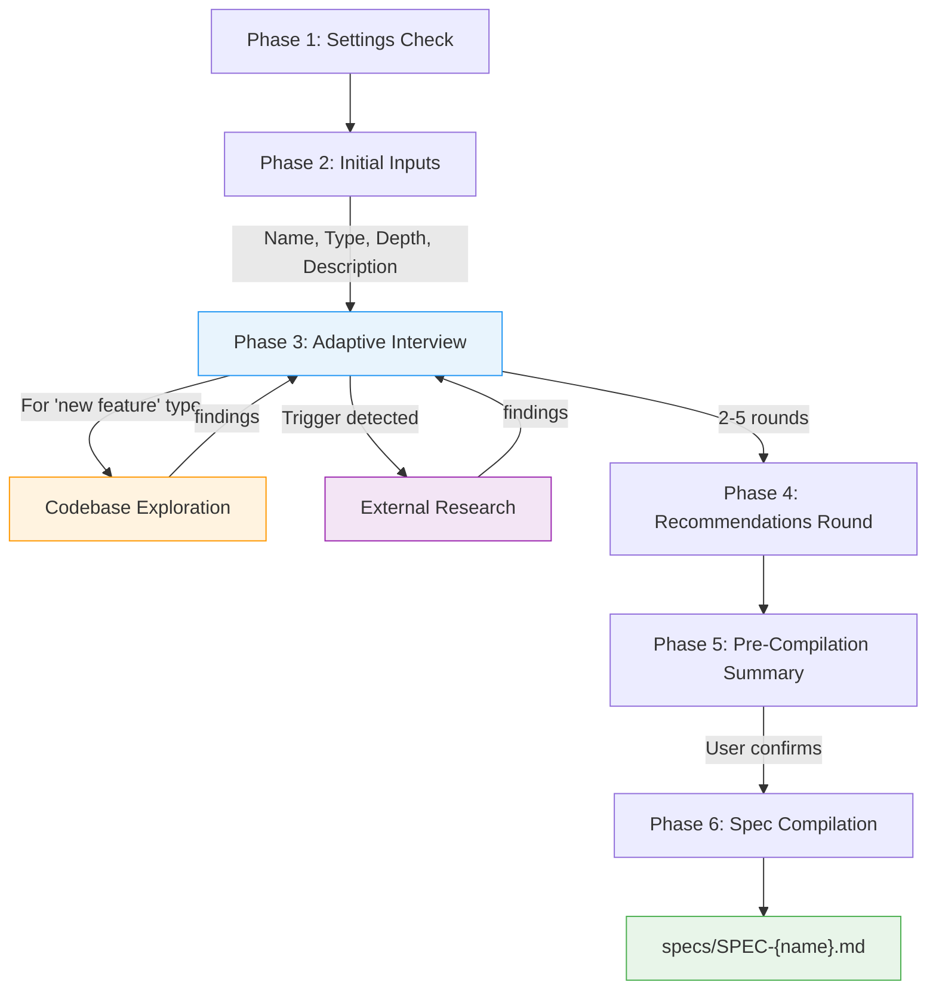

### Depth Levels

The interview adapts based on the requested depth level:

| Level | Rounds | Questions | Focus | Output |
|-------|--------|-----------|-------|--------|
| **High-level overview** | 2-3 | 6-10 | Problem, goals, key features, success metrics | Executive summary |
| **Detailed specifications** | 3-4 | 12-18 | Balanced coverage, acceptance criteria, technical constraints | Standard PRD |
| **Full technical documentation** | 4-5 | 18-25 | Deep probing, API endpoints, data models, performance | Comprehensive tech spec |

### Question Categories

Each interview round covers four categories (depth-adjusted):

1. **Problem & Goals** — Problem statement, success metrics, user personas, business value
2. **Functional Requirements** — Features, user stories, acceptance criteria, workflows
3. **Technical Specs** — Architecture, tech stack, data models, APIs, constraints
4. **Implementation** — Phases, dependencies, risks, out-of-scope items

### Proactive Features

- **Recommendation triggers**: Scans user responses for patterns that suggest best-practice recommendations (e.g., mentioning "auth" triggers authentication pattern suggestions)
- **External research**: Can invoke the `researcher` agent for technical documentation, competitive analysis, or compliance requirements
- **Codebase exploration**: For "new feature" type specs, spawns `codebase-explorer` agents (Sonnet) in parallel to discover existing architecture, patterns, and integration points
- **Early exit support**: Users can wrap up early; spec is marked as `Draft (Partial)`

### Spec Templates

Three templates matched to depth levels:

| Template | File | Use Case |
|----------|------|----------|
| High-level | `references/templates/high-level.md` | Executive summaries, stakeholder alignment |
| Detailed | `references/templates/detailed.md` | Standard development specs |
| Full-tech | `references/templates/full-tech.md` | API specs, data models, architecture |

---

## Skill 2: analyze-spec — Quality Gate

### Purpose

Performs systematic quality analysis on an existing spec, identifying inconsistencies, missing information, ambiguities, and structure issues. Provides both a markdown report and an interactive HTML review interface.

### Analysis Categories

| Category | What It Catches | Example |
|----------|----------------|---------|
| **Inconsistencies** | Internal contradictions | Feature named "Search" in one section, "Find" in another |
| **Missing Information** | Expected content absent for depth level | Full-tech spec with no API definitions |
| **Ambiguities** | Vague or multi-interpretable statements | "Users should be able to search quickly" |
| **Structure Issues** | Formatting and organization problems | Missing required sections, orphaned references |

### Severity Levels

| Severity | Definition | Example |
|----------|-----------|---------|
| **Critical** | Would cause implementation failure | Circular dependencies, undefined core requirements |
| **Warning** | Could cause confusion or problems | Vague acceptance criteria, unnamed dependencies |
| **Suggestion** | Quality improvement, not blocking | Inconsistent formatting, missing glossary |

### Output Formats

1. **Markdown report** (`{name}.analysis.md`) — Structured findings with severity, location, and recommendations
2. **Interactive HTML review** (`{name}.analysis.html`) — Browser-based UI for approving/rejecting findings with copy-prompt workflow

### Review Modes

```mermaid
flowchart TD
    A["Spec Analyzed"] --> B{"Choose Review Mode"}
    B --> C["Interactive HTML Review"]
    B --> D["CLI Update Mode"]
    B --> E["Reports Only"]

    C --> F["Open in Browser"]
    F --> G["Approve/Reject Findings"]
    G --> H["Copy Prompt"]
    H --> I["Paste Back → Apply Changes"]

    D --> J["Walk Through Each Finding"]
    J --> K{"Apply / Modify / Skip"}
    K --> |"Apply"| L["Edit spec directly"]
    K --> |"Modify"| M["User provides text → Edit"]
    K --> |"Skip"| N["Record reason, move on"]

    E --> O["Keep reports as-is"]

    style C fill:#e8f4fd,stroke:#2196F3
    style D fill:#fff3e0,stroke:#FF9800
    style E fill:#e0e0e0,stroke:#666
```

---

## Skill 3: create-tasks — Spec Decomposition

### Purpose

Transforms a specification into a dependency-ordered set of Claude Code native Tasks, each with categorized acceptance criteria, testing requirements, and metadata for tracking.

### Workflow (8 Phases)

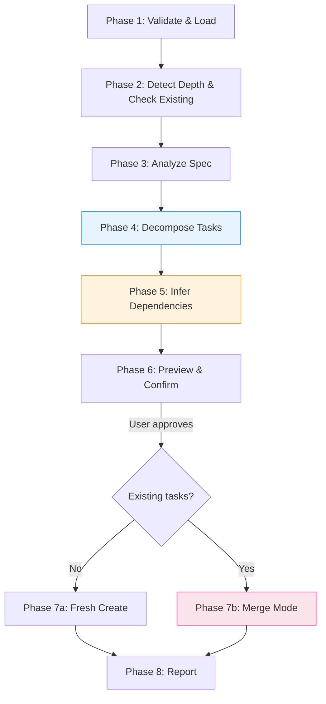

### Task Decomposition Pattern

Each feature is decomposed using a standard layer pattern:

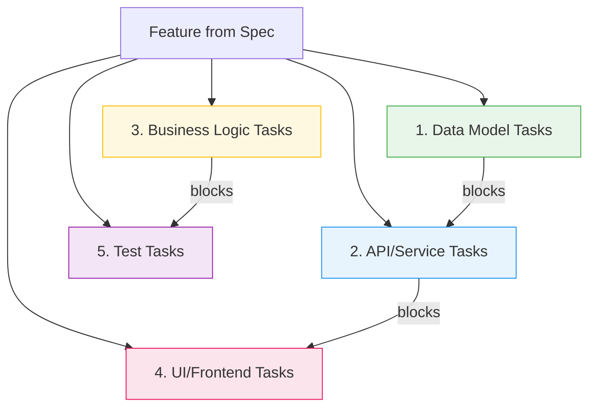

### Depth-Based Granularity

| Spec Depth | Tasks per Feature | Granularity | Example |
|-----------|-------------------|-------------|---------|
| High-level | 1-2 | Feature-level | "Implement user authentication" |
| Detailed | 3-5 | Functional decomposition | "Implement login endpoint", "Add password validation" |
| Full-tech | 5-10 | Technical decomposition | "Create User model", "Implement POST /auth/login", "Add auth middleware" |

### Task Structure

Each generated task includes:

```markdown
subject: "Create User data model"              # Imperative mood
description: |
  {What needs to be done}

  **Acceptance Criteria:**

  _Functional:_
  - [ ] Core behavior criteria

  _Edge Cases:_
  - [ ] Boundary condition criteria

  _Error Handling:_
  - [ ] Error scenario criteria

  _Performance:_ (if applicable)
  - [ ] Performance target criteria

  **Testing Requirements:**
  - Unit: Schema validation
  - Integration: Database persistence

  Source: specs/SPEC-Auth.md Section 7.3
activeForm: "Creating User data model"
metadata:
  priority: critical|high|medium|low
  complexity: XS|S|M|L|XL
  spec_path: "specs/SPEC-Auth.md"
  feature_name: "User Authentication"
  task_uid: "specs/SPEC-Auth.md:user-auth:model:001"
  task_group: "user-authentication"
```

### Merge Mode

When re-running on an updated spec, tasks are intelligently merged:

```mermaid
flowchart TD
    RE["Re-run /create-tasks"] --> MATCH{"Match by task_uid"}
    MATCH --> |"Match found"| STATUS{"Task status?"}
    STATUS --> |"completed"| PRESERVE["Preserve — never modify"]
    STATUS --> |"in_progress"| SKIP["Preserve status, optionally update description"]
    STATUS --> |"pending"| UPDATE["Update description if changed"]
    MATCH --> |"No match (new)"| CREATE["Create new task"]
    MATCH --> |"No match (existing)"| OBSOLETE{"Potentially obsolete"}
    OBSOLETE --> KEEP["Keep if user confirms"]
    OBSOLETE --> MARK["Mark completed if user confirms"]

    style PRESERVE fill:#e8f5e9,stroke:#4CAF50
    style SKIP fill:#fff8e1,stroke:#FFC107
    style UPDATE fill:#e8f4fd,stroke:#2196F3
    style CREATE fill:#bbdefb,stroke:#1976D2
    style OBSOLETE fill:#fce4ec,stroke:#e91e63
```

### Dependency Inference

Dependencies are automatically inferred from three sources:

1. **Layer dependencies**: Data Model → API → UI → Tests
2. **Phase dependencies**: Phase 2 tasks blocked by Phase 1 completion
3. **Explicit spec dependencies**: Section 10 of spec ("requires X" → blockedBy X)
4. **Cross-feature dependencies**: Shared data models, services, auth

---

## Skill 4: execute-tasks — Autonomous Execution

### Purpose

Orchestrates autonomous task execution with wave-based parallelism, session management, shared execution context, and adaptive verification. After user confirmation, it runs without further interaction until all tasks are complete.

### Core Principles

1. **Understand before implementing** — Read context, conventions, and earlier task learnings
2. **Follow existing patterns** — Match the codebase's coding style and conventions
3. **Verify against criteria** — Walk through each acceptance criterion, run tests
4. **Report honestly** — PASS only when all Functional criteria and tests pass

### Orchestration Loop (10 Steps)

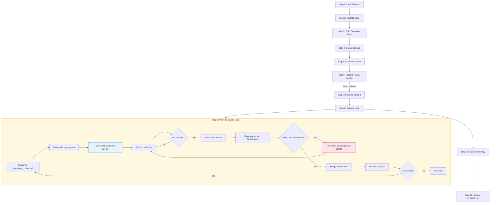

### Wave-Based Parallelism

Tasks are organized into waves using topological sort:

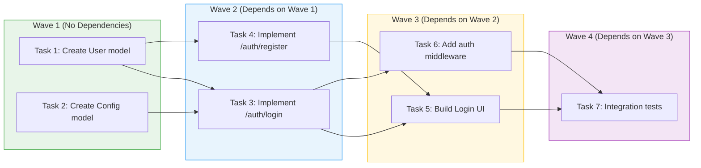

### Task Executor 4-Phase Workflow

Each task is executed by a `task-executor` agent (Opus) through:

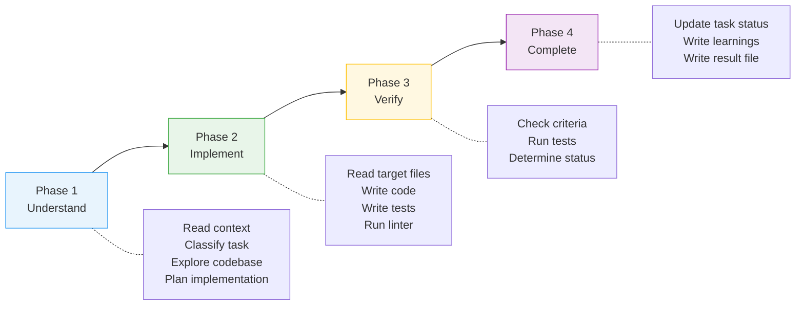

### Verification Status

| Condition | Status | What Happens |
|-----------|--------|--------------|
| All Functional criteria pass + Tests pass | **PASS** | Task marked `completed` |
| All Functional pass + Tests pass + Edge/Error/Perf issues | **PARTIAL** | Task stays `in_progress`, may retry |
| Any Functional criterion fails | **FAIL** | Task stays `in_progress`, retry with failure context |
| Any test failure | **FAIL** | Task stays `in_progress`, retry with failure context |

### Session Management

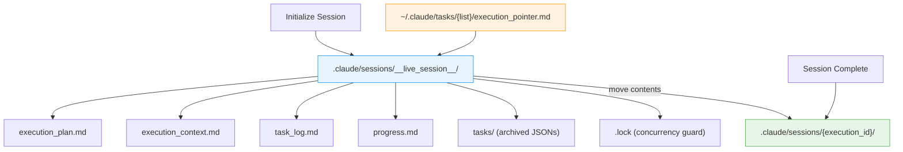

### Key Execution Features

| Feature | Description |
|---------|-------------|
| **Background agents** | Agents run via `run_in_background: true`, returning ~3 lines instead of full output |
| **Result file protocol** | Each agent writes a compact `result-task-{id}.md` (~18 lines) as completion signal |
| **Per-task context isolation** | Each agent writes to `context-task-{id}.md`, orchestrator merges after wave |
| **Configurable parallelism** | Default 5 concurrent agents; overridable via `--max-parallel` |
| **Configurable retries** | Default 3 attempts; overridable via `--retries` |
| **Retry with context** | Failed tasks include previous failure details for different approach |
| **Interrupted session recovery** | Stale sessions archived; in_progress tasks reset to pending |
| **Concurrency guard** | `.lock` file prevents concurrent execution sessions |
| **Token usage tracking** | Per-task `duration_ms` and `total_tokens` extracted via TaskOutput |

---

## Agent Inventory

```mermaid
flowchart TD
    subgraph Agents["SDD Tools Agents"]
        CE["codebase-explorer\n(Sonnet)"]
        R["researcher\n(Opus)"]
        SA["spec-analyzer\n(Opus)"]
        TE["task-executor\n(Opus)"]
    end

    CS["/create-spec"] --> |"spawns for 'new feature'"| CE
    CS --> |"spawns for research"| R
    AS["/analyze-spec"] --> |"launches"| SA
    ET["/execute-tasks"] --> |"launches × N per wave"| TE

    CE --> |"Read, Glob, Grep, Bash"| CODEBASE["Codebase"]
    R --> |"WebSearch, WebFetch, Context7"| WEB["External Sources"]
    SA --> |"AskUserQuestion, Read, Write, Edit"| SPEC["Spec Files"]
    TE --> |"Read, Write, Edit, Glob, Grep, Bash"| CODE["Source Code"]

    style CE fill:#e8f4fd,stroke:#2196F3
    style R fill:#f3e5f5,stroke:#9C27B0
    style SA fill:#fce4ec,stroke:#e91e63
    style TE fill:#e8f5e9,stroke:#4CAF50
```

| Agent | Model | Tools | Role | Spawned By |
|-------|-------|-------|------|------------|
| **codebase-explorer** | Sonnet | Read, Glob, Grep, Bash | Explores codebase for patterns and architecture | `/create-spec` (parallel, for "new feature" type) |
| **researcher** | Opus | WebSearch, WebFetch, Context7 | Technical and domain research for specs | `/create-spec` (on-demand or proactive) |
| **spec-analyzer** | Opus | AskUserQuestion, Read, Write, Edit, Glob, Grep | Quality analysis with interactive resolution | `/analyze-spec` |
| **task-executor** | Opus | Read, Write, Edit, Glob, Grep, Bash, TaskGet/Update/List | Autonomous 4-phase task implementation | `/execute-tasks` (N per wave, background) |

### Model Tiering Rationale

- **Sonnet for codebase-explorer**: These agents perform broad, parallelizable search work. Sonnet is cost-effective for exploration where reasoning depth is less critical than breadth.
- **Opus for researcher, spec-analyzer, task-executor**: These agents require deep reasoning — synthesizing research findings, analyzing spec quality, and implementing code with verification. Opus's stronger reasoning is essential.

---

## Hooks & Automation

### auto-approve-session.sh

| Property | Value |
|----------|-------|
| **Event** | `PreToolUse` |
| **Triggers** | Write, Edit, Bash operations |
| **Purpose** | Auto-approves file operations within `.claude/sessions/` directories |
| **Timeout** | 5 seconds |

This hook enables task-executor agents to write execution context files, result files, and session artifacts without requiring user approval for each operation. Without it, every file write during autonomous execution would pause for user confirmation — breaking the autonomous execution loop.

---

## End-to-End Workflow Walkthrough

### Example: Building a User Authentication Feature

```mermaid
sequenceDiagram
    participant U as Developer
    participant CS as /create-spec
    participant CE as codebase-explorer
    participant AS as /analyze-spec
    participant SA as spec-analyzer
    participant CT as /create-tasks
    participant ET as /execute-tasks
    participant TE as task-executor × N
    participant TM as Task Manager

    Note over U,TM: Phase 1: Specification

    U->>CS: /create-spec
    CS->>U: What type? "New feature"
    CS->>U: What depth? "Detailed"
    CS->>CE: Explore auth patterns (Sonnet × 2)
    CE-->>CS: Architecture findings
    CS->>U: Interview rounds (3-4 rounds, 12-18 questions)
    CS->>U: Recommendations round
    CS->>U: Pre-compilation summary — confirm?
    U->>CS: Confirmed
    CS-->>U: specs/SPEC-User-Auth.md created

    Note over U,TM: Phase 2: Quality Gate (Optional)

    U->>AS: /analyze-spec specs/SPEC-User-Auth.md
    AS->>SA: Analyze spec (Opus)
    SA-->>AS: 8 findings (2 critical, 4 warning, 2 suggestion)
    AS->>U: Choose review mode
    U->>AS: CLI Update Mode
    AS->>U: Walk through each finding
    U->>AS: Apply 6, Skip 2
    AS-->>U: Spec updated, report saved

    Note over U,TM: Phase 3: Decomposition

    U->>CT: /create-tasks specs/SPEC-User-Auth.md
    CT->>CT: Detect depth: Detailed
    CT->>CT: Extract features, decompose, infer dependencies
    CT->>U: Preview: 15 tasks, 22 dependencies
    U->>CT: Confirmed
    CT-->>U: 15 tasks created with dependency chains
    CT-->>TM: Tasks visible in Kanban board

    Note over U,TM: Phase 4: Execution

    U->>ET: /execute-tasks --task-group user-authentication
    ET->>ET: Build wave plan: Wave 1 (3 tasks), Wave 2 (5), Wave 3 (4), Wave 4 (3)
    ET->>U: Execution plan — confirm?
    U->>ET: Confirmed

    loop Each Wave
        ET->>TE: Launch N background agents
        TE->>TE: Understand → Implement → Verify → Complete
        TE-->>ET: result-task-{id}.md (PASS/PARTIAL/FAIL)
        ET->>ET: Merge context, form next wave
        ET-->>TM: Task status updates (real-time)
    end

    ET-->>U: Session summary: 14 PASS, 1 PARTIAL
```

### Step-by-Step

1. **`/create-spec`** — Developer initiates spec creation. The skill asks about type ("new feature"), depth ("detailed"), and runs a 3-4 round interview. For new features, it spawns codebase explorers to understand existing patterns. It produces `specs/SPEC-User-Auth.md`.

2. **`/analyze-spec specs/SPEC-User-Auth.md`** (optional but recommended) — The spec is analyzed for quality issues. The developer reviews findings via CLI or HTML interface, fixing critical issues before task generation.

3. **`/create-tasks specs/SPEC-User-Auth.md`** — The spec is decomposed into 15 dependency-ordered tasks. Each task has categorized acceptance criteria (Functional, Edge Cases, Error Handling, Performance), testing requirements, and metadata. The developer previews and confirms.

4. **`/execute-tasks --task-group user-authentication`** — The orchestrator builds a wave plan and launches background task-executor agents in parallel. Each agent reads the execution context, implements the task, verifies against acceptance criteria, and reports results. The Task Manager dashboard shows real-time progress.

---

## Data Flow Diagrams

### Artifact Flow Through the Pipeline

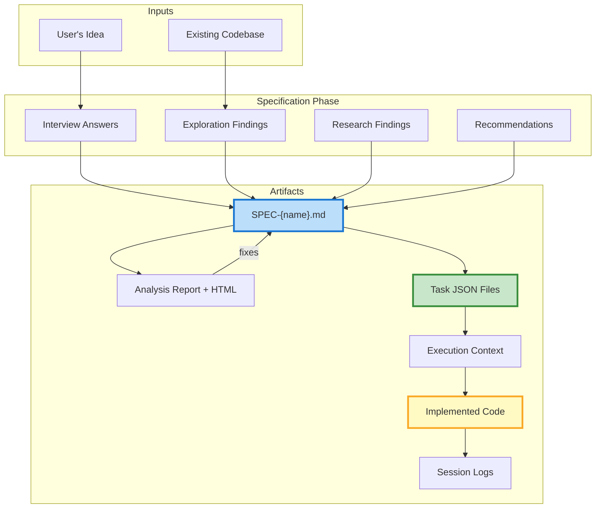

### Execution Context Sharing

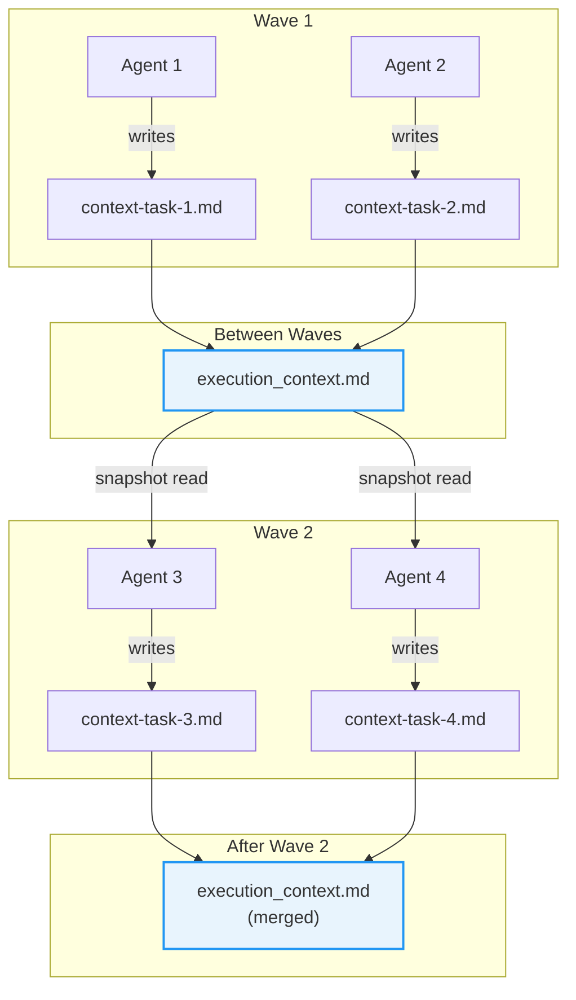

---

## Use Cases & Benefits

### Use Cases

| Use Case | How SDD Tools Helps |
|----------|-------------------|
| **Greenfield feature development** | Structured spec → decomposed tasks → parallel autonomous execution |
| **Complex multi-component features** | Dependency inference ensures correct build order; wave parallelism maximizes throughput |
| **Team alignment** | Spec serves as single source of truth; analyze-spec catches ambiguities before coding starts |
| **Iterative spec refinement** | Merge mode preserves completed work when specs evolve; analyze-spec provides quality gate |
| **Compliance-sensitive projects** | Research agent gathers regulatory requirements; specs document acceptance criteria for audit |
| **Reducing rework** | Verification against acceptance criteria catches issues before they compound |
| **Onboarding new team members** | Specs document the "why" behind features; execution context captures implementation decisions |

### Benefits for Developers

| Benefit | Without SDD Tools | With SDD Tools |
|---------|-------------------|----------------|
| **Requirements capture** | Ad-hoc prompts, lost context | Structured spec with testable criteria |
| **Task planning** | Manual decomposition | Automatic dependency-aware decomposition |
| **Parallel execution** | Sequential, one task at a time | Wave-based concurrent agent execution |
| **Verification** | Manual review or trust | Automated criterion-by-criterion verification |
| **Knowledge sharing** | Each task starts from scratch | Shared execution context across tasks |
| **Progress visibility** | Checking git log | Real-time Task Manager dashboard |
| **Spec evolution** | Start over or manual diff | Merge mode preserves completed work |
| **Quality assurance** | Post-hoc review | Pre-implementation spec analysis |

---

## Integration with Other Plugins

### Standalone Design

sdd-tools is a **standalone plugin** — it has no external plugin dependencies. This was achieved by the `refactor(sdd-tools): make plugin standalone by removing core-tools dependency` commit, which gave sdd-tools its own `codebase-explorer` agent instead of relying on core-tools.

### Consumed By Other Plugins

| Plugin | How It Uses sdd-tools |
|--------|---------------------|
| **tdd-tools** | `/execute-tdd-tasks` routes non-TDD tasks to the `task-executor` agent from sdd-tools |
| **tdd-tools** | `/create-tdd-tasks` reads tasks created by `/create-tasks` and generates TDD pairs |

### Integration with Task Manager

The Task Manager dashboard (`apps/task-manager/`) provides real-time visualization:


---

## Configuration & Settings

Settings are configured in `.claude/agent-alchemy.local.md` (not committed):

| Setting | Type | Default | Description |
|---------|------|---------|-------------|
| `execute-tasks.max-parallel` | number | 5 | Maximum concurrent agents per wave |
| Custom output path | string | `specs/` | Directory for spec output |
| Author name | string | — | Attribution in spec metadata |

### Command-Line Arguments

| Skill | Arguments | Description |
|-------|-----------|-------------|
| `/create-spec` | (none) | Starts interactive interview |
| `/analyze-spec` | `[spec-path]` | Path to spec file |
| `/create-tasks` | `[spec-path]` | Path to spec file |
| `/execute-tasks` | `[task-id] [--task-group <group>] [--retries <n>] [--max-parallel <n>]` | Flexible execution control |

---

## Reference File Inventory

| Skill | File | Purpose | Contents |
|-------|------|---------|----------|
| create-spec | `interview-questions.md` | Question bank | Questions organized by category and depth |
| create-spec | `recommendation-triggers.md` | Trigger patterns | Keyword patterns for proactive recommendations |
| create-spec | `recommendation-format.md` | Recommendation templates | How to present recommendations to users |
| create-spec | `codebase-exploration.md` | Exploration procedure | 4-step codebase exploration workflow |
| create-spec | `templates/high-level.md` | Spec template | Streamlined executive overview |
| create-spec | `templates/detailed.md` | Spec template | Standard PRD with all sections |
| create-spec | `templates/full-tech.md` | Spec template | Extended with API specs, data models |
| analyze-spec | `analysis-criteria.md` | Depth checklists | What to check at each depth level |
| analyze-spec | `common-issues.md` | Issue patterns | Known issue patterns with examples |
| analyze-spec | `report-template.md` | Report format | Markdown report structure |
| analyze-spec | `html-review-guide.md` | HTML generation | Instructions for HTML review output |
| create-tasks | `decomposition-patterns.md` | Decomposition rules | Feature-to-task decomposition patterns |
| create-tasks | `dependency-inference.md` | Dependency rules | Automatic dependency inference logic |
| create-tasks | `testing-requirements.md` | Test mappings | Task type → test type mappings |
| execute-tasks | `orchestration.md` | Orchestration loop | Full 10-step execution procedure |
| execute-tasks | `execution-workflow.md` | Phase workflow | 4-phase agent workflow details |
| execute-tasks | `verification-patterns.md` | Verification rules | Task classification and pass/fail criteria |
