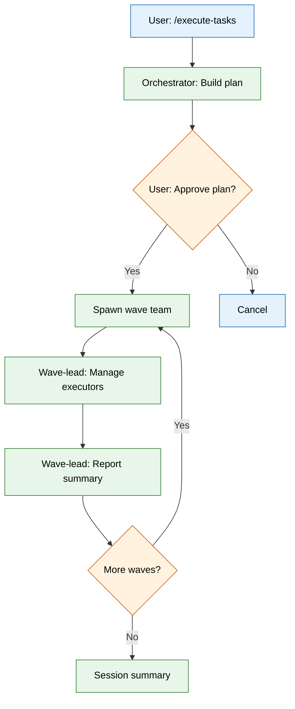
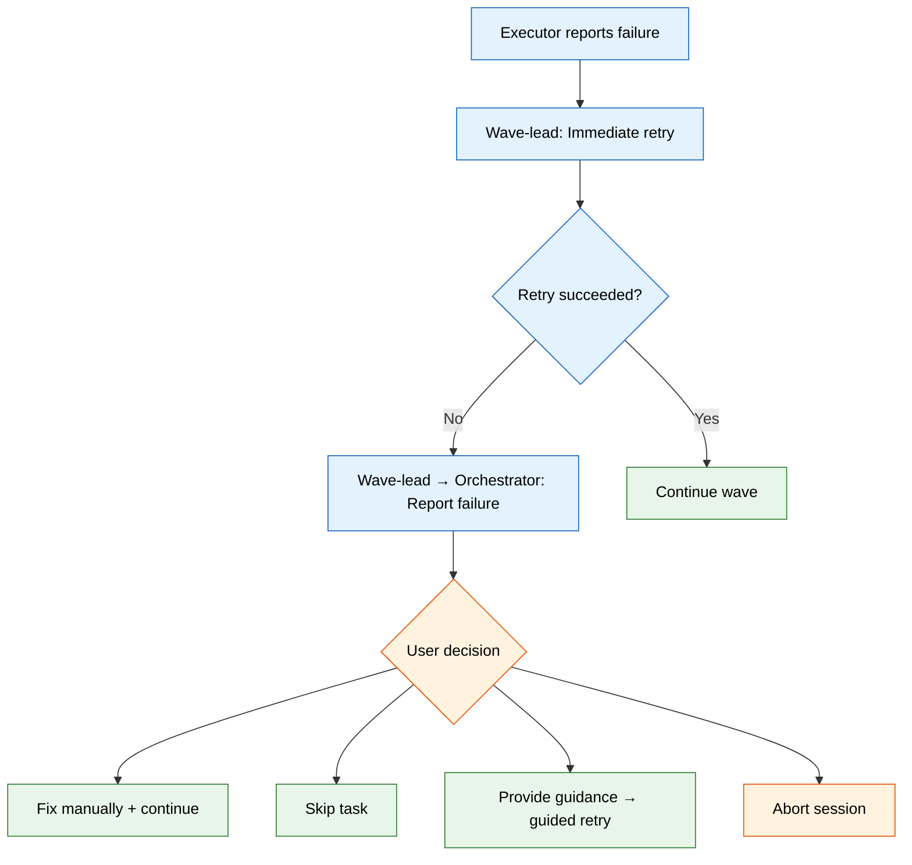

# SDD Execute Tasks Rewrite PRD

**Version**: 1.0
**Author**: Stephen Sequenzia
**Date**: 2026-02-23
**Status**: Draft
**Spec Type**: New Product
**Spec Depth**: Full Technical Documentation
**Description**: Full rewrite of the SDD orchestration execution engine. The current engine (~2,600 lines across 10+ files) is too complex and unstable. This rewrite replaces the file-based signaling architecture with Claude Code's native Agent Team system, using message-passing coordination instead of filesystem watching.

---

## 1. Executive Summary

The SDD execution engine (`/execute-tasks`) is the runtime core of the Spec-Driven Development pipeline, responsible for taking a set of tasks with dependency relationships and executing them autonomously via parallel agent teams. The current engine relies on shell scripts (`fswatch`/`inotifywait`) for completion detection and file-based protocols for inter-agent communication, which has proven unreliable and overly complex. This rewrite replaces the entire coordination model with Claude Code's native Agent Team system (`TeamCreate`/`SendMessage`), introducing a 3-tier agent hierarchy (Orchestrator → Wave Lead → Context Manager + Task Executors) that is simpler, more stable, and more resilient.

## 2. Problem Statement

### 2.1 The Problem

The current SDD orchestration engine is too complex and unstable for production use. Its core architecture treats agents as "fire and forget" background processes, then uses filesystem events to detect when they complete. This file-based signaling model requires two shell scripts (115 and 133 lines), custom hooks for file validation, a complex merge pipeline for context sharing, and extensive error handling for partial file writes, missing files, and race conditions.

### 2.2 Current State

The current engine (`execute-tasks` skill, version 0.3.1) operates as follows:

- **Orchestration**: A single 10-step loop coordinates all execution from the orchestrator skill's prompt
- **Agent launching**: Task executors are spawned as background `Task` agents with `run_in_background: true`
- **Completion detection**: `watch-for-results.sh` (fswatch/inotifywait) with automatic fallback to `poll-for-results.sh` (adaptive 5s-30s polling)
- **Result protocol**: Each agent writes a `result-task-{id}.md` file (~18 lines); a PostToolUse hook (`validate-result.sh`) validates format on write
- **Context sharing**: Per-task `context-task-{id}.md` files are merged into shared `execution_context.md` by the orchestrator after each wave, using a 6-section structured schema with compaction and deduplication
- **Retry**: 3-tier escalation (Standard → Context Enrichment → User Escalation) with batched retry processing
- **Concurrency**: `.lock` file prevents concurrent sessions; file conflict detection defers tasks modifying the same files

**Key files**:

| File | Lines | Role |
|------|-------|------|
| `SKILL.md` | 293 | Skill entry point |
| `references/orchestration.md` | ~1,235 | 10-step orchestration loop |
| `agents/task-executor.md` | 414 | Opus-tier task agent |
| `scripts/watch-for-results.sh` | 115 | Event-driven completion detection |
| `scripts/poll-for-results.sh` | 133 | Polling fallback |
| `hooks/auto-approve-session.sh` | 75 | PreToolUse auto-approval |
| `hooks/validate-result.sh` | 100 | PostToolUse result validation |

### 2.3 Impact Analysis

The instability of the execution engine directly blocks the SDD pipeline. When completion detection fails:

- **Silent hangs**: The orchestrator waits indefinitely for result files that were written but not detected by fswatch
- **Partial wave completion**: Some agents' results are detected, others are missed, causing inconsistent state
- **Cascading timeouts**: The 8-minute Bash timeout for detection scripts triggers recovery paths that add further complexity
- **Context corruption**: Failed merges or partial writes to `execution_context.md` degrade context quality for subsequent waves

The complexity also creates a maintenance burden: any change to the orchestration logic requires understanding the interaction between the 10-step loop, shell scripts, hook validation, and file-based protocols — a cognitive load that inhibits iteration.

### 2.4 Business Value

The execution engine is the terminal artifact in the SDD pipeline (`/create-spec` → spec → `/create-tasks` → tasks → `/execute-tasks` → code). If execution is unreliable, the entire pipeline's value proposition — autonomous code generation from specifications — is undermined. A stable, simpler engine enables confident multi-wave execution of complex specs, which is the primary use case for the SDD tools plugin.

## 3. Goals & Success Metrics

### 3.1 Primary Goals

1. **Replace file-based signaling with message-based coordination** using Claude Code's native Agent Team system (`TeamCreate`, `SendMessage`, `TaskOutput`)
2. **Reduce architectural complexity** by eliminating shell scripts, file-based protocols, and the 6-section merge pipeline
3. **Improve resilience** with automatic wave-lead crash recovery, per-task timeouts, and graceful degradation under API rate limits
4. **Maintain functional parity** for the end user — the `/execute-tasks` command interface, task filtering, and session artifacts remain familiar

### 3.2 Success Metrics

| Metric | Current Baseline | Target | Measurement Method |
|--------|------------------|--------|-------------------|
| Orchestration code size | ~2,600 lines (10+ files) | < 1,500 lines | Line count of skill + references + agents |
| Shell script dependencies | 2 scripts (248 lines) | 0 scripts | File inventory |
| Completion detection reliability | Intermittent failures (fswatch misses) | 100% (message-based) | Execute 10 multi-wave sessions without detection failure |
| Wave execution success rate | ~80% (estimated from retry patterns) | > 95% first-attempt pass rate | Session logs across 20 executions |
| New failure recovery modes | 0 (no wave-lead crash handling) | 2 (wave-lead crash retry + per-task timeout) | Feature verification |

### 3.3 Non-Goals

- **Changing the task format**: Tasks produced by `/create-tasks` remain compatible — same JSON structure, same `blockedBy` relationships, same metadata fields
- **Changing the spec format**: The input spec format is untouched — this rewrite only affects execution
- **Real-time streaming of per-task progress**: Wave-level progress events are sufficient; per-line code generation streaming is out of scope
- **Multi-session concurrency**: Only one execution session at a time per project (same as current)

## 4. User Research

### 4.1 Target Users

#### Primary Persona: SDD Pipeline User

- **Role/Description**: Developer using the full SDD pipeline (`/create-spec` → `/create-tasks` → `/execute-tasks`) to generate code from specifications
- **Goals**: Execute a set of tasks autonomously with minimal intervention, verify results, and iterate
- **Pain Points**: Execution hangs on completion detection, unclear error messages when waves fail, excessive session artifacts to debug
- **Context**: Invokes `/execute-tasks` after task generation, monitors progress, intervenes only on escalation
- **Technical Proficiency**: High — understands task dependencies, wave parallelism, and agent coordination

#### Secondary Persona: Plugin Developer

- **Role/Description**: Developer maintaining or extending the SDD tools plugin
- **Goals**: Modify orchestration behavior, add new features, debug execution issues
- **Pain Points**: Current architecture requires understanding 10+ files and the interaction between shell scripts, hooks, and file protocols
- **Context**: Reads and modifies skill files, agent definitions, and hook scripts

### 4.2 User Journey Map

```
[Tasks created] --> [/execute-tasks] --> [Review plan] --> [Confirm] --> [Monitor waves] --> [Handle escalations] --> [Review results]
     |                    |                  |                |                |                     |                     |
     v                    v                  v                v                v                     v                     v
  Task JSON          Load & plan         Wave breakdown    "Proceed?"     Progress events     Fix/skip/guide/abort    Session summary
```

### 4.3 User Workflows

#### Workflow 1: Standard Execution



#### Workflow 2: Failure Escalation



## 5. Functional Requirements

### 5.1 Feature: 3-Tier Agent Hierarchy

**Priority**: P0 (Critical)
**Complexity**: High

#### User Stories

**US-001**: As an SDD pipeline user, I want the execution engine to use Claude Code's native team coordination so that execution doesn't depend on unreliable filesystem watching.

**Acceptance Criteria**:
- [ ] Each wave spawns a dedicated Agent Team via `TeamCreate`
- [ ] Wave-lead agent coordinates task executors via `SendMessage` (no file-based signaling)
- [ ] Context Manager agent per wave handles execution context distribution and collection
- [ ] Task executor agents use the 4-phase workflow (Understand, Implement, Verify, Report)
- [ ] All inter-agent communication uses `SendMessage` with structured protocols
- [ ] No shell scripts are required for execution coordination

**Technical Notes**:
- Agent hierarchy: Orchestrator (skill) → Wave Lead (team lead) → Context Manager + Task Executor × N (team members)
- The orchestrator runs in the user's conversation context; wave teams run as spawned agents
- Each wave team is independent — no cross-wave team membership

**Edge Cases**:

| Scenario | Expected Behavior |
|----------|-------------------|
| Wave with single task | Wave-lead still spawns context manager + one executor (consistent pattern) |
| Wave with 0 unblocked tasks after filtering | Skip wave, proceed to next (or finish) |
| All tasks in a wave fail | Wave-lead reports all failures; orchestrator presents batch escalation to user |

**Error Handling**:

| Error Condition | System Action |
|-----------------|---------------|
| TeamCreate fails | Orchestrator retries once; on second failure, marks wave tasks as failed and offers user the choice to retry or skip |
| SendMessage fails between agents | Agent retries delivery; on persistent failure, wave-lead logs the issue and marks affected task as failed |
| Task tool spawn fails | Wave-lead logs error, marks task as failed, continues with remaining executors |

---

### 5.2 Feature: Wave Lead Agent

**Priority**: P0 (Critical)
**Complexity**: High

#### User Stories

**US-002**: As an SDD pipeline user, I want each wave to be managed by an autonomous wave-lead agent so that wave execution is self-contained and recoverable.

**Acceptance Criteria**:
- [ ] Wave-lead launches context manager as first team member
- [ ] Wave-lead launches task executor agents for each task in the wave
- [ ] Wave-lead manages pacing autonomously using `max_parallel` as a guideline (not a rigid cap)
- [ ] Wave-lead collects structured results from all executors via `SendMessage`
- [ ] Wave-lead handles immediate retry (1 attempt) for failed executors before escalating
- [ ] Wave-lead reports wave summary to orchestrator via `SendMessage` including: tasks passed, tasks failed, duration, key decisions
- [ ] Wave-lead manages TaskUpdate calls (marks tasks `in_progress`, `completed`, `failed`)
- [ ] Wave-lead model is configurable (default: Opus, override: Sonnet)

**Technical Notes**:
- Wave-lead receives: task list for this wave, execution context snapshot, wave number, max_parallel hint
- Wave-lead produces: wave summary message to orchestrator, TaskUpdate state changes
- Wave-lead lifecycle: created per wave, destroyed after wave completes (no persistent wave-leads)

**Edge Cases**:

| Scenario | Expected Behavior |
|----------|-------------------|
| Executor finishes before others | Wave-lead acknowledges result immediately; does not wait for batch |
| All executors fail | Wave-lead reports all failures to orchestrator for user escalation |
| Rate limit hit during agent spawning | Staggered spawning with backoff (see graceful degradation requirement) |
| Wave-lead itself crashes | Orchestrator detects via TaskOutput, resets wave tasks to pending, spawns new wave team |

---

### 5.3 Feature: Context Manager Agent

**Priority**: P0 (Critical)
**Complexity**: High

#### User Stories

**US-003**: As an SDD pipeline user, I want a dedicated context manager per wave so that execution context is intelligently summarized, distributed, and collected without complex file-based merge pipelines.

**Acceptance Criteria**:
- [ ] Context manager reads main `execution_context.md` at wave start
- [ ] Context manager derives a relevant summary of session context up to the current wave
- [ ] Context manager distributes summary to all task executors via `SendMessage`
- [ ] Task executors send key decisions, insights, and patterns back to context manager during execution
- [ ] Context manager summarizes collected information at wave end
- [ ] Context manager updates main `execution_context.md` with new wave section
- [ ] Context manager model is configurable (default: Sonnet, override: Opus)

**Technical Notes**:
- `execution_context.md` is organized by waves (not the current 6-section schema)
- Context manager has Read/Write access to the session directory
- Context manager is a team member (not the team lead) — wave-lead coordinates its lifecycle
- Context distribution happens before task executors begin work

**Edge Cases**:

| Scenario | Expected Behavior |
|----------|-------------------|
| Empty execution_context.md (first wave) | Context manager distributes minimal context: "This is the first wave. No prior context available." |
| Very large execution_context.md (many prior waves) | Context manager summarizes aggressively; includes only relevant patterns, decisions, and conventions |
| Context manager crashes | Wave-lead detects; executors proceed without distributed context; wave-lead writes a minimal context entry for the wave |
| Executor sends context update after context manager has already written | Context manager handles late arrivals if still alive; otherwise updates are lost (acceptable — not critical data) |

---

### 5.4 Feature: Task Executor Agent (Revised)

**Priority**: P0 (Critical)
**Complexity**: Medium

#### User Stories

**US-004**: As an SDD pipeline user, I want task executors to implement code changes using a 4-phase workflow and communicate results via structured messages so that execution quality is maintained without file-based protocols.

**Acceptance Criteria**:
- [ ] Executors follow 4-phase workflow: Understand, Implement, Verify, Report
- [ ] Executors send structured result message to wave-lead via `SendMessage`
- [ ] Result message includes: status (PASS/PARTIAL/FAIL), summary, files_modified, verification_results, issues, context_contribution
- [ ] Executors send context contribution (decisions, patterns, insights) to context manager via separate `SendMessage`
- [ ] Executors run at Opus model tier
- [ ] Executors operate with `bypassPermissions` mode for implementation autonomy

**Technical Notes**:
- Executors are team members spawned by the wave-lead
- Each executor receives: task description, acceptance criteria, context summary (from context manager), and any relevant metadata
- The structured result protocol replaces the current `result-task-{id}.md` file format

**Structured Result Protocol**:
```
STATUS: PASS | PARTIAL | FAIL
SUMMARY: Brief description of what was accomplished
FILES_MODIFIED:
- path/to/file1.ts (created)
- path/to/file2.ts (modified)
VERIFICATION:
- [PASS] Criterion 1 description
- [PASS] Criterion 2 description
- [FAIL] Criterion 3 description
ISSUES:
- Issue description (if any)
CONTEXT_CONTRIBUTION:
- Key decision or insight worth sharing with other tasks
```

**Edge Cases**:

| Scenario | Expected Behavior |
|----------|-------------------|
| Executor exceeds per-task timeout | Wave-lead terminates executor, marks task as failed, triggers retry |
| Executor produces PARTIAL result | Wave-lead treats as failure for retry purposes but preserves partial work |
| Executor modifies unexpected files | Accepted — verification phase should catch unintended changes |

---

### 5.5 Feature: Simplified Orchestration Loop

**Priority**: P0 (Critical)
**Complexity**: Medium

#### User Stories

**US-005**: As an SDD pipeline user, I want a streamlined orchestration loop so that execution is predictable and the codebase is maintainable.

**Acceptance Criteria**:
- [ ] Orchestration loop has 9 steps (reduced from 10 with simplified internals)
- [ ] Step 1 (Load & Filter): Support `--task-group` and `--phase` filtering
- [ ] Step 2 (Validate): Detect empty tasks, all completed, blocked tasks, circular dependencies
- [ ] Step 3 (Plan): Topological sort, wave assignment, priority ordering within waves
- [ ] Step 4 (Settings): Read configuration from `.claude/agent-alchemy.local.md`
- [ ] Step 5 (Confirm): Present execution plan to user, get approval via `AskUserQuestion`
- [ ] Step 6 (Init Session): Create session directory with `execution_context.md` and `task_log.md`
- [ ] Step 7 (Execute Waves): For each wave, create team → wave-lead manages → collect summary → update context
- [ ] Step 8 (Summarize): Generate session summary, archive session
- [ ] Step 9 (Update CLAUDE.md): Review execution context for project-wide changes

**Technical Notes**:
- Steps 1-6 run in the orchestrator skill's prompt (user's context)
- Step 7 delegates to wave teams — orchestrator waits for each wave-lead's summary
- Steps 8-9 run in the orchestrator after all waves complete
- The orchestrator passes accumulated `execution_context.md` content to each wave-lead's prompt as cross-wave context bridge

**Edge Cases**:

| Scenario | Expected Behavior |
|----------|-------------------|
| User cancels at Step 5 | Clean exit, no tasks modified |
| All tasks already completed | Report summary at Step 2, no execution |
| Circular dependencies detected | Break at weakest link (fewest blockers), warn user in plan |
| `--phase 1,2` filtering | Execute tasks in spec phases 1 and 2 only |

---

### 5.6 Feature: 2-Tier Retry Model

**Priority**: P1 (High)
**Complexity**: Medium

#### User Stories

**US-006**: As an SDD pipeline user, I want a simple retry model so that transient failures are recovered automatically and persistent failures are escalated to me promptly.

**Acceptance Criteria**:
- [ ] Tier 1 (Autonomous Retry): Wave-lead immediately retries a failed executor (1 attempt by default, configurable via `max_retries`)
- [ ] Retry includes failure context from the original attempt
- [ ] Wave-lead can request additional context from Context Manager to inform the retry
- [ ] Tier 2 (User Escalation): After retry exhaustion, wave-lead reports failure to orchestrator
- [ ] Orchestrator presents failure to user via `AskUserQuestion` with options: Fix manually, Skip, Provide guidance, Abort session
- [ ] "Provide guidance" option triggers a guided retry with user-supplied instructions
- [ ] Guided retry failures re-prompt the user (loop until resolution)

**Technical Notes**:
- Retry is immediate per executor (not batched) — as soon as an executor reports failure, the wave-lead can retry while other executors are still running
- Escalation flows: Executor → Wave-lead (retry) → Wave-lead (escalate via SendMessage) → Orchestrator (present to user) → Orchestrator (relay decision to wave-lead) → Wave-lead (act on decision)
- The wave-lead continues managing other running executors during the escalation round-trip

**Edge Cases**:

| Scenario | Expected Behavior |
|----------|-------------------|
| Multiple executors fail simultaneously | Each is retried independently and immediately |
| Retry succeeds | Wave-lead updates task to completed, continues normally |
| User selects "Abort session" | Orchestrator signals wave-lead to terminate remaining executors; all remaining tasks logged as failed |
| User selects "Fix manually" | Orchestrator waits for user confirmation that the fix is done; marks task as completed (manual) |

---

### 5.7 Feature: Wave-Lead Crash Recovery

**Priority**: P1 (High)
**Complexity**: Medium

#### User Stories

**US-007**: As an SDD pipeline user, I want the orchestrator to automatically recover when a wave-lead agent crashes so that a single agent failure doesn't require restarting the entire session.

**Acceptance Criteria**:
- [ ] Orchestrator monitors wave-lead via `TaskOutput` with appropriate timeout
- [ ] On wave-lead crash or timeout, orchestrator resets wave tasks to pending (using TaskUpdate)
- [ ] Orchestrator spawns a new wave team for the reset tasks
- [ ] Recovery is automatic — no user intervention required unless the retry also fails
- [ ] If second wave-lead also crashes, orchestrator escalates to user

**Technical Notes**:
- "Crash" includes: agent timeout, unexpected termination, malformed summary response
- Wave tasks that were already completed by executors before the crash retain their completed status
- Only `in_progress` or `pending` tasks within the wave are reset

---

### 5.8 Feature: Per-Task Timeout Management

**Priority**: P1 (High)
**Complexity**: Medium

*Agent Recommendation — accepted during interview.*

#### User Stories

**US-008**: As an SDD pipeline user, I want per-task timeouts so that stuck executors are proactively terminated rather than blocking the entire wave.

**Acceptance Criteria**:
- [ ] Wave-lead monitors each executor's duration
- [ ] Default timeout is complexity-based (simple tasks: 5 min, standard tasks: 10 min, complex tasks: 20 min)
- [ ] Timeout triggers proactive termination via `TaskStop`
- [ ] Timed-out tasks are treated as failures and enter the retry flow
- [ ] Timeout values can be overridden per task via task metadata

**Technical Notes**:
- Complexity classification can use task description length, number of acceptance criteria, or explicit `complexity` metadata field
- The wave-lead tracks start time for each executor and checks against timeout threshold

---

### 5.9 Feature: Graceful Degradation Under Rate Limits

**Priority**: P1 (High)
**Complexity**: Low

*Agent Recommendation — accepted during interview.*

#### User Stories

**US-009**: As an SDD pipeline user, I want the engine to handle API rate limits gracefully so that spawning many agents doesn't crash the wave.

**Acceptance Criteria**:
- [ ] Wave-lead implements staggered agent spawning (brief delay between launches)
- [ ] Rate limit errors during agent creation trigger retry with exponential backoff
- [ ] Partial team formation is handled — if some executors fail to spawn, wave-lead proceeds with those that succeeded and retries spawning the rest
- [ ] Spawning failures are logged to the wave summary

**Technical Notes**:
- Stagger delay should be configurable but default to a small value (e.g., 1-2 seconds between spawns)
- The Claude Code Task tool handles some rate limiting internally, but rapid parallel spawns can still trigger limits

---

### 5.10 Feature: Progress Reporting Hooks

**Priority**: P2 (Medium)
**Complexity**: Low

#### User Stories

**US-010**: As a developer using the task-manager dashboard, I want wave-level progress events so that I can monitor execution status in real-time without reading log files.

**Acceptance Criteria**:
- [ ] PreToolUse hook emits event when wave team is created (wave started)
- [ ] PostToolUse hook emits event when wave summary is received (wave completed with task statuses)
- [ ] Session start and session complete events are emitted
- [ ] Events are written to a known location that the task-manager dashboard can watch

**Technical Notes**:
- Event format should be lightweight (JSON lines or similar)
- The task-manager dashboard already watches `~/.claude/tasks/` via Chokidar — progress events could be written to the session directory
- Progress hooks are optional and should not affect execution if they fail

---

### 5.11 Feature: Auto-Approve Hook (Revised)

**Priority**: P2 (Medium)
**Complexity**: Low

#### User Stories

**US-011**: As an SDD pipeline user, I want session directory writes to be auto-approved so that context manager updates to `execution_context.md` don't trigger permission prompts.

**Acceptance Criteria**:
- [ ] PreToolUse hook auto-approves Write/Edit operations to the session directory (`*/.claude/sessions/*`)
- [ ] Auto-approval covers `execution_context.md`, `task_log.md`, and `session_summary.md`
- [ ] Hook never exits non-zero (safe error handling)
- [ ] Hook has debug logging capability via environment variable

**Technical Notes**:
- This is a simplified version of the current `auto-approve-session.sh` — same concept, reduced scope
- Consider whether agents running with `bypassPermissions` mode eliminate the need for this hook entirely

---

### 5.12 Feature: Dry-Run Mode

**Priority**: P2 (Medium)
**Complexity**: Low

*Agent Recommendation — accepted during interview.*

#### User Stories

**US-012**: As an SDD pipeline user, I want a dry-run mode so that I can validate the execution plan and team structure without spawning real agents or modifying any files.

**Acceptance Criteria**:
- [ ] `--dry-run` flag skips Step 7 (Execute Waves) entirely
- [ ] Dry-run output shows: wave breakdown, task assignments per wave, agent model tiers, estimated team composition per wave
- [ ] No tasks are modified (no TaskUpdate calls)
- [ ] No session directory is created
- [ ] Dry-run completes in seconds (no agent spawning)

---

### 5.13 Feature: Session Management (Simplified)

**Priority**: P1 (High)
**Complexity**: Low

#### User Stories

**US-013**: As an SDD pipeline user, I want simple session management with basic recovery so that interrupted sessions can be resumed without complex cleanup logic.

**Acceptance Criteria**:
- [ ] Session ID generated from task-group + timestamp (e.g., `auth-feature-20260223-143022`)
- [ ] Session directory: `.claude/sessions/__live_session__/`
- [ ] Session artifacts: `execution_context.md`, `task_log.md`, `session_summary.md` (3 files only)
- [ ] On interrupted session detection: offer user choice to resume or start fresh via `AskUserQuestion`
- [ ] Resume: reset `in_progress` tasks to pending, continue from next unblocked wave
- [ ] Fresh start: archive interrupted session to `.claude/sessions/{session_id}/`, create new session
- [ ] No `.lock` file — detection is based on presence of `__live_session__/` with content

---

### 5.14 Feature: Configuration System

**Priority**: P2 (Medium)
**Complexity**: Low

#### User Stories

**US-014**: As an SDD pipeline user, I want execution behavior to be configurable so that I can tune agent tiers and retry behavior for my project.

**Acceptance Criteria**:
- [ ] Configuration read from `.claude/agent-alchemy.local.md` YAML frontmatter
- [ ] Configurable settings:
  - `execute-tasks.max_parallel` (default: 5) — hint to wave-lead for pacing
  - `execute-tasks.max_retries` (default: 1) — autonomous retries before user escalation
  - `execute-tasks.wave_lead_model` (default: `opus`) — model for wave-lead agents
  - `execute-tasks.context_manager_model` (default: `sonnet`) — model for context manager agents
- [ ] CLI arguments override settings file values
- [ ] Missing settings file is not an error — defaults are used

---

## 6. Non-Functional Requirements

### 6.1 Performance Requirements

| Metric | Requirement | Measurement Method |
|--------|-------------|-------------------|
| Wave setup time | < 30 seconds from wave start to all executors launched | Timestamp comparison in wave summary |
| Context distribution time | < 15 seconds from context manager start to all executors receiving context | Wave-lead tracking |
| Orchestrator overhead per wave | < 60 seconds (plan review, team creation, summary processing) | Session log timestamps |
| Total execution overhead | < 10% of total wall time spent on coordination vs. actual implementation | Session summary analysis |

### 6.2 Reliability Requirements

| Metric | Requirement |
|--------|-------------|
| Completion detection | 100% — message-based delivery eliminates detection failures |
| Wave-lead crash recovery | Automatic retry within 60 seconds of crash detection |
| Per-task timeout enforcement | Stuck executors terminated within 30 seconds of timeout |
| Session recovery | Resume from any interruption point without data loss |

### 6.3 Scalability Requirements

| Metric | Requirement |
|--------|-------------|
| Max tasks per session | 100+ (limited by API rate limits, not architecture) |
| Max tasks per wave | Limited only by `max_parallel` hint and API rate limits |
| Max waves per session | Unlimited (determined by dependency graph depth) |
| Context file growth | Linear with wave count; context manager summarizes to prevent unbounded growth |

### 6.4 Maintainability Requirements

| Metric | Requirement |
|--------|-------------|
| Total orchestration code | < 1,500 lines across all files |
| Shell script count | 0 (all coordination via Claude Code primitives) |
| Agent definition count | 3 new agents (wave-lead, context-manager, task-executor) |
| Hook count | ≤ 2 (auto-approve + progress, both optional) |

## 7. Technical Architecture

### 7.1 System Overview

```
┌─────────────────────────────────────────────────────────────────────┐
│                     User's Conversation Context                      │
│  ┌─────────────────────────────────────────────────────────────┐    │
│  │              Orchestrator Skill (/execute-tasks)             │    │
│  │  Steps 1-6: Load, Validate, Plan, Settings, Confirm, Init  │    │
│  │  Step 7: Spawn wave teams (sequential)                      │    │
│  │  Steps 8-9: Summarize, Update CLAUDE.md                     │    │
│  └─────────────────────────┬───────────────────────────────────┘    │
└────────────────────────────┼────────────────────────────────────────┘
                             │ TeamCreate + SendMessage
                             ▼
┌─────────────────────────────────────────────────────────────────────┐
│                     Wave Team (per wave)                              │
│                                                                      │
│  ┌───────────────────────────────────────────┐                      │
│  │           Wave Lead Agent (Opus)           │                      │
│  │  - Launches context manager + executors    │                      │
│  │  - Collects results via SendMessage        │                      │
│  │  - Handles immediate retries               │                      │
│  │  - Manages TaskUpdate state changes        │                      │
│  │  - Reports wave summary to orchestrator    │                      │
│  └────────┬──────────────────┬────────────────┘                     │
│           │                  │                                       │
│    ┌──────▼──────┐    ┌──────▼──────────────────────────┐           │
│    │   Context    │    │     Task Executors (Opus) × N    │          │
│    │   Manager    │◄──►│  - 4-phase workflow               │         │
│    │  (Sonnet)    │    │  - Structured result protocol     │         │
│    │              │    │  - Context contribution to CM     │         │
│    └──────────────┘    └─────────────────────────────────┘          │
│                                                                      │
└─────────────────────────────────────────────────────────────────────┘
                             │
                             ▼
┌─────────────────────────────────────────────────────────────────────┐
│                     Session Directory                                │
│  .claude/sessions/__live_session__/                                  │
│  ├── execution_context.md    (cross-wave learning, grouped by wave) │
│  ├── task_log.md             (per-task status, duration, tokens)    │
│  └── session_summary.md      (final execution report)              │
└─────────────────────────────────────────────────────────────────────┘
```

### 7.2 Tech Stack

| Layer | Technology | Justification |
|-------|------------|---------------|
| Orchestration | Claude Code Skill (markdown-as-code) | Existing plugin system; runs in user's context |
| Agent coordination | `TeamCreate` / `SendMessage` / `TaskOutput` | Native Claude Code primitives; message-passing replaces file-based signaling |
| Task state | `TaskList` / `TaskUpdate` / `TaskGet` | Native Claude Code task management; replaces custom state tracking |
| Agent spawning | `Task` tool with `team_name` parameter | Team-aware agent spawning |
| Session storage | Local filesystem (`.claude/sessions/`) | Persistent session artifacts for history and debugging |
| Configuration | YAML frontmatter in `.claude/agent-alchemy.local.md` | Existing settings convention |

### 7.3 Agent Definitions

#### Agent: Wave Lead (`wave-lead.md`)

```yaml
---
model: opus  # configurable via settings
tools:
  - Task
  - TaskList
  - TaskGet
  - TaskUpdate
  - TaskStop
  - SendMessage
  - Read
  - Glob
  - Grep
---
```

**Responsibilities**:
1. Receive wave assignment (task list, max_parallel hint, wave number) from orchestrator
2. Launch Context Manager agent as first team member
3. Wait for Context Manager to signal readiness (context distributed to session)
4. Launch Task Executor agents (staggered spawning for rate limit protection)
5. Monitor executor progress via `SendMessage` (collect structured results)
6. Handle immediate retry for failed executors (request additional context from Context Manager if needed)
7. Manage TaskUpdate calls (in_progress, completed, failed) for wave tasks
8. After all executors complete: signal Context Manager to finalize context, collect wave metrics
9. Send structured wave summary to orchestrator via `SendMessage`
10. Handle shutdown request from orchestrator

#### Agent: Context Manager (`context-manager.md`)

```yaml
---
model: sonnet  # configurable via settings
tools:
  - Read
  - Write
  - SendMessage
  - Glob
  - Grep
---
```

**Responsibilities**:
1. Read `execution_context.md` from session directory
2. Derive a concise, relevant summary of all prior wave learnings
3. Distribute context summary to all task executors via `SendMessage`
4. Signal wave-lead that context distribution is complete
5. Receive context contributions from executors during execution (decisions, patterns, insights, issues)
6. On wave completion signal from wave-lead: summarize all collected contributions
7. Append new wave section to `execution_context.md`
8. Handle shutdown request

#### Agent: Task Executor (`task-executor.md`)

```yaml
---
model: opus
tools:
  - Read
  - Write
  - Edit
  - Glob
  - Grep
  - Bash
  - SendMessage
---
```

**Responsibilities** (4-phase workflow):
1. **Understand**: Read task description, acceptance criteria, and distributed context. Analyze requirements.
2. **Implement**: Make code changes (Write, Edit, Bash). Follow project conventions from context.
3. **Verify**: Check acceptance criteria. Run tests if applicable. Validate changes.
4. **Report**: Send structured result to wave-lead. Send context contribution to context manager.

### 7.4 Communication Protocols

#### Orchestrator → Wave Lead (via Task prompt)

```
WAVE ASSIGNMENT
Wave: {N} of {total}
Max Parallel: {max_parallel}
Max Retries: {max_retries}
Session Dir: {session_dir_path}

TASKS:
- Task #{id}: {subject}
  Description: {description}
  Acceptance Criteria: {criteria}
  Priority: {priority}
  Metadata: {metadata}

CROSS-WAVE CONTEXT:
{Summary of execution_context.md content for context bridge}
```

#### Wave Lead → Orchestrator (via SendMessage)

```
WAVE SUMMARY
Wave: {N}
Duration: {total_wave_duration}
Tasks Passed: {count}
Tasks Failed: {count}

RESULTS:
- Task #{id}: {status} ({duration}, {tokens})
  Summary: {brief}
  Files: {file_list}
- Task #{id}: {status} ({duration}, {tokens})
  Summary: {brief}
  Files: {file_list}

FAILED TASKS (for escalation):
- Task #{id}: {failure_reason}
  Retry Attempted: {yes/no}
  Retry Result: {outcome}

CONTEXT UPDATES:
{Summary of new learnings from this wave — for orchestrator's awareness}
```

#### Task Executor → Wave Lead (via SendMessage)

```
TASK RESULT
Task: #{id}
Status: PASS | PARTIAL | FAIL
Summary: {what was accomplished}
Files Modified:
- {path} (created|modified|deleted)
Verification:
- [PASS|FAIL] {criterion}
Issues:
- {issue description, if any}
```

#### Task Executor → Context Manager (via SendMessage)

```
CONTEXT CONTRIBUTION
Task: #{id}
Decisions:
- {key decision made during implementation}
Patterns:
- {pattern discovered or followed}
Insights:
- {useful information for other tasks}
Issues:
- {problems encountered, workarounds applied}
```

#### Context Manager → Task Executors (via SendMessage)

```
SESSION CONTEXT
Wave: {N}

PROJECT SETUP:
{summarized tech stack, build commands, environment}

CONVENTIONS:
{coding style, naming, import patterns discovered in prior waves}

KEY DECISIONS:
{architecture choices from prior waves}

KNOWN ISSUES:
{problems encountered, workarounds to be aware of}
```

### 7.5 Session Directory Layout

```
.claude/sessions/__live_session__/
├── execution_context.md    # Cross-wave learning (grouped by wave)
├── task_log.md             # Per-task status table
└── session_summary.md      # Final report (written in Step 8)

.claude/sessions/{session-id}/  # Archived sessions
├── execution_context.md
├── task_log.md
└── session_summary.md
```

#### execution_context.md Format

```markdown
# Execution Context

## Wave 1
**Completed**: 2026-02-23T14:30:22Z
**Tasks**: #1 (PASS), #2 (PASS), #3 (FAIL)

### Learnings
- Runtime: Node.js 22 with pnpm
- Tests: `__tests__/{name}.test.ts` alongside source
- Imports: Named exports, barrel files for public API

### Key Decisions
- [Task #1] Used Zod for runtime validation over io-ts
- [Task #2] Placed shared types in `src/types/` directory

### Issues
- Vitest mock.calls behavior differs from Jest — reset between tests

---

## Wave 2
**Completed**: 2026-02-23T14:45:10Z
**Tasks**: #4 (PASS), #5 (PASS)

### Learnings
- API routes follow `src/api/{resource}/route.ts` pattern

### Key Decisions
- [Task #4] Used middleware pattern for auth validation

### Issues
- None
```

#### task_log.md Format

```markdown
# Task Log

| Task | Subject | Status | Attempts | Duration | Tokens |
|------|---------|--------|----------|----------|--------|
| #1 | Create data models | PASS | 1 | 2m 10s | 52K |
| #2 | Implement API handler | PASS | 1 | 3m 01s | 67K |
| #3 | Add validation | FAIL | 2 | 4m 12s | 71K |
| #4 | Create auth middleware | PASS | 1 | 2m 45s | 48K |
```

### 7.6 Orchestration Loop Detail

#### Step 1: Load & Filter Tasks

```
Input: TaskList + CLI args (--task-group, --phase, task-id)
Output: Filtered task set
Exit: If no tasks match filters

Filter sequence:
1. --task-group → match metadata.task_group
2. --phase → match metadata.spec_phase (comma-separated integers)
3. task-id → single task mode

Tasks without spec_phase metadata excluded when --phase is active.
```

#### Step 2: Validate State

```
Input: Filtered task set
Output: Validation result
Exit: If empty, all completed, or no unblocked tasks

Checks:
- Empty task list → suggest /create-tasks
- All completed → report summary
- No unblocked tasks → report blocking chains
- Circular dependencies → detect and report
```

#### Step 3: Build Execution Plan

```
Input: Task dependencies, max_parallel setting
Output: Wave assignments with priority ordering

Procedure:
3a. Resolve max_parallel: CLI > settings > default (5)
3b. Topological wave assignment:
    - Wave 1: tasks with no blockedBy
    - Wave N: tasks whose ALL blockedBy are in waves 1..N-1
3c. Within-wave priority sort:
    1. critical > high > medium > low > unprioritized
    2. Ties: "unblocks most others" first
3d. Circular dependency breaking: weakest link (fewest blockers)
```

#### Step 4: Check Settings

```
Input: .claude/agent-alchemy.local.md
Output: Execution preferences (max_parallel, max_retries, model overrides)
Non-blocking: proceeds with defaults if file missing
```

#### Step 5: Present Plan & Confirm

```
Input: Execution plan
Output: User confirmation

Display:
- Total task count, wave count
- Per-wave breakdown with task subjects and priorities
- Agent model tiers
- Estimated team composition per wave

AskUserQuestion: "Proceed with execution?" / "Cancel"
```

#### Step 6: Initialize Session

```
Input: Task group, timestamp
Output: Session directory with initial files

Procedure:
1. Generate session ID: {task-group}-{YYYYMMDD}-{HHMMSS}
2. Check for existing __live_session__/ content:
   - If found: offer resume or fresh start via AskUserQuestion
   - Resume: reset in_progress tasks to pending, continue
   - Fresh start: archive to .claude/sessions/interrupted-{timestamp}/
3. Create __live_session__/ with:
   - execution_context.md (empty template)
   - task_log.md (header only)
```

#### Step 7: Execute Waves

```
For each wave:
  7a. Identify unblocked tasks (refresh via TaskList)
  7b. Create wave team via TeamCreate
  7c. Spawn wave-lead agent with wave assignment in prompt
  7d. Wait for wave-lead summary via SendMessage (foreground Task)
  7e. Process wave summary:
      - Update task_log.md with results
      - Handle failed tasks requiring user escalation
      - Emit progress events (if hooks enabled)
  7f. Repeat until no more unblocked tasks
```

#### Step 8: Session Summary

```
Input: task_log.md, execution_context.md
Output: session_summary.md, archived session

Summary includes:
- Total pass/fail/partial counts
- Total execution time
- Per-wave breakdown
- Failed task list with reasons
- Key decisions made during execution

Archive: Move __live_session__/ contents to .claude/sessions/{session-id}/
```

#### Step 9: Update CLAUDE.md

```
Input: execution_context.md
Output: CLAUDE.md edits (if warranted)

Only update if meaningful project-wide changes occurred:
- New dependencies added
- New patterns established
- Architecture decisions made
- New commands or build steps discovered
```

### 7.7 Technical Constraints

| Constraint | Impact | Mitigation |
|------------|--------|------------|
| Claude Code API rate limits | Rapid agent spawning may be throttled | Staggered spawning with backoff in wave-lead |
| TeamCreate is relatively new | Potential undocumented limitations | Graceful fallback patterns; test extensively |
| SendMessage delivery is not guaranteed instant | Small delays between agent sends | Wave-lead uses polling pattern (check for messages, process, check again) |
| Agent context window limits | Large tasks may exceed context | Context Manager provides concise summaries; task descriptions should be bounded |
| Max concurrent agents | Platform may limit total active agents | Wave-lead respects max_parallel hint; orchestrator runs waves sequentially |

## 8. Scope Definition

### 8.1 In Scope

- Full rewrite of orchestration skill (`execute-tasks` SKILL.md + references)
- New agent definitions: wave-lead, context-manager, task-executor (revised)
- Session directory management (simplified)
- Configuration system (4 settings)
- Progress reporting hooks (wave-level events)
- Auto-approve hook (simplified)
- Dry-run mode
- Phase filtering (`--phase`)
- Task group filtering (`--task-group`)
- Session recovery (basic — resume or fresh start)
- Backwards compatibility with task JSON format from `/create-tasks`

### 8.2 Out of Scope

- **Changes to `/create-spec` or `/create-tasks`**: These skills are untouched
- **Changes to task JSON format**: Tasks use existing structure with `blockedBy`, metadata, etc.
- **`produces_for` upstream injection**: Dropped — context manager handles information flow
- **File conflict detection**: Dropped — wave-lead coordinates via messages
- **Concurrent session support**: Still single-session per project
- **Per-task streaming progress**: Wave-level events only
- **Task-manager dashboard changes**: Dashboard reads existing task state; progress hooks are additive

### 8.3 Future Considerations

- **Cross-wave-lead communication**: For very large specs, wave-leads could share learnings directly instead of going through the orchestrator
- **Adaptive model tiering**: Automatically downgrade executor model for simple tasks based on complexity classification
- **Persistent context manager**: A single context manager that survives across waves, maintaining session state without file I/O
- **Parallel wave execution**: Run independent wave branches concurrently (requires dependency graph analysis beyond linear topological sort)

## 9. Implementation Plan

### 9.1 Phase 1: Foundation (Orchestrator Loop + Session Management)

**Completion Criteria**: Orchestrator can load tasks, build a plan, present it to the user, create a session directory, and produce a session summary — without executing any waves.

| Deliverable | Description | Technical Tasks | Dependencies |
|-------------|-------------|-----------------|--------------|
| Orchestration skill | New `SKILL.md` with steps 1-6, 8-9 | Write skill with plan/confirm flow, session init, summary generation | None |
| Orchestration reference | New `references/orchestration.md` with step details | Document all step procedures | SKILL.md structure |
| Session management | Init, recovery detection, archival | Create/archive session dirs, interrupted session handling | None |
| Configuration reader | Settings from `.claude/agent-alchemy.local.md` | Parse YAML frontmatter for 4 settings | None |
| Dry-run mode | `--dry-run` flag implementation | Skip Step 7, display plan details only | Orchestration skill |

**Checkpoint Gate**:
- [ ] `--dry-run` mode works end-to-end (load tasks → plan → display → exit)
- [ ] Session directory is created with correct structure
- [ ] Interrupted session is detected and user is prompted
- [ ] Configuration settings are read and applied

---

### 9.2 Phase 2: Wave Execution (Wave Lead + Task Executors)

**Completion Criteria**: Waves execute via team-based coordination. Wave-lead spawns executors, collects results, and reports to orchestrator. Basic retry works.

| Deliverable | Description | Technical Tasks | Dependencies |
|-------------|-------------|-----------------|--------------|
| Wave-lead agent | `agents/wave-lead.md` definition | Define agent prompt, model, tools | Phase 1 |
| Task executor agent | Revised `agents/task-executor.md` | 4-phase workflow with SendMessage protocol | Phase 1 |
| Wave dispatch | Orchestrator Step 7 implementation | TeamCreate per wave, wave-lead prompt construction, summary reception | Phase 1 + agents |
| Structured protocol | Result message format | Define and document executor → wave-lead message format | Agent definitions |
| Task state management | Wave-lead TaskUpdate integration | Wave-lead marks tasks in_progress/completed/failed | Agent definitions |
| 2-tier retry | Immediate retry + user escalation | Wave-lead retry logic, orchestrator escalation flow | Wave dispatch |

**Checkpoint Gate**:
- [ ] Single-wave execution works end-to-end (spawn team → executors implement → results collected → summary reported)
- [ ] Multi-wave execution works (sequential waves with dependency ordering)
- [ ] Failed executor triggers immediate retry by wave-lead
- [ ] User escalation works for persistent failures

---

### 9.3 Phase 3: Context System (Context Manager + Cross-Wave Learning)

**Completion Criteria**: Context is distributed to executors at wave start, collected during execution, and persisted to `execution_context.md` for cross-wave learning.

| Deliverable | Description | Technical Tasks | Dependencies |
|-------------|-------------|-----------------|--------------|
| Context manager agent | `agents/context-manager.md` definition | Define agent prompt, model, tools | Phase 2 |
| Context distribution | Context manager → executor flow | Read execution_context.md, summarize, distribute via SendMessage | Context manager agent |
| Context collection | Executor → context manager flow | Receive contributions during wave, aggregate | Context manager agent |
| Context persistence | Write to execution_context.md | Wave-grouped format, append new wave section | Context distribution |
| Cross-wave bridge | Orchestrator passes context to wave-leads | Include execution_context.md summary in wave-lead prompt | Phase 2 + context persistence |

**Checkpoint Gate**:
- [ ] Context manager distributes session summary to executors before they begin work
- [ ] Executors send context contributions to context manager during execution
- [ ] `execution_context.md` is updated with wave-grouped learnings after each wave
- [ ] Later waves receive context from earlier waves via context manager

---

### 9.4 Phase 4: Resilience (Crash Recovery + Timeouts + Rate Limits)

**Completion Criteria**: The engine handles wave-lead crashes, executor timeouts, and API rate limits without user intervention (except escalation).

| Deliverable | Description | Technical Tasks | Dependencies |
|-------------|-------------|-----------------|--------------|
| Wave-lead crash recovery | Automatic detection and retry | TaskOutput monitoring, task reset, new team spawn | Phase 2 |
| Per-task timeouts | Complexity-based timeout management | Wave-lead tracks executor duration, terminates on timeout | Phase 2 |
| Rate limit handling | Staggered spawning with backoff | Wave-lead implements spawn delays, retry on rate limit errors | Phase 2 |
| Context manager crash handling | Graceful degradation | Wave-lead detects, executors proceed without distributed context | Phase 3 |

**Checkpoint Gate**:
- [ ] Simulated wave-lead crash triggers automatic recovery (new team spawned)
- [ ] Executor exceeding timeout is terminated and retried
- [ ] Rate limit during spawning triggers backoff (not crash)
- [ ] Context manager crash doesn't block wave execution

---

### 9.5 Phase 5: Integration (Hooks + Dashboard + Polish)

**Completion Criteria**: Progress hooks emit wave-level events, auto-approve hook works, and the engine is fully documented.

| Deliverable | Description | Technical Tasks | Dependencies |
|-------------|-------------|-----------------|--------------|
| Auto-approve hook | Simplified session write approval | Rewrite `auto-approve-session.sh` for new session structure | Phase 1 |
| Progress hooks | Wave-level event emission | Create hook that writes progress events to session dir | Phase 2 |
| Task log integration | Orchestrator updates task_log.md | Wave summary → task_log.md rows after each wave | Phase 2 |
| Documentation | Updated CLAUDE.md entries | Document new architecture, agents, configuration | All phases |
| Migration guide | Current → new engine transition | Document breaking changes, new file structure, removed features | All phases |

**Checkpoint Gate**:
- [ ] Auto-approve hook allows autonomous session writes
- [ ] Progress events are emitted for wave start/complete and session start/complete
- [ ] task_log.md is populated with per-task results
- [ ] CLAUDE.md reflects the new architecture
- [ ] Migration guide covers all breaking changes

## 10. Testing Strategy

### 10.1 Test Approach

Given that this is a Claude Code plugin (markdown-as-code), traditional unit testing doesn't apply. Testing focuses on scenario-based verification and dry-run validation.

| Level | Scope | Method | Coverage Target |
|-------|-------|--------|-----------------|
| Agent scenarios | Individual agent behavior | Execute agents in isolation with controlled inputs | All 3 agent types |
| Integration | Full wave lifecycle | Execute single-wave sessions with known task sets | Happy path + all failure modes |
| Regression | Multi-wave sessions | Execute multi-wave specs end-to-end | 5+ session runs without failure |
| Dry-run | Plan validation | `--dry-run` flag verifies plan without execution | All filter combinations |

### 10.2 Test Scenarios

#### Scenario: Happy Path (Single Wave)

| Step | Action | Expected Result |
|------|--------|-----------------|
| 1 | Create 3 tasks with no dependencies | Tasks created |
| 2 | Run `/execute-tasks` | Plan shows 1 wave with 3 tasks |
| 3 | Confirm execution | Wave team spawned |
| 4 | Wait for completion | All 3 tasks pass, session summary generated |

#### Scenario: Multi-Wave with Dependencies

| Step | Action | Expected Result |
|------|--------|-----------------|
| 1 | Create 5 tasks: A, B (blocked by A), C, D (blocked by B, C), E (blocked by D) | Tasks created with dependency chain |
| 2 | Run `/execute-tasks` | Plan shows 3 waves: [A, C], [B], [D], [E] |
| 3 | Confirm and execute | Waves execute sequentially, context flows between waves |

#### Scenario: Executor Failure + Retry

| Step | Action | Expected Result |
|------|--------|-----------------|
| 1 | Create task with acceptance criteria that executor will fail on first attempt | Task created |
| 2 | Execute | Executor fails, wave-lead retries immediately |
| 3 | Observe retry | Either succeeds (task marked completed) or fails again (escalated to user) |

#### Scenario: Wave-Lead Crash Recovery

| Step | Action | Expected Result |
|------|--------|-----------------|
| 1 | Create tasks that will trigger a wave | Tasks created |
| 2 | Simulate wave-lead crash (agent timeout) | Orchestrator detects crash |
| 3 | Observe recovery | Tasks reset to pending, new wave team spawned |

#### Scenario: Phase Filtering

| Step | Action | Expected Result |
|------|--------|-----------------|
| 1 | Create tasks with spec_phase metadata (phases 1, 2, 3) | Tasks created |
| 2 | Run `/execute-tasks --phase 1` | Only phase 1 tasks appear in plan |
| 3 | Execute and verify | Phase 1 tasks execute, phases 2-3 remain pending |

### 10.3 Dry-Run Validation

The dry-run mode serves as a lightweight test harness:

```
/execute-tasks --dry-run
/execute-tasks --dry-run --phase 1
/execute-tasks --dry-run --task-group auth-feature
```

Each invocation should display the plan without modifying any state or spawning agents. Use this to verify plan generation logic before running full executions.

## 11. Deployment & Operations

### 11.1 Deployment Strategy

This is a plugin skill replacement — the new engine replaces the existing `execute-tasks` skill files within the `sdd-tools` plugin.

**Deployment steps**:
1. Replace `skills/execute-tasks/SKILL.md` with new orchestration skill
2. Replace `skills/execute-tasks/references/orchestration.md` with new reference
3. Remove `skills/execute-tasks/scripts/` directory (shell scripts eliminated)
4. Remove `skills/execute-tasks/references/execution-workflow.md` (replaced by new architecture)
5. Keep `skills/execute-tasks/references/verification-patterns.md` (still relevant for executor verification)
6. Add new agents: `agents/wave-lead.md`, `agents/context-manager.md`
7. Replace `agents/task-executor.md` with revised version
8. Update `hooks/hooks.json` with new hook configuration
9. Replace hook scripts with new versions
10. Update plugin version in `plugin.json`

**Rollback plan**: Previous skill files are committed in git. Rollback = `git checkout` the prior version of the `sdd-tools` plugin directory.

### 11.2 Hook Configuration

```json
{
  "hooks": {
    "PreToolUse": [{
      "matcher": "Write|Edit",
      "hooks": [{
        "type": "command",
        "command": "bash ${CLAUDE_PLUGIN_ROOT}/hooks/auto-approve-session.sh",
        "timeout": 5
      }]
    }],
    "PostToolUse": [{
      "matcher": "Write",
      "hooks": [{
        "type": "command",
        "command": "bash ${CLAUDE_PLUGIN_ROOT}/hooks/progress-event.sh",
        "timeout": 5
      }]
    }]
  }
}
```

### 11.3 Monitoring

Progress events are emitted to the session directory and can be consumed by:
- **Task-manager dashboard**: Chokidar watches for progress event files
- **CLI output**: Orchestrator displays wave summaries between waves
- **Session logs**: `task_log.md` provides post-hoc debugging

## 12. Dependencies

### 12.1 Technical Dependencies

| Dependency | Status | Risk if Unavailable |
|------------|--------|---------------------|
| Claude Code `TeamCreate` | Available | Critical — core architecture depends on this |
| Claude Code `SendMessage` | Available | Critical — all agent coordination uses this |
| Claude Code `TaskList`/`TaskUpdate` | Available | Critical — task state management |
| Claude Code `TaskOutput`/`TaskStop` | Available | High — crash detection and timeout enforcement |
| `.claude/agent-alchemy.local.md` | Optional | Low — defaults used if missing |

### 12.2 Cross-Plugin Dependencies

| Plugin | Dependency | Impact |
|--------|------------|--------|
| `create-tasks` (sdd-tools) | Task JSON format compatibility | Tasks must have same `blockedBy`, `metadata.task_group`, `metadata.spec_phase` structure |
| `core-tools` | No direct dependency | None (unlike current engine, no shell scripts to share) |
| `tdd-tools` | `execute-tdd-tasks` routes TDD tasks to different executor | TDD executor routing may need updates for team model |

## 13. Risks & Mitigations

| Risk | Impact | Likelihood | Mitigation Strategy |
|------|--------|------------|---------------------|
| TeamCreate API instability | High | Low | Test extensively; implement retry on team creation failure |
| SendMessage delivery delays | Medium | Medium | Wave-lead uses patient polling pattern; per-task timeouts catch stuck cases |
| Higher API cost from 3-tier agents | Medium | High | Default wave-lead to Opus (configurable to Sonnet); context manager uses Sonnet; monitor token usage per session |
| Context Manager produces poor summaries | Medium | Medium | Context manager uses Sonnet (strong summarization); orchestrator also bridges context directly in wave-lead prompt as backup |
| Wave-lead agent prompt too complex | Medium | Medium | Keep wave-lead instructions focused; externalize complex logic into reference files |
| Rate limit issues with parallel agent spawning | Medium | High | Staggered spawning with backoff built into wave-lead |
| `execute-tdd-tasks` compatibility | Low | Medium | Update TDD execution skill to use new team model in a follow-up |

## 14. Open Questions

| # | Question | Owner | Resolution |
|---|----------|-------|------------|
| 1 | Should agents running with `bypassPermissions` eliminate the need for the auto-approve hook? | Implementation | Test during Phase 5 — if bypassPermissions covers session writes, the hook is unnecessary |
| 2 | What is the maximum number of concurrent agents Claude Code supports in a single team? | Implementation | Test during Phase 2 — may affect max_parallel recommendations |
| 3 | How does `execute-tdd-tasks` adapt to the team model? | Follow-up | TDD skill routes TDD tasks to tdd-executor and non-TDD to task-executor — needs update for team-based dispatch |

## 15. Appendix

### 15.1 Glossary

| Term | Definition |
|------|------------|
| Wave | A group of tasks that can execute in parallel (same topological sort level) |
| Wave Lead | The team-lead agent responsible for managing all executors within a single wave |
| Context Manager | A specialized team-member agent responsible for distributing and collecting execution context within a wave |
| Task Executor | A team-member agent that implements a single task using a 4-phase workflow |
| Orchestrator | The skill running in the user's conversation context that coordinates waves sequentially |
| Structured Protocol | The defined message format for inter-agent communication via SendMessage |
| Session | A single execution run covering one or more waves, producing session artifacts |
| Escalation | The process of reporting a persistent failure to the user for manual resolution |

### 15.2 References

- Current orchestration engine deep-dive: `internal/docs/sdd-orchestration-deep-dive-2026-02-22.md`
- Current execute-tasks skill: `claude/sdd-tools/skills/execute-tasks/`
- Current task-executor agent: `claude/sdd-tools/agents/task-executor.md`
- Claude Code Agent Team documentation: TeamCreate, SendMessage, TaskOutput tools

### 15.3 Change Log

| Version | Date | Author | Changes |
|---------|------|--------|---------|
| 1.0 | 2026-02-23 | Stephen Sequenzia | Initial version |

---

*Document generated by SDD Tools*
