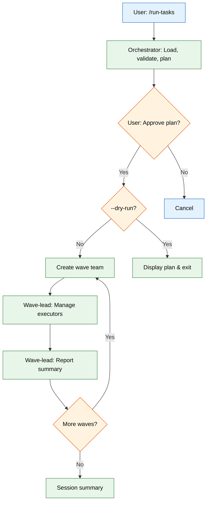
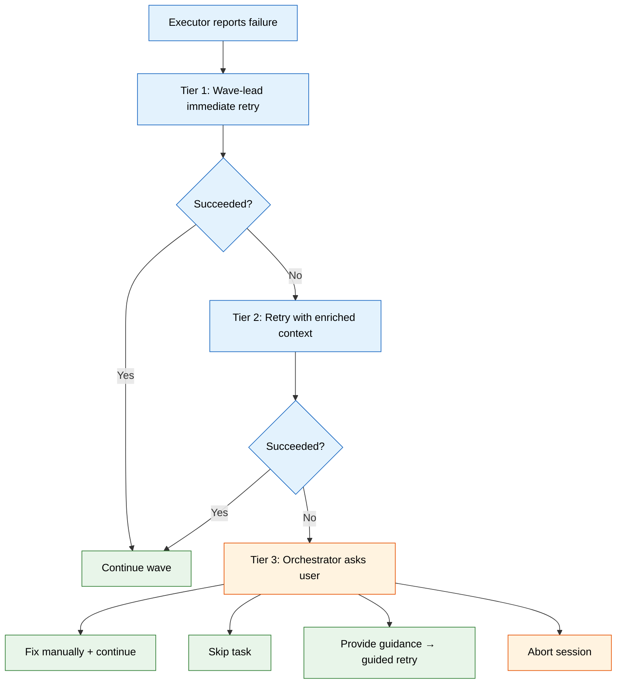

# SDD Run-Tasks Engine PRD

**Version**: 1.0
**Author**: Stephen Sequenzia
**Date**: 2026-02-23
**Status**: Draft
**Spec Type**: New Feature
**Spec Depth**: Full Technical Documentation
**Description**: A brand new execution engine skill (`/run-tasks`) for the sdd-tools plugin that replaces the current `execute-tasks` skill. Uses Claude Code's native Agent Team system (TeamCreate/SendMessage) with a 3-tier agent hierarchy, eliminating all file-based signaling, shell scripts, and complex merge pipelines.

---

## 1. Executive Summary

The `/run-tasks` skill is a new, independent execution engine for the Spec-Driven Development pipeline. It takes a set of tasks with dependency relationships (produced by `/create-tasks`) and executes them autonomously via parallel agent teams organized in waves. The engine uses Claude Code's native Agent Team primitives (`TeamCreate`, `SendMessage`, `TaskOutput`) for all coordination, replacing the current engine's unreliable file-based signaling architecture with message-passing. A 3-tier agent hierarchy (Orchestrator → Wave Lead → Context Manager + Task Executors) provides clean separation of concerns: the orchestrator plans and presents, wave-leads coordinate execution, context managers handle knowledge flow, and executors implement code.

## 2. Problem Statement

### 2.1 The Problem

The current SDD execution engine (`/execute-tasks`, version 0.3.1) is too complex and unstable for production use. Three root causes drive this instability:

1. **File-based signaling unreliability**: The engine uses `fswatch`/`inotifywait` via shell scripts to detect when agents complete work by watching for result files. These filesystem watchers miss events, deliver duplicates, and suffer from platform-specific inconsistencies — causing silent hangs, partial wave completion, and cascading timeouts.

2. **Architectural complexity**: The engine spans ~2,600 lines across 10+ files, including a 10-step orchestration loop (~1,235 lines), two shell scripts for completion detection (248 lines combined), a PostToolUse validation hook, a 6-section context merge pipeline with compaction and deduplication, and a 3-tier retry escalation system with batched processing. Any change requires understanding the interaction between all these components.

3. **Context window pressure**: The entire orchestration loop runs in the user's conversation context, consuming the user's context window with verbose wave summaries, file reads during context merging, progress streaming, and session file manipulation across multi-wave executions.

### 2.2 Current State

The current engine operates as follows:

- **Orchestration**: A 10-step loop defined across `SKILL.md` (293 lines) and `references/orchestration.md` (~1,235 lines)
- **Agent launching**: Task executors spawned as background `Task` agents with `run_in_background: true`
- **Completion detection**: `watch-for-results.sh` (116 lines, fswatch/inotifywait) with fallback to `poll-for-results.sh` (134 lines, adaptive 5s-30s polling)
- **Result protocol**: Each agent writes `result-task-{id}.md` (~18 lines); a PostToolUse hook (`validate-result.sh`, 101 lines) validates format on write, renames malformed files to `.invalid`
- **Context sharing**: Per-task `context-task-{id}.md` files merged into shared `execution_context.md` using a 6-section structured schema with section-based parsing, deduplication, compaction at 10+ entries, and post-merge validation with auto-repair
- **Retry**: 3-tier escalation (Standard → Context Enrichment → User Escalation) with batched processing
- **Concurrency**: `.lock` file prevents concurrent sessions; file conflict detection defers tasks modifying the same files

**Key files being replaced:**

| File | Lines | Role |
|------|-------|------|
| `skills/execute-tasks/SKILL.md` | 293 | Skill entry point |
| `skills/execute-tasks/references/orchestration.md` | ~1,235 | 10-step orchestration loop |
| `skills/execute-tasks/references/execution-workflow.md` | ~381 | Execution workflow reference |
| `agents/task-executor.md` | 414 | Opus-tier task agent |
| `skills/execute-tasks/scripts/watch-for-results.sh` | 116 | Event-driven completion detection |
| `skills/execute-tasks/scripts/poll-for-results.sh` | 134 | Polling fallback |
| `hooks/auto-approve-session.sh` | 75 | PreToolUse auto-approval |
| `hooks/validate-result.sh` | 101 | PostToolUse result validation |

### 2.3 Impact Analysis

The instability of the execution engine directly blocks the SDD pipeline:

- **Silent hangs**: The orchestrator waits indefinitely for result files that were written but not detected by fswatch
- **Partial wave completion**: Some agents' results are detected, others are missed, causing inconsistent state
- **Cascading timeouts**: The 8-minute Bash timeout for detection scripts triggers complex recovery paths
- **Context corruption**: Failed merges or partial writes to `execution_context.md` degrade context quality for subsequent waves
- **Maintenance burden**: Any change requires understanding the interaction between the 10-step loop, shell scripts, hook validation, and file-based protocols — a cognitive load that inhibits iteration

### 2.4 Business Value

The execution engine is the terminal artifact in the SDD pipeline (`/create-spec` → spec → `/create-tasks` → tasks → `/run-tasks` → code). If execution is unreliable, the entire pipeline's value proposition — autonomous code generation from specifications — is undermined. A stable, simpler engine enables confident multi-wave execution of complex specs, which is the primary use case for the SDD tools plugin.

## 3. Goals & Success Metrics

### 3.1 Primary Goals

1. **Replace file-based signaling with message-based coordination** using Claude Code's native Agent Team system (`TeamCreate`, `SendMessage`, `TaskOutput`)
2. **Reduce architectural complexity** by eliminating shell scripts, file-based protocols, and the 6-section merge pipeline
3. **Improve resilience** with a 3-tier retry model, automatic wave-lead crash recovery, per-task timeouts, and graceful degradation under API rate limits
4. **Reduce context window pressure** by delegating wave management to dedicated wave-lead agents rather than running everything in the user's context
5. **Maintain functional parity** for the end user — task filtering, session artifacts, and execution flow remain familiar

### 3.2 Success Metrics

| Metric | Current Baseline | Target | Measurement Method |
|--------|------------------|--------|-------------------|
| Completion detection reliability | Intermittent failures (fswatch misses) | 100% (message-based) | Execute 10 multi-wave sessions without detection failure |
| Shell script dependencies | 2 scripts (248 lines) | 0 scripts | File inventory |
| Wave execution success rate | ~80% (estimated from retry patterns) | > 95% first-attempt pass rate | Session logs across 20 executions |
| New failure recovery modes | 0 (no wave-lead crash handling) | 3 (wave-lead crash retry + per-task timeout + context-enriched retry) | Feature verification |

### 3.3 Non-Goals

- **Changing the task format**: Tasks produced by `/create-tasks` remain compatible — same JSON structure, same `blockedBy` relationships, same metadata fields
- **Changing the spec format**: The input spec format is untouched — this affects execution only
- **TDD task routing**: The `/execute-tdd-tasks` skill has its own execution pipeline; adapting it to the new engine is a separate follow-up spec
- **Task Manager dashboard compatibility**: The dashboard update is a separate follow-up
- **Real-time per-task streaming**: Wave-level progress events are sufficient; per-line code generation streaming is out of scope
- **Multi-session concurrency**: Only one execution session at a time per project (same as current)

## 4. User Research

### 4.1 Target Users

#### Primary Persona: SDD Pipeline User

- **Role/Description**: Developer using the full SDD pipeline (`/create-spec` → `/create-tasks` → `/run-tasks`) to generate code from specifications
- **Goals**: Execute a set of tasks autonomously with minimal intervention, verify results, and iterate
- **Pain Points**: Execution hangs on completion detection, unclear error messages when waves fail, excessive session artifacts to debug, context window filling up during long sessions
- **Context**: Invokes `/run-tasks` after task generation, monitors progress, intervenes only on escalation
- **Technical Proficiency**: High — understands task dependencies, wave parallelism, and agent coordination

#### Secondary Persona: Plugin Developer

- **Role/Description**: Developer maintaining or extending the SDD tools plugin
- **Goals**: Modify orchestration behavior, add new features, debug execution issues
- **Pain Points**: Current architecture requires understanding 10+ files and the interaction between shell scripts, hooks, and file protocols
- **Context**: Reads and modifies skill files, agent definitions, and hook scripts

### 4.2 User Journey Map

```
[Tasks created] --> [/run-tasks] --> [Review plan] --> [Confirm] --> [Monitor waves] --> [Handle escalations] --> [Review results]
     |                  |                |               |               |                    |                     |
     v                  v                v               v               v                    v                     v
  Task JSON         Load & plan     Wave breakdown    "Proceed?"    Progress events     Fix/skip/guide/abort    Session summary
```

### 4.3 User Workflows

#### Workflow 1: Standard Execution



#### Workflow 2: Failure Escalation



## 5. Functional Requirements

### 5.1 Feature: 3-Tier Agent Hierarchy

**Priority**: P0 (Critical)
**Complexity**: High

#### User Stories

**US-001**: As an SDD pipeline user, I want the execution engine to use Claude Code's native team coordination so that execution doesn't depend on unreliable filesystem watching.

**Acceptance Criteria**:
- [ ] Each wave spawns a dedicated Agent Team via `TeamCreate`
- [ ] Wave-lead agent coordinates task executors via `SendMessage` (no file-based signaling)
- [ ] Context Manager agent per wave handles execution context distribution and collection
- [ ] Task executor agents use the 4-phase workflow (Understand, Implement, Verify, Report)
- [ ] All inter-agent communication uses `SendMessage` with structured protocols
- [ ] No shell scripts are required for execution coordination

**Technical Notes**:
- Agent hierarchy: Orchestrator (skill) → Wave Lead (team lead) → Context Manager + Task Executor × N (team members)
- The orchestrator runs in the user's conversation context; wave teams run as spawned agents
- Each wave team is independent — no cross-wave team membership

**Edge Cases**:

| Scenario | Expected Behavior |
|----------|-------------------|
| Wave with single task | Wave-lead still spawns context manager + one executor (consistent pattern) |
| Wave with 0 unblocked tasks after filtering | Skip wave, proceed to next (or finish) |
| All tasks in a wave fail | Wave-lead reports all failures; orchestrator presents batch escalation to user |

**Error Handling**:

| Error Condition | System Action |
|-----------------|---------------|
| TeamCreate fails | Orchestrator retries once; on second failure, marks wave tasks as failed and offers user the choice to retry or skip |
| SendMessage fails between agents | Agent retries delivery; on persistent failure, wave-lead logs the issue and marks affected task as failed |
| Task tool spawn fails | Wave-lead logs error, marks task as failed, continues with remaining executors |

---

### 5.2 Feature: Wave Lead Agent

**Priority**: P0 (Critical)
**Complexity**: High

#### User Stories

**US-002**: As an SDD pipeline user, I want each wave to be managed by an autonomous wave-lead agent so that wave execution is self-contained and recoverable.

**Acceptance Criteria**:
- [ ] Wave-lead launches context manager as first team member
- [ ] Wave-lead launches task executor agents for each task in the wave
- [ ] Wave-lead manages pacing autonomously using `max_parallel` as a guideline (not a rigid cap)
- [ ] Wave-lead collects structured results from all executors via `SendMessage`
- [ ] Wave-lead manages TaskUpdate calls (marks tasks `in_progress`, `completed`, `failed`) as single source of truth
- [ ] Wave-lead handles Tier 1 retry (immediate) and Tier 2 retry (context-enriched) before escalating
- [ ] Wave-lead reports wave summary to orchestrator via `SendMessage` including: tasks passed, tasks failed, duration, key decisions
- [ ] Wave-lead implements staggered agent spawning with exponential backoff for rate limit protection
- [ ] Wave-lead model is configurable (default: Opus)

**Technical Notes**:
- Wave-lead receives: task list for this wave, execution context snapshot, wave number, max_parallel hint, max_retries setting
- Wave-lead produces: wave summary message to orchestrator, TaskUpdate state changes
- Wave-lead lifecycle: created per wave, destroyed after wave completes (no persistent wave-leads)

**Edge Cases**:

| Scenario | Expected Behavior |
|----------|-------------------|
| Executor finishes before others | Wave-lead acknowledges result immediately; does not wait for batch |
| All executors fail | Wave-lead reports all failures to orchestrator for user escalation |
| Rate limit hit during agent spawning | Staggered spawning with exponential backoff; partial team formation handled gracefully |
| Wave-lead itself crashes | Orchestrator detects via TaskOutput, resets wave tasks to pending, spawns new wave team |

---

### 5.3 Feature: Context Manager Agent

**Priority**: P0 (Critical)
**Complexity**: High

#### User Stories

**US-003**: As an SDD pipeline user, I want a dedicated context manager per wave so that execution context is intelligently summarized, distributed, and collected without complex file-based merge pipelines.

**Acceptance Criteria**:
- [ ] Context manager reads main `execution_context.md` at wave start
- [ ] Context manager derives a relevant summary of session context up to the current wave
- [ ] Context manager distributes summary to all task executors via `SendMessage`
- [ ] Context manager signals wave-lead that context distribution is complete
- [ ] Task executors send key decisions, insights, and patterns back to context manager during execution
- [ ] Context manager summarizes collected information at wave end
- [ ] Context manager updates main `execution_context.md` with new wave section
- [ ] Context manager provides enriched context to wave-lead on request (for Tier 2 retry)
- [ ] Context manager model is configurable (default: Sonnet)

**Technical Notes**:
- `execution_context.md` is organized by waves (not the old 6-section schema)
- Context manager has Read/Write access to the session directory
- Context manager is a team member (not the team lead) — wave-lead coordinates its lifecycle
- Context distribution happens before task executors begin work
- Mid-wave real-time relay between executors is aspirational — SendMessage is async, so executors may not receive within-wave updates until their current turn ends. The primary value is cross-wave knowledge persistence.

**Edge Cases**:

| Scenario | Expected Behavior |
|----------|-------------------|
| Empty execution_context.md (first wave) | Context manager distributes minimal context: "This is the first wave. No prior context available." |
| Very large execution_context.md (many prior waves) | Context manager summarizes aggressively; includes only relevant patterns, decisions, and conventions |
| Context manager crashes | Wave-lead detects; executors proceed without distributed context; wave-lead writes a minimal context entry for the wave |
| Executor sends context update after context manager has already written | Context manager handles late arrivals if still alive; otherwise updates are lost (acceptable — not critical data) |

---

### 5.4 Feature: Task Executor Agent (Revised)

**Priority**: P0 (Critical)
**Complexity**: Medium

#### User Stories

**US-004**: As an SDD pipeline user, I want task executors to implement code changes using a 4-phase workflow and communicate results via structured messages so that execution quality is maintained without file-based protocols.

**Acceptance Criteria**:
- [ ] Executors follow 4-phase workflow: Understand, Implement, Verify, Report
- [ ] Executors send structured result message to wave-lead via `SendMessage`
- [ ] Result message includes: status (PASS/PARTIAL/FAIL), summary, files_modified, verification_results, issues, context_contribution
- [ ] Executors send context contribution (decisions, patterns, insights) to context manager via separate `SendMessage`
- [ ] Executors use verification logic from `references/verification-patterns.md`
- [ ] Executor model is configurable (default: Opus)
- [ ] Executors operate with `bypassPermissions` mode for implementation autonomy

**Technical Notes**:
- Executors are team members spawned by the wave-lead
- Each executor receives: task description, acceptance criteria, context summary (from context manager), and any relevant metadata
- The structured result protocol replaces the current `result-task-{id}.md` file format
- `verification-patterns.md` is copied from the existing engine (battle-tested logic for spec-generated vs. general task classification)

**Edge Cases**:

| Scenario | Expected Behavior |
|----------|-------------------|
| Executor exceeds per-task timeout | Wave-lead terminates executor via `TaskStop`, marks task as failed, triggers retry |
| Executor produces PARTIAL result | Wave-lead treats as failure for retry purposes but preserves partial work context |
| Executor modifies unexpected files | Accepted — verification phase should catch unintended changes |

---

### 5.5 Feature: 7-Step Orchestration Loop

**Priority**: P0 (Critical)
**Complexity**: Medium

#### User Stories

**US-005**: As an SDD pipeline user, I want a streamlined orchestration loop so that execution is predictable and the codebase is maintainable.

**Acceptance Criteria**:
- [ ] Step 1 (Load & Validate): Load TaskList, apply `--task-group` and `--phase` filters, validate state (empty, all completed, no unblocked, circular dependencies)
- [ ] Step 2 (Configure & Plan): Read settings from `.claude/agent-alchemy.local.md`, build execution plan via topological sort, wave assignment, priority ordering within waves
- [ ] Step 3 (Confirm): Present execution plan to user via `AskUserQuestion`, get approval. If `--dry-run`: display plan details and exit.
- [ ] Step 4 (Initialize Session): Create session directory, handle interrupted session recovery (offer resume or fresh start via `AskUserQuestion`)
- [ ] Step 5 (Execute Waves): For each wave: create team → wave-lead manages → collect summary → process results → handle escalations
- [ ] Step 6 (Summarize & Archive): Generate session_summary.md, archive session to timestamped directory
- [ ] Step 7 (Finalize): Review execution_context.md for project-wide changes, update CLAUDE.md if warranted

**Technical Notes**:
- Steps 1-4 and 6-7 run in the orchestrator skill's prompt (user's context)
- Step 5 delegates to wave teams — orchestrator waits for each wave-lead's summary via foreground `Task`
- The orchestrator passes accumulated `execution_context.md` content to each wave-lead's prompt as cross-wave context bridge

**Edge Cases**:

| Scenario | Expected Behavior |
|----------|-------------------|
| User cancels at Step 3 | Clean exit, no tasks modified |
| All tasks already completed | Report summary at Step 1, no execution |
| Circular dependencies detected | Break at weakest link (fewest blockers), warn user in plan |
| `--phase 1,2` filtering | Execute tasks in spec phases 1 and 2 only; tasks without `spec_phase` excluded |
| `--dry-run` mode | Complete Steps 1-3 only; display plan details (wave breakdown, task assignments, model tiers) and exit without spawning agents or creating session directory |

---

### 5.6 Feature: 3-Tier Retry Model

**Priority**: P1 (High)
**Complexity**: Medium

#### User Stories

**US-006**: As an SDD pipeline user, I want a graduated retry model so that transient failures are recovered automatically, context-starved failures get enriched information, and persistent failures are escalated to me promptly.

**Acceptance Criteria**:
- [ ] Tier 1 (Immediate Retry): Wave-lead immediately retries a failed executor (1 attempt by default, configurable via `max_retries`)
- [ ] Retry includes failure context from the original attempt
- [ ] Tier 2 (Context-Enriched Retry): Wave-lead requests additional context from Context Manager (related task results, detailed project context) and retries with enriched prompt
- [ ] Tier 3 (User Escalation): After retry exhaustion, wave-lead reports failure to orchestrator
- [ ] Orchestrator presents failure to user via `AskUserQuestion` with 4 options: Fix manually, Skip, Provide guidance, Abort session
- [ ] "Provide guidance" option triggers a guided retry with user-supplied instructions
- [ ] Guided retry failures re-prompt the user (loop until resolution)
- [ ] "Fix manually" waits for user confirmation that the fix is done, then marks task as completed (manual)

**Technical Notes**:
- Retry is immediate per executor (not batched) — as soon as an executor reports failure, the wave-lead can retry while other executors are still running
- Escalation flows: Executor → Wave-lead (Tier 1 retry) → Wave-lead (Tier 2 enriched retry) → Wave-lead (escalate via SendMessage) → Orchestrator (present to user) → Orchestrator (relay decision to wave-lead) → Wave-lead (act on decision)
- The wave-lead continues managing other running executors during the escalation round-trip

**Edge Cases**:

| Scenario | Expected Behavior |
|----------|-------------------|
| Multiple executors fail simultaneously | Each is retried independently and immediately through Tier 1 → Tier 2 |
| Tier 1 retry succeeds | Wave-lead marks task as completed, continues normally |
| Tier 2 retry succeeds | Wave-lead marks task as completed, continues normally |
| User selects "Abort session" | Orchestrator signals wave-lead to terminate remaining executors; all remaining tasks logged as failed |
| User selects "Fix manually" | Orchestrator waits for user confirmation; marks task as completed (manual) |

---

### 5.7 Feature: Wave-Lead Crash Recovery

**Priority**: P1 (High)
**Complexity**: Medium

#### User Stories

**US-007**: As an SDD pipeline user, I want the orchestrator to automatically recover when a wave-lead agent crashes so that a single agent failure doesn't require restarting the entire session.

**Acceptance Criteria**:
- [ ] Orchestrator monitors wave-lead via `TaskOutput` with appropriate timeout
- [ ] On wave-lead crash or timeout, orchestrator resets wave tasks that are still `in_progress` to `pending` (via TaskUpdate)
- [ ] Orchestrator spawns a new wave team for the reset tasks
- [ ] Recovery is automatic — no user intervention required unless the retry also fails
- [ ] If second wave-lead also crashes, orchestrator escalates to user via `AskUserQuestion`
- [ ] Tasks that were already completed by executors before the crash retain their completed status

**Technical Notes**:
- "Crash" includes: agent timeout, unexpected termination, malformed summary response
- Only `in_progress` or `pending` tasks within the wave are reset
- Completed tasks are preserved because the wave-lead calls TaskUpdate to mark them completed before the crash occurs

---

### 5.8 Feature: Per-Task Timeout Management

**Priority**: P1 (High)
**Complexity**: Medium

*Agent Recommendation — accepted during interview.*

#### User Stories

**US-008**: As an SDD pipeline user, I want per-task timeouts so that stuck executors are proactively terminated rather than blocking the entire wave.

**Acceptance Criteria**:
- [ ] Wave-lead monitors each executor's duration
- [ ] Default timeout is complexity-based: XS/S tasks: 5 min, M tasks: 10 min, L/XL tasks: 20 min
- [ ] Complexity classification reads `metadata.complexity` field; tasks without complexity default to M (10 min)
- [ ] Timeout triggers proactive termination via `TaskStop`
- [ ] Timed-out tasks are treated as failures and enter the retry flow (Tier 1)
- [ ] Timeout values can be overridden per task via task metadata (`metadata.timeout_minutes`)

**Technical Notes**:
- The wave-lead tracks start time for each executor and checks against timeout threshold
- Complexity values come from `create-tasks` output: XS, S, M, L, XL

---

### 5.9 Feature: Rate Limit Protection

**Priority**: P1 (High)
**Complexity**: Low

*Agent Recommendation — accepted during interview.*

#### User Stories

**US-009**: As an SDD pipeline user, I want the engine to handle API rate limits gracefully so that spawning many agents doesn't crash the wave.

**Acceptance Criteria**:
- [ ] Wave-lead implements staggered agent spawning (brief delay between launches)
- [ ] Rate limit errors during agent creation trigger retry with exponential backoff
- [ ] Partial team formation is handled — if some executors fail to spawn, wave-lead proceeds with those that succeeded and retries spawning the rest
- [ ] Spawning failures are logged to the wave summary

**Technical Notes**:
- Default stagger delay: 1-2 seconds between spawns
- The Claude Code Task tool handles some rate limiting internally, but rapid parallel spawns of Opus-tier agents can still trigger limits

---

### 5.10 Feature: Dry-Run Mode

**Priority**: P2 (Medium)
**Complexity**: Low

*Agent Recommendation — accepted during interview.*

#### User Stories

**US-010**: As an SDD pipeline user, I want a dry-run mode that doubles as a test harness so that I can validate the execution plan and team structure without spawning real agents.

**Acceptance Criteria**:
- [ ] `--dry-run` flag causes the orchestrator to exit after Step 3 (Confirm)
- [ ] Dry-run output shows: wave breakdown, task assignments per wave, priority ordering, agent model tiers, estimated team composition per wave
- [ ] No tasks are modified (no TaskUpdate calls)
- [ ] No session directory is created
- [ ] Dry-run completes in seconds (no agent spawning)
- [ ] Dry-run validates the full plan generation pipeline (load, filter, validate, topological sort, wave assignment) as a lightweight test harness

---

### 5.11 Feature: Session Management

**Priority**: P1 (High)
**Complexity**: Low

#### User Stories

**US-011**: As an SDD pipeline user, I want simple session management with recovery so that interrupted sessions can be resumed without complex cleanup logic.

**Acceptance Criteria**:
- [ ] Session ID generated from task-group + timestamp (e.g., `auth-feature-20260223-143022`)
- [ ] Session directory: `.claude/sessions/__live_session__/`
- [ ] Session artifacts: 5 files — `execution_context.md`, `task_log.md`, `session_summary.md`, `execution_plan.md`, `progress.jsonl`
- [ ] On interrupted session detection: offer user choice to resume or start fresh via `AskUserQuestion`
- [ ] Resume: reset `in_progress` tasks to pending, continue from next unblocked wave
- [ ] Fresh start: archive interrupted session to `.claude/sessions/interrupted-{timestamp}/`, create new session
- [ ] No `.lock` file — detection is based on presence of `__live_session__/` with content

---

### 5.12 Feature: Auto-Approve Hook

**Priority**: P2 (Medium)
**Complexity**: Low

#### User Stories

**US-012**: As an SDD pipeline user, I want session directory writes to be auto-approved so that context manager updates don't trigger permission prompts.

**Acceptance Criteria**:
- [ ] PreToolUse hook auto-approves Write/Edit operations to the session directory (`*/.claude/sessions/*`)
- [ ] Hook covers `execution_context.md`, `task_log.md`, `session_summary.md`, `execution_plan.md`, `progress.jsonl`
- [ ] Hook never exits non-zero (safe error handling via `trap 'exit 0' ERR`)
- [ ] Hook has debug logging capability via environment variable

**Technical Notes**:
- This is a safety net alongside `bypassPermissions` mode on agents
- Open question: if `bypassPermissions` covers all session writes for all agent types, this hook may be unnecessary — test during Phase 3

---

### 5.13 Feature: Configuration System

**Priority**: P2 (Medium)
**Complexity**: Low

#### User Stories

**US-013**: As an SDD pipeline user, I want execution behavior to be configurable so that I can tune agent tiers and retry behavior for my project.

**Acceptance Criteria**:
- [ ] Configuration read from `.claude/agent-alchemy.local.md` YAML frontmatter
- [ ] Configurable settings:
  - `run-tasks.max_parallel` (default: 5) — hint to wave-lead for pacing
  - `run-tasks.max_retries` (default: 1) — autonomous retries per tier before escalation
  - `run-tasks.wave_lead_model` (default: `opus`) — model for wave-lead agents
  - `run-tasks.context_manager_model` (default: `sonnet`) — model for context manager agents
  - `run-tasks.executor_model` (default: `opus`) — model for task executor agents
- [ ] Missing settings file is not an error — defaults are used

---

### 5.14 Feature: Progress Events

**Priority**: P2 (Medium)
**Complexity**: Low

#### User Stories

**US-014**: As a developer monitoring execution, I want structured progress events so that external tools can track execution status.

**Acceptance Criteria**:
- [ ] Progress events written to `progress.jsonl` in the session directory as JSON lines
- [ ] Events emitted: session_start, wave_start, wave_complete, task_complete, session_complete
- [ ] Each event includes: timestamp, event_type, and event-specific data (wave number, task ID, status, duration)
- [ ] Progress event writing is best-effort — failures do not affect execution
- [ ] Orchestrator writes session-level events; wave-lead writes wave-level events (if it has access)

**Technical Notes**:
- JSON Lines format enables append-only writes without read-modify-write
- The task-manager dashboard can consume these events in a future update
- If wave-lead writes to the session directory, the auto-approve hook must cover those writes

---

## 6. Non-Functional Requirements

### 6.1 Performance Requirements

| Metric | Requirement | Measurement Method |
|--------|-------------|-------------------|
| Wave setup time | < 30 seconds from wave start to all executors launched | Timestamp comparison in wave summary |
| Context distribution time | < 15 seconds from context manager start to all executors receiving context | Wave-lead tracking |
| Orchestrator overhead per wave | < 60 seconds (plan review, team creation, summary processing) | Session log timestamps |
| Total execution overhead | < 10% of total wall time spent on coordination vs. actual implementation | Session summary analysis |

### 6.2 Reliability Requirements

| Metric | Requirement |
|--------|-------------|
| Completion detection | 100% — message-based delivery eliminates detection failures |
| Wave-lead crash recovery | Automatic retry within 60 seconds of crash detection |
| Per-task timeout enforcement | Stuck executors terminated within 30 seconds of timeout |
| Session recovery | Resume from any interruption point without data loss |

### 6.3 Scalability Requirements

| Metric | Requirement |
|--------|-------------|
| Max tasks per session | 100+ (limited by API rate limits, not architecture) |
| Max tasks per wave | Limited only by `max_parallel` hint and API rate limits |
| Max waves per session | Unlimited (determined by dependency graph depth) |
| Context file growth | Linear with wave count; context manager summarizes to prevent unbounded growth |

### 6.4 Maintainability Requirements

| Metric | Requirement |
|--------|-------------|
| Shell script count | 0 (all coordination via Claude Code primitives) |
| Agent definition count | 3 new agents (wave-lead, context-manager, task-executor) |
| Hook count | 1 (auto-approve; progress is best-effort via direct writes) |

## 7. Technical Architecture

### 7.1 System Overview

```
┌─────────────────────────────────────────────────────────────────────┐
│                     User's Conversation Context                      │
│  ┌─────────────────────────────────────────────────────────────┐    │
│  │              Orchestrator Skill (/run-tasks)                  │    │
│  │  Steps 1-4: Load, Configure, Confirm, Init Session           │    │
│  │  Step 5: Spawn wave teams (sequential)                       │    │
│  │  Steps 6-7: Summarize, Finalize                              │    │
│  └─────────────────────────┬───────────────────────────────────┘    │
└────────────────────────────┼────────────────────────────────────────┘
                             │ TeamCreate + SendMessage
                             ▼
┌─────────────────────────────────────────────────────────────────────┐
│                     Wave Team (per wave)                              │
│                                                                      │
│  ┌───────────────────────────────────────────┐                      │
│  │         Wave Lead Agent (Opus)             │                      │
│  │  - Launches context manager + executors    │                      │
│  │  - Collects results via SendMessage        │                      │
│  │  - Handles Tier 1 + Tier 2 retries         │                      │
│  │  - Manages TaskUpdate state changes        │                      │
│  │  - Reports wave summary to orchestrator    │                      │
│  └────────┬──────────────────┬────────────────┘                     │
│           │                  │                                       │
│    ┌──────▼──────┐    ┌──────▼──────────────────────────┐           │
│    │   Context    │    │     Task Executors (Opus) × N    │          │
│    │   Manager    │◄──►│  - 4-phase workflow               │         │
│    │  (Sonnet)    │    │  - Structured result protocol     │         │
│    │              │    │  - Context contribution to CM     │         │
│    └──────────────┘    └─────────────────────────────────┘          │
│                                                                      │
└─────────────────────────────────────────────────────────────────────┘
                             │
                             ▼
┌─────────────────────────────────────────────────────────────────────┐
│                     Session Directory                                │
│  .claude/sessions/__live_session__/                                  │
│  ├── execution_context.md    (cross-wave learning, grouped by wave) │
│  ├── task_log.md             (per-task status, duration, tokens)    │
│  ├── session_summary.md      (final execution report)              │
│  ├── execution_plan.md       (wave breakdown for debugging)        │
│  └── progress.jsonl          (structured progress events)          │
└─────────────────────────────────────────────────────────────────────┘
```

### 7.2 Tech Stack

| Layer | Technology | Justification |
|-------|------------|---------------|
| Orchestration | Claude Code Skill (markdown-as-code) | Existing plugin system; runs in user's context |
| Agent coordination | `TeamCreate` / `SendMessage` / `TaskOutput` | Native Claude Code primitives; message-passing replaces file-based signaling |
| Task state | `TaskList` / `TaskUpdate` / `TaskGet` | Native Claude Code task management; replaces custom state tracking |
| Agent spawning | `Task` tool with `team_name` parameter | Team-aware agent spawning |
| Agent termination | `TaskStop` | Per-task timeout enforcement |
| Session storage | Local filesystem (`.claude/sessions/`) | Persistent session artifacts for history and debugging |
| Configuration | YAML frontmatter in `.claude/agent-alchemy.local.md` | Existing settings convention |

### 7.3 Agent Definitions

#### Agent: Wave Lead (`agents/wave-lead.md`)

```yaml
---
model: opus  # configurable via run-tasks.wave_lead_model
tools:
  - Task
  - TaskList
  - TaskGet
  - TaskUpdate
  - TaskStop
  - SendMessage
  - Read
  - Glob
  - Grep
---
```

**Responsibilities**:
1. Receive wave assignment (task list, max_parallel hint, max_retries, wave number) from orchestrator
2. Launch Context Manager agent as first team member
3. Wait for Context Manager to signal readiness (context distributed)
4. Launch Task Executor agents with staggered spawning (rate limit protection)
5. Mark each task `in_progress` via TaskUpdate before launching its executor
6. Monitor executor progress via SendMessage (collect structured results)
7. Handle Tier 1 retry (immediate) for failed executors
8. Handle Tier 2 retry (request enriched context from Context Manager) for persistent failures
9. Mark tasks `completed` or `failed` via TaskUpdate based on results
10. After all executors complete: signal Context Manager to finalize context, collect wave metrics
11. Send structured wave summary to orchestrator via SendMessage
12. Handle shutdown request from orchestrator

#### Agent: Context Manager (`agents/context-manager.md`)

```yaml
---
model: sonnet  # configurable via run-tasks.context_manager_model
tools:
  - Read
  - Write
  - SendMessage
  - Glob
  - Grep
---
```

**Responsibilities**:
1. Read `execution_context.md` from session directory
2. Derive a concise, relevant summary of all prior wave learnings
3. Distribute context summary to all task executors via SendMessage
4. Signal wave-lead that context distribution is complete
5. Receive context contributions from executors during execution (decisions, patterns, insights, issues)
6. On Tier 2 retry request from wave-lead: provide enriched context for the failing task (include related task results, detailed project context)
7. On wave completion signal from wave-lead: summarize all collected contributions
8. Append new wave section to `execution_context.md`
9. Handle shutdown request

#### Agent: Task Executor (`agents/task-executor.md`)

```yaml
---
model: opus  # configurable via run-tasks.executor_model
tools:
  - Read
  - Write
  - Edit
  - Glob
  - Grep
  - Bash
  - SendMessage
---
```

**Responsibilities** (4-phase workflow):
1. **Understand**: Read task description, acceptance criteria, and distributed context. Analyze requirements. Explore codebase if needed.
2. **Implement**: Make code changes (Write, Edit, Bash). Follow project conventions from context.
3. **Verify**: Check acceptance criteria using `references/verification-patterns.md` logic. Run tests if applicable. Classify result as PASS/PARTIAL/FAIL.
4. **Report**: Send structured result to wave-lead via SendMessage. Send context contribution to context manager via SendMessage.

### 7.4 Communication Protocols

All inter-agent communication uses `SendMessage` with explicit schemas. These schemas are defined in `references/communication-protocols.md`.

#### Orchestrator → Wave Lead (via Task prompt)

```
WAVE ASSIGNMENT
Wave: {N} of {total}
Max Parallel: {max_parallel}
Max Retries: {max_retries}
Session Dir: {session_dir_path}

TASKS:
- Task #{id}: {subject}
  Description: {description}
  Acceptance Criteria: {criteria}
  Priority: {priority}
  Complexity: {complexity}
  Metadata: {metadata}

CROSS-WAVE CONTEXT:
{Summary of execution_context.md content for context bridge}
```

#### Wave Lead → Orchestrator (via SendMessage)

```
WAVE SUMMARY
Wave: {N}
Duration: {total_wave_duration}
Tasks Passed: {count}
Tasks Failed: {count}
Tasks Skipped: {count}

RESULTS:
- Task #{id}: {status} ({duration})
  Summary: {brief}
  Files: {file_list}

FAILED TASKS (for escalation):
- Task #{id}: {failure_reason}
  Tier 1 Retry: {attempted/skipped} → {outcome}
  Tier 2 Retry: {attempted/skipped} → {outcome}

CONTEXT UPDATES:
{Summary of new learnings from this wave}
```

#### Task Executor → Wave Lead (via SendMessage)

```
TASK RESULT
Task: #{id}
Status: PASS | PARTIAL | FAIL
Summary: {what was accomplished}
Files Modified:
- {path} (created|modified|deleted)
Verification:
- [PASS|FAIL] {criterion}
Issues:
- {issue description, if any}
```

#### Task Executor → Context Manager (via SendMessage)

```
CONTEXT CONTRIBUTION
Task: #{id}
Decisions:
- {key decision made during implementation}
Patterns:
- {pattern discovered or followed}
Insights:
- {useful information for other tasks}
Issues:
- {problems encountered, workarounds applied}
```

#### Context Manager → Task Executors (via SendMessage)

```
SESSION CONTEXT
Wave: {N}

PROJECT SETUP:
{summarized tech stack, build commands, environment}

CONVENTIONS:
{coding style, naming, import patterns discovered in prior waves}

KEY DECISIONS:
{architecture choices from prior waves}

KNOWN ISSUES:
{problems encountered, workarounds to be aware of}
```

#### Context Manager → Wave Lead (on Tier 2 enrichment request)

```
ENRICHED CONTEXT
Task: #{id}
Original Failure: {failure reason from Tier 1}

ADDITIONAL CONTEXT:
{Detailed project context relevant to this task's failure}
{Related task results if available}
{Conventions or patterns that may help}
```

### 7.5 Session Directory Layout

```
.claude/sessions/__live_session__/
├── execution_context.md    # Cross-wave learning (grouped by wave)
├── task_log.md             # Per-task status table
├── execution_plan.md       # Wave breakdown (written in Step 4)
├── progress.jsonl          # Structured progress events (JSON Lines)
└── session_summary.md      # Final report (written in Step 6)

.claude/sessions/{session-id}/      # Archived completed sessions
├── execution_context.md
├── task_log.md
├── execution_plan.md
├── progress.jsonl
└── session_summary.md

.claude/sessions/interrupted-{timestamp}/  # Archived interrupted sessions
├── (same files as above)
```

#### execution_context.md Format

```markdown
# Execution Context

## Wave 1
**Completed**: 2026-02-23T14:30:22Z
**Tasks**: #1 (PASS), #2 (PASS), #3 (FAIL)

### Learnings
- Runtime: Node.js 22 with pnpm
- Tests: `__tests__/{name}.test.ts` alongside source
- Imports: Named exports, barrel files for public API

### Key Decisions
- [Task #1] Used Zod for runtime validation over io-ts
- [Task #2] Placed shared types in `src/types/` directory

### Issues
- Vitest mock.calls behavior differs from Jest — reset between tests

---

## Wave 2
**Completed**: 2026-02-23T14:45:10Z
**Tasks**: #4 (PASS), #5 (PASS)

### Learnings
- API routes follow `src/api/{resource}/route.ts` pattern

### Key Decisions
- [Task #4] Used middleware pattern for auth validation

### Issues
- None
```

#### task_log.md Format

```markdown
# Task Log

| Task | Subject | Wave | Status | Attempts | Duration |
|------|---------|------|--------|----------|----------|
| #1 | Create data models | 1 | PASS | 1 | 2m 10s |
| #2 | Implement API handler | 1 | PASS | 1 | 3m 01s |
| #3 | Add validation | 1 | FAIL | 3 | 4m 12s |
| #4 | Create auth middleware | 2 | PASS | 1 | 2m 45s |
```

#### execution_plan.md Format

```markdown
# Execution Plan

**Task Group**: auth-feature
**Total Tasks**: 8
**Total Waves**: 3
**Max Parallel**: 5
**Generated**: 2026-02-23T14:28:00Z

## Wave 1 (4 tasks)
| Task | Subject | Priority | Complexity |
|------|---------|----------|------------|
| #1 | Create data models | critical | M |
| #2 | Set up config | high | S |
| #3 | Create interfaces | high | S |
| #4 | Add shared types | medium | XS |

## Wave 2 (3 tasks)
| Task | Subject | Priority | Complexity | Blocked By |
|------|---------|----------|------------|------------|
| #5 | Implement API handler | critical | L | #1, #3 |
| #6 | Create service layer | high | M | #1 |
| #7 | Add middleware | medium | M | #3 |

## Wave 3 (1 task)
| Task | Subject | Priority | Complexity | Blocked By |
|------|---------|----------|------------|------------|
| #8 | Integration tests | high | L | #5, #6, #7 |
```

#### progress.jsonl Format

```jsonl
{"ts":"2026-02-23T14:28:00Z","event":"session_start","task_group":"auth-feature","total_tasks":8,"total_waves":3}
{"ts":"2026-02-23T14:28:30Z","event":"wave_start","wave":1,"task_count":4}
{"ts":"2026-02-23T14:35:22Z","event":"task_complete","wave":1,"task_id":"1","status":"PASS","duration_s":130}
{"ts":"2026-02-23T14:36:10Z","event":"task_complete","wave":1,"task_id":"2","status":"PASS","duration_s":181}
{"ts":"2026-02-23T14:38:45Z","event":"wave_complete","wave":1,"tasks_passed":3,"tasks_failed":1,"duration_s":615}
{"ts":"2026-02-23T14:50:00Z","event":"session_complete","total_passed":7,"total_failed":1,"total_duration_s":1320}
```

### 7.6 Orchestration Loop Detail

#### Step 1: Load & Validate

```
Input: TaskList + CLI args (--task-group, --phase)
Output: Filtered, validated task set
Exit: If no tasks match filters, all completed, or no unblocked tasks

Procedure:
1a. Read TaskList
1b. Apply filters:
    - --task-group → match metadata.task_group
    - --phase → match metadata.spec_phase (comma-separated integers)
    - Tasks without spec_phase excluded when --phase is active
1c. Validate:
    - Empty task list → suggest /create-tasks
    - All completed → report summary
    - No unblocked tasks → report blocking chains
    - Circular dependencies → detect, break at weakest link (fewest blockers), warn user
```

#### Step 2: Configure & Plan

```
Input: Filtered task set, .claude/agent-alchemy.local.md
Output: Execution plan with wave assignments

Procedure:
2a. Read settings (defaults if file missing):
    - max_parallel (default: 5)
    - max_retries (default: 1)
    - wave_lead_model (default: opus)
    - context_manager_model (default: sonnet)
    - executor_model (default: opus)
2b. Topological wave assignment:
    - Wave 1: tasks with no blockedBy (or all blockers completed)
    - Wave N: tasks whose ALL blockedBy are in waves 1..N-1 or already completed
2c. Within-wave priority sort:
    1. critical > high > medium > low > unprioritized
    2. Ties: "unblocks most others" first
```

#### Step 3: Confirm

```
Input: Execution plan
Output: User confirmation or --dry-run exit

Display via AskUserQuestion:
- Total task count, wave count
- Per-wave breakdown with task subjects and priorities
- Agent model tiers
- Estimated team composition per wave (1 wave-lead + 1 context-mgr + N executors)

If --dry-run: display plan details and exit (no TaskUpdate, no session dir)
```

#### Step 4: Initialize Session

```
Input: Task group, timestamp
Output: Session directory with initial files

Procedure:
4a. Generate session ID: {task-group}-{YYYYMMDD}-{HHMMSS}
4b. Check for existing __live_session__/ content:
    - If found: offer resume or fresh start via AskUserQuestion
    - Resume: reset in_progress tasks to pending, continue
    - Fresh start: archive to .claude/sessions/interrupted-{timestamp}/
4c. Create __live_session__/ with:
    - execution_context.md (empty template with "# Execution Context" header)
    - task_log.md (header row only)
    - execution_plan.md (populated from Step 2 plan)
    - progress.jsonl (session_start event)
```

#### Step 5: Execute Waves

```
For each wave:
  5a. Identify unblocked tasks (refresh via TaskList)
  5b. Write wave_start event to progress.jsonl
  5c. Create wave team via TeamCreate
  5d. Spawn wave-lead agent (foreground Task) with:
      - Wave assignment (task list, max_parallel, max_retries, wave number)
      - Cross-wave context (summary of execution_context.md)
  5e. Wait for wave-lead summary via SendMessage
  5f. Process wave summary:
      - Update task_log.md with results
      - Write wave_complete event to progress.jsonl
      - Handle failed tasks requiring user escalation (Tier 3)
      - For "Provide guidance": relay guidance to wave-lead for guided retry
      - For "Fix manually": wait for user confirmation
      - For "Skip": mark task as skipped
      - For "Abort": terminate session
  5g. Delete wave team via TeamDelete
  5h. Repeat until no more unblocked tasks
```

#### Step 6: Summarize & Archive

```
Input: task_log.md, execution_context.md
Output: session_summary.md, archived session

Summary includes:
- Total pass/fail/partial/skipped counts
- Total execution time
- Per-wave breakdown
- Failed task list with reasons
- Key decisions made during execution

Write session_complete event to progress.jsonl
Archive: Move __live_session__/ contents to .claude/sessions/{session-id}/
```

#### Step 7: Finalize

```
Input: execution_context.md
Output: CLAUDE.md edits (if warranted)

Only update if meaningful project-wide changes occurred:
- New dependencies added
- New patterns established
- Architecture decisions made
- New commands or build steps discovered
```

### 7.7 Task Format Compatibility

The new engine consumes tasks produced by `/create-tasks` without any format changes. Key fields:

| Field | Location | Used For |
|-------|----------|----------|
| `subject` | Task top-level | Display in plan and logs |
| `description` | Task top-level | Executor receives as implementation instructions |
| `blockedBy` | Task relationship | Dependency graph for wave assignment |
| `metadata.task_group` | Task metadata | `--task-group` filtering, session ID generation |
| `metadata.spec_phase` | Task metadata | `--phase` filtering |
| `metadata.spec_phase_name` | Task metadata | Display in execution plan |
| `metadata.priority` | Task metadata | Within-wave priority sorting |
| `metadata.complexity` | Task metadata | Per-task timeout determination |
| `metadata.spec_path` | Task metadata | Task classification (spec-generated vs. general) |
| `metadata.feature_name` | Task metadata | Display and grouping |
| `metadata.task_uid` | Task metadata | Ignored (used by create-tasks merge mode only) |
| `produces_for` | Task top-level | Silently ignored — Context Manager handles info flow |

### 7.8 Codebase Context

#### Existing Architecture

The new `run-tasks` skill lives at `claude/sdd-tools/skills/run-tasks/` alongside the existing `execute-tasks` skill. During development, both coexist. After the new skill is proven, `execute-tasks` will be deleted.

#### Integration Points

| File/Module | Purpose | How This Feature Connects |
|------------|---------|---------------------------|
| `create-tasks` skill | Produces task JSON | `run-tasks` consumes tasks via `TaskList`/`TaskGet` — format compatibility maintained |
| `.claude/agent-alchemy.local.md` | User settings | New settings under `run-tasks.*` namespace |
| `.claude/sessions/` directory | Session storage | Shared location for session artifacts |
| `execute-tdd-tasks` (tdd-tools) | TDD execution | No direct dependency — TDD adaptation is a follow-up |

#### Patterns to Follow

- **Skill/Reference split**: SKILL.md for high-level steps + `references/orchestration.md` for detailed procedures — used in current `execute-tasks`
- **AskUserQuestion for all user interaction**: All prompts routed through AskUserQuestion, never plain text — used across all SDD skills
- **YAML frontmatter for skill metadata**: Standardized frontmatter with `name`, `description`, `argument-hint`, `allowed-tools` — used by all skills
- **`${CLAUDE_PLUGIN_ROOT}` for path references**: Same-plugin references use `${CLAUDE_PLUGIN_ROOT}/`, cross-plugin use `/../{dir-name}/` — standard convention

#### Key Dependencies

- **Claude Code Team APIs**: `TeamCreate`, `SendMessage`, `TaskOutput`, `TaskStop` — these are the foundation. Any undocumented limitations could impact the design.
- **`create-tasks` task format**: The task JSON structure with `blockedBy`, `metadata.*` fields is an immutable input contract.
- **Session directory convention**: `.claude/sessions/__live_session__/` is the standard location.

### 7.9 Technical Constraints

| Constraint | Impact | Mitigation |
|------------|--------|------------|
| Claude Code API rate limits | Rapid agent spawning may be throttled | Staggered spawning with exponential backoff in wave-lead |
| TeamCreate is relatively new | Potential undocumented limitations | Graceful fallback patterns; test extensively in Phase 1 |
| SendMessage delivery is async | Small delays between agent sends; mid-wave relay unlikely | Wave-lead uses patient collection pattern; per-task timeouts catch stuck cases |
| Agent context window limits | Large tasks may exceed context | Context Manager provides concise summaries; task descriptions should be bounded |
| Max concurrent agents | Platform may limit total active agents | Wave-lead respects max_parallel hint; orchestrator runs waves sequentially |

## 8. Scope Definition

### 8.1 In Scope

- New independent skill `run-tasks` at `claude/sdd-tools/skills/run-tasks/`
- New agent definitions: `wave-lead.md`, `context-manager.md`, `task-executor.md`
- 7-step orchestration loop with reference documentation
- 3-tier retry model (immediate → context-enriched → user escalation)
- Wave-lead crash recovery (auto-recover once)
- Per-task complexity-based timeouts
- Rate limit protection (staggered spawning with backoff)
- Session management (5 files, interrupted session recovery)
- Configuration system (5 settings)
- Auto-approve hook (simplified)
- Dry-run mode (`--dry-run`)
- Phase filtering (`--phase`) and task group filtering (`--task-group`)
- Communication protocol schemas in reference file
- Verification patterns reference (copied from existing engine)
- Progress events (`progress.jsonl`)
- Backwards compatibility with task JSON format from `/create-tasks`

### 8.2 Out of Scope

- **Changes to `/create-spec` or `/create-tasks`**: These skills are untouched
- **Changes to task JSON format**: Tasks use existing structure
- **TDD task routing**: `execute-tdd-tasks` adaptation is a separate follow-up spec
- **Task Manager dashboard compatibility**: Dashboard update is a separate follow-up
- **`produces_for` upstream injection**: Dropped — Context Manager handles information flow
- **File conflict detection**: Dropped — wave-lead coordinates via messages, executors work independently
- **Concurrent session support**: Still single-session per project
- **Per-task streaming progress**: Wave-level events only
- **Modifying or deleting the old `execute-tasks` skill**: It remains untouched during development

### 8.3 Future Considerations

- **TDD engine adaptation**: Update `execute-tdd-tasks` to use the new team model (wave-lead accepts `task_type` routing metadata)
- **Task Manager dashboard integration**: Update dashboard to consume `progress.jsonl` events and the new session layout
- **Cross-wave-lead communication**: For very large specs, wave-leads could share learnings directly
- **Adaptive model tiering**: Automatically downgrade executor model for simple tasks based on complexity
- **Persistent context manager**: A single context manager across waves, maintaining state without file I/O
- **Parallel wave execution**: Run independent wave branches concurrently
- **Deletion of old `execute-tasks`**: Remove after new engine is proven stable across 10+ multi-wave sessions

## 9. Implementation Plan

### 9.1 Phase 1: Core Engine

**Completion Criteria**: The engine can load tasks, build a plan, present it to the user, create a session, execute single and multi-wave sessions via team-based coordination, and produce a session summary. Dry-run mode works end-to-end.

| Deliverable | Description | Technical Tasks | Dependencies |
|-------------|-------------|-----------------|--------------|
| Orchestration skill | New `skills/run-tasks/SKILL.md` with 7-step loop summary | Write skill entry point with argument parsing, step summaries | None |
| Orchestration reference | New `skills/run-tasks/references/orchestration.md` | Document all 7 step procedures in detail | SKILL.md structure |
| Wave-lead agent | New `agents/wave-lead.md` | Define agent prompt, model, tools, wave management behavior | None |
| Task executor agent | New `agents/task-executor.md` | Revised 4-phase workflow with SendMessage result protocol | None |
| Communication protocols | New `references/communication-protocols.md` | Define all message schemas between agent pairs | Agent definitions |
| Verification patterns | Copy `references/verification-patterns.md` | Copy from existing execute-tasks, adapt if needed | None |
| Session management | Init, recovery detection, archival | Create/archive session dirs, interrupted session handling | SKILL.md |
| Dry-run mode | `--dry-run` flag implementation | Complete Steps 1-3 only, display plan, exit | Orchestration skill |
| Wave dispatch | Orchestrator Step 5 implementation | TeamCreate per wave, wave-lead prompt construction, summary reception | All agents |
| Task state management | Wave-lead TaskUpdate integration | Wave-lead marks tasks in_progress/completed/failed | Wave-lead agent |

**Checkpoint Gate**:
- [ ] `--dry-run` works end-to-end (load → filter → plan → display → exit)
- [ ] Single-wave execution works (spawn team → executors implement → results collected → summary reported)
- [ ] Multi-wave execution works (sequential waves with dependency ordering)
- [ ] Session directory is created with correct structure
- [ ] Interrupted session is detected and user is prompted
- [ ] task_log.md populated with per-task results

---

### 9.2 Phase 2: Intelligence & Resilience

**Completion Criteria**: Context is distributed to executors, collected, and persisted. The engine handles failures gracefully with 3-tier retry, wave-lead crash recovery, and per-task timeouts.

| Deliverable | Description | Technical Tasks | Dependencies |
|-------------|-------------|-----------------|--------------|
| Context manager agent | New `agents/context-manager.md` | Define agent prompt, model, tools | Phase 1 |
| Context distribution | Context manager → executor flow | Read execution_context.md, summarize, distribute via SendMessage | Context manager agent |
| Context collection | Executor → context manager flow | Receive contributions during wave, aggregate | Context manager agent |
| Context persistence | Write to execution_context.md | Wave-grouped format, append new wave section | Context distribution |
| Cross-wave bridge | Orchestrator passes context to wave-leads | Include execution_context.md summary in wave-lead prompt | Phase 1 + context persistence |
| 3-tier retry | Immediate + context-enriched + user escalation | Wave-lead Tier 1/2 retry logic, orchestrator Tier 3 escalation flow | Phase 1 + context manager |
| Wave-lead crash recovery | Automatic detection and retry | TaskOutput monitoring, task reset, new team spawn | Phase 1 |
| Per-task timeouts | Complexity-based timeout management | Wave-lead tracks executor duration, terminates via TaskStop on timeout | Phase 1 |
| Rate limit handling | Staggered spawning with backoff | Wave-lead implements spawn delays, retry on rate limit errors | Phase 1 |

**Checkpoint Gate**:
- [ ] Context manager distributes session summary to executors before they begin work
- [ ] Executors send context contributions to context manager during execution
- [ ] `execution_context.md` is updated with wave-grouped learnings after each wave
- [ ] Later waves receive context from earlier waves via context manager
- [ ] Tier 1 retry (immediate) works for failed executors
- [ ] Tier 2 retry (context-enriched) works with additional context from Context Manager
- [ ] Tier 3 escalation presents 4 options to user
- [ ] Simulated wave-lead crash triggers automatic recovery
- [ ] Executor exceeding timeout is terminated and retried
- [ ] Rate limit during spawning triggers backoff (not crash)

---

### 9.3 Phase 3: Polish & Integration

**Completion Criteria**: Hooks work, progress events are emitted, configuration is fully functional, and documentation is complete.

| Deliverable | Description | Technical Tasks | Dependencies |
|-------------|-------------|-----------------|--------------|
| Auto-approve hook | Simplified session write approval | Write `hooks/auto-approve-session.sh` for session directory writes | Phase 1 |
| Hook configuration | New `hooks/hooks.json` | Configure PreToolUse auto-approve hook | Auto-approve hook |
| Progress events | Progress.jsonl writing | Orchestrator writes session/wave events to progress.jsonl | Phase 1 |
| Configuration system | Full 5-setting support | Parse YAML frontmatter for all settings, apply to agent model selection | Phase 1 |
| execution_plan.md | Persist wave plan | Write plan to session directory in Step 4 | Phase 1 |
| Documentation | Updated CLAUDE.md entries | Document new architecture, agents, configuration, session layout | All phases |
| Migration guide | Transition documentation | Document relationship to old execute-tasks, what changed, new CLI | All phases |

**Checkpoint Gate**:
- [ ] Auto-approve hook allows autonomous session writes
- [ ] Progress events are written to progress.jsonl for session/wave lifecycle
- [ ] All 5 configuration settings are read and applied
- [ ] execution_plan.md is populated in session directory
- [ ] CLAUDE.md reflects the new architecture
- [ ] Migration guide documents the transition from execute-tasks to run-tasks

## 10. Testing Strategy

### 10.1 Test Approach

Given that this is a Claude Code plugin (markdown-as-code), traditional unit testing doesn't apply. Testing focuses on scenario-based verification and dry-run validation.

| Level | Scope | Method | Coverage Target |
|-------|-------|--------|-----------------|
| Agent scenarios | Individual agent behavior | Execute agents in isolation with controlled inputs | All 3 agent types |
| Integration | Full wave lifecycle | Execute single-wave sessions with known task sets | Happy path + all failure modes |
| Regression | Multi-wave sessions | Execute multi-wave specs end-to-end | 5+ session runs without failure |
| Dry-run | Plan validation | `--dry-run` flag verifies plan without execution | All filter combinations |

### 10.2 Test Scenarios

#### Scenario: Happy Path (Single Wave)

| Step | Action | Expected Result |
|------|--------|-----------------|
| 1 | Create 3 tasks with no dependencies | Tasks created |
| 2 | Run `/run-tasks` | Plan shows 1 wave with 3 tasks |
| 3 | Confirm execution | Wave team spawned, context distributed |
| 4 | Wait for completion | All 3 tasks pass, session summary generated |

#### Scenario: Multi-Wave with Dependencies

| Step | Action | Expected Result |
|------|--------|-----------------|
| 1 | Create 5 tasks: A, B→A, C, D→B+C, E→D | Tasks created with dependency chain |
| 2 | Run `/run-tasks` | Plan shows 3 waves: [A, C], [B], [D], [E] |
| 3 | Confirm and execute | Waves execute sequentially, context flows between waves |

#### Scenario: 3-Tier Retry Escalation

| Step | Action | Expected Result |
|------|--------|-----------------|
| 1 | Create task likely to fail | Task created |
| 2 | Execute | Executor fails |
| 3 | Tier 1 | Wave-lead retries immediately with failure context |
| 4 | Tier 2 | Wave-lead requests enriched context from Context Manager, retries |
| 5 | Tier 3 | Failure escalated to user with 4 options |

#### Scenario: Wave-Lead Crash Recovery

| Step | Action | Expected Result |
|------|--------|-----------------|
| 1 | Create tasks that trigger a wave | Tasks created |
| 2 | Simulate wave-lead crash (agent timeout) | Orchestrator detects crash |
| 3 | Observe recovery | Tasks reset to pending, new wave team spawned |
| 4 | Second crash | Escalated to user |

#### Scenario: Per-Task Timeout

| Step | Action | Expected Result |
|------|--------|-----------------|
| 1 | Create an XS task (5 min timeout) | Task created |
| 2 | Execute with a task that would exceed timeout | Executor is terminated via TaskStop |
| 3 | Observe retry | Timed-out task enters Tier 1 retry flow |

#### Scenario: Phase Filtering

| Step | Action | Expected Result |
|------|--------|-----------------|
| 1 | Create tasks with spec_phase 1, 2, 3 | Tasks created |
| 2 | Run `/run-tasks --phase 1` | Only phase 1 tasks in plan |
| 3 | Execute | Phase 1 tasks execute, phases 2-3 remain pending |

#### Scenario: Interrupted Session Recovery

| Step | Action | Expected Result |
|------|--------|-----------------|
| 1 | Start execution, interrupt mid-wave | `__live_session__/` exists with partial state |
| 2 | Run `/run-tasks` again | Prompted to resume or start fresh |
| 3 | Resume | in_progress tasks reset to pending, execution continues |

### 10.3 Dry-Run Validation

The dry-run mode serves as a lightweight test harness:

```
/run-tasks --dry-run
/run-tasks --dry-run --phase 1
/run-tasks --dry-run --task-group auth-feature
```

Each invocation validates the full plan generation pipeline (load, filter, validate, topological sort, wave assignment) without modifying state or spawning agents.

## 11. Deployment & Operations

### 11.1 Deployment Strategy

This is a new skill addition to the sdd-tools plugin. The old `execute-tasks` remains during development.

**Deployment steps**:
1. Create `skills/run-tasks/SKILL.md` with 7-step orchestration
2. Create `skills/run-tasks/references/orchestration.md` with step details
3. Create `skills/run-tasks/references/communication-protocols.md` with message schemas
4. Copy `skills/run-tasks/references/verification-patterns.md` from existing engine
5. Create `agents/wave-lead.md`
6. Create `agents/context-manager.md`
7. Create `agents/task-executor.md` (new version, alongside old one initially)
8. Create `hooks/` directory with simplified auto-approve hook and hooks.json
9. Update marketplace.json version for sdd-tools
10. Test extensively before removing old execute-tasks

**Rollback plan**: Delete the `run-tasks` skill directory and agent files. The old `execute-tasks` remains functional throughout.

### 11.2 Hook Configuration

```json
{
  "hooks": {
    "PreToolUse": [{
      "matcher": "Write|Edit",
      "hooks": [{
        "type": "command",
        "command": "bash ${CLAUDE_PLUGIN_ROOT}/hooks/auto-approve-session.sh",
        "timeout": 5
      }]
    }]
  }
}
```

### 11.3 File Inventory

| File | Purpose |
|------|---------|
| `skills/run-tasks/SKILL.md` | Skill entry point with 7-step summary |
| `skills/run-tasks/references/orchestration.md` | Detailed step procedures |
| `skills/run-tasks/references/communication-protocols.md` | Inter-agent message schemas |
| `skills/run-tasks/references/verification-patterns.md` | Task verification logic (copied) |
| `agents/wave-lead.md` | Wave coordination agent |
| `agents/context-manager.md` | Context distribution/collection agent |
| `agents/task-executor.md` | Code implementation agent (revised) |
| `hooks/hooks.json` | Hook configuration |
| `hooks/auto-approve-session.sh` | Session write auto-approval |

## 12. Dependencies

### 12.1 Technical Dependencies

| Dependency | Status | Risk if Unavailable |
|------------|--------|---------------------|
| Claude Code `TeamCreate` | Available | Critical — core architecture depends on this |
| Claude Code `SendMessage` | Available | Critical — all agent coordination uses this |
| Claude Code `TaskList`/`TaskUpdate`/`TaskGet` | Available | Critical — task state management |
| Claude Code `TaskOutput`/`TaskStop` | Available | High — crash detection and timeout enforcement |
| `.claude/agent-alchemy.local.md` | Optional | Low — defaults used if missing |

### 12.2 Cross-Plugin Dependencies

| Plugin | Dependency | Impact |
|--------|------------|--------|
| `create-tasks` (sdd-tools) | Task JSON format compatibility | Tasks must have same `blockedBy`, `metadata.task_group`, `metadata.spec_phase` structure |
| `tdd-tools` | No direct dependency | TDD adaptation is a separate follow-up; the new engine does not reference tdd-tools |

## 13. Risks & Mitigations

| Risk | Impact | Likelihood | Mitigation Strategy |
|------|--------|------------|---------------------|
| TeamCreate API instability | High | Low | Test extensively in Phase 1; implement retry on team creation failure |
| SendMessage delivery delays | Medium | Medium | Wave-lead uses patient collection pattern; per-task timeouts catch stuck cases |
| Higher API cost from 3-tier agents | Medium | High | All agent models configurable; context manager defaults to Sonnet (cheaper) |
| Context Manager produces poor summaries | Medium | Medium | Context manager uses Sonnet (strong summarization); orchestrator also bridges context directly in wave-lead prompt as backup |
| Wave-lead agent prompt too complex | Medium | Medium | Keep wave-lead instructions focused; externalize complex logic into orchestration reference |
| Rate limit issues with parallel agent spawning | Medium | High | Staggered spawning with exponential backoff built into wave-lead |
| Max concurrent agent limit unknown | Medium | Medium | Test during Phase 1; wave-lead respects max_parallel hint |
| Old execute-tasks and new run-tasks agent name collision | Low | Medium | New agents use distinct names (wave-lead, context-manager vs. task-executor); old task-executor remains functional for execute-tdd-tasks |

## 14. Open Questions

| # | Question | Owner | Resolution |
|---|----------|-------|------------|
| 1 | Does `bypassPermissions` cover session directory writes for the Context Manager agent? | Implementation | Test during Phase 3 — if yes, auto-approve hook is unnecessary |
| 2 | What is the maximum number of concurrent agents Claude Code supports in a single team? | Implementation | Test during Phase 1 — may affect max_parallel recommendations |
| 3 | Should the new `task-executor.md` agent coexist with the old one during development, or use a different name? | Implementation | Resolve before Phase 1 — naming collision risk with execute-tdd-tasks |

## 15. Appendix

### 15.1 Glossary

| Term | Definition |
|------|------------|
| Wave | A group of tasks that can execute in parallel (same topological sort level) |
| Wave Lead | The team-lead agent responsible for managing all executors within a single wave |
| Context Manager | A specialized team-member agent responsible for distributing and collecting execution context within a wave |
| Task Executor | A team-member agent that implements a single task using a 4-phase workflow |
| Orchestrator | The skill running in the user's conversation context that coordinates waves sequentially |
| Structured Protocol | The defined message format for inter-agent communication via SendMessage |
| Session | A single execution run covering one or more waves, producing session artifacts |
| Escalation | The process of reporting a persistent failure to the user for manual resolution |
| Tier 1 Retry | Immediate retry by wave-lead with failure context from original attempt |
| Tier 2 Retry | Retry with enriched context from Context Manager (related results, detailed project context) |
| Tier 3 Escalation | User-facing prompt with 4 resolution options (Fix/Skip/Guide/Abort) |

### 15.2 References

- Current orchestration engine: `claude/sdd-tools/skills/execute-tasks/`
- Current task-executor agent: `claude/sdd-tools/agents/task-executor.md`
- Orchestration deep-dive: `internal/docs/sdd-orchestration-deep-dive-2026-02-22.md`
- Original rewrite spec (v1): `internal/specs/sdd-execute-tasks-rewrite-SPEC.md`
- Claude Code Agent Team tools: TeamCreate, SendMessage, TaskOutput, TaskStop

### 15.3 Change Log

| Version | Date | Author | Changes |
|---------|------|--------|---------|
| 1.0 | 2026-02-23 | Stephen Sequenzia | Initial version — rebuilt from scratch via adaptive interview |

---

*Document generated by SDD Tools*
